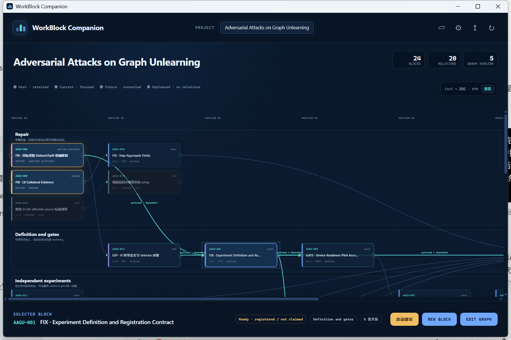
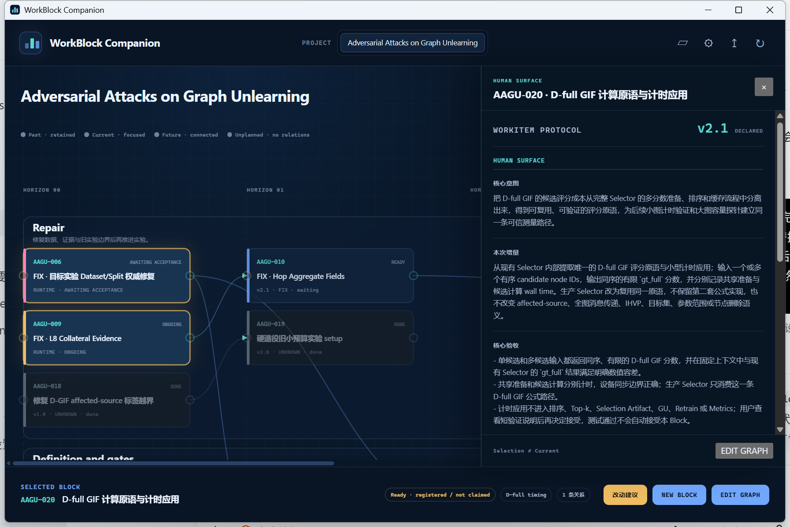
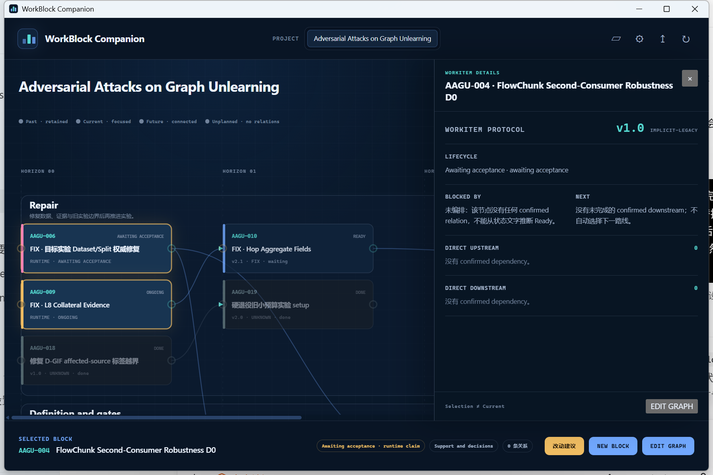

# AAGU-024 · 未 Claim WorkItems 升级为 2.1 Human Surface

## Human Result

### 实际增量

本候选把 14 个尚未 Claim 的 AAGU Blocks 原位升级为 WorkItem 2.1：每份 Record 现在都以唯一、首个 `## Human Surface` 直接说明核心意图、本次增量和核心验收；旧 `Block human acceptance surface` / `Intent` 权威入口已收敛。成员 ID、状态、关系、priority 文本、运行/SSH/GPU 边界、来源和历史没有随迁移改写，成员也没有被 Claim 或执行。

### 核心观察

14/14 当前 2.1 validator 通过，且去掉版本与旧/新人类入口后，其余非空行 14/14 与 baseline 逐字一致。COMP-042 新 exact candidate `08be674abc60c9249982a1c3f341a080cd8b5121` 从 fresh registry 加载真实 AAGU 临时快照，观察到 24 nodes、20 relations 和 1.0/2.0/2.1 三种版本；AAGU-020 逐字显示三段 Human Surface，AAGU-004 只显示 legacy 机器事实而没有 Human Surface / Human Result 标题或卡片。live AAGU Graph、非 owner WorkItems 和既有 Claims 均未被产品浏览动作改写。

### 当前决定

> 当前验收决定：`待决定`

Agent 建议接受当前 AAGU-024 候选：结构、语义守恒、真实 mixed-version native 显示和零写入边界均有直接证据。最终决定者是用户；决定对象仅是 AAGU-024 当前 report-bearing source `HEAD`，不是 COMP-042、WB-228 或 Apply target。installed nested-finish hotfix 尚未进入 WB-228 Git candidate，这一工具链边界不影响本次迁移内容，但必须独立保留。

## 真实产品证据

### 同屏 mixed-version Campaign

真实 Windows native Companion 加载隔离的 canonical AAGU 快照，显示 24 Blocks、20 Relations、Graph v5；节点卡片同时出现 v1.0、v2.0 与 v2.1。**PASS**。

### 2.1 Human Surface

AAGU-020 抽屉显示 `v2.1 / declared` 以及 `核心意图 / 本次增量 / 核心验收`，确定性读回与 Record 逐字一致。**PASS**。

### Legacy 无 fallback

隐式 1.0 的 AAGU-004 抽屉只显示 protocol、lifecycle 和 confirmed relations；不存在 Human Surface / Human Result 标题、卡片、占位文案或来源区。**PASS**。

## 迁移前后

| WorkItems | 迁移前 | 当前 | 状态/关系 |
|---|---|---|---|
| AAGU-001、002、003、005 | 实际 1.0；旧 `Block human acceptance surface` | 2.1；唯一首个 Human Surface | 保持原文 |
| AAGU-007、008、011、012、013、014 | 实际 1.0；无正式人类入口 | 2.1；唯一首个 Human Surface | 保持原文 |
| AAGU-010 | 2.0；无正式人类入口 | 2.1；唯一首个 Human Surface | 保持原文；既存 Record P1 / WORKPLAN P0 差异未改 |
| AAGU-020、021、022 | 实际 1.0；旧 `## Intent` | 2.1；唯一首个 Human Surface | 保持原文 |

完整 14 项 baseline/current 哈希、WORKPLAN 快照和逐项状态见 [`evidence/migration-audit.md`](evidence/migration-audit.md)。

## 验证结果

| 判断 | 结果 | 实际观察 / 证据 |
|---|---|---|
| WorkItem 2.1 结构 | PASS | 14/14 members + owner 均通过 current Human Surface validator。 |
| 非 Human Surface 语义守恒 | PASS | 14/14 去掉迁移区块后其余非空行逐字相同。 |
| 禁止修改对象 | PASS | AAGU-004、006、009、018、019、015–017、023 与 WORKPLAN 相对 baseline 不变。 |
| Claim guard | PASS | 14 个成员 Claim 数为 0；既有 AAGU-004/006/009 Claim 哈希不变。 |
| 真实 AAGU mixed-version 读取 | PASS | `aagu-companion-view.json`：24 nodes、20 relations、v1.0/v2.0/v2.1 = 5/4/15。 |
| 真实 Windows native 视觉 | PASS | 三张 1792×1196 截图覆盖全图、2.1 正例和 legacy 负例。 |
| COMP targeted regressions | PASS | 2 个 test files，18/18 PASS。 |
| AAGU/fixture 零写入 | PASS | 除 owner 的授权记录更新外 live guard 零变化；fixture view/capture 前后 clean。 |
| Report pair / HTML QA | PASS | Markdown/HTML contract PASS；1280×720 与 390×844 无横向溢出，3 张图无断图，warning/error console=0。 |

## 失败与修正链

旧 COMP candidate `f6832b9dec0be903d9f8d83f50ba2bc2864dfbd7` 在真实 AAGU 快照的 `Item Type: Block` 处 fail closed，因此未被用于视觉 PASS，也没有靠改 fixture 绕过。COMP-042 在同一 Block 内补齐 declared 2.0/2.1 quoted/unquoted Todo/Block coverage，形成 `08be674...` 后，AAGU 从 fresh registry 重新验证并通过。完整失败证据见 [`evidence/companion-aagu-probe.md`](evidence/companion-aagu-probe.md)，正向证据见 [`evidence/companion-aagu-acceptance.md`](evidence/companion-aagu-acceptance.md)。

## 已知边界

- native runtime 保留产品正常的 Graph 写能力；本次安全性来自 temp registry/fixture 隔离与前后 hash/clean guard，而不是把 runtime 误报为只读。
- AAGU-010 在 baseline 已存在 WorkItem `P1` 与 live WORKPLAN `P0` 差异；本次只保留两边事实，没有替用户选择新 priority。
- current installed `run_git.py` nested-finish hotfix 的 SHA-256 为 `BC2B64DD7EC8F2ABC68500D0598BC1D09009D25841F4DFD48AC81A876AB272C0`；它已用 nested project 内含空 `.git/` 的 fixture 回归，3-command finish 与 project 外 dirt guard 均保持。该 hotfix 尚未进入 WB-228 candidate `bbb2990...`；本报告不把该工具修复声称为已 Git 化协议结果。
- 未运行实验、未 SSH、未修改 Cache/Result/DocMap，未 Merge / Apply、push、install 或 cleanup。
