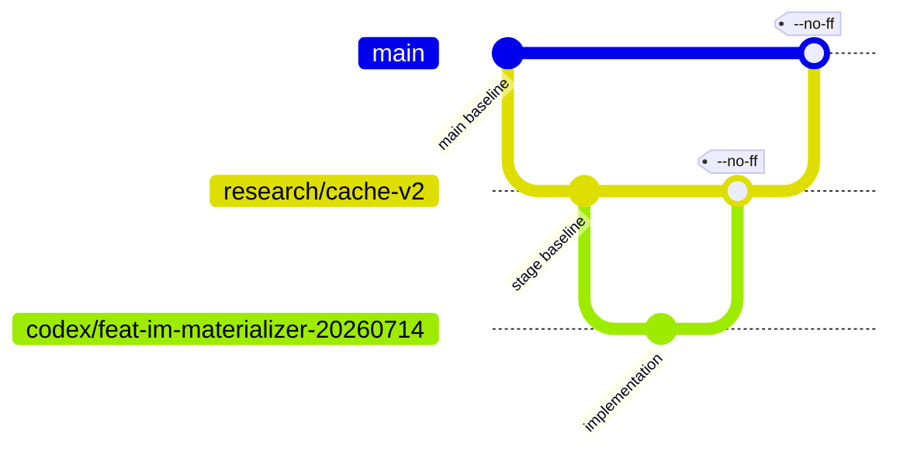

# OpenGU Git 分支与合并规则

> 适用范围：`GULib-master/` 的代码、实验配置、文档与工具改进。
> 核心原则：**一个改进，一条分支；先回父线，再回主线；接收改进统一使用 `--no-ff`。**

## 1. 为什么这样管理

当前仓库同时存在 `main`、`release/*`、`research/*`、`codex/*`、备份分支和多个 worktree。问题不在于分支数量本身，而在于新分支经常没有明确记录“从哪条线切出、最终应合回哪条线”。

本规则把分支关系定义为一棵有父节点的树：

- `main` 是稳定主线。
- `release/*`、长期 `research/*` 可以作为阶段集成线。
- `feat/*`、`fix/*`、`experiment/*`、`docs/*`、`chore/*` 和 `codex/*` 是短期改进线。
- 每条短期改进线在创建时确定唯一 `parent branch`，完成后只能先合回这个父分支。



## 2. 必须遵守的规则

1. **禁止直接开发集成线。** `main`、`release/*` 和被指定为阶段基线的 `research/*` 只接收完成的分支。
2. **一个分支只解决一个可命名的改进。** 代码、测试和与该改进直接对应的文档可以同分支提交；无关事项另开分支。
3. **创建时声明父分支。** 默认父分支是开工时所在的当前分支，不能在完成后为了方便临时改成 `main`。
4. **子线先回父线。** 若 `B` 从 `A` 切出，必须先把 `B --no-ff` 合回 `A`；不能绕过 `A` 直接把 `B` 合到 `main`。
5. **接收改进必须保留 merge commit。** 使用 `git merge --no-ff`；不使用 squash merge 或 rebase merge 代替正式接收。
6. **日常同步只允许快进。** 使用 `git pull --ff-only`。出现分叉时停下来判断父子关系，不让 `pull` 自动生成无意义 merge commit。
7. **不重写共享历史。** 已推送或被其他 worktree / 机器使用的分支禁止强制 push、随意 rebase 或 reset。
8. **先看 worktree 和脏文件。** 切分支、合并、清理前必须检查 `git status --short --branch` 与 `git worktree list`。
9. **`main` 是显式审批门。** 完成父线不等于自动获得合入 `main`、push 或删分支的授权。

## 3. 分支命名

| 类型 | 用途 | 示例 |
|---|---|---|
| `feat/*` | 新能力 | `feat/cache-v2-index` |
| `fix/*` | 缺陷修复 | `fix/selection-tie-order` |
| `experiment/*` | 独立实验或 canary | `experiment/citeseer-e1` |
| `docs/*` | 纯文档改进 | `docs/git-workflow` |
| `chore/*` | 工具、清理、工程规则 | `chore/git-policy` |
| `codex/*` | Codex 创建的短期任务分支 | `codex/fix-cache-key-20260714` |
| `research/*` | 经确认的阶段研究集成线 | `research/cache-v2` |
| `release/*` | 发布或阶段修复集成线 | `release/phase-b-fixes` |

分支名应描述改进内容，不使用 `temp`、`new`、`test2` 之类无法追溯的名称。

## 4. 开始一个改进

以下命令适用于 PowerShell。假设当前所在分支就是本次改进的父分支：

```powershell
git status --short --branch
git worktree list

$parent = git branch --show-current
$child = "codex/fix-cache-key-20260714"

git switch -c $child
git config --local "branch.$child.openguParent" $parent
git config --local --get "branch.$child.openguParent"
```

`branch.<name>.openguParent` 是本地辅助记录，不会随 push 传播。因此创建 PR 时仍须把 **base branch 设置为同一个父分支**，并在 PR 描述中写明：

```text
Parent: research/cache-v2
Merge policy: --no-ff
```

如果目标父分支不是当前分支，应先明确切换并只做快进同步：

```powershell
git switch research/cache-v2
git pull --ff-only
git switch -c codex/feat-im-materializer-20260714
```

## 5. 提交前检查

```powershell
git status --short
git diff --name-status
git diff --stat
```

- 只暂存本次改进的文件。
- 混合工作树按语义拆分提交，禁止不检查就执行 `git add -A`。
- 运行与改动风险相称的测试或文档生成检查。
- 报告类产物遵守 Markdown 源文件与 HTML 成品一致的项目规则。

## 6. 合回父分支

先在子分支完成提交并确认工作树干净：

```powershell
$child = git branch --show-current
$parent = git config --local --get "branch.$child.openguParent"

if (-not $parent) {
    throw "Missing parent branch record for $child"
}

git status --short --branch
git log --oneline "$parent..$child"
git diff --stat "$parent...$child"
```

确认 `$parent` 非空且与预期一致，然后在父分支所在 worktree 执行：

```powershell
git switch $parent
git pull --ff-only
git merge --no-ff $child -m "merge: integrate $child into $parent"
```

合并后必须验证确实产生了 merge commit：

```powershell
git show --summary --pretty=raw HEAD
git log --graph --decorate --oneline -n 12
```

若父分支已被另一个 worktree 检出，不要强行移动它；进入那个 worktree 完成合并，或通过以该父分支为 base 的 PR 合并。

## 7. 父线完成后进入 `main`

只有当整条父线达到阶段验收条件，并获得明确授权后，才执行：

```powershell
git switch main
git pull --ff-only
git merge --no-ff research/cache-v2 -m "merge: integrate research/cache-v2 into main"
```

因此，`main <- parent <- child` 会留下两个有含义的 merge commit：一个表示“子改进被父线接收”，另一个表示“完整阶段被主线接收”。

## 8. 本地默认保护

本仓库建议设置：

```powershell
git config --local merge.ff false
git config --local pull.ff only
```

- `merge.ff=false`：直接运行 `git merge` 时也默认保留 merge commit。
- `pull.ff=only`：普通同步不允许自动制造分叉合并。
- 正式接收时仍应显式写 `git merge --no-ff`，让命令和审查记录都清楚表达意图。

GitHub 侧若要同样严格，应只开放 **Create a merge commit**，关闭 squash/rebase 合并，并要求 PR 的 base 指向登记的父分支。

## 9. 不应做的事

```text
# 错误：在 main 上边开发边提交
main -- a -- b -- c

# 错误：B 从 A 切出，却绕过 A 直接进入 main
main <- B    (B 的真实 parent 是 A)

# 错误：普通 pull 产生没有项目含义的 merge commit
Merge remote-tracking branch ...

# 错误：为了让图看起来直，把已共享分支 rebase / force-push
```

分支图可以复杂，但每个 merge commit 必须能回答两个问题：**合入了哪个完整改进？它被哪条父线接收？**
