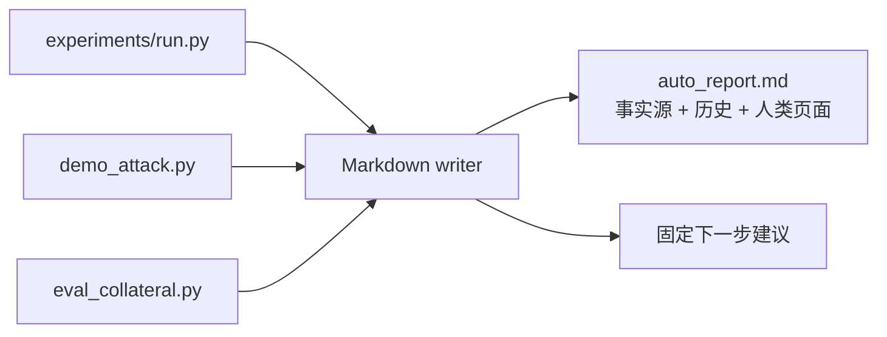
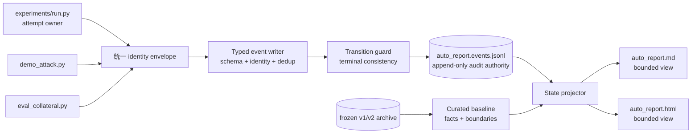
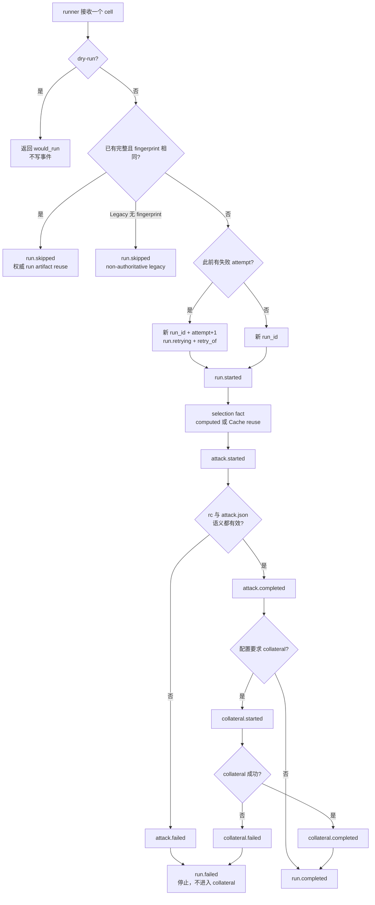

# AutoReport V3 改进汇报

> 本报告汇报本次 session 对 AutoReport 所做的架构改进。
>
> 它不描述 AutoReport 自己应该采用什么页面格式，也不汇报 OpenGU 的研究进度或实验结论。

**改进主线：把 AutoReport 从“多个脚本直接追加 Markdown”改造成“统一身份的阶段事件 → 可信审计流 → 可重建状态视图”。**

| 维度 | 原来 | 现在 |
|---|---|---|
| 事实权威 | `auto_report.md` 文本 | append-only `auto_report.events.jsonl` |
| 状态表达 | `OK / WARN / X / SKIP / TIMEOUT` 平面标签 | `selection / attack / collateral / run` 分阶段状态机 |
| 运行身份 | 依赖条目文字和时间 | `cell_id / run_id / attempt / config_fingerprint / git_sha` |
| Cache 表达 | `cache=HIT` 或 `MISS` 文本 | 类型、来源、Recipe、Artifact、authority、write outcome |
| 重试与重复 | 容易混成多条相似记录 | 同 cell 新 run、显式 `retry_of`、稳定 dedup |
| 失败处理 | producer 各写各的，可能互相矛盾 | runner 编排 + terminal guard + failure-first projection |
| 人类页面 | 与原始记录是同一个文件 | 从 JSONL + baseline 重建的有界 MD/HTML 投影 |
| 历史迁移 | 新旧事实混在 live 文件 | v1/v2 冻结 archive；baseline 只携带有边界的事实 |

## 1. 我接手时的架构

旧 AutoReport 的核心是一个 Markdown append helper。`demo_attack.py`、`eval_collateral.py` 和其他 runner 各自调用 writer，把段落直接追加到同一个 `auto_report.md`。



这种设计简单，但把四种职责压在了一个文件里：

1. **事实记录**：某个阶段实际发生了什么；
2. **状态判断**：一个实验 cell 现在是完成、失败还是只跑了一半；
3. **历史存档**：过去数月的旧格式条目；
4. **人类展示**：研究者打开浏览的页面。

因此旧系统存在结构性歧义：

- attack 和 collateral 可以分别声称自己的状态，却没有共同的 run identity；
- `OK` 只代表某个 writer 收到了一次成功结果，不等于整条实验链完成；
- retry 与第一次执行难以关联，同一 cell 的重复记录只能靠文字判断；
- `cache=HIT` 没有说明 Cache 类型、命中来源和是否权威；
- Markdown 越写越长，无法安全地从中恢复唯一的当前状态；
- 固定“下一步建议”被每条记录重复生成，历史 server journal 最终积累了 2,015 条同类建议。

## 2. 我改成的架构

V3 把写入、审计、状态和展示分开：



这里最重要的不是文件后缀从 Markdown 换成 JSONL，而是建立了清晰的责任边界：

- **runner 拥有 attempt 和阶段顺序**；
- **producer 只报告自己观察到的阶段事实**；
- **event writer 负责身份、schema、去重、并发锁和终态合法性**；
- **JSONL 是唯一机器审计权威**；
- **projector 负责从事实推导当前状态**；
- **MD/HTML 只是可丢弃、可重建的阅读视图**；
- **旧历史只读，不被重写成看似精确的新事件**。

## 3. 七项关键改进

### 3.1 将“实验坐标”与“执行尝试”分开

我引入了五个不同层次的身份：

| 身份 | 回答的问题 | 变化条件 |
|---|---|---|
| `cell_id` | 这是矩阵中的哪个实验坐标？ | dataset/model/method/strategy/ratio/seed/k 改变 |
| `run_id` | 这是该 cell 的哪一次真实执行？ | 每次真实 attempt 都新建 |
| `attempt` | 这是第几次尝试？ | retry 时递增 |
| `config_fingerprint` | 配置内容是否相同？ | 影响运行语义的配置改变 |
| `git_sha` | 使用的是哪版代码？ | checkout commit 改变 |

这使“同一个实验重跑”和“实验定义发生变化”不再混为一谈。

### 3.2 建立阶段状态机

每次运行不再只有一个平面状态，而是由以下阶段组成：

```text
run.started
  ├─ selection.completed / failed / skipped
  ├─ attack.started → completed / failed
  ├─ collateral.started → completed / failed   （仅当配置要求）
  └─ run.completed / failed / skipped
```

`run.completed` 现在是一条受约束的终态，而不是任何 producer 都能随意写出的成功文字。

### 3.3 把 Cache 变成可审计事实

每个 Cache observation 现在明确记录：

- `type`：selection、result、score、artifact 或 run artifact；
- `outcome`：hit、miss、bypass 或 unknown；
- `hit_source` 与 `lookup_policy`；
- Recipe hash 或明确标注的 Legacy key；
- Artifact path/ID/content hash；
- `authoritative` 与 `write_outcome`。

一个关键规则是：**ResultCache 整体命中时，不把缓存对象里历史的 `selection_cache_hit` 重放成本次 SelectionCache HIT。** 本次没有执行 selection，就不能制造本次 selection 事实。

### 3.4 显式表达 retry

同一个 `cell_id` 重试时：

- 新建 `run_id`；
- `attempt` 加一；
- 记录 `retry_of` 指向上一次失败 run；
- 先写 `run.retrying`，再写本次 `run.started`；
- Cache 复用仍保留在本次 attempt 中，不因语义压缩而抹掉重试历史。

### 3.5 去重与并发一致性

事件内容生成稳定 `dedup_key`。runner 与 child producer 重复回报同一 run/stage/state 时，只保留第一条更完整事实。

追加事件和刷新 MD/HTML 共用排他锁；追加前会重新验证已有 JSONL。这样并发 producer 不会让旧投影覆盖新事件，也不会在坏日志上继续追加。

### 3.6 旧历史采用冻结与基线，而不是伪迁移

原 server live journal 被逐字节冻结到 archive。`auto_report_baseline.json` 只携带仍有价值的历史事实、来源校验和失效边界。

旧记录不会被反向解释成 V3 的 `run.completed`，因为它们缺少 V3 所要求的 identity、attempt、Recipe 和阶段证据。

### 3.7 展示层变成可重建投影

`auto_report.md` 和 `.html` 不再是审计原件。它们由 JSONL + baseline 原子重建，并限制默认只展示最近 200 个 cell。删除这两个页面不会丢失事实，重新投影即可恢复。

## 4. 不同情境在哪里分叉



### 情境—分叉—结果对照

| 情境 | 分叉位置 | 追加的事实 | 明确禁止 |
|---|---|---|---|
| dry-run | runner 执行入口 | 无 | 任何 V3 事件 |
| 完整 cell 未变化 | fingerprint + artifact 检查 | 一次权威 `run.skipped` | 重复刷屏 |
| Legacy cell 无 fingerprint | legacy 判定 | non-authoritative `run.skipped` | 宣称为当前 V3 complete |
| 首次真实运行 | attempt 初始化 | `run.started` | 复用旧 run identity |
| 失败后重试 | prior attempt 查询 | `run.retrying`、新 `run_id`、`retry_of` | 覆盖第一次失败 |
| Cache V2 Selection Artifact | selection 入口 | `selection.completed` + authoritative provenance | 泛化为无来源 `HIT` |
| ResultCache 整体命中 | attack producer | result cache fact | 重放历史 selection HIT |
| attack subprocess 非零 | subprocess gate | `attack.failed + run.failed` | 继续 collateral |
| `attack.json` 缺失、空、无目标 strategy 或目标失败 | semantic artifact gate | `attack.failed + run.failed` | 仅凭 rc=0 宣称成功 |
| collateral 失败 | collateral gate | `collateral.failed + run.failed` | `run.completed` |
| 阶段已失败后又收到 complete | transition guard | 拒绝追加 | 产生矛盾终态 |
| JSONL 坏行、事件被篡改或 identity 不匹配 | append validation | fail-closed，不改历史 | 带病继续写入 |

## 5. 真实探针暴露的最后一个架构漏洞

初次部署后，我没有停在单元测试，而是在 4090 checkout 上运行了一个最小真实 cell。第二次 attempt 暴露出一条矛盾序列：

```text
demo_attack.py 发现没有 attack result
    → 写出 attack.failed
    → 但进程返回码仍为 0
runner 只检查返回码
    → 继续 collateral
    → 最后写出 run.completed
```

这说明“有结构化事件”还不够；必须在 producer、orchestrator、event store 和 projector 四层同时约束终态。

我随后补了四道防线：

1. **producer**：`demo_attack.py` 没有结果或 strategy failed 时，在记录失败事件后非零退出；
2. **runner**：不仅检查 return code，还检查 `attack.json` 是否非空、包含目标 strategy、且该 strategy 未标记失败；
3. **event store**：同一 run 已有非 run 阶段失败时，拒绝随后追加 `run.completed` 或 `run.skipped`；
4. **projector**：对已经存在的历史矛盾流，失败优先于完成，保持字节不变但投影为 failed。

修复后的 attempt 3 在 Legacy Cache freeze 再次阻止 attack result 时，正确停在：

```text
attack.failed → run.failed → STOP
```

没有进入 collateral，也没有出现 false completion。这个案例是本次架构改进最重要的闭环：**系统不仅能记录事实，还能阻止互相矛盾的事实被接受。**

## 6. 现在成立的设计保证

| 保证 | 架构机制 |
|---|---|
| 同一 cell 的多次执行可区分 | 稳定 `cell_id` + 每次新 `run_id` + `attempt/retry_of` |
| 阶段失败不能伪装为整次成功 | runner gate + transition guard + failure-first projection |
| 重复 producer 不制造重复历史 | 内容导出的 `dedup_key` |
| Cache HIT 可追溯且不夸大 | typed provenance + authority + source + Recipe/Legacy boundary |
| 展示页损坏不等于审计丢失 | JSONL 权威、MD/HTML 可重建 |
| 旧历史不会被伪造成新事实 | frozen archive + curated baseline |
| 已损坏或被篡改的流不会继续扩散 | append 前全流校验、fail-closed |
| 并发写入不会让视图倒退 | append 与 refresh 共用排他锁 |

## 7. 本次明确没有做什么

- 没有改变 TracIn、GIF、IM 或任何攻击算法；
- 没有把失败 sanity cell 提升为研究证据；
- 没有重写或删除 v1/v2 历史；
- 没有把整条 Cache V2 开发线包装成 AutoReport 改进；
- 没有让 AutoReport 负责实验调度或研究决策；
- 没有把 MD/HTML 的视觉格式当成这次架构工作的主体。

## 8. 实现落点

| 责任 | 主要文件 |
|---|---|
| 事件 schema、identity、dedup、锁、transition guard | `scripts/evaluation/reporting/events.py` |
| producer 事件适配、Cache provenance、旧 writer 禁写 | `scripts/evaluation/reporting/writer.py` |
| 当前状态推导与 MD/HTML 重建 | `scripts/evaluation/reporting/summary.py` |
| 历史兼容读取 | `scripts/evaluation/reporting/reader.py` |
| curated legacy baseline | `scripts/evaluation/reporting/baseline.py` |
| attempt owner、阶段编排、artifact semantic gate | `experiments/run.py` |
| attack producer 终态 | `demo_attack.py` |
| collateral producer 终态 | `eval_collateral.py` |
| 合同与边界 | `docs/auto_report_v3_DESIGN.md`, `results/_journal/RULES.md` |

## 9. 保证证据（附带）

以下数字不是报告主角，只用于证明上面的架构承诺已被执行路径覆盖：

| 架构承诺 | 验证证据 |
|---|---|
| V3 event、identity、dedup、retry、Cache、projector | 本地 AutoReport 专项 **32 passed** |
| 与 runner、attack、evaluation、collateral、Cache V2/legacy freeze 协同 | 去重后的联合回归 **233 passed，3 个已知 baseline stub deselected** |
| 部署环境一致 | 远端 4090 checkout 专项 **32 passed** |
| 真实失败闭环 | attempt 3：`attack.failed + run.failed`，无 collateral、无 false completion |
| append/projection 完整性 | 远端流 **16 events，0 parse warnings** |
| legacy 不变性 | archive **19,020 lines / 2,015 entries**，SHA-256 保持不变 |

主要实现提交：

- `c576b30` — AutoReport V3 event core；
- `0d5f7d6` — runner/attack/collateral runtime provenance；
- `ba80175` — active journal cutover、baseline 和 bounded views；
- `fa67c13` — Cache 语义与语义去重；
- `e0c9f0c` — terminal stage consistency。

## 10. 已知边界

1. append 前仍线性扫描并验证 JSONL；未来可以加只读索引，但索引必须能由 JSONL 重建。
2. pre-fix 的矛盾 attempt 保留在不可变审计流中；projector 正确显示 failed，后续 attempt 3 提供运行上的修正证据。
3. standalone producer 与 runner-managed attempt 仍是两种入口，语义压缩规则必须持续区分二者。
4. 本次保证的是 AutoReport 的事实与状态正确性，不保证某个具体实验一定成功。

## 结论

我完成的不是一次报告模板美化，而是一次职责拆分：

> **AutoReport 从“把运行文本追加到 Markdown”演化成了“带统一身份、阶段状态机、Cache provenance、终态约束和可重建视图的实验审计系统”。**

旧系统主要回答“某个脚本写了什么”；新系统能够回答“同一个实验 cell 的哪一次 attempt，在什么配置与代码下，经过哪些阶段，在哪里分叉，为什么最终是完成、失败、跳过或重试”。
