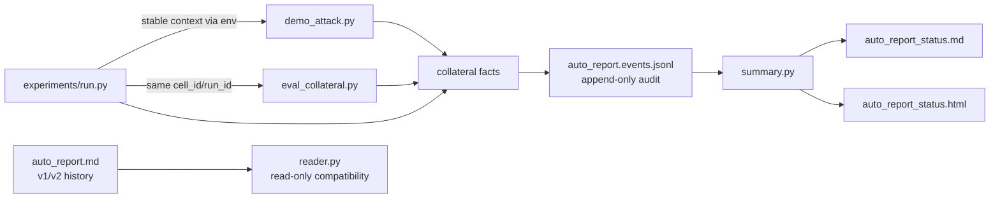

# AutoReport V3 design

> Scope: append-only experiment audit events and a bounded current-state view. This design does not migrate historical Markdown, delete results/caches/runs, execute GPU work, or change TracIn algorithms.

## Decision

Keep the historical `results/_journal/auto_report.md` as immutable v1/v2 evidence. New high-volume producers write one JSON object per accepted transition to `results/_journal/auto_report.events.jsonl`. Humans read the rebuildable `auto_report_status.md` / `.html` projection, capped at 200 latest cells by default.



## Event contract

Required top-level fields are:

| Field | Meaning |
|---|---|
| `schema`, `schema_version` | `opengu.autoreport.event`, version `3` |
| `event_id`, `dedup_key` | Stable transition identity; exact repeats are not appended |
| `timestamp`, `producer` | UTC observation time and producing script/host |
| `cell_id` | Stable matrix-coordinate identity, independent of attempts |
| `run_id`, `attempt` | One real execution attempt shared across runner/children; retry ordinal |
| `stage`, `state` | `selection/attack/collateral/run` × `started/completed/failed/skipped/retrying` |
| `identity` | dataset/model/method/strategy/ratio/seed/k |
| `git_sha`, `config_fingerprint` | Code and recipe identity kept separate from `cell_id` |
| `cache` | Typed cache observations with recipe, Artifact/source, policy, authority, and write outcome |
| `artifacts`, `metrics` | Outputs and stage-specific measurements |
| `error`, `retry`, `metadata` | Failure/retry evidence and orchestration context |

Cache observations use explicit `type` (`selection`, `result`, `score`, `artifact`, `run_artifact`) and `outcome` (`hit`, `miss`, `bypass`, `unknown`). A HIT requires `hit_source`. Legacy keys remain Legacy recipe fields and are never presented as Cache V2 `recipe_hash`/`artifact_id`; their authority is `false`.

The `AttackResult` now carries separate SelectionCache and ResultCache provenance. When a whole ResultCache entry is reused, the cached result's historical `selection_cache_hit` is not replayed as a current selection HIT.

## Transition and append policy

| Situation | Event behavior |
|---|---|
| Actual work starts | Append `stage.started` |
| Stage resolves | Append its first `completed`, `failed`, or `skipped` transition |
| Retry starts | New `run_id`, incremented `attempt`, `retry_of`, and `run.retrying` |
| Complete unchanged cell is encountered repeatedly | Append one `run.skipped` per unchanged config/Artifact identity; suppress repeats |
| Runner and child both report the same terminal transition | The shared run/stage/state dedup key retains the first, richer fact |
| Dry run, internal cache probes, fixed next-step prose, repeated HIT text | Append nothing |

The status projection recognizes selection-only, attack-only, collateral, complete/cached, legacy-skip, running, and failed states. It is atomically rewritten from JSONL; losing it does not lose audit evidence.

## Compatibility

- Existing `append_report_entry`, `append_attack_result`, and `append_collateral_entry` functions remain available for v1 callers.
- `reader.py` parses v1 experiment headings and v2 session/decision headings without modifying the source file.
- No migration is required for the existing ~19k-line journal; V3 starts as a sidecar stream.
- `experiments/run.py` owns attempt/stage boundaries and propagates identity through environment variables, avoiding new CLI arguments in legacy parsers.

Rebuild the current-state views with:

```powershell
E:/conda_package/envs/gnn/python.exe -m scripts.evaluation.reporting.summary
```
