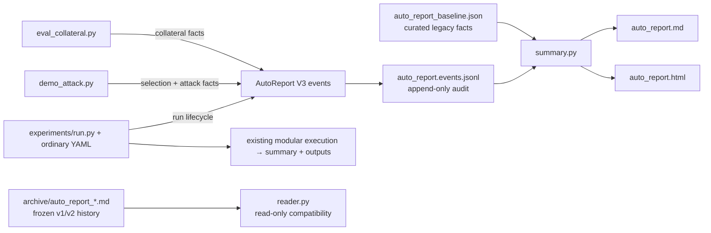

# AutoReport V3 design

> Scope: append-only experiment audit events, a frozen legacy archive, a curated baseline, and a bounded current-state view. This design does not reinterpret old rows as new events, delete results/caches/runs, execute GPU work, or change TracIn algorithms.

## Decision

Freeze the former `results/_journal/auto_report.md` byte-for-byte under `results/_journal/archive/`, and let the name `auto_report.md` become the new bounded report surface. High-volume producers write one JSON object per accepted transition to `auto_report.events.jsonl`. Humans read the rebuildable `auto_report.md` / `.html` projection, capped at 200 latest cells by default. A small `auto_report_baseline.json` carries forward useful facts and invalidation boundaries without manufacturing historical V3 events.



## Event contract

Required top-level fields are:

| Field | Meaning |
|---|---|
| `schema`, `schema_version` | `opengu.autoreport.event`, version `3` |
| `event_id`, `dedup_key` | Stable transition identity; exact repeats are not appended |
| `timestamp`, `producer` | UTC observation time and producing script/host |
| `cell_id` | Stable logical identity (matrix cell or explicitly scoped experiment), independent of attempts |
| `run_id`, `attempt` | One real execution attempt shared across runner/children; retry ordinal |
| `stage`, `state` | `selection/attack/collateral/run` × `started/completed/failed/skipped/retrying` |
| `identity` | Matrix cell: dataset/model/method/strategy/ratio/seed/k. Ordinary YAML: scope=experiment, experiment_id/dataset/execution_stage |
| `git_sha`, `config_fingerprint` | Code and recipe identity kept separate from `cell_id` |
| `cache` | Typed cache observations with recipe, Artifact/source, policy, authority, and write outcome |
| `artifacts`, `metrics` | Outputs and stage-specific measurements |
| `error`, `retry`, `metadata` | Failure/retry evidence and orchestration context |

Cache observations use explicit `type` (`selection`, `result`, `score`, `artifact`, `run_artifact`) and `outcome` (`hit`, `miss`, `bypass`, `unknown`). A HIT requires `hit_source`. Legacy keys remain Legacy recipe fields and are never presented as Cache V2 `recipe_hash`/`artifact_id`; their authority is `false`.

The `AttackResult` now carries separate SelectionCache and ResultCache provenance. When a whole ResultCache entry is reused, the cached result's historical `selection_cache_hit` is not replayed as a current selection HIT. The human projection labels every HIT as authoritative or Legacy/non-authoritative and shows its source, lookup policy, and Recipe hash or Legacy key.

## Transition and append policy

| Situation | Event behavior |
|---|---|
| Actual work starts | Append `stage.started` |
| Stage resolves | Append its first `completed`, `failed`, or `skipped` transition |
| Retry starts | New `run_id`, incremented `attempt`, `retry_of`, and `run.retrying` |
| Complete unchanged cell is encountered repeatedly | Append one `run.skipped` per unchanged config/Artifact identity; suppress repeats |
| Standalone selection/result stage is wholly served by the same Cache entry | Append one semantic cache-reuse event; suppress later invocations until Cache/Recipe/Artifact/config changes |
| Cache reuse belongs to a runner-managed real attempt | Keep the per-attempt stage event; semantic compression must not erase retry history |
| Runner and child both report the same terminal transition | The shared run/stage/state dedup key retains the first, richer fact |
| Dry run, internal cache probes, fixed next-step prose, repeated HIT text | Append nothing |

The ordinary runner records one YAML invocation with explicit experiment scope, after configuration and device validation. It writes `run.started` before execution and `run.completed` or `run.failed` after observing the outcome. Config fingerprint and source Git SHA bind each attempt; metadata links the execution run-id and level. A completed event references the existing summary and its SHA-256. Cache-backed invocations are still real attempts, with separate run IDs and increasing attempt ordinals. Matrix results stay in the summary; the runner does not invent model/method/ratio coordinates or cache observations for an entire matrix.

The existing independent cell producers retain their cell identity envelope. Child writers reject a mismatched cell identity instead of silently attaching different coordinates to the same cell. Before append, the writer validates the new event, recomputes event/dedup identity, validates every existing event, and refuses to append after malformed or untrusted JSONL. Append plus view refresh is serialized under one lock, so concurrent producers cannot leave an older projection on top of a newer audit line.

The status projection recognizes selection-only, attack-only, collateral, complete/cached, legacy-skip, running, and failed states. It is atomically rewritten from JSONL plus the integrity-checked baseline; losing it does not lose audit evidence.

## Cutover and legacy-content triage

- `/autodl-fs/data/OpenGU/GULib-master/results/_journal/archive/auto_report_2026-05-06_to_2026-07-10_active4090.md` is the exact 980,451-byte former server live file (19,020 lines, 2,015 entries; SHA-256 `0273a88a0d56952c232fc1b5165ad5bbab66a1940ba6ceae01def784fa817d3b`).
- Relative to the earlier 2,010-entry snapshot, the five server-only tail entries are one GraphRevoker attack, one GraphRevoker collateral result, and three GraphEraser collateral probes.
- The repeated GraphEraser random probe and temporary paths remain archive-only. The GraphRevoker legacy HIT lacks enough provenance to become a current V3 Cache fact.
- One useful historical fact is carried forward explicitly: the old journal plus local artifacts verify exactly six Phase B arxiv pilot cells (GIF/GNNDelete × random/tracin/im, seed 42, ratio 0.01). It remains a historical baseline item, not a manufactured V3 completion event.
- The small local fragment is not a cutover authority and is not retained as a second archive.
- Fixed automatic “下一步建议” text is retired. Old text remains in the archive; new reports show facts, failure/retry evidence, and current state only.

## Compatibility

- Existing `append_report_entry`, `append_attack_result`, and `append_collateral_entry` functions remain importable only for compatibility fixtures/exports. They require an explicit `report_path`, emit a deprecation warning, and no longer synthesize next-step advice.
- `reader.py` parses v1 experiment headings and v2 session/decision headings without modifying the source file.
- The large ~19k-line server journal stays frozen in `archive/`; the cutover never rewrites it.
- `experiments/run.py` calls the existing V3 writer directly. Journal and projections live under the device-selected execution root's `results/_journal`; verification uses its disposable root. It does not invoke legacy parsers or propagate an experiment identity into independent cell producers. Core runs the same command; its declared artifact collection remains separate from the runner journal.

Rebuild the current-state views with:

```powershell
E:/conda_package/envs/gnn/python.exe -m scripts.evaluation.reporting.summary
```
