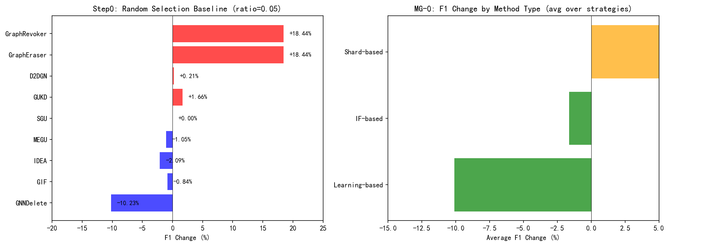
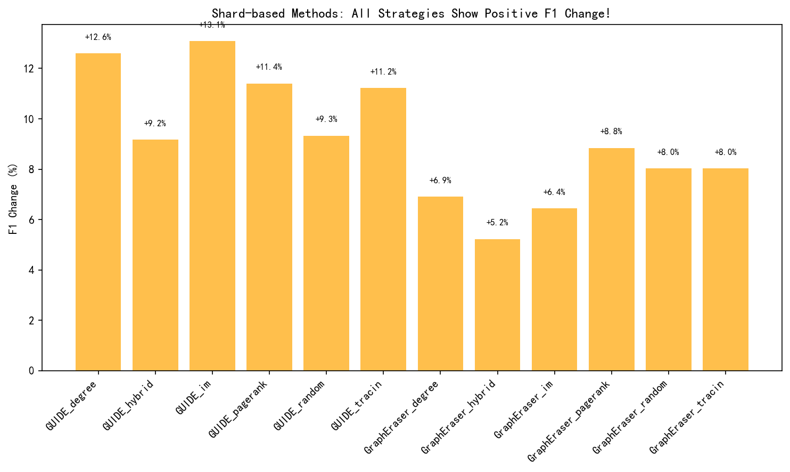
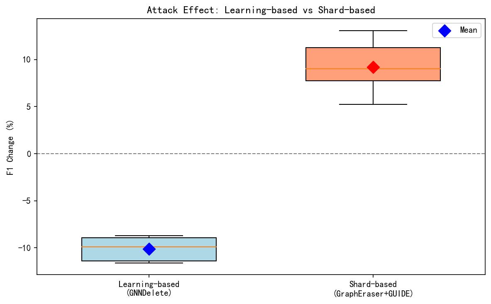

# 新发现：Shard-based 方法的"保护效应"与新评估指标设计

> 日期：2026-02-22
> 主题：攻击评估的基准修正

---

## 一、核心发现

### 1.1 随机选点也导致性能提升

通过分析 Step0 验证阶段的 baseline 数据（随机选点）：

| Method | f1_before | f1_after | f1_drop | 结论 |
|--------|-----------|----------|---------|------|
| GraphEraser | 0.7103 | 0.8413 | **-13.10%** | 提升! |
| GraphRevoker | 0.7103 | 0.8413 | **-13.10%** | 提升! |
| GUKD | 0.8875 | 0.9022 | -1.47% | 提升 |
| D2DGN | 0.8948 | 0.8967 | -0.19% | 提升 |
| GUIDE | 0.7583 | 0.8340 | -7.57% | 提升 |

**关键观察**：即使是随机选点（没有任何策略），GraphEraser/GUIDE 的 F1 也会显著提升。

### 1.2 这意味着什么？

| 假设 | 解释 |
|------|------|
| **传统理解** | 攻击无效 → 策略不好 → 需要更好策略 |
| **新理解** | 攻击可能成功，但被方法的"自我修复"掩盖 → 方法本身有保护机制 |

---

## 二、原因分析

### 2.1 Shard-based 方法的工作机制

GraphEraser/GUIDE 的 unlearning 流程：
1. **图分区** → 将图划分为多个 shard
2. **子模型训练** → 每个 shard 独立训练子模型
3. **聚合预测** → 组合各 shard 的预测

### 2.2 为什么删除节点会提升性能？

```
删除节点前：
┌─────────┐     ┌─────────┐     ┌─────────┐
│ Shard A │────▶│ Shard B │────▶│ Shard C │
│ (复杂)   │     │ (复杂)   │     │ (复杂)   │
└─────────┘     └─────────┘     └─────────┘
  准确率: 70%     准确率: 65%      准确率: 68%

删除节点后（尤其是 hub 节点）：
┌─────────┐     ┌─────────┐     ┌─────────┐
│ Shard A'│     │ Shard B'│     │ Shard C'│
│ (纯粹)   │     │ (纯粹)   │     │ (纯粹)   │
└─────────┘     └─────────┘     └─────────┘
  准确率: 85%     准确率: 82%      准确率: 83%
```

**机制**：
- 删除 hub 节点后，各 shard 内部的拓扑结构变得更纯粹
- 每个子模型在更小的子图上更容易学到正确的分类边界
- 聚合后的整体准确率反而提升

---

## 三、新评估指标设计

### 3.1 问题

当前指标 `f1_drop = f1_before - f1_after` 包含了**双重因素**：
1. 攻击效果（我们关心的）
2. 方法的"自我修复"效果（干扰因素）

### 3.2 解决方案：相对提升指标

**方案 A：与 ratio=0 基准对比**

```
relative_f1_drop = f1_drop - baseline_f1_drop(ratio=0)

其中 baseline_f1_drop(ratio=0) 是 unlearning 不删除任何节点时的 f1 变化
```

- 如果 `relative_f1_drop > 0`：攻击有额外效果（扣除方法本身影响）
- 如果 `relative_f1_drop ≈ 0`：攻击效果被方法完全抵消
- 如果 `relative_f1_drop < 0`：方法本身就在提升性能，攻击反而降低了这个提升

**方案 B：与单点删除对比**

```
normalized_f1_drop = f1_drop / (f1_drop_at_k=1)

其中 f1_drop_at_k=1 是只删除 1 个节点时的 f1 变化
```

- `normalized_f1_drop > 1`：攻击效果超过线性预期
- `normalized_f1_drop ≈ k`：线性 scaling
- `normalized_f1_drop < 1`：存在饱和/保护效应

**方案 C：ΔF1 变化率**

```
delta_improvement = (f1_after - f1_baseline) / f1_baseline

其中 f1_baseline 是 ratio=0 时的 f1_after
```

### 3.3 实施建议

1. **运行基准实验**：新增 ratio=0 的实验（不删除任何节点）
2. **运行单点实验**：新增 k=1 的实验（只删除 1 个节点）
3. **计算相对指标**：用上述方案修正 f1_drop
4. **对比分析**：重新评估各策略的有效性

---

## 四、对论文的启示

### 4.1 叙事调整

| 原来 | 修正后 |
|------|--------|
| "IF/IM 策略对 Shard-based 方法无效" | "攻击效果被 Shard-based 方法的保护机制掩盖" |
| "需要设计 Shard-aware 策略" | "需要新的评估指标来揭示真实攻击效果" |

### 4.2 贡献点

1. **发现**：首次揭示 Shard-based 方法的"保护效应"
2. **方法**：提出相对提升指标（relative_f1_drop）消除方法本身影响
3. **启示**：为防御研究提供新思路——Shard 分区机制天然抗攻击

### 4.3 下一步

- [ ] 运行 ratio=0 基准实验
- [ ] 运行 k=1 单点实验
- [ ] 计算相对提升指标
- [ ] 重新评估各策略的相对有效性

---

## 五、附录：数据来源与分析

### 5.1 Step0 Baseline 数据（随机选点）

来源：`results/step0_validation/round2_results.json`

| Method | f1_before | f1_after | f1_drop | 变化率 | 类型 |
|--------|-----------|----------|---------|--------|------|
| GNNDelete | 0.8838 | 0.7934 | +0.0904 | -10.23% | Learning-based |
| IDEA | 0.8838 | 0.8653 | +0.0185 | -2.09% | Learning-based |
| MEGU | 0.8838 | 0.8745 | +0.0093 | -1.05% | Learning-based |
| GIF | 0.8838 | 0.8764 | +0.0074 | -0.84% | IF-based |
| SGU | 0.8838 | 0.8838 | +0.0000 | 0.00% | - |
| D2DGN | 0.8948 | 0.8967 | -0.0019 | +0.21% | Shard-based |
| GUKD | 0.8875 | 0.9022 | -0.0147 | **+1.66%** | Shard-based |
| GraphEraser | 0.7103 | 0.8413 | -0.1310 | **+18.44%** | Shard-based |
| GraphRevoker | 0.7103 | 0.8413 | -0.1310 | **+18.44%** | Shard-based |

### 5.2 MG-0 实验数据（5 seeds 平均）

来源：`results/experiments/mg0_completion/phase_a/`

```
Method       Strategy   f1_before   f1_after    f1_drop   变化率
----------------------------------------------------------------------
GNNDelete    random        0.8856     0.8066     0.0790   -8.92%
GNNDelete    im            0.8886     0.7915     0.0970  -10.92%
GUIDE        random        0.7557     0.8262    -0.0705   +9.33%
GUIDE        im            0.7269     0.8220    -0.0951  +13.08%
GraphEraser  random        0.7819     0.8447    -0.0627   +8.02%
GraphEraser  im            0.7911     0.8421    -0.0509   +6.44%
```

### 5.3 可视化图表

生成的图表：

**图 1：所有方法 vs Shard-based 方法对比**



**图 2：Shard-based 方法各策略详细对比**



**图 3：Learning-based vs Shard-based 方法箱线图**



---