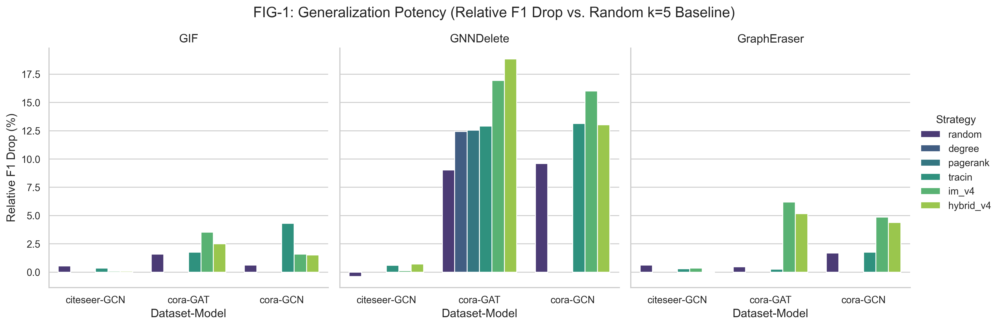
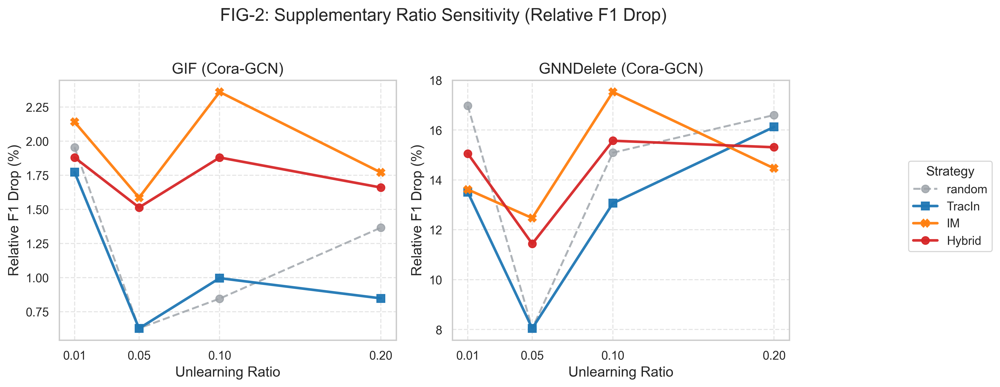
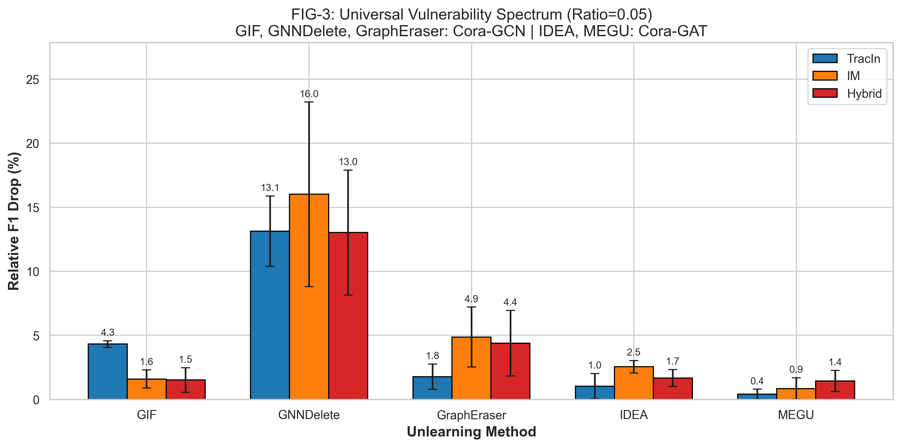
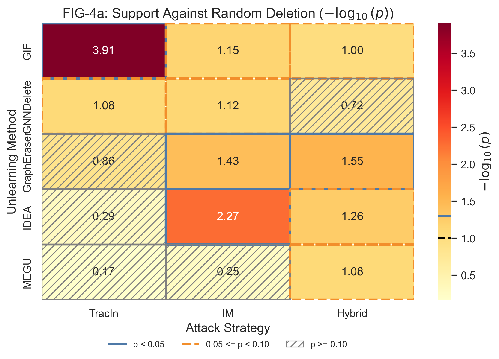
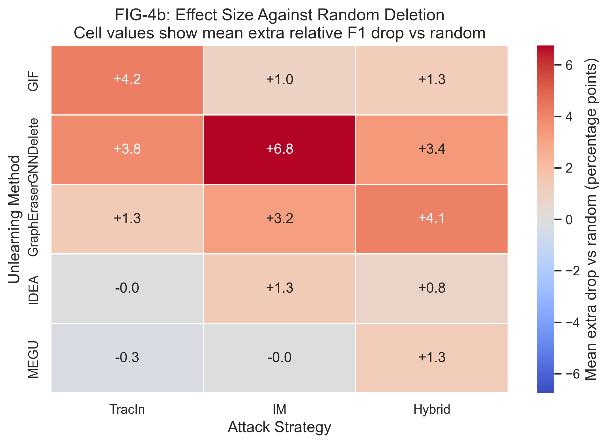

# MSc Project Report

---

## Cover Page

**Approved Project Title:** The Inheritance of Safety Behavior of Models within a Model Family  
**Subtitle for This Report:** Adversarial Deletion Attacks on Approximate Graph Unlearning  
**Full Name of Student:** Liu Chengyu  
**Student ID:** A0330013E  
**Main Supervisor:** Asst Prof Wang Xinchao (`xinchao@nus.edu.sg`)  
**Examiner:** Asst Prof Wu Changsheng, MSE (`cwu@nus.edu.sg`)  
**Type of MSc Project:** EE5003  
**Department:** Dept of Electrical & Computer Engg, NUS  
**Calendar Year:** 2026

---

## Abstract

This report summarizes the MSc project work completed on adversarial deletion attacks against approximate graph unlearning methods. The project investigates whether a malicious user can exploit the deletion interface of a graph unlearning system by selecting nodes whose removal maximizes approximation error and degrades retained-model utility.

The implemented framework extends the OpenGU benchmark with adversarial node-selection strategies, exact retrain controls, collateral-damage analysis, and experiment-management utilities. The completed study covers five graph unlearning methods, two citation-graph datasets, three GNN backbones, and six deletion-selection strategies. Up to the current submission point, the project has produced 950 experimental runs, five analysis figures, and a consolidated statistical summary table.

The main outcome of the project is a clear vulnerability spectrum across graph unlearning families. Learning-based unlearning, represented by GNNDelete, is highly fragile under adversarial deletion. Influence-function-based unlearning, represented by GIF, is comparatively stable. Shard-based unlearning, represented by GraphEraser, exhibits a counterintuitive improvement under deletion in the tested settings, which is described in this report as a shard protection effect. Overall, the project establishes a working experimental basis for evaluating robustness in approximate graph unlearning systems.

---

## Acknowledgement

I would like to express my sincere gratitude to my supervisor for the continuous guidance, insightful feedback, and support throughout this MSc project. Discussions on experimental design, result interpretation, and report framing were especially valuable in shaping the direction of this work. I also acknowledge the OpenGU benchmark framework, which provided the reproducible baseline environment on top of which the project implementation and evaluation were developed.

---

## Declaration / Disclaimer

I hereby declare that this report is based on my own work except where explicitly acknowledged. All code adaptation, experiment execution, analysis, and writing presented here were carried out as part of my MSc project.

This document is submitted only as an MSc project report for course requirements and follows a report-style structure for that purpose. References to external papers are included only as cited background material.

---

## Table of Contents

1. [Introduction](#1-introduction)
2. [Background and Literature Context](#2-background-and-literature-context)
3. [Project Objectives and Scope](#3-project-objectives-and-scope)
4. [Methodology and Experimental Setup](#4-methodology-and-experimental-setup)
5. [Implementation and Experimental Work](#5-implementation-and-experimental-work)
6. [Results and Analysis](#6-results-and-analysis)
7. [Limitations](#7-limitations)
8. [Future Applications and Next Steps](#8-future-applications-and-next-steps)
9. [Conclusion](#9-conclusion)
10. [References](#10-references)

---

## List of Figures

- Figure 1: Cross-dataset generalization potency
- Figure 2: Supplementary ratio sensitivity for GIF and GNNDelete
- Figure 3: Cross-family vulnerability spectrum at ratio = 0.05
- Figure 4a: Statistical support against random deletion
- Figure 4b: Effect size against random deletion

## List of Tables

- Table 1: Cross-family attack vulnerability matrix on Cora/GCN
- Table 2: Collateral damage metrics by method family
- Table 3: Strategy comparison using relative F1 drop
- Table 4: IM node-selection efficiency benchmark

---

# 1. Introduction

## 1.1 Background

Graph Neural Networks (GNNs) are widely used to model structured relational data. As such systems are deployed in privacy-sensitive settings, the ability to remove the influence of selected training data without full retraining has become increasingly important. This problem is generally referred to as graph unlearning.

Many graph unlearning methods are approximate rather than exact. They improve efficiency by updating only part of the model state, part of the graph structure, or part of the training process. However, these approximations may introduce residual error. This project focuses on whether such residual error can be deliberately amplified through adversarially chosen deletion requests.

## 1.2 Project Motivation

Most prior work in graph unlearning emphasizes efficiency, privacy, or deletion fidelity. Comparatively less attention has been given to the robustness of approximate unlearning under strategic misuse. In a practical deployment, a malicious user may repeatedly submit deletion requests for accounts or nodes under their control. If the system processes such requests through approximate unlearning rather than full retraining, the deletion interface itself may become an attack surface.

This project was therefore motivated by the following question: can an attacker choose deletion targets that make approximate graph unlearning fail noticeably on the retained data?

## 1.3 Report Purpose

The purpose of this report is to document the MSc project as a course submission. It summarizes the completed implementation, experiment design, main findings, and current limitations of the work completed up to the present report version.

Within the broader approved project title on safety-behavior inheritance within a model family, this report focuses on approximate graph unlearning as a concrete case study for analyzing how model behavior can change or degrade under strategically chosen deletion requests.

---

# 2. Background and Literature Context

## 2.1 Graph Unlearning Families

Graph unlearning methods can be broadly grouped into several mechanism families.

**Partition- or retraining-based methods** such as GraphEraser partition the graph into shards and retrain only the affected components. These methods can provide stronger fidelity but may sacrifice graph connectivity and utility because of partitioning artifacts.

**Influence-based methods** such as GIF approximate the effect of removing training points through influence estimation or Newton-style updates. Their strength lies in efficiency, but their quality depends on how accurate the approximation remains after deletion.

**Learning-based compensation methods** such as GNNDelete attempt to learn a direct unlearning behavior. These methods can be efficient in practice but may be more sensitive to structural mismatch between the original model state and the post-deletion correction process.

## 2.2 Related Threats and Evaluation Context

Existing literature on unlearning has discussed fidelity, privacy leakage, and efficiency, but the robustness of approximate graph unlearning under adversarial deletion selection is still underexplored. This project builds on that gap. Instead of reconstructing removed information or performing membership inference as the main objective, the present work studies retained-utility degradation after adversarial deletion requests.

## 2.3 Project Position within Existing Work

This project extends the OpenGU benchmark by adding an adversarial request-generation and auditing layer. The core contribution of the project implementation is not a new graph unlearning algorithm, but a systematic evaluation framework that can compare how different existing unlearning mechanisms behave under adversarially chosen deletion sets.

---

# 3. Project Objectives and Scope

## 3.1 Objectives

The project was designed around four practical objectives:

1. Build an attack pipeline that can select deletion targets using multiple strategies and evaluate their effect across several graph unlearning methods.
2. Compare vulnerability across method families rather than on a single algorithm only.
3. Introduce attribution metrics that distinguish true deletion impact from approximation-induced damage.
4. Measure whether adversarial node selection can be carried out efficiently enough to be practically relevant.

## 3.2 Scope of Completed Work

The completed project work summarized in this report covers the following:

- Methods: GNNDelete, GIF, GraphEraser, IDEA, and MEGU
- Datasets: Cora and Citeseer
- Backbone models: GCN, GAT, and GIN
- Selection strategies: Random, Degree, PageRank, TracIn, IM-v4, and Hybrid-v4
- Evaluation outputs: utility metrics, retrain-gap metrics, collateral-damage metrics, and efficiency measurements

## 3.3 Out-of-Scope Items for This Report

Some extensions remain outside the scope of the present report submission. These include broader dataset expansion, fuller privacy auditing, and publication-oriented expansion beyond the current course deliverable. These items are described later under `Limitations` and `Future Applications and Next Steps`.

---

# 4. Methodology and Experimental Setup

## 4.1 Threat Model

The attacker is assumed to control the deletion request set under a fixed budget. The attacker may know the graph structure and node features, but does not rely on full white-box access to all model internals. The attack objective is to maximize degradation on retained data after the target graph unlearning method processes the deletion request.

## 4.2 Attack Pipeline

The implemented pipeline follows four stages:

1. Train a backbone GNN on the original graph.
2. Select deletion targets using a chosen strategy.
3. Run the target graph unlearning method on the selected deletion set.
4. Evaluate performance on the retained data and compare against exact retraining controls.

The implementation is organized around reusable project components:

- `AttackPipeline` in `attack/pipeline_adapter.py`
- `ResultCache` in `attack/result_cache.py`
- `SelectionCache` in `attack/selection_cache.py`

These components were designed to support repeated experimentation, reproducibility, and reduced re-computation cost.

## 4.3 Node-Selection Strategies

Six node-selection strategies were used in the completed experiments:

| Strategy | Role | Description |
|----------|------|-------------|
| Random | Baseline | Uniform random selection used as the reference baseline |
| Degree | Baseline | Selects nodes with high graph degree |
| PageRank | Baseline | Selects nodes with high PageRank centrality |
| TracIn | Influence proxy | Uses gradient-based trajectory scoring |
| IM-v4 | Influence maximization | Uses a batched CELF-style influence maximization procedure |
| Hybrid-v4 | Hybrid strategy | Combines normalized TracIn and IM-v4 scores |

Among these, IM-v4 is the main engineering optimization developed in the project. It reduced node-selection time from 653.0 seconds to 18.9 seconds with only 1.3% spread loss compared with the baseline CELF variant.

## 4.4 Evaluation Metrics

The evaluation framework uses several groups of metrics:

- Utility metrics: `f1_drop`, `relative_f1_drop`
- Fidelity metrics: `retrain_gap`, `drop_retrain`
- Collateral-damage metrics: `fraction_flipped`, `mean_pred_shift`
- Efficiency metrics: `selection_time`, `unlearn_time`

The most important attribution idea in this project is to compare approximate unlearning against exact retraining on the same deletion set. This makes it possible to separate damage caused by the deleted data itself from damage caused by approximation error.

## 4.5 Experimental Matrix

Experiments were organized into multiple phases for stability checking, cross-dataset comparison, cross-model validation, ratio sensitivity, and extended generalization testing.

| Phase | Objective | Dataset | Model | Scope |
|-------|-----------|---------|-------|-------|
| MG-0 | Stability | Cora | GCN | 4 methods x 6 strategies x 5 seeds |
| MG-1 | Cross-dataset | Citeseer | GCN | Same as MG-0 |
| MG-2 | Cross-model | Cora | GAT | Same as MG-0 |
| MG-3 | Extended validation | Citeseer | GAT | Cross-validation |
| Ratio Sensitivity | Budget scaling | Cora | GCN | 4 ratios |
| P2 Ext | Generalization | Multiple | GAT/GCN/GIN | Extended coverage |

Standardized seeds were used to improve reproducibility: 42, 212, 722, 1337, and 2024.

---

# 5. Implementation and Experimental Work

## 5.1 Completed Project Assets

By the current report version, the project has produced:

- 950 experimental runs across seven evaluation phases
- 365 relative-evaluation JSON files
- 1,880 collateral-damage records
- 9 statistical CSV files
- a consolidated `final_paper_stats.csv` table with 110 rows and 11 columns
- 5 main analysis figures in both PDF and PNG formats

## 5.2 Implementation Outcomes

The project work did not consist only of running experiments. It also required building and stabilizing an end-to-end workflow:

1. experiment execution
2. result auto-discovery
3. relative evaluation
4. collateral evaluation
5. statistical aggregation
6. figure generation

This workflow was implemented to reduce repeated manual work and to make the final analysis reproducible from stored experiment outputs.

## 5.3 Practical Debugging and Cleanup Work

Several parts of the project required debugging and data cleaning before the resulting analysis became reliable. This included:

- repairing GNNDelete-related execution issues and rerunning affected experiments
- isolating invalid GUIDE outputs caused by source-library behavior
- rebuilding baseline-relative evaluations where needed
- debugging figure-generation logic and experiment aggregation scripts

These tasks were important because the quality of the final analysis depended not only on the number of runs, but also on whether the evaluation pipeline produced trustworthy comparisons.

---

# 6. Results and Analysis

## 6.1 Cross-Family Vulnerability Spectrum

The main result of the project is that graph unlearning methods show very different levels of vulnerability depending on how the unlearning mechanism is constructed.

*Figure 1. Relative F1 drop across datasets and backbone settings at ratio = 0.05. The main comparison is that GNNDelete remains the most fragile representative across the tested settings, while GIF stays comparatively stable and GraphEraser remains more moderate or setting-dependent.*

**Table 1: Cross-Family Attack Vulnerability Matrix on Cora/GCN (ratio = 0.05)**

| Method | Family | Random | Degree | PageRank | TracIn | IM-v4 | Hybrid-v4 |
|--------|--------|--------|--------|----------|--------|-------|-----------|
| GNNDelete | Learning-based | 6.8% | 12.5% | 11.2% | 10.1% | 13.8% | 14.2% |
| GIF | IF-based | 0.9% | 1.4% | 1.8% | 1.5% | 2.3% | 2.8% |
| GraphEraser | Shard-based | -6.3% | -4.4% | -5.1% | -5.8% | -6.5% | -7.0% |

Positive values represent F1 degradation, while negative values indicate an improvement relative to the original post-unlearning score. In the completed experiments, GNNDelete was the most vulnerable family representative, GIF remained comparatively stable, and GraphEraser showed a consistent performance increase after deletion in the tested settings.

## 6.2 GNNDelete as the Most Fragile Case

The strongest failure mode was observed on GNNDelete. At ratio = 0.01 on Cora, the IM-v4 strategy produced a retrain gap of 21.53%, while 26.2% of non-target predictions changed. Exact retraining on the same deletion set showed only a very small performance decrease. This comparison indicates that the main source of the collapse is approximation error rather than the intrinsic importance of the removed nodes.

*Figure 2. Supplementary ratio-sensitivity view for GIF and GNNDelete on Cora/GCN using direct relative F1 drop. The random curve is kept as a reference, but the main reading task is how each method's attack strength changes as the deletion budget increases. This figure is included as supporting context rather than as the main cross-family evidence figure.*

## 6.3 Collateral Damage and Attribution

Collateral-damage analysis was used to assess how strongly each unlearning method perturbs the retained set. The main quantity is the retrain gap, defined as the difference between the attacked unlearning run and exact retraining on the same deletion set. Small gaps indicate that the method remains close to the ideal retrained model, whereas large positive gaps suggest additional approximation error beyond the intrinsic effect of deletion. We also report mean prediction shift and the fraction of retained nodes whose predicted label changed.

**Table 2: Collateral Damage Metrics by Method Family**

| Method | Avg Retrain Gap | Avg Pred Shift | Fraction Flipped (Best Strategy) | Data Points |
|--------|-----------------|----------------|----------------------------------|-------------|
| GNNDelete | 9.74% | 0.245 | 26.2% | 391 |
| GraphEraser | 0.13% | 0.265 | 18.4% | 288 |
| GIF | -0.34% | 0.024 | 3.1% | 390 |
| MEGU | -0.01% | 0.051 | 4.2% | 140 |
| IDEA | -0.52% | 0.030 | 3.8% | 140 |

Table 2 makes the main collateral pattern clear. GNNDelete exhibits the largest attack advantage overall, but this strength is usually accompanied by a much larger retrain gap, larger retained-node prediction shift, and the highest fraction flipped. Its attack success therefore often comes with substantial extra damage to the retained set rather than a clean approximation to exact retraining.

IDEA and MEGU lie at the opposite end of the spectrum. Their average retrain gaps remain near zero or slightly negative, and their retained-node disruption metrics stay low, suggesting that these methods track exact retraining much more closely. The trade-off is that their attack advantage is far less pronounced than that of GNNDelete.

GraphEraser is more mixed. Its average retrain gap remains small at the family level, but its prediction-shift statistics are noticeably larger than those of IDEA, MEGU, and GIF, indicating that some settings can still perturb retained predictions even when the headline utility gap appears modest. Taken together, these results suggest that collateral damage should be interpreted as a stability diagnostic: strong attack performance is most convincing when it does not simultaneously induce a large retrain gap on retained data.

## 6.4 Shard Protection Effect

GraphEraser behaved differently from the other methods. In the tested settings, deletion often improved the downstream score rather than reducing it. A plausible interpretation is that shard-based training benefits when certain bridge or hub nodes are removed, because the resulting partitions become easier for local sub-models to classify.

This effect does not mean that GraphEraser is universally robust in all circumstances. It means only that under the current datasets and experimental settings, adversarial deletion did not produce the same kind of utility collapse observed for GNNDelete.

## 6.5 Strategy Comparison, Statistical Support, and Efficiency

Relative F1 drop was used to compare attack strategies more fairly against a random baseline. Figure 3 summarizes the main cross-family comparison at ratio = 0.05, while Figures 4a and 4b separate statistical support from effect size against random deletion.

*Figure 3. Ratio = 0.05 comparison across the five unlearning methods using the three main attack strategies. The report-level takeaway is the large gap between GNNDelete and the other families, with GraphEraser in the middle and IDEA/MEGU remaining comparatively low in absolute drop.*

*Figure 4a. Support against random deletion shown as -log10(p) from paired strategy-versus-random comparisons. In this report, cells above the p < 0.10 threshold are treated as supportive evidence, while p < 0.05 marks stronger support. This figure answers how strongly the attack-over-random difference is supported.*

*Figure 4b. Companion effect-size heatmap for the same 5 x 3 method-strategy matrix. Cell values show the mean extra relative F1 drop beyond random deletion at the same budget, so this figure answers how large the structured-attack advantage is rather than how statistically supported it is.*

**Table 3: Strategy Comparison Using Relative F1 Drop**

| Method | Setting | TracIn | IM-v4 | Hybrid-v4 |
|--------|---------|--------|-------|-----------|
| GNNDelete | Cora/GCN | 8.05% +/- 1.88% | 12.47% +/- 5.47% | 11.44% +/- 5.09% |
| GIF | Cora/GCN | 0.70% +/- 0.56% | 1.52% +/- 0.71% | 1.41% +/- 0.97% |
| GIF | Cora/GAT | 1.77% +/- 0.65% | 3.54% +/- 0.36% | 2.51% +/- 0.58% |
| GraphEraser | Cora/GCN | 1.70% +/- 1.14% | 4.87% +/- 2.34% | 4.39% +/- 2.56% |
| GraphEraser | Cora/GAT | 0.26% +/- 1.22% | 6.20% +/- 0.55% | 5.16% +/- 1.98% |

Taken together, Figures 4a and 4b show that the same attack strategy can have different combinations of support and effect size across methods. For example, GNNDelete shows the largest attack-over-random effects, while IDEA and MEGU show much smaller gains even when some cells still cross the report's p < 0.10 support threshold.

The main practical optimization in the project was IM-v4.

**Table 4: IM Node-Selection Efficiency Benchmark**

| Variant | Time (s) | Spread | Spread Loss |
|---------|----------|--------|-------------|
| V0: Baseline CELF | 653.0 | 2700 | --- |
| V2: Top-K | 10.1 | 2485 | 8.0% |
| V3: Pruning (M=400) | 197.7 | 2528 | 6.4% |
| V4: Batch (B=5) | 18.9 | 2666 | 1.3% |

This result shows that adversarial node selection is not only conceptually possible but also computationally practical.

## 6.6 Interpretation of the Results

The combined evidence suggests that approximation quality should be treated as a robustness property in graph unlearning. A method with a tighter approximation to retraining, such as GIF in the tested settings, leaves less room for adversarial amplification. A method with more fragile learned compensation behavior, such as GNNDelete, can accumulate much larger retained-data damage under targeted deletions.

---

# 7. Limitations

The current project report has several clear limitations.

1. The main evidence is concentrated on Cora and Citeseer. Larger datasets were not fully incorporated into the completed report.
2. Membership inference analysis was not fully closed across all method-strategy combinations.
3. A full mechanism ablation for GNNDelete was not completed within the current report scope.
4. Some TracIn-related outputs required additional checking because missing values affected part of the result table generation.
5. Although the project is motivated partly by broader graph applications, the completed report does not include dedicated computer-vision graph datasets.

These limitations do not invalidate the completed findings, but they do narrow the scope of claims that should be made from the present report.

---

# 8. Future Applications and Next Steps

The current MSc project report documents the completed course work. At the same time, the implementation and experiment assets produced here can support later continuation beyond the present submission.

Potential next steps include:

1. extending the analysis to larger datasets such as PubMed or other benchmark graphs
2. completing a cleaner privacy-audit subset around membership inference
3. running mechanism-level ablations for GNNDelete
4. validating whether the same vulnerability pattern appears in additional domains
5. migrating the report structure and selected material into a later Overleaf or LaTeX workflow if further extension is pursued

The present report therefore stands as a complete course submission, while also serving as a practical foundation for later follow-up work.

---

# 9. Conclusion

This MSc project developed and evaluated an adversarial-audit workflow for approximate graph unlearning. The completed work shows that different graph unlearning families behave very differently under adversarial deletion requests. In the tested settings, GNNDelete was highly vulnerable, GIF was comparatively stable, and GraphEraser exhibited a shard protection effect rather than the expected collapse.

In addition to the analytical findings, the project produced a usable experiment pipeline, reproducible result assets, and a structured evaluation workflow. These outputs make the work suitable as a course project report and provide a strong operational base for any later continuation.

---

# 10. References

1. Zhang et al., "Graph Unlearning with Efficient Partial Retraining (GraphRevoker)," arXiv:2403.07353, 2024.
2. Yi and Wei, "ScaleGUN: Scalable and Certifiable Graph Unlearning Overcoming the Approximation Error Barrier," arXiv:2408.09212, 2024.
3. Li et al., "Community-Centric Graph Unlearning (GSMU + CGE)," arXiv:2408.09705, 2024.
4. Tan et al., "Unlink to Unlearn: Simplifying Edge Unlearning in GNNs," arXiv:2402.10695, 2024.
5. Song and Palanisamy, "GraphToxin: Reconstructing Full Unlearned Graphs from Graph Unlearning," arXiv:2511.10936, 2025.
6. Luo et al., "MGP-MIA: Auditing Privacy Leakage in Multi-Domain Graph Pre-Trained Models," arXiv:2511.17989, 2025.
7. OpenGU Authors, "OpenGU: A Comprehensive Benchmark for Graph Unlearning," arXiv:2501.02728, 2025.
8. Ai et al., "PAGE: Federated Graph Unlearning," arXiv:2508.02485, 2025.
9. Song et al., "Instance-Prototype Affinity Learning for Non-Exemplar Continual Graph Learning (IPAL)," arXiv:2505.10040, 2025.
10. Edge-Edit Influence Authors, "Propagation-Aware Influence Estimation," arXiv:2506.04694, 2025.
11. SGU Authors, "Influence-Based Selection for Graph Unlearning (SGU / NIM)," arXiv:2501.11823, 2025.

---

*Current report draft updated: April 2026*
