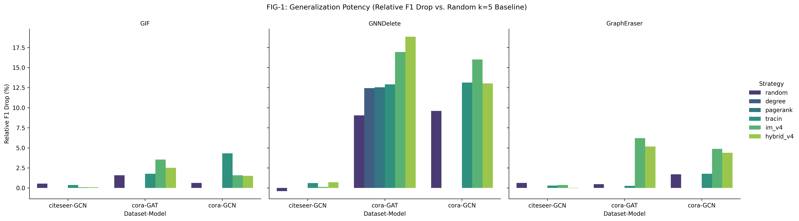
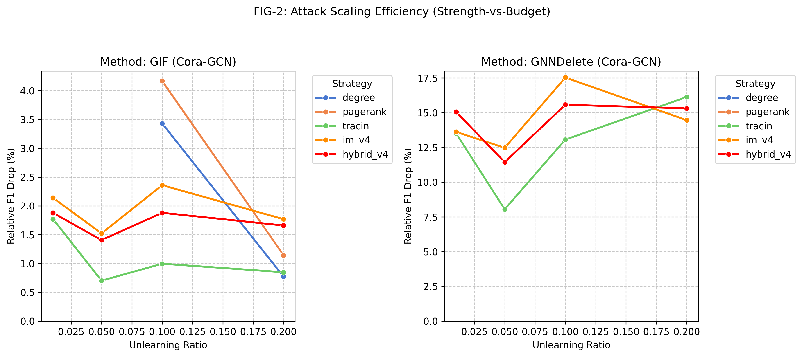
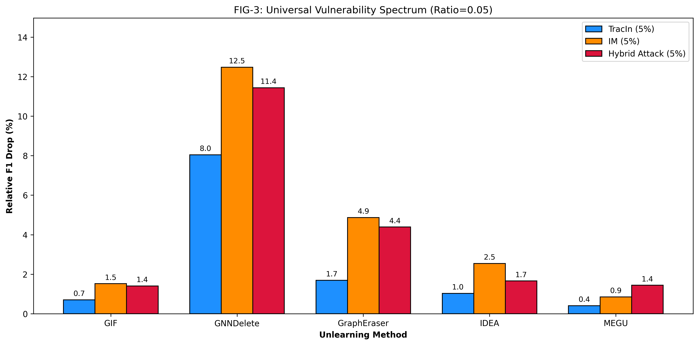
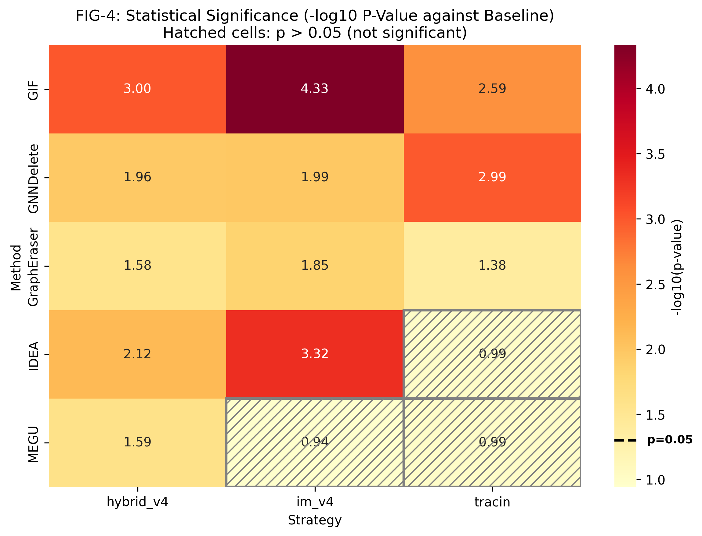
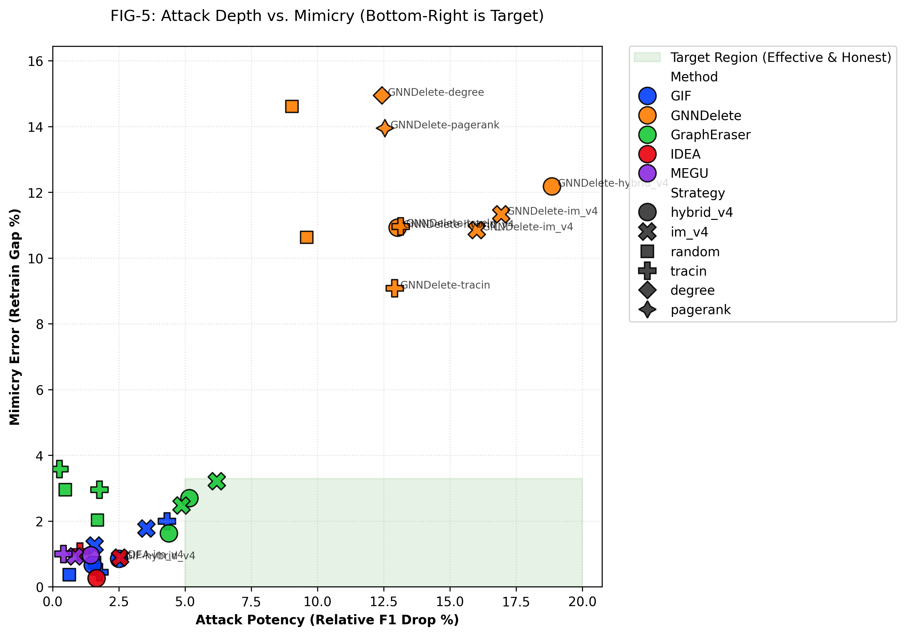

# 导师汇报版阶段报告（2026-02-27）

## 0. 一句话结论

当前实验体系已完成从“单点结果”到“端到端、跨维度、可解释评估”的升级：  
在 `950 runs` 的覆盖下，我们确认了方法族差异；同时通过新引入的 `Relative F1 Drop`（以 `k=5 random` 为基线）澄清了 **Shard-based 方法看似“变好”** 的来源，并把“攻击效果”与“方法自身增益”分离开来。

---

## 1. 本轮端到端实验是怎么跑通的

### 1.1 端到端流程（E2E）

1. 批量主实验执行：`results/experiments/*`（MG-0/MG-1/MG-2/MG-3/P2-Ratio/P2-EXT）。
2. 相对指标评估：`experiments/baseline_k5/eval_relative.py` + `results/relative/`。
3. 近似误差/副作用评估：`results/collateral/`（gap、flip 等）。
4. 统计汇总与可视化：`report/paper/sections/*` + `results/paper_figures/*`。
5. 状态核查：`scripts/evaluation/exp_status_checker.py`（5-seed 完整性 + 质量过滤）。

### 1.2 当前覆盖规模（已完成）

- 总实验量：`950 runs`（`results/experiments/auto_discovered.json`）
- 分阶段：
  - `mg0=90`, `mg1=90`, `mg2=90`
  - `mg3_citeseer=40`, `mg3_gat=40`
  - `ratio_sensitivity=240`
  - `p2_ext_GCN/GAT/GIN=360`
- 主维度覆盖：
  - 方法：`GIF, GNNDelete, GraphEraser, IDEA, MEGU`
  - 数据集：`cora, citeseer`
  - 模型：`GCN, GAT, GIN`
  - 比例：`0.01, 0.05, 0.10, 0.20`
  - 策略：`random, degree, pagerank, tracin, im_v4, hybrid_v4`（MG-3 为子集）
  - seeds：`42, 212, 722, 1337, 2024`

---

## 2. 算力限制下的方法决策（你提到的问题）

### 2.1 IF 框架：为何简化为 TracIn

依据 `experiments/README.md` 的工程结论：  
精确 IF（GIF 的二阶近似）在“攻击选点组合搜索”场景下开销会爆炸，超大图下可能到“天/周/月”级并伴随 OOM 风险；因此在攻击框架中采用 **TracIn（一阶 pseudo-IF）** 作为可执行替代。

### 2.2 IM 框架：IM v4 的收益与大图扩展

`experiments/im_benchmark/results/bench_results.json`：

- `V0` 时间：`652.97s`
- `V4 (Batch CELF)` 时间：`18.90s`
- 加速比：`34.55x`
- spread 从 `2700` 到 `2666`，损失 `1.26%`

结论：当前阶段 `IM v4` 已满足中小图-中图效率需求；面向更大图（如你提到 large dataset）建议按 `experiments/README.md` 路线切换到 **D-SSA/IMM（RR-set 系）**。

---

## 3. 新指标：为什么一定要用 Relative（k=5 baseline）

### 3.1 指标定义

来自 `report/paper/visualization_plan.md`：

- Baseline：\(\overline{F1}_{after}(k=5, random)\)
- Relative F1 Drop：  
  \[
  \Delta F1_{rel}=\overline{F1}_{after}(k=5, random)-F1_{after}(ratio=0.05, attack)
  \]

### 3.2 这个指标解决了什么

它把“方法自身带来的性能漂移”从“攻击额外造成的损伤”里剥离出来，特别适用于解释 Shard-based 的反直觉现象。

---

## 4. 深度分析：是否变好？

### 4.1 结论先行

1. **实验体系变好**：从单配置扩展到跨方法/跨数据/跨模型/跨 ratio 的完整矩阵，且 5-seed 完整。
2. **工程效率变好**：IM 选点端到端提速 `34.55x`，并明确了大图迁移路线（D-SSA）。
3. **解释力变好**：Relative 指标让我们能准确判断“到底是攻击有效，还是方法本身在增益”。

### 4.2 Shard-based “gap 提升”怎么解释

你提出的观察是成立的：  
在绝对 F1 Drop 口径下，GraphEraser 经常出现负 drop（看起来越删越好）。

`self/generalization_experiment_checklist.md` 示例：
- MG-0 (`cora/gcn/r=0.05`)：GraphEraser `F1 Drop = -5.2% ± 2.7`
- MG-2 (`cora/gat/r=0.05`)：GraphEraser `F1 Drop = -7.9% ± 3.4`

这说明 **Shard-based 本身存在“性能抬升效应”**。  
但引入 Relative 后，在同等基线下仍可看到攻击产生额外影响（例如 `cora/gcn/r=0.05` 下 GraphEraser: `tracin=1.70`, `im_v4=4.87`, `hybrid_v4=4.39`，单位为相对下降百分点，见 `report/paper/sections/cross_seed_tables.md`）。

换言之：
- 绝对指标回答“最终性能变没变好”；
- Relative 指标回答“攻击相对 baseline 有没有真实增益”。

两者合起来，才能避免把 Shard-based 的“自带提升”误判为“攻击无效”。

### 4.3 其他方法族的稳定结论（简版）

- **GNNDelete**：脆弱性最高（在 checklist 汇总里长期处于最高 relative/f1_drop 区间）。
- **GIF/IDEA/MEGU**：整体更稳，攻击效果存在但幅度显著低于 GNNDelete。
- **GraphEraser**：绝对指标“提升”与相对指标“仍有攻击增益”并存，是当前最需要谨慎阐释的对象。

---

## 5. 可直接给导师展示的图（可放汇报 PPT）

> 以下图片已在仓库生成，可直接引用：

### 5.1 泛化与方法族对比

### 5.2 ratio 敏感性

### 5.3 全方法脆弱性谱

### 5.4 统计显著性

### 5.5 relative vs gap（深度/保真）

---

## 6. 面向下一次组会的简要结论

1. 我们已经把“攻击有效性”从“方法自身偏置”里分离出来（Relative + k=5 baseline）。
2. IF 与 IM 的算力路径已经明确：`TracIn`（当前可执行）+ `IM v4`（当前高效）+ `D-SSA`（大图下一步）。
3. 关键新发现：Shard-based 的“变好”主要来自方法本身机制；但在 Relative 口径下，攻击增益并非 0，需要在论文叙事中明确“双层结论”。

---

## 7. 可从 `paper_analysis.md` 直接并入的内容

### 7.1 可直接扩写到汇报正文的“硬结论”

1. **GNNDelete 在小预算下已出现高强度脆弱性**  
   - `paper_analysis.md` 的 C1/C2、§5.2 已给出 ratio=`0.01` 下的 gap 与 collateral 证据链。

2. **“性能崩塌来自近似误差”这一归因可直接使用**  
   - `paper_analysis.md` 的 H2 与 §5.3 已给出 `drop_retrain` vs `gap` 的拆分逻辑。

3. **Shard Protection Effect 可作为反直觉亮点**  
   - `paper_analysis.md` 的 H3、Surprise 1 与本报告第 4.2 完全一致，可并行支撑汇报和论文叙事。

### 7.2 建议同时带给导师的 3 个“待补证据”

1. **MIA 审计未闭环**：按 `paper_analysis.md` 建议先补 `GNNDelete + GIF` 的最小对照。
2. **机制验证仍缺 ablation**：优先补 GNNDelete（DEC/NI）最小分解实验。
3. **外推证据不足**：若做下一轮扩展，优先加 1 个更大规模数据集验证趋势是否保真。

---

## 8. ECCV 对齐与 CV 补实验计划

### 8.1 为什么这件事与 ECCV 有关联

1. **CV 任务里存在图结构模型**：scene graph、skeleton graph、point cloud graph 都是 GNN 常见落地形态。
2. **CV 隐私合规场景真实存在**：如人脸/身份相关关系删除，本质是 machine unlearning 的视觉版本。
3. **本工作的核心价值是“近似遗忘的安全审计”**：这与 CV 系统部署中的可靠性和合规性直接相关。

### 8.2 当前离 ECCV 还差什么

1. 现有主实验仍是 citation 网络（`cora/citeseer`），缺 CV 数据集的定量结果。
2. 缺少 CV 社区常见的 qualitative 证据（可视化案例）。
3. MIA 与 threat-model 在 CV 任务上的实例化还不完整。

### 8.3 最小可执行 CV 补实验包（建议 2-3 周）

1. **CV-Exp-1（优先）**：`Visual Genome scene graph` 或等价 scene-graph 数据
   - 配置：`1-2` 个 GU 方法（建议 `GNNDelete + GIF`），`3` 个策略（`random, tracin, im_v4`），`ratio=0.05`，`5 seeds`。
   - 产出：`F1 drop + Relative F1 drop + Retrain gap + Collateral + MIA AUC`。

2. **CV-Exp-2（补强）**：`superpixel graph`（如 PASCAL-Context 派生图）
   - 目标：验证“近似误差脆弱性”是否跨视觉图结构保持同向趋势。
   - 产出：与 CV-Exp-1 同口径的主表（至少一张）。

3. **CV-Exp-3（审稿关键）**：可视化案例
   - 内容：删除前后 graph 结构变化 + 预测变化热图/案例图。
   - 目标：满足 ECCV 对可解释可视化的最低预期。

### 8.4 ECCV 决策门槛（组会可直接用）

1. 若补齐 `CV-Exp-1 + 可视化 + MIA`，ECCV 叙事可进入“可投稿评估”状态。
2. 若无法在时间窗内补齐，建议优先投 `NeurIPS/ICML/KDD`，并将 CV 扩展作为下一轮工作。
