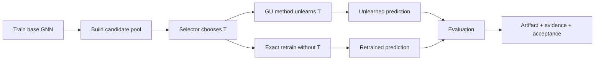

# OpenGU / GULib 实验框架汇报

> **汇报截面：2026-07-14。** 这不是最终论文结论，也不是实时实验看板；它面向一次阶段进度汇报，重点解释完整 experiment setup 如何组织可证伪比较、如何产出可解释证据，以及下一步仍在推进什么。

[打开长条 HTML](REPORT.html) · [实验框架总览](../../../../../OpenGU-DocMap/10_实验矩阵/10_实验-框架总览.md) · [OB 汇报大纲](../../../../../OpenGU-DocMap/30_评审与汇报/32_学长汇报大纲.md)

## Executive Brief

本项目研究一个常被 graph unlearning 工作默认忽略的问题：**删除请求本身也可能被策略性选择。** 如果攻击者在固定预算下选择一组最危险的节点，再要求近似遗忘算法执行删除，不同 GU 方法会不会出现超出 exact retrain 的额外损失？

目前已经建立的不是单个 selector，而是一套完整的系统性审计框架：

- 将 **deletion selector** 与 **GU method** 解耦；
- 在 method、selector、dataset/backbone/ratio、metric 四条轴上组织实验矩阵；
- 同时保留 unlearned 与 exact retrained 对照，区分删除集本身的代价和近似算法额外引入的误差；
- 用结构化 artifact、版本与验收报告追踪 selection、prediction 和 evaluation；
- 把失败、污染和 pending gate 明确留在证据边界中。

本次汇报以 experiment setup 为主轴。Cache V2、`proper-tracin-v1`、surrogate transfer 和补量工作都放在最后的 **Next steps（ongoing）**，不再用实时 WORKPLAN 反向组织主体。

---

## 1. 为什么做：删除请求也是攻击面

Graph unlearning 通常回答“收到删除请求后，怎样高效忘掉指定数据”。这里额外追问：

> 如果 deletion set 不是随机的，而是由攻击者在固定预算下策略性选择，近似遗忘是否会产生比 exact retrain 更大的额外损失？

这个问题有三个层次：

1. **效应层**：哪些 deletion sets 会让模型性能下降？
2. **归因层**：下降来自删除集本身，还是 approximate unlearning 的额外误差？
3. **机制层**：不同 GU family、selector 信号和访问权限为什么产生不同响应？

因此，本项目的核心不是“证明 IF/IM 一定最强”，而是希望通过一套可以被反例推翻、可以区分不同失效模式的系统审计，寻找不同 selector 与 GU family 响应背后的可解释性。

---

## 2. 已建立的完整实验框架

### 2.1 两类对象必须解耦

| 对象 | 它决定什么 | 当前代表 |
|---|---|---|
| **GU method** | 收到删除集后，如何执行 graph unlearning | GIF、GNNDelete、MEGU、IDEA、GraphEraser、GraphRevoker |
| **Deletion selector** | 固定预算下，选择哪些节点进入删除集 | random、degree、PageRank、IM、TracIn、Hybrid |

一次实验是两者的交叉：selector 产生 deletion request，GU method 执行 unlearning。只有保持这个解耦，才能判断“攻击信号强”与“某个 GU family 本身脆弱”是否是同一件事。

### 2.2 完整执行链



这条链同时保留：

- 原模型状态；
- 有序 selected nodes；
- unlearned 与 exact retrained prediction；
- attack、collateral、metadata 与验收信息。

### 2.3 四条实验轴

| 矩阵轴 | 设计 | 回答的问题 |
|---|---|---|
| **GU method** | 六个方法，覆盖 influence、learning、partition/shard 等路径 | 不同 unlearning family 是否有不同脆弱性 |
| **Selector** | random / structural / propagation / model-based / fused | 攻击信号来自结构 volume、传播覆盖还是模型 sensitivity |
| **Scope** | dataset、backbone、ratio、seed | 现象是否只属于单一小图或单一模型 |
| **Metric** | F1、retrain gap、collateral、update-detection AUC、效率 | “失效”是表面性能、近似误差、波及还是可检测性 |

### 2.4 归因框架：不要把所有下降都叫漏洞

对同一个 deletion set，设：

```text
Total = Drop_retrain + Gap
      = (Perf_before - Perf_retrain)
      + (Perf_retrain - Perf_unlearn)
```

| 分量 | 含义 | 研究角色 |
|---|---|---|
| `Drop_retrain` | exact retrain 也会出现的删除集应有损失 | deletion set 本身的难度 |
| `Gap` | approximate unlearning 相对 exact retrain 的额外损失 | over-forgetting / approximation error |
| `Total` | 原模型到 unlearned 模型的总下降 | 结果表象，不足以单独归因 |

这使核心假设可证伪：如果 Gap 接近零，即使 raw F1 下降，也不能简单把它归因于 approximate unlearning 漏洞。

### 2.5 指标分工

| 指标 | 主要回答什么 | 当前边界 |
|---|---|---|
| Raw / paired F1 change | 模型性能是否变化 | 容易混入 deletion set 本身的损失 |
| Retrain gap | approximate unlearning 是否额外过度遗忘 | 当前主归因指标 |
| Collateral / prediction flip | 保留节点受到多大波及 | 需要与 exact retrain 对照 |
| Update-detection AUC | 一次 unlearning 更新是否暴露被删集合 | 不是标准 shadow-model MIA |
| Selection time / end-to-end time | selector 与完整 attack 的资源代价 | 需分开报告，避免把 MIA/重训练成本算给 selector |

---

## 3. Threat Model：三层 selector 权限 + 一个共同前提

这里把“如何构造 deletion set”的权限压成三层；output query 不再单独占一层，而是作为 zero-query / output-query 的反馈维度另记。

| 层级 | 代表 selector | 图 / 数据 | Target 输出 | Target 梯度 / checkpoint | 独立 surrogate |
|---|---|---:|---:|---:|---:|
| **L0 · Structural / model-free** | degree、PageRank、IM | 需要 | 不需要 | 不需要 | 不需要 |
| **L1 · Surrogate black-box transfer** | surrogate proper-TracIn | 需要 | 不需要 | 不需要 | 需要 |
| **L2 · Direct white-box reference** | direct TracIn、GIF reference | 需要 | 可选 | 需要 | 不需要 |

需要把两件事分开：

- **信息权限**决定攻击者如何选点：zero-query、output-query、surrogate 或 direct target access；
- **删除权限**决定攻击能否发生：攻击者必须控制一组 eligible deletion candidates，并能向目标系统提交删除请求。

黑盒攻击者并不自己执行遗忘；它触发 target system 执行 unlearning。因而 surrogate proper-TracIn 可以称为 **target-model black-box transfer**，同时必须声明它依赖哪些图、数据或架构先验。

---

## 4. Experiment Setup：七个实验块如何组成可解释证据

> **配套实验前端：**[Experiment Config Inventory · Coverage Heatmap](../../../self/dashboard/config_inventory.html)。第四章解释如何阅读一个 cell、对照和证据层；该前端展开全部配置、scope、method、strategy、seed，以及 produced / usable / rerun 和 provenance。实时覆盖数字只保留在前端，不复制进本报告。

| 表面 | 职责 |
|---|---|
| **REPORT §4** | 解释七个 config block 分别检测什么，以及 cell、controls、evidence layers 与 fingerprint readout |
| **Config Inventory** | 展示七个 config block 的全部配置、scope、methods、strategies 与 seeds |
| **Live state** | 展示 produced / usable / rerun，以及 CSV / disk provenance |

### 4.1 七个实验块，对应七个检测问题

这七部分不是单纯的“配置文件分类”，也不是七组同等优先级的结果。它们共同组成一套分层检测：先验证 selector 信号，再刻画核心脆弱性，随后检查机制、scope 与规模外推，最后用 sanity 阻止执行错误混进研究结论。

| 前端实验块 | 主要检测什么 | 必须保留的对照 / 变化轴 | 在完整框架中的作用 |
|---|---|---|---|
| **SUPP · overlap / validity** | Selector 是否真的表达不同信号：IM 是否只是 degree；proper TracIn 是否接近 GIF；deployed TracIn 是否需要刷新 | Top-k overlap、GIF / proper / deployed TracIn 对照；必要时补 LiSSA sensitivity | **信号有效性**：先证明“选点信号是什么”，再解释攻击结果 |
| **CORA · main matrix** | 在统一小图主矩阵中，不同 GU family 是否呈现不同脆弱性，不同 selector 是否触发不同响应 | 同 dataset / backbone / ratio / seed；budget-matched random 与 exact retrain | **核心 fingerprint**：读取 family heterogeneity 与 attack-signal sensitivity |
| **ARXIV · main matrix** | 小图上的响应形状能否扩展到大规模图，还是受图规模与计算路径限制 | 保持 selector 语义、评价指标和基线一致，只放大 graph scale | **规模外推**：区分研究规律与 small-graph artifact |
| **A3 · alpha** | IF 与 IM 的融合是否产生互补机制，还是只在两个端点之间插值 | 固定 scope，比较 `α=0`、中间值与 `α=1` | **机制诊断**：解释 Hybrid 是否提供独立信息 |
| **A5 · ratio / dataset** | 结论是否只发生在单一删除预算或单一数据集 | 改变 ratio / dataset，其余坐标尽量固定 | **范围稳健性**：排除 one-budget、one-dataset anecdote |
| **A6 · backbone** | 现象是否依赖特定 GNN backbone 或消息传递归纳偏置 | 改变 GCN / GAT / GIN 等 backbone，其余坐标固定 | **架构外推**：声明结论在哪类模型上成立；未运行时保持 deferred，不越界外推 |
| **SANITY** | Runner、GU method、selector、cache 与 artifact 路径是否先在最小闭环内正常工作 | 单 cell、已知期望、artifact completeness 与 acceptance gate | **执行护栏**：只用于发现工程错误，不能当作 paper evidence |

因此，完整检测链可以压缩为：

```text
signal validity (SUPP)
    → core vulnerability fingerprint (CORA)
    → scale / scope generality (ARXIV + A5 + A6)
    → mechanism diagnosis (A3)
    with execution guardrails (SANITY)
```

前端负责回答“每块当前跑到哪里”；报告负责回答“为什么需要这一块、缺了它会误判什么”。

### 4.2 一个 cell 的坐标

```text
cell = (dataset, backbone, ratio) × GU method × selector × seed
```

| 组成 | 控制什么 | 比较后能回答什么 |
|---|---|---|
| Dataset / backbone / ratio | 图规模、模型归纳偏置与删除预算 | 现象是否只属于单一小图或单一模型 |
| GU method | 近似遗忘的执行机制 | 不同 unlearning family 是否以不同方式失效 |
| Selector | deletion set 的构造信号 | 结构、传播覆盖或模型 sensitivity 哪类信号有效 |
| Seed | 训练、划分和选择随机性 | 观察到的差异是否可重复 |

候选集合限定为可被删除的训练节点，预算由相同 `ratio` 决定。一次比较必须保持 scope、预算和 seed 对齐，避免把预算差异误写成 selector 效果。

### 4.3 一个结论需要哪些对照

| 对照 | 作用 | 不可替代的原因 |
|---|---|---|
| **Budget-matched random** | 同预算、同 seed 的 paired baseline | 判断策略性选点是否优于随机删除 |
| **Exact retrain without T** | 删除同一集合后的金标准 | 把删除集应有损失与 approximate unlearning 额外误差分开 |
| **Multi-seed repetition** | 估计均值、方差和方向稳定性 | 防止单 seed 现象升级为机制结论 |
| **Noise anchor（可选）** | 估计极小删除引起的固有波动 | 只能作参考线，不能替代 budget-matched random |

因此一个 cell 不是“跑一次 unlearning”，而是同时保留 original、unlearned、exact retrained 三个状态，并对同预算 random 建立配对参照。

### 4.4 证据产物分层

| 证据层 | 主要产物 | 需要回答的问题 |
|---|---|---|
| **L1 · Selection** | 有序 `selected_nodes`、selector 配置 / recipe | 删除集合到底由什么信号生成 |
| **L2 · Prediction** | `logits_before`、`logits_unlearned`、`logits_retrained` | 三个模型状态是否可复算、可对齐 |
| **L3 · Evaluation** | F1、retrain gap、collateral、update-detection AUC | “失效”是性能下降、近似误差还是副作用 |
| **Audit metadata** | config、git SHA、seed、scope 与验收记录 | 结果来自哪套代码和实验身份 |

Runner、exact retrain 与四件套 artifact 已构成基础执行面；artifact 版本治理的进一步改进属于最后的 ongoing，而不是 setup 的定义。

### 4.5 从矩阵读出 Vulnerability Fingerprint

| 固定什么 | 改变什么 | 读出的框架信号 |
|---|---|---|
| selector、scope | GU method | family-level heterogeneity |
| GU method、scope | selector | attack-signal sensitivity |
| method、selector | dataset / backbone / ratio | scope 与 generality |
| 同一 cell | metric / baseline | failure source 与结论强度 |

最终要解释的不是一张 selector 排名，而是：**不同 GU family 面对不同 deletion signal 时，呈现出怎样可复核、可被反例推翻的响应形状。**

---

## 5. Results Snapshot：setup 能产出什么证据

### 5.1 Citeseer stable scope

2026-07-14 真机验收覆盖 Citeseer / GCN / r=0.05，5 个稳定方法 × random/IM × 5 seeds，共 50/50 cells。

| 方法 | random gap | IM gap | 读法 |
|---|---:|---:|---|
| GIF | +0.0018 | -0.0018 | 接近当前 noise floor |
| IDEA | +0.0018 | -0.0018 | 接近当前 noise floor |
| MEGU | +0.0021 | -0.0015 | 接近当前 noise floor |
| GNNDelete | +0.0120 | **+0.0462** | IM 在该 accepted scope 放大 approximation gap |
| GraphEraser | -0.0006 | -0.0072 | method-specific shard/SISA before，不能和 vanilla GCN before 混读 |

边界：该表不包含 TracIn、Hybrid、GraphRevoker；不能扩写成完整 Citeseer selector 排名。

### 5.2 TracIn 语义诊断

Cora / GCN / r=0.05 / seed2024，k=108 的 selector-only diagnostic：

| 比较 | Jaccard@108 | 解释 |
|---|---:|---|
| proper TracIn vs eval-IF/GIF | **0.7419** | Hessian-free proper TracIn 与曲率修正 IF 具有较强选集一致性 |
| deployed cross-TracIn vs eval-IF/GIF | **0.1134** | legacy 方向并不是干净的 eval-impact surrogate |
| degree vs PageRank | 0.8305 | 两个 structural centrality selector 高度相近 |
| degree vs IM | 0.1868 | IM 并不只是 degree 的同义替代 |

边界：这是 selector validity 诊断，不等于 attack outcome；必须等 proper-TracIn rerun 后再做 overlap-vs-damage join。

---

## 6. Next steps（ongoing，不属于 setup 主体）

> 这里才引用动态工作状态；完整依赖与执行顺序以 [WORKPLAN.md](../../../self/dashboard/WORKPLAN.md) 为准。

| Ongoing lane | 为什么需要 | 下一道可见输出 |
|---|---|---|
| **Cache / artifact provenance** | 让 selection、prediction、evaluation 的 recipe、依赖和版本可追踪 | Cache V2 runner real-hit；查询异常不静默回退 Legacy |
| **proper TracIn refresh** | 把 legacy training-residual direction 与 eval-impact sensitivity 分开 | versioned `proper-tracin-v1`，legacy artifact 只读；刷新 attack matrix |
| **Surrogate black-box transfer** | 检查 selector signal 能否脱离 direct target access | 先 GCN→GCN，再 GCN→GAT/GIN；报告 transfer ratio 与 selection Jaccard |
| **Coverage / evidence closure** | 关闭方法、scope 与指标缺口，不制造新故事 | GraphRevoker 多 seed、IF collateral、noise anchor、arxiv 补量与 hop 聚合 |

surrogate 线的依赖顺序保持为：

```text
Cache V2 runner real-hit + proper-tracin-v1
                    ↓
       same-architecture transfer
                    ↓
         cross-backbone transfer
```

这些工作均标记为 **ongoing**。它们可以改变未来证据质量或 threat-model realism，但当前不用于定义 experiment setup，也不提前写成科学结论。

---

## 7. 权威来源与阅读入口

| 需要核对 | 权威文件 |
|---|---|
| 实验矩阵与框架关系 | [10_实验-框架总览.md](../../../../../OpenGU-DocMap/10_实验矩阵/10_实验-框架总览.md) |
| 全量实验版图与实时覆盖 | [config_inventory.html](../../../self/dashboard/config_inventory.html) |
| Cell、运行入口与 artifact 分层 | [experiments/configs/README.md](../../../experiments/configs/README.md) |
| 方法与 selector 定义 | [20_方法与策略框架.md](../../../../../OpenGU-DocMap/20_研究框架/20_方法与策略框架.md) |
| Ongoing 状态与依赖 | [WORKPLAN.md](../../../self/dashboard/WORKPLAN.md) |
| TracIn / GIF 公式边界 | [21_TracIn变体与GIF关系.md](../../../../../OpenGU-DocMap/20_研究框架/21_TracIn变体与GIF关系.md) |
| Cache V2 架构与迁移 | [19_Cache架构重设计与迁移方案.md](../../../../../OpenGU-DocMap/10_实验矩阵/19_Cache架构重设计与迁移方案.md) |
| Citeseer E1 evidence | [citeseer_e1_stable_ACCEPTANCE_REPORT.md](../../../docs/citeseer_e1_stable_ACCEPTANCE_REPORT.md) |
| GraphRevoker canary evidence | [graphrevoker_postfix_canary_ACCEPTANCE_REPORT.md](../../../docs/graphrevoker_postfix_canary_ACCEPTANCE_REPORT.md) |
| Cache V2 Selection evidence | [cache_v2_citeseer_selection_canary_ACCEPTANCE_REPORT.md](../../../docs/cache_v2_citeseer_selection_canary_ACCEPTANCE_REPORT.md) |
| IF selector diagnostic | [ifdiag_cora_GCN_r0.05_seed2024.json](../../../self/related_work/concordance/data/ifdiag_cora_GCN_r0.05_seed2024.json) |

---

## 8. 冻结规则

- 本报告冻结于 2026-07-14；它可以用于一次完整研究讨论。
- 新实验默认进入下一次 checkpoint，不反向拖动本次汇报。
- 只有推翻本报告主判断的证据，才修改主体。
- 未通过 gate 的内容只能出现在“Next steps / ongoing”，不能升级为结果结论，也不能反向定义 setup。
