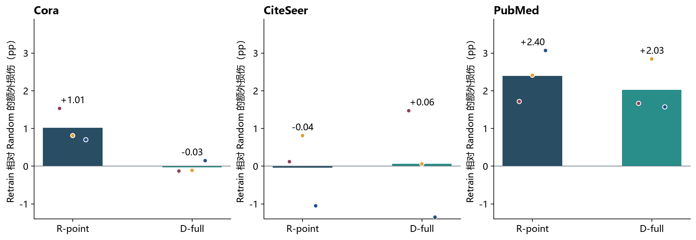
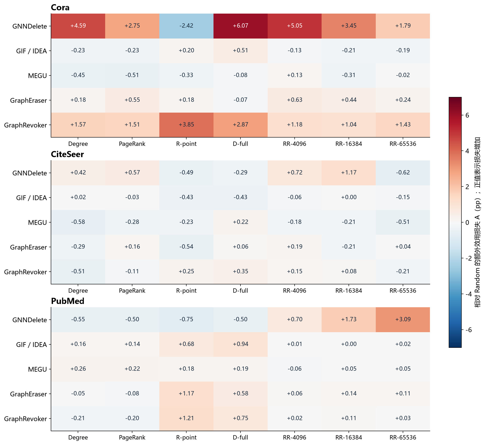
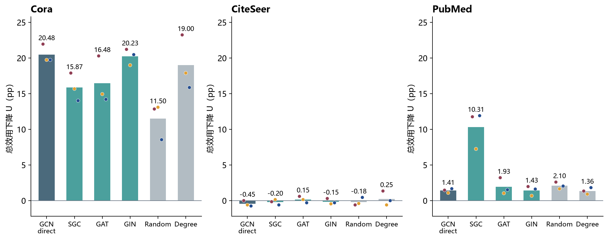
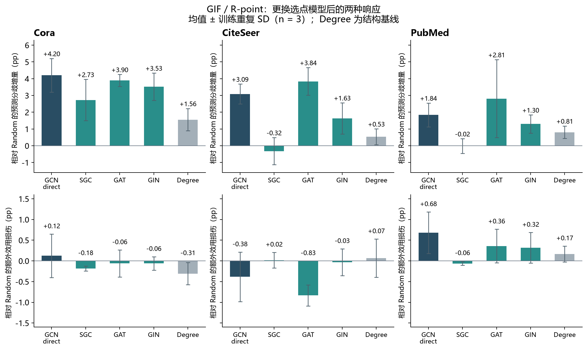

# 从节点影响到图遗忘响应：实验结果与理论问题

研究讨论稿 · 刘丞毓 · 2026 年 10 月 5 日初稿，10 月 6 日修订

正文按约 18–20 分钟安排；表格、图注、材料链接和附录供展示与讨论时查阅，不逐项朗读。

> 主要实验已经完成。IF 在部分 Retrain 条件下有明确效果，但这种效果没有稳定传递到不同 GU。当前框架能够定位差异，尚未解释差异。这次希望讨论：优先深化 IF 有效性的条件，还是建立从 Retrain 影响到 GU 响应的理论联系，以及哪条更可能形成论文贡献。

## 汇报路线

**IF 认为哪些节点重要 → 删除后 Retrain 是否真的受损 → GU 怎样改变这种损伤 → 换模型选点后能否保留 → 哪一段值得形成理论主线。**

| 段落 | 主线问题 | 结果如何推进讨论 | 时间 |
|---|---|---|---:|
| 1 | 怎样从节点重要性走到图遗忘攻击？ | 交代研究预期与当前解释缺口 | 1.5 分钟 |
| 2 | 选点依据能否预测 Retrain 的变化？ | IF 有效性已经依赖数据集与配置，不能直接推到 GU | 4 分钟 |
| 3 | GU 怎样改变删除的影响？ | 效用损伤会被放大或削弱；准确率变化较小时，行为偏离仍可能增加 | 6 分钟 |
| 4 | 换模型选点后，哪些响应还能保留？ | GAT、GIN 与 SGC 的不同表现，以及跨 GU 的正反案例，限定解释范围 | 5 分钟 |
| 5 | 哪个关系最值得形成理论主线？ | 比较候选解释，讨论还缺什么证据 | 3.5 分钟 |

快速入口：[Work Plan 总表](../../../self/research/index.html) · [EXP-011 完整主表](../../../self/research/analyses/EXP-011/table02-v2-tables.html) · [EXP-013 全量图表](../../../self/research/analyses/EXP-013/REPORT.html)。验收范围见附录 A。

## 1. 研究问题与实验安排

我们想研究的是：策略性地选择删除节点，会不会让图遗忘方法出现随机删除下不明显的问题？最初的思路是用 IF 或传播影响找到重要节点，再观察这些请求对 Retrain 和 GU 的影响。

现在，实验基本已经跑完，但这条推理没有完整成立。IF 在部分条件下确实能找到对 Retrain 更有破坏力的节点；到了 GU，效果可能被放大，也可能减弱，甚至方向不同。同一个选点方法跨数据集也没有一致的优势。我现在最想解决的是，这些变化能不能由一个有条件、可检验的解释串起来。

实验围绕三个相连的问题展开：先判断选点依据是否对应真实的删除影响，再看 GU 如何改变这种影响，最后检查换模型选点后哪些响应能够保留。

| 主要研究问题 | 比较设计 | 主要实验 |
|---|---|---|
| 选点依据能否预测删除后的重训变化？ | 对比 IF、IM、结构指标与 Random 在 Retrain 上的效果；进一步比较 IF 近似与删除预算 | EXP-032：360 个 Retrain 条件；EXP-011 的 Retrain 对照 |
| 同一删除影响经过 GU 后，怎样表现为效用变化和重训行为偏离？ | 固定删除请求，比较六种 GU 与同请求 Retrain；观察相对 Random 的效用损伤、gap 和预测分歧 | EXP-011：1,449 个输出条件、1,242 条 GU–Retrain 配对 |
| 这些效用与行为响应能否跨选点模型保留？ | 固定 GCN 目标侧，用 GCN、SGC、GAT、GIN 分别选点，比较响应幅度、方向及基线 | EXP-013：756 个输出条件、648 条 GU–Retrain 配对 |

主表和迁移实验都覆盖 Cora、CiteSeer、PubMed，使用三个训练 seed，删除训练候选节点的 10%。这些输出共享图、划分和部分选集，数量不能当作独立重复次数。

我希望最后形成的是稳定的研究框架，加上能解释结果的理论关系。现在的框架已经能回答“差异出现在哪里”；如果只把这些不同的表现列出来，贡献仍会偏向 benchmark。

材料：[上次汇报](../2026-08-26_advisor-meeting/REPORT.md) · [上次会议纪要](../2026-08-26_advisor-meeting/MEETING_NOTES.md) · [主表配置](../../../experiments/configs/aagu011/table02_v2.yaml) · [迁移配置](../../../experiments/configs/exp013/surrogate_to_gcn.yaml)。

## 2. 选点依据能否预测 Retrain 的变化？

### 2.1 IF 提供了怎样的预期？

Degree 只按节点的连接数选择；IF 则试图估计，删除这个节点会怎样改变训练后的参数，进而怎样改变目标损失。它与模型当前学到的东西有关，也与我们希望损害的目标有关。

图上的问题又多了一层：删除节点会改变邻居的输入和表示。因此，除了只考虑节点自身损失的 R-point，我们还用了计入邻域损失变化的 D-full。它对应实现中的 graph-aware source；这里的“full”不能理解为全参数、全图精确计算，主表采用的仍是具体参数子空间和邻域近似。

评分的结构可以写成：

$$s(v)\approx g_{\mathcal{Q}}^{\top}(H+\lambda I)^{-1}q_v$$

这里，qᵥ 是删除造成的梯度扰动，H 是训练目标的局部曲率，g𝒬 是验证目标的损失梯度。评分估计删除对目标损失的局部影响。这个 λ 表示本式中的数值移位，不与其他论文的训练正则项混用。[IF 推导](https://proceedings.mlr.press/v70/koh17a.html) · [图上删除的邻域修正](https://wujcan.github.io/papers/www23-gif.pdf)

但这里需要修正我原来的预期：有影响估计的理论依据，不等于已经证明按这个分数选出的有限节点集合，在准确率上一定比 Degree 更有破坏力。中间至少还有三个环节：近似评分是否准确，单点影响能否组合成批量删除的影响，以及损失变化是否转化成分类错误。

《Characterizing the Influence of Graph Elements》给出了 SGC 条件下的影响估计和误差分析，也展示了用 SGC 选点攻击 GCN 的效果。它为我们的预期提供了依据，但没有保证当前 GNN、数据划分和 GU 算法下的统一效果排序。原论文采用公共训练划分，我们当前的训练划分不同；结果幅度不能直接照搬。[原论文，第 4、5.5 节及附录 E](https://arxiv.org/pdf/2210.07441)

所以实验首先要检查的是：**在进入 GU 之前，IF 选出的节点是否已经对 Retrain 更有破坏力？** 如果这一环都不稳定，就不能把后面的所有差异都归因于 GU。

### 2.2 实验回答：有效，但依赖条件

这里先只看完整重训。我用同预算 Random 作为参照，定义额外损伤 Aᵣ：随机请求后的准确率，减去策略性请求后的准确率。正值表示策略性请求带来更多损伤。

| 数据集 | Random 后准确率 | R-point 后准确率 | D-full 后准确率 | R-point 的 Aᵣ | D-full 的 Aᵣ |
|---|---:|---:|---:|---:|---:|
| Cora | 89.76% | 88.75% | 89.79% | +1.01 pp | −0.03 pp |
| CiteSeer | 74.88% | 74.92% | 74.82% | −0.04 pp | +0.06 pp |
| PubMed | 88.51% | 86.11% | 86.49% | +2.40 pp | +2.03 pp |

表 1. EXP-011 的同请求 Retrain，10% 预算、三个训练 seed。Random 在每个训练 seed 内先平均十次抽样，再对训练 seed 等权平均。这里展示均值，不作显著性声明。[附带数据](assets/retrain-reference.csv)

图 1. 柱为 Aᵣ 均值，点为三个训练 seed 各自相对 Random 的差值；零线表示与 Random 相同。

PubMed 上，两种 IF 请求都比 Random 多造成约两个百分点的损失。Cora 是 R-point 有效果，D-full 接近 Random；CiteSeer 的均值则都很接近零。

这已经暴露了第一个需要解释的问题：更完整地计入图扰动，并没有在每个数据集上带来更强的准确率攻击。它可能涉及影响估计误差，也可能涉及批量删除与分类边界；现在还不能凭这个表决定原因。

EXP-032 从四个预算和三个 D-full 配置补充了这个问题。当前 3000 轮参数分析中，D-full 相对 Degree 的平均准确率差，在 Cora 为 −0.277 pp，PubMed 为 −0.922 pp，CiteSeer 为 +0.188 pp。负值代表攻击损伤更大。它也呈现条件性，但这是多个配置与预算的描述性汇总，科学审阅尚未完成，不能用来替代逐条件分析。

我现在对这一段的判断是：IF 的信号并没有消失，但其有效条件还没解释清楚。下一段要进一步问，在已经存在 Retrain 损伤的地方，GU 是否保留了这个信号。

材料：[EXP-032 当前分析](../../../self/research/analyses/AAGU-032-AAGU-053-3000-only-paper-analysis-20260923.md) · [逐预算配对数据](../../../self/research/analyses/evidence/AAGU-032-AAGU-053-3000epoch-20260923/AAGU-032-paired-baseline-contrasts.csv)。

## 3. GU 怎样改变删除的影响？

### 3.1 效用损伤会被放大或削弱

为了看清这一步，我给每个删除请求都配了完整重训，同时保留 Random。先定义 G 为同请求 Retrain 准确率减去 GU 准确率。G 大于零，表示 GU 比重训差；小于零，表示 GU 的任务效用更高。这个量只比较效用，不等于遗忘正确性。

再把策略性请求和 Random 比较。Aₘ 表示 GU 上相对 Random 的额外损伤，Eₘ 表示策略性请求额外改变了多少 GU–Retrain gap。它们满足：

$$A_M(S)=A_R(S)+E_M(S)$$

这个式子是恒等式，本身没有理论新颖性。它的作用是明确我们缺的解释：同一个请求在 Retrain 上的损伤，通过哪个 GU 过程被放大或削弱了。

图 2. EXP-011 全部七种非 Random 配置，单元为 Aₘ，单位 pp。正值表示额外损伤，负值表示策略性请求的效用高于 Random。GIF/IDEA 对应准确率完全相同，在效用图中合并；全部六方法仍保留在原始表中。各方法训练及模型设置不同，图不支持普遍方法排名。[完整数据](assets/table02-unified-signs.csv)

如果顺着刚才的 D-full 往下看，Cora 的 Retrain 基本没有额外损伤，但 GNNDelete 有 6.07 pp 的额外损伤。PubMed 的 Retrain 有约 2.03 pp，到了 GIF 只剩约 0.94 pp，到了 GNNDelete 则是 −0.50 pp。这说明，Retrain 上的攻击效果不足以直接预测 GU 上的效果。

两个案例可以把这个问题讲得更具体。

| 条件 | 总效用下降 | 同请求 Retrain 变化 | GU gap G | GU 额外损伤 Aₘ | Retrain 额外损伤 Aᵣ | gap 增量 Eₘ |
|---|---:|---:|---:|---:|---:|---:|
| Cora / GNNDelete / D-full | +20.48 | +0.31 | +20.17 | +6.07 | −0.03 | +6.10 |
| PubMed / GIF / D-full | +0.96 | +1.99 | −1.03 | +0.94 | +2.03 | −1.09 |

表 2. 单位均为 pp；前三列满足“总下降 = Retrain 变化 + G”，后三列满足 Aₘ = Aᵣ + Eₘ。显示值经过四舍五入。[分解数据](assets/decomposition-cases.csv)

第一例里，GNNDelete 的总下降有二十多个百分点，但 Random 下本来就有约 14.07 pp 的 gap。D-full 额外增加的是 6.10 pp，不能把全部下降都算成策略性选点的贡献。与此同时，Retrain 本身没有额外受损，这个结果值得从 GU 的请求响应入手解释。

第二例正好相反。PubMed 的请求对 Retrain 更有破坏力，GIF 的准确率也下降了，但下降程度更小。它对 GU 的额外损伤为正，gap 增量却为负。这里如果只说“攻击成功”，就会把两种不同的问题混在一起。

这两个例子让我更倾向于把理论问题放在 Retrain 到 GU 的联系上：**什么条件下，节点对重训的重要性会传递为 GU 损伤；又是什么使它被放大、削弱或反转？**

材料：[EXP-011 已接受分析](../../../self/research/analyses/EXP-011/table02-v2-analysis.html) · [分解图](assets/02-decomposition.png)。

### 3.2 准确率变化小，是否就意味着遗忘行为接近重训？

GIF 的结果给出了另一种情况：R-point 对准确率的影响不大，但三个数据集上与同请求 Retrain 的预测分歧都增加了。IDEA 在这些比较中的数值相同，以下以 GIF 展示，不把两者视为独立的机制证据。

| 数据集 | GIF 的 R-point 额外损伤 Aₘ | Random 与 Retrain 的分歧 | R-point 与 Retrain 的分歧 |
|---|---:|---:|---:|
| Cora | +0.20 pp | 2.49% | 6.40% |
| CiteSeer | −0.43 pp | 4.66% | 7.41% |
| PubMed | +0.68 pp | 2.12% | 4.05% |

表 3. EXP-011；对应 IDEA 数值相同。分歧指 GU 与同请求 Retrain 对测试节点的预测不同，不是相对原模型的翻转，也不是隐私指标。[数据图](assets/03-utility-and-disagreement.png)

CiteSeer 上最直观：R-point 的准确率反而比 Random 高 0.43 pp，但预测分歧从 4.66% 增到 7.41%。所以，“效用没有明显受损”还不能完整概括结果。

这个现象值得放到核心候选里。接下来应当比较选点策略，并看重复实验中的方向和幅度是否一致。把 IM 和其他结构基线都放进来，可以看到：

| 选点策略 | Cora | CiteSeer | PubMed |
|---|---:|---:|---:|
| Random | 2.49 ± 0.16 | 4.66 ± 0.39 | 2.12 ± 0.15 |
| Degree | 3.75 ± 0.70 | 4.85 ± 0.35 | 3.02 ± 0.38 |
| PageRank | 3.94 ± 0.75 | 5.36 ± 0.63 | 3.46 ± 0.37 |
| IM / RR-4096 | 3.49 ± 0.80 | 4.99 ± 0.36 | 2.09 ± 0.26 |
| IM / RR-16384 | 3.73 ± 0.09 | 5.12 ± 0.38 | 2.77 ± 1.41 |
| IM / RR-65536 | 3.96 ± 0.38 | 5.07 ± 0.53 | 2.25 ± 0.16 |
| R-point | 6.40 ± 0.85 | 7.41 ± 0.38 | 4.05 ± 0.67 |
| D-full | 4.12 ± 1.05 | 5.56 ± 0.69 | 3.36 ± 0.98 |

表 3b. GIF 与同请求 Retrain 的预测分歧，单位 %，均值 ± 三个训练重复的样本 SD。每个训练重复内，Random 先平均十次选点、IM 先平均三次选点；SD 不表示选点本身的稳定性，也不是置信区间。[全部方法的策略比较数据](assets/behavior-selector-summary.csv)

R-point 的平均分歧在三个数据集上都高于三档 IM，也高于 Degree 和 D-full；高于 Random、Degree 的方向在三个训练重复中一致。这里支持的是这组条件中方向的一致性，不能说 R-point 的波动比其他策略更小。比如 Cora 的 RR-16384 波动很小，但平均分歧也明显较低。

IF 与 IM 优化的目标不同，但仅凭目标不同还不能解释这些差异。一个具体假设是：R-point 找到的请求更容易使完整重训改变判断，而近似遗忘没有完整跟上。另一种可能是 GU 自己产生了额外变化，需要比较两侧相对删除前模型的变化来区分。

这样，准确率较稳而预测分歧增加就成为一个具体的待解释现象。理论需要说明它怎样发生、在哪些条件下保留；仅把分歧数字换成新的攻击指标还不够。

这个现象目前是在直接选点条件下看到的。下一步要问，换一个模型选点，是否仍然能产生类似的效用与行为响应。[主表分析](../../../self/research/analyses/EXP-011/table02-v2-analysis.md)

## 4. 换模型选点后，哪些响应还能保留？

代理迁移实验进一步检查，这些结果有多少依赖选点模型。目标侧保持 GCN，分别使用 GCN direct、SGC、GAT、GIN 生成请求。代理不查询目标模型的权重、梯度或预测，但共享图、划分和指定验证标签，因此这里是共享数据条件下的灰盒迁移。

### 4.1 效用损伤能否迁移？

图 3. EXP-013，GNNDelete / D-full 的总准确率下降。柱为三个训练 seed 均值，点为训练重复；Random 每个训练 seed 先平均三次请求。六种 GU、两种 IF 的完整结果见[全量报告](../../../self/research/analyses/EXP-013/REPORT.html)。

| 数据集 / 方法 / 选点 | GCN direct | GIN | SGC | Random | Degree |
|---|---:|---:|---:|---:|---:|
| Cora / GNNDelete / D-full | 20.48 | 20.23 | 15.87 | 11.50 | 19.00 |
| PubMed / GNNDelete / D-full | 1.41 | 1.43 | 10.31 | 2.10 | 1.36 |

表 4. 总下降，单位 pp。完整六来源均值和 SD 已附在[数据文件](assets/transfer-example.csv)，表中只突出要讲解的比较。

Cora 上，GIN 的效果接近 direct，而且都超过 Random，是一个明确的迁移案例。但 Degree 也能造成 19.00 pp 的下降，不能把这个案例讲成代理 IF 已经稳定优于简单基线。

PubMed 则提出了另一种问题：SGC 的请求造成 10.31 pp 的下降，direct 只有 1.41 pp。直接使用目标模型选点，并不构成攻击强度上界；这也符合前面的问题，IF 评分目标与实际 GU 响应之间还有距离。

反例也存在。Cora / GNNDelete / GAT / R-point 的总下降为 6.46 pp，低于 Random 的 11.50 pp。有些配置的代理与 direct 很接近，但两者本来都比 Random 弱，例如刚才 PubMed 的 direct 与 GIN。所以“接近 direct”和“有较强的攻击效果”必须分别看。

另外，Cora / D-full 中，GIN 与 direct 跨 GU 的损伤排序相关达到 1.000；但 Random 与 direct 也有 0.975。高相关中可能包含 GU 方法本身的共同响应。仅凭相关性，不能判断代理保留了多少有用的攻击信号。

### 4.2 效用与行为分离的现象能否迁移？

如果把刚才 GIF 的现象作为核心候选，surrogate 实验就应该直接检查它，而不能只讲总准确率下降。下面仍固定 GIF 和 R-point，改变选点模型，比较预测分歧相对 Random 的增量。

| 选点模型 | Cora | CiteSeer | PubMed |
|---|---:|---:|---:|
| GCN direct | +4.20 ± 1.00 | +3.09 ± 0.59 | +1.84 ± 0.71 |
| SGC | +2.73 ± 1.23 | −0.32 ± 0.80 | −0.02 ± 0.44 |
| GAT | +3.90 ± 0.36 | +3.84 ± 0.83 | +2.81 ± 2.33 |
| GIN | +3.53 ± 0.81 | +1.63 ± 0.93 | +1.30 ± 0.54 |

表 4b. EXP-013，GIF / R-point 的 ΔFlip = Flip(selected)−mean Flip(Random)，单位 pp，均值 ± 三个训练重复的差值 SD。配对在同一训练条件内完成，再汇总重复；比较轴是选点模型。这里 Random 每个训练重复只有三次抽样，不能与表 3b 的十次 Random 基线混算。[全部模型、方法及两种 IF 的数据](assets/behavior-transfer-summary.csv)

图 4. 上排是预测分歧增量 ΔFlip，下排是效用额外损伤 Aₘ；正值分别表示分歧更多、准确率损伤更大。误差线是训练重复 SD，不是置信区间。横轴比较四种选点模型及 Degree 基线。

GAT 和 GIN 在三个数据集上都保留了分歧增加的方向；GAT 在 PubMed 上的幅度波动较大。SGC 则在 Cora 有增量，在 CiteSeer 和 PubMed 上接近 Random。这里已经有可以区分解释的正反情况，不能只说所有 surrogate 都有效。

效用与行为分离的例子也随代理选点保留下来了。CiteSeer 上，GAT 请求让 GIF 的准确率比 Random 高约 0.83 pp，同时预测分歧增加约 3.84 pp。这个现象不依赖直接读取目标模型的信息，但目前只是在共享图和指定验证标签的条件下观察到。

### 4.3 换 GU 方法后，关系是否仍然成立？

GIF 与 IDEA 的对应分歧数值相同，不能只靠它们来支撑跨机制解释。已有结果中，MEGU 也出现了值得比较的情况：

| MEGU / GAT / R-point | 效用额外损伤 Aₘ | 预测分歧增量 ΔFlip |
|---|---:|---:|
| Cora | −0.12 pp | +1.95 pp |
| CiteSeer | −0.27 pp | +2.87 pp |
| PubMed | +0.21 pp | +2.94 pp |

表 4c. EXP-013，三个训练重复的均值，使用本实验自己的 Random 基线。其他模型与 GU 的正反结果均保留在[完整比较数据](assets/behavior-transfer-summary.csv)。

这说明效用变化较小、行为偏离增加并不只出现在 GIF/IDEA。另一方面，GraphEraser、GraphRevoker 的部分代理条件中，分歧增量为负；现有结果不支持所有 GU 都出现同一种响应。

因此，surrogate 层次可以直接检验核心现象的边界：哪些选点模型保留了行为偏离，哪些模型没有；换一个 GU 方法后，这个关系是否改变。训练 seed 用来估计重复波动，选点模型、选点策略和 GU 方法才是这里要讨论的对象。

材料：[当前迁移结论](../../../self/research/analyses/EXP-013/transfer_conclusion_REPORT.html) · [GIN 跨六 GU 比较与 Discussion](../../../self/research/analyses/EXP-013/gin_transfer_discussion_REPORT.html) · [选集重叠分析](../../../self/research/analyses/EXP-013/post_REPORT.html)。

## 5. 哪个关系最值得形成理论主线？

把这几组结果放在一起，核心困难可以说得更准确一些：我们已经能测量节点选择造成的损伤，却还不能解释这种损伤为什么随训练条件和 GU 方法变化。

目前有两条值得认真讨论的主线。第一条是往前追，解释 IF 在 Retrain 上什么时候有效。它会重点分析影响估计、批量删除、损失与准确率之间的关系，EXP-032 是主要材料。它的好处是理论对象相对集中；难点是最后可能更接近一般图影响估计问题，需要说明与图遗忘研究的联系。

第二条是从 Retrain 往 GU 推，解释删除影响如何被具体遗忘算法改变。现在其中有一个更集中的切口：为什么一些策略对准确率的影响不大，却扩大了与重训的预测分歧？EXP-011 比较 IF、IM 和结构基线；EXP-013 则检查这个现象能否跨选点模型及 GU 方法保留。它更贴近图遗忘本身，但不能用一个分解式就宣布统一解释了所有算法。

| 候选切面 | 论文要回答的中心问题 | 目前有的证据 | 距离贡献还缺什么 |
|---|---|---|---|
| A. IF 有效性的条件 | 什么时候影响评分能预测有限删除后的 Retrain 损伤？ | 三数据集的效果差异、R-point/D-full 差异、EXP-032 多预算结果 | 能区分评分近似、集合交互和评价端点的证据；有条件的误差或排序结论 |
| B. Retrain 影响如何传到 GU | 什么条件下，效用损伤较小而重训行为偏离增加？ | R-point 与 IM 的分歧差异；GIF/IDEA、MEGU 的效用与行为分离 | 区分 GU 的额外变化与未跟上 Retrain 的变化；从方法响应预测现象，不能只复述指标关系 |
| C. 作为 B 的检验：代理迁移 | 不同选点模型能否保留同一种效用或行为响应？ | GAT、GIN 在 GIF 上保留分歧增量；SGC 在部分数据集接近 Random；效用迁移另有正反案例 | 区分共同影响方向、方法共同响应和弱效果接近；说明为什么迁移随模型和 GU 改变 |

我的暂定组织方式是以 B 为中心，把 A 作为进入主问题前必须检查的条件，用 C 检查核心现象是否依赖目标模型自身的选点信息。这样整篇文章围绕“从节点影响到图遗忘响应”展开。效用与行为分离是现在值得优先讨论的具体切口；是否足以承担论文主线，取决于后续能否解释并预测它的边界。

理论上可以从一个很简单的关系起步：如果 GU 与 Retrain 在策略性请求和比较请求上的效用误差都有界，而且两次误差的合计上界小于 Retrain 的攻击优势，那么优势就能保留。这个结论本身只是误差传递，不足以成为论文贡献。真正要做的是解释误差为什么受控、依赖什么、什么时候会变大。

理论需要回答，什么样的 GU 更新会保留重训的变化，什么样的更新会让两者分离。能否先在一个可分析的方法家族上建立关系，再用其他方法检验它的适用范围，是需要讨论的取舍。

接下来我希望优先利用已有结果，沿选点策略、代理模型、GU 方法比较效用与行为变化，再检查分歧是集中在什么节点、主要由哪一侧的变化产生。若缺少必要的原模型预测、评分或更新诊断，再围绕具体假设决定是否补最小验证。大矩阵本身已经足够丰富，继续增加组合未必会解决解释问题。

### 5.1 需要讨论的问题

1. 论文中心是否放在“Retrain 影响如何传到 GU”上？还是现有证据更适合先把“IF 为什么只在部分条件下有效”讲透？两条路线都能使用已有实验，但理论投入会不同。
2. 理论应该先覆盖一个可分析的 GU 家族，还是追求跨六种方法的关系？如果只能对一个家族给出较强结论，其他方法作为边界案例，是否能形成完整贡献？
3. 是否把“效用保持与重训行为一致性为什么分离”作为具体主问题？这条线已有跨数据集和部分跨方法案例；需要进一步明确行为偏离的实质意义，以及什么解释能够超出准确率与分歧本来就是不同指标这一事实。
4. 代理迁移适合独立成为主线，还是直接检验这个现象的边界？GAT、GIN 与 SGC 的区别，以及不同 GU 的反例，能否帮助区分候选机制？
5. 在“框架加理论解释”这个目标下，最小还缺哪条证据？是一个能预测未参与解释的条件的关系，还是某个具体算法下的误差界与边界案例？确定这一点后，才能决定是否需要少量补充分析或实验。

## 附录 A. Work Plan 中的验收与材料入口

状态核对日期：2026-10-06。运行与交付读取 `experiments/EXP-NNN.json`；分析及科学决定读取 `analyses/EXP-NNN.json`。下面是本次汇报的状态快照，后续状态以 [Work Plan](../../../self/research/index.html) 为准。

| 实验 | 运行 / 交付 | 分析 | 科学决定 | 已确认范围及入口 |
|---|---|---|---|---|
| [EXP-011](../../../self/research/experiments/EXP-011.html) | completed；1,449 格，回传校验通过 | complete | **accepted** | 完整主表及固定条件下的描述性结论；GIF/IDEA 机制等价仍未确认。[决定原文](../../../self/research/analyses/EXP-011.json) · [验收所据分析](../../../self/research/analyses/EXP-011/table02-v2-analysis.html) |
| [EXP-013](../../../self/research/experiments/EXP-013.html) | completed；756 格，产物验收通过 | complete | **not_requested** | 已记录条件性迁移口径；没有正式科学接受或等效性结论。[决定原文](../../../self/research/analyses/EXP-013.json) · [分析](../../../self/research/analyses/EXP-013/transfer_conclusion_REPORT.html) |
| [EXP-032](../../../self/research/experiments/EXP-032.html) | completed；360 格 | review | **pending** | 3000 轮当前参数分析待科学审阅。[决定原文](../../../self/research/analyses/EXP-032.json) · [草稿](../../../self/research/analyses/AAGU-032-AAGU-053-3000-only-paper-analysis-20260923.md) |
| [EXP-053](../../../self/research/experiments/EXP-053.html) | completed；当前下游 96 格；历史采样另有 36 格 | complete | **accepted** | 接受按配置诊断收口；`success_confirmed=false`，没有接受“攻击成功”或“采样充分”。[决定原文](../../../self/research/analyses/EXP-053.json) · [收口记录](../../../self/research/analyses/EXP-053-closeout-20260925.md) |
| [EXP-062](../../../self/research/experiments/EXP-062.html) | 协调记录本身 not_required；子实验执行 | complete | **accepted** | 仅四组固定 checkpoint 校准与验证；CiteSeer/PubMed H16 暂缓。[决定原文](../../../self/research/analyses/EXP-062.json) · [收口记录](../../../self/research/analyses/EXP-062/closeout-20260924.md) |
| [EXP-079](../../../self/research/experiments/EXP-079.html) | pending；未启动 | 尚无分析记录 | 尚无决定 | 迁移验证计划新增七个训练 seed，目标总数十个；不属于本次已有结果。[状态源](../../../self/research/experiments/EXP-079.json) |

这里确实有实验验收。需要特别注意 EXP-013：交付回执中的 `project_acceptance: accepted` 指 756 格产物满足项目检查；其科学决定仍为 `not_requested`。两个状态回答不同问题。

交付证据：[EXP-011 可信回传回执](../../../.syncmate/deliveries/exp011-t2-retry-20260929-183235.json) · [EXP-013 恢复收集及产物验收](../../../.syncmate/recovery-exp013-full-20260930-r1/summary.json)。本次生成器另保存了[状态与来源哈希快照](assets/workplan-status-snapshot.json)，未改动任何实验状态。

## 附录 B. 数据、图表与复核口径

### B1. 每段讲稿对应的材料

| 讲稿位置 | 直接附在本稿的数据 | 完整材料与原始来源 |
|---|---|---|
| 第 2 节：IF → Retrain | [Retrain 均值、SD 与基线差](assets/retrain-reference.csv)；图 1 | [EXP-011 汇总](../../../self/research/analyses/EXP-011/table02-v2-summary.csv)；[EXP-032 逐条件](../../../self/research/analyses/evidence/AAGU-032-AAGU-053-3000epoch-20260923/AAGU-032-all-conditions.csv) |
| 第 3.1 节：Retrain → GU | [统一符号的完整表](assets/table02-unified-signs.csv)；[两案例分解](assets/decomposition-cases.csv)；图 2 | [六 GU 全表](../../../self/research/analyses/EXP-011/table02-v2-tables.html)；[原始 manifest](../../../results/runs/gpu4090/exp011-t2/0925-v1/run.json) |
| 第 3.2 节：IF、IM 与行为偏离 | 表 3、3b；[全部策略与 GU 的均值及 SD](assets/behavior-selector-summary.csv) | [主表分析](../../../self/research/analyses/EXP-011/table02-v2-analysis.html)；[校准证据](../../../self/research/analyses/EXP-062/closeout-20260924.md) |
| 第 4 节：效用与行为的迁移 | [效用案例](assets/transfer-example.csv)；[全部模型、方法、两种 IF 的均值及 SD](assets/behavior-transfer-summary.csv)；[训练重复数据](assets/behavior-transfer-seeds.csv)；图 3、4 | [756 格原始分析数据](../../../self/research/analyses/EXP-013/cells.csv)；[跨方法相关](../../../self/research/analyses/EXP-013/transfer_method_correlations.csv)；[原始 manifest](../../../results/runs/gpu4090/exp013-surrogate-to-gcn/r1/run.json) |
| 第 5 节：理论与讨论 | 本稿附录 C、D | [论文叙事与章节入口](../../../../../OpenGU-DocMap/40_论文写作/40_论文写作.md)；[攻击与参照定义](../../../../../OpenGU-DocMap/40_论文写作/04_攻击与审计框架.md) |

### B2. 数值读法

- “效用”指测试准确率。原字段名 `f1` 实际计算 argmax accuracy，单标签多分类下与 micro-F1 数值相等，不能当作 macro-F1。
- A = Random−selected；G = Retrain−GU；E = G(selected)−mean G(Random)。差值单位为百分点 pp，预测分歧单位为百分比。EXP-011 原汇总的 `gap` 与本稿 G 符号相反，`relative_random` 与本稿 A 符号相反。
- 先在每个训练 seed 内平均选择重复，再对 42、212、2024 三个训练 seed 等权平均。SD 为三个训练重复的样本标准差，不是置信区间。
- “同训练 seed 配对”固定模型训练条件，不表示 selector 使用相同选点 seed，也不表示不同模型的训练结果相同。汇报以策略、选点模型和 GU 方法为比较轴；训练 seed 只作重复。方向一致、幅度接近与波动较小分别判断，不用逐 seed 胜负计数替代稳定性分析。
- EXP-011 每训练 seed 有十次 Random，EXP-013 有三次。即使 direct 输出复用，相对 Random 的值也可能不同；两组不能当成独立复现。
- 分片方法有自己的集成模型起点。跨方法绝对效用及总下降还受模型与训练设置影响；GU 与全图 Retrain 的差距也包含模型、聚合差异。
- 10% 指训练候选池中的删除比例。主表有 207 个请求条件、81 个不同 Selection Artifact；总输出数不表示独立样本数。

### B3. EXP-032 的补充表

| 数据集 | 三种 D-full 配置 × 四预算：相对 Degree 的平均准确率差 | 低于 / 持平 / 高于 Degree | 相对 Random 的平均差 |
|---|---:|---:|---:|
| Cora | −0.277 pp | 8 / 2 / 2 | −0.062 pp |
| CiteSeer | +0.188 pp | 4 / 0 / 8 | +0.526 pp |
| PubMed | −0.922 pp | 10 / 0 / 2 | −0.949 pp |

此表沿用原分析的 selected−baseline 符号，负值表示损伤更大；不同于正文 A 的方向。每个配置预算组先平均三个训练 seed；12 组并非独立重复。科学状态为 review/pending。[当前参数分析及完整表链接](../../../self/research/analyses/AAGU-032-AAGU-053-3000-only-paper-analysis-20260923.md)

### B4. 执行身份

| 实验 | run | 实际执行 SHA |
|---|---|---|
| EXP-011 | `exp011-t2 / 0925-v1` | `1f5cfec08494ef1a78eda16bd3f69428ac47b0bd` |
| EXP-013 | `exp013-surrogate-to-gcn / r1` | `62926d95b843af137076eb9dd0a15e1c54c75663` |
| EXP-032 | `aagu032-recovery-full-20260920` | `ee4ea59509523a650fe67bacf9bc961dfe9db78b` |

本稿图表由 [build_report.py](build_report.py) 读取回传文件复算，核对 manifest、逐格文件哈希、GU/Retrain 完整配对及原汇总 CSV。复核结果见 [validation.json](validation.json)。HTML 从本 Markdown 生成，图和公式嵌入，可离线阅读；跳转到实验原文件的链接需要保留本地目录。

## 附录 C. 理论讨论备稿

### C1. 两个参照的完整定义

设 U₀ 为选定的删除前参照，Uᵣ(S) 为同请求 Retrain 效用，Uₘ(S) 为 GU 效用。则：

$$G_M(S)=U_R(S)-U_M(S)$$

$$U_0-U_M(S)=[U_0-U_R(S)]+G_M(S)$$

若比较方法自身起点 Uₘ,₀ 与共同起点，则还可写成：

$$U_0-U_M(S)=[U_0-U_{M,0}]+[U_{M,0}-\overline{U}_{M,r}]+A_M(S)$$

三项依次为方法起点差异、随机请求的平均变化、策略性请求相对 Random 的增量。分片方法尤其需要实际 Uₘ,₀，不能把全图 GCN 起点代入。

正文使用：

$$A_M(S)=\overline{U}_{M,r}-U_M(S),\quad A_R(S)=\overline{U}_{R,r}-U_R(S)$$

$$E_M(S)=G_M(S)-\overline{G}_{M,r},\qquad A_M(S)=A_R(S)+E_M(S)$$

这是有符号的效用分解；绝对值、截断负 gap 或混用不同 Random 对照都会改变解释。

### C2. 最基础的保序关系，以及它为什么还不够

对策略性请求 S 和比较请求 T，定义 aᵣ = Uᵣ(T)−Uᵣ(S)，aₘ = Uₘ(T)−Uₘ(S)。若两个请求都满足：

$$|U_M(X)-U_R(X)|\leq\epsilon,\qquad X\in\{S,T\}$$

则由三角不等式：

$$|a_M-a_R|\leq 2\epsilon$$

因此 aᵣ > 2ε 是 aₘ > 0 的充分条件。对有限组 Random 请求，如果每个请求及 S 都满足同一个界，平均比较也成立。反过来，aᵣ 不超过 2ε 不能推出攻击失败，只能说这个充分条件无法判定。

这只是一个基础误差传递关系。把已经观察到的 GU–Retrain 差作为 ε 代回去，仍然是在复述结果。要形成理论贡献，需要从方法更新、可独立测量的诊断或明确假设推出有用的界，并检查它能否预测未参与拟合或解释的条件。

准确率还有额外困难：它不是光滑函数。即使得到参数或损失误差界，也不能直接当成准确率界；需要分类 margin 等联系，或者明确把理论端点限定为损失，并单独验证它与效用结果的关系。

### C3. GIF/IDEA 校准为何不自动意味着接近 Retrain

实现修复和数值校准用于支撑主表比较。四组固定 checkpoint 的校准、多请求验证已接受，覆盖 Cora H16、Cora H64、CiteSeer H64、PubMed H64；准确率没有参与选参。通过范围是所测条件下的数值稳定性，不是完整重训近似质量。

当前主表的 207 个对应条件中，GIF 与 IDEA 的准确率全部相同。共享求解器、相近的节点删除损失构造、对应的校准参数和 IDEA 零噪声设置提供了排查方向，但尚未验证梯度、参数更新或 logits 等价。

当前共享迭代可写为：

$$h_{t+1}=v+(1-d)h_t-Hh_t/s,\qquad \Delta=h_T/s$$

若收敛，固定点满足：

$$[H+(sd)I]\Delta=v$$

因此移位系统残差小，只能先说明这个系统被较好求解。它不消除移位引入的差异、删除的高阶项或训练路径差异。稳定性校准与重训近似质量分别需要证据。

在固定对称 H 的精确递推下，每个特征方向的误差因子为 1−d−λᵢ/s；所有因子的绝对值小于 1 时才有相应收缩。不能仅凭 scale 数字大就认定阻尼支配更新，需要相对谱尺度与右端向量的信息。当前也不能由共享参数推出两种算法完全相同。

来源：[共享求解器](../../../unlearning/unlearning_methods/GIF/solver.py) · [固定参数](../../../experiments/configs/profiles/gif_idea_fixed_pt.yaml) · [四组校准记录](../../../self/research/analyses/EXP-062/closeout-20260924.md)。这里讨论被评价 GU 的求解器，不与攻击者 IF selector 的参数混用。

### C4. 代理迁移的一个解释候选

在同一目标 checkpoint、同一参数空间内，假设集合扰动可加，记 qₛ 为集合的梯度扰动之和、u 为固定目标损失方向。则局部模型给出：

$$\widetilde{\Delta L}(S)-\widetilde{\Delta L}(T)=u^{\top}(q_S-q_T)$$

这说明集合重叠低与局部损失变化接近并不矛盾：两个不同的扰动可以在目标方向上有接近的投影。它只是一种待验证解释，不能直接拿不同架构的原始梯度作内积，也没有覆盖真实 GU 的有限删除过程。

替代解释至少包括：目标方法对所比较请求变化较小；不同错误在平均准确率中抵消；模型起点和随机请求响应使跨方法排序接近。验证时必须保留 Random、Degree 和逐方法幅度，不能仅靠高相关判断。

### C5. 参考论文怎样支持我们的预期

《Characterizing the Influence of Graph Elements》表 4 的 10% 节点删除结果如下，值为攻击后 GCN 测试准确率，越低表示攻击越强；原表为 25 次运行均值。

| 原论文数据集 | Random | Degree | 文中 IF 方法 |
|---|---:|---:|---:|
| Cora | 80.3% | 78.7% | 59.8% |
| CiteSeer | 69.0% | 68.3% | 65.5% |
| PubMed | 79.6% | 79.6% | 77.2% |

该文以 SGC 选点、GCN 为攻击目标；公共划分的训练节点数为 Cora 140、CiteSeer 120、PubMed 60。它支持“影响估计可用于构造有破坏力的请求”的研究动机，不能当作当前六种 GU 的结果，也不能把本实验称为已完成该论文的严格复现。[论文第 5.1、5.5 节，表 1、4](https://arxiv.org/pdf/2210.07441)

### C6. IM 的 RR 采样诊断如何支撑主问题

IM 作为选点策略，与 IF、Degree 和 Random 一起进入主问题的效果比较。RR 采样规模是 IM 内部的配置问题，EXP-053 已按配置诊断收口；策略间的下游效果由 EXP-011 比较。

本稿表 3b 中，增加 RR 采样量没有带来跨数据集单调增加的预测分歧。它说明更大采样量不能直接当作更强下游效果的保证，但不能由此推断采样已经充分或覆盖目标没有作用。[采样诊断收口](../../../self/research/analyses/EXP-053-closeout-20260925.md)

## 附录 D. 现场追问的回答准备

| 可能的问题 | 回答要点 |
|---|---|
| 现在是不是只有 benchmark？ | 目前确实已有较完整的比较框架和描述性结果，理论联系仍是缺口。希望以 Retrain 影响到 GU 响应为中心补出可预测的解释；不能把现有恒等式包装成理论贡献。 |
| 为什么 IF 没有普遍更强？ | 文献保证、实现近似、有限删除和准确率端点之间有距离。现有数据定位了条件差异，但尚未识别主要原因。 |
| 既然 Degree 很强，为什么还研究 IF？ | IF 提供损失敏感性的解释对象，但必须证明它带来什么额外理解或效果。Degree 会始终保留；没有额外价值的复杂部分可以舍弃。 |
| GIF/IDEA 已经修好，为什么仍然接近？ | 数值验证不等于机制区分。当前损失构造相近、共享求解器及相应参数；需要更新与预测概率层面的检查，准确率相同不足以判定等价。 |
| 三个 seed 能说明什么？ | 可以报告这组条件中的均值、波动、正反案例；不能证明普遍迁移或统计等效。EXP-079 已登记但未执行，不把待办当结果。 |
| 为什么不直接扩大实验？ | 主矩阵已经能提出问题。先决定要区分哪两个解释，再补必要的信息；新增更多组合不一定提供机制证据。 |
| 实验验收了吗？ | EXP-011 的限定描述性结论、EXP-062 四组数值验证、EXP-053 配置诊断收口已接受。EXP-013 已完成产物验收与分析，科学决定未正式请求；EXP-032 仍待科学审阅。 |
