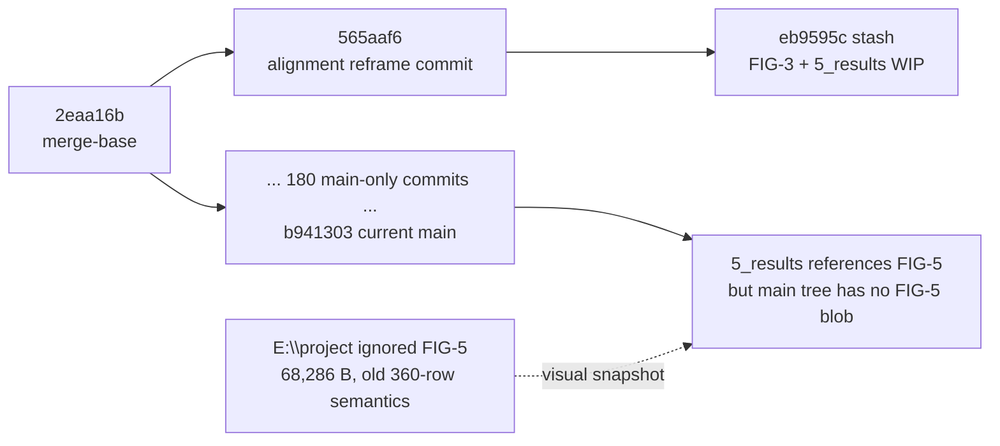

# paper/alignment-experiment 差异与图件审计

## 执行摘要

> [!warning] 总结论
> `paper/alignment-experiment` 已不适合作为当前 paper 的可合并开发线，但仍是被当前 `WORKPLAN.md` 明确引用的“不中后重投蓝本”。它的概念价值仍在，具体数字、GraphRevoker 机制楔子和旧图则已经过时。**不要 cherry-pick，不要现在删除分支。**

`main` 当前正文在 `5_results.tex` 中引用 `FIG-5_Alignment.pdf`，但 `main` Git tree 没有该 blob；干净 checkout 因而不能完整编译论文。`E:\project\OpenGU` 中确有一份 68,286-byte ignored FIG-5，但它对应 2026-05-07 的 360-row 数据口径，而不是当前 460-row 聚合 CSV。当前两个生成器又分别存在 schema、单位和根路径错误。结论是：

- **FIG-5 应在修复生成链、刷新/裁定 GraphRevoker 数据、复核正文数字后，用 `git add -f` 纳入 Git。**
- **不要直接 force-add 当前 68KB 文件。**它是有用的视觉蓝本和旧数据快照，不是当前可复现成品。
- stash 的 FIG-3 已被 main 的六方法 fingerprint 取代；stash 的 `5_results.tex` 大部被 main 吸收，唯一值得恢复的是 Jaccard 段落的分析思路，但数字应从当前输入重新计算。
- `stash@{0}` 当前不应立即 drop；审计报告经审核并形成持久记录后，可先建立 archive ref，再 drop。
- 分支当前不应删除，因为项目文档仍以分支名引用它。若确需清理，先把 `565aaf6` 和 `eb9595c` 变成持久 archive tag/bundle，并同步文档引用，再删除。

本审计没有执行 switch、merge、cherry-pick、stash drop、branch delete、commit 或 push，也没有修改报告之外的项目文件。

## 1. 现场身份与提交拓扑

| 对象 | 现场值 | 判定 |
|---|---|---|
| 当前隔离 worktree | detached `b94130339e1a2490957fcc3c5373fb491422dc84` | 与当前 `main` 完全相同 |
| `main` | `b94130339e1a2490957fcc3c5373fb491422dc84` | 2026-07-21 merge commit |
| `paper/alignment-experiment` | `565aaf64ea480b3df880e1d9b460211a328f98ad` | 仅 1 个独有提交 |
| merge-base | `2eaa16b40577d07d0d77e8d335dfcd312ce6d8a9` | 旧线从此分出 |
| `main...paper/alignment-experiment` | `180 / 1` | main 独有 180，旧线独有 1 |
| `stash@{0}` | `eb9595cb76456aebd232e04ef5abdfb88a480c52` | 描述与线索一致 |
| stash 第一父节点 | `565aaf64...` | stash 基点正是旧分支头 |
| stash 第二父节点 | `91613c0e...` | index snapshot；tree 与第一父节点相同 |
| stash 第三父节点 | 不存在 | 没有 `--include-untracked` 内容 |



`565aaf6` 的提交说明把目标写得很明确：从“informed selectors 优于 baseline”转向“access tier inverted + objective misalignment”，并新增 alignment 小节和 FIG-5。当前 `WORKPLAN.md` 进一步把它限定为“不中奖后的重投蓝本”，明确不用于当前 rebuttal 叙事。

## 2. 重点文件的 Git blob 证据

| 文件 | main | `565aaf6` | `stash@{0}` |
|---|---|---|---|
| `0_abstract.tex` | `513bc5f`, 2,166 B | `954fbf7`, 2,847 B | 同 `565aaf6` |
| `1_intro.tex` | `ebc0fa7`, 2,999 B | `545535a`, 5,228 B | 同 `565aaf6` |
| `5_results.tex` | `cafa3b5`, 20,953 B | `7651663`, 11,417 B | `91382cd`, 12,072 B |
| `FIG-3_Spectrum.pdf` | `7114c0b`, 23,191 B | `a9f90f2`, 47,620 B | `b8f12fe`, 46,848 B |
| `FIG-5_Alignment.pdf` | **缺失** | `576c696`, 39,699 B | 同 `565aaf6` |
| `scripts/plot_neurips_figures.py` | `1839164`, 25,500 B | 缺失 | 缺失 |
| `2026-06_resume-diagnosis.md` | `73c8610`, 8,560 B | 缺失 | 缺失 |

`E:\project\OpenGU\GULib-master\report\paper\overleaf\figures\FIG-5_Alignment.pdf` 是 ignored 文件，大小 68,286 B，SHA-256 为 `6A8659B2DB7944D80E292E7DE7199EE9ABCDF3231BD0CD4E8B43D0A411A3CEA0`。其 PDF 元数据为 Matplotlib 3.7.2、单页、创建时间 2026-05-07 19:20:49；它不在任何当前 Git tree 中。

## 3. 文本差异审计

| 项目 | 内容价值 | 当前事实冲突 | 建议 |
|---|---|---|---|
| 分支 `0_abstract.tex` | 最完整的“低访问结构攻击者胜过 L2 TracIn、objective misalignment”重投摘要蓝本 | 含 `6/12`、`1/12`、GraphRevoker×GAT 机制楔子、旧 retrain-gap 和旧范围表述；当前 GraphRevoker 旧矩阵已被项目记录判为 invalid | **KEEP AS BLUEPRINT / SUPERSEDED FOR MAIN**。未来重投时手工重写并回填新数字；不 cherry-pick |
| 分支 `1_intro.tex` | 保存“conventional answer is wrong”“objective mismatch”叙事和四项贡献结构 | “partition pair immune”“GraphRevoker exception”等依赖旧坏数据；access-tier 叙事与当前 rebuttal 锁定路线不同 | **KEEP AS BLUEPRINT / RECOVER MANUALLY ONLY FOR RESUBMISSION** |
| 分支 `5_results.tex` | 首次引入 alignment 小节和 FIG-5 | 早期文本仍有 placeholder/旧尺度，之后 stash 和 main 均重写 | **SUPERSEDED** |
| stash `5_results.tex` | 比分支更接近 Phase B；242 行中有 120 行与 main 完全相同 | main 已扩展为 372 行 scorecard；stash 的 GraphRevoker 负相关楔子和若干数字已过时 | **SUPERSEDED**, 但 Jaccard 段落的分析思路可恢复 |
| stash 独有 Jaccard 段 | PageRank/IM/Hybrid/TracIn 对 Degree 的 mean Jaccard 为约 `0.83/0.21/0.09/0.03`，是有解释力的选择集证据 | 用当前 360 个 selection artifacts 复算后均值仍为 `0.8305/0.2067/0.0878/0.0326`，但与效果的相关已从旧 `r=0.18,p=.004` 变为 `r=0.245,p=1.24e-4` | **RECOVER AFTER RECOMPUTE**；不要恢复旧相关数字 |

项目原文已经明确给出处理方式：`2026-06_resume-diagnosis.md` 第 75 行写的是“用 `565aaf6` abstract/intro 当重投蓝本（**不 cherry-pick**……），手动重写 + 回填真实数字”；第 88 行又把它收窄为“不中奖后的重投蓝本”。当前 `WORKPLAN.md` 第 8、49、164 行保持同一口径。

## 4. FIG-3 审计

| 版本 | 页面/视觉语义 | 数据/叙事状态 | 建议 |
|---|---|---|---|
| `565aaf6`，47,620 B | 五方法三组柱状图；标题为 “Universal Vulnerability Spectrum”；GIF/GNNDelete/GraphEraser 用 Cora-GCN，IDEA/MEGU 用 Cora-GAT | 混用 backbone、缺 GraphRevoker、相对 F1 drop 数字为 pre-Phase-B 口径 | **DELETE CANDIDATE / DO NOT RECOVER** |
| stash，46,848 B | 六方法二维 fingerprint，1σ ellipse + family chord；IM 轴约扩到 16、TracIn 轴约到 -11 | 结构已接近现行图，但坐标来自早期错误/旧聚合口径 | **SUPERSEDED / DO NOT RECOVER** |
| main，23,191 B | 六方法 Cora/GCN fingerprint；坐标约 IM `-1..4`、TracIn `-5..1` | 与当前 `paired_dF_pct` 的 method means 一致，例如 GNNDelete `IM=3.212`、`TracIn=-4.612` | **KEEP**；未来在生成器修好后受控再生以闭合 provenance |

main FIG-3 的内容没有从 stash 获得仍需恢复的独特科学价值；stash 版本的唯一价值是显示了叙事转型过程，不值得继续用 stash 保存。

## 5. FIG-5 内容、来源与可复现性

### 5.1 两个现存版本

| 版本 | 视觉内容 | 审计结论 |
|---|---|---|
| 分支 blob `576c696`，39,699 B | 双 panel；左图含 300 tuples，右图同时画 Random、Degree、PageRank、IM、Hybrid、TracIn；标题和配色为早期版 | **SUPERSEDED**，只作恢复兜底 |
| E 盘 ignored，68,286 B | 更成熟的 pastel 双 panel；右图去掉 Random，仅保留五个 non-random 策略；显示 Pearson `r=0.24`、Spearman `ρ=0.34`、`n=300` | 视觉 **KEEP AS DESIGN REFERENCE**，数据 **STALE**，不可直接入库 |

68KB 版与 commit `808ba7f` 跟踪的旧 360-row `_phase_b_aggregate.csv` 可复现出相同点位、误差条和统计文字。旧 CSV 使用 `f1_drop`；当前 460-row CSV 自 commit `47f4e8b` 起改为已经配对且以 percentage points 存储的 `paired_dF_pct`。

### 5.2 当前输入复核

FIG-5 实际依赖三类输入，不是脚本头部所称的“only two inputs”：

1. `results/_phase_b_aggregate.csv`；
2. `data/processed/transductive/cora0.8_0_0.2.pkl` 的 `edge_index`；
3. `results/runs/4090/cora_*_r0.05/*/seed*/attack.json` 中的 `selected_nodes`。

现场证据：

| 输入 | 现场状态 |
|---|---|
| 当前 CSV | 460 rows；磁盘 SHA-256 `CBB70B45F6608C9DACD9AC097DE82D430B8E3E634DEC31AFCE9CA8E422330DA` |
| Cora pickle | 15,848,053 B；SHA-256 `BA26F2B79396E79091CB44FC37A16344947FF93B2274EE7C5EB5A7D0BBA6E875` |
| attack JSON | 360/360 可解析，六策略 × 六方法 × 两骨干 × 五 seed；聚合 manifest SHA-256 `8D812DCE26A1F47A84786444729A476C150AC23C2C21ACC5776AFF83354283C4` |

用当前 CSV 口径复算 300 个 non-random tuples：

| 指标 | 旧 FIG-5/正文 | 当前 460-row CSV 复算 |
|---|---:|---:|
| Pearson | `0.239` | `0.298` (`p=1.43e-7`) |
| Spearman | `0.341` | `0.401` (`p=4.80e-13`) |
| Degree mean paired effect | `+2.04` | `+1.854` pp |
| PageRank | `+1.54` | `+1.526` pp |
| IM | `+0.88` | `+0.806` pp |
| Hybrid | `+0.42` | `+0.210` pp |
| TracIn | `+0.02` | `-0.378` pp |

更重要的是，当前 CSV 仍包含项目已判 invalid 的旧 GraphRevoker baseline。按当前 CSV 复算后，旧文“11/12 cell 正相关、GraphRevoker×GAT 为唯一负相关”的机制楔子不再成立：12 个 cell 都为正相关，GraphRevoker×GAT 为 `r=0.208`。因此不能仅把图中数字换成当前 CSV 数字就宣称完成；必须先导入已接受的 post-fix GraphRevoker evidence，或明确从该机制图中排除 GraphRevoker。

### 5.3 生成器分叉

| 入口 | 当前错误 | 影响 |
|---|---|---|
| `scripts/plot_neurips_figures.py` | 仍读取已删除的 `f1_drop`；FIG-5 lookup 的 `KeyError` 被逐条 `continue` 吞掉，最终 0 tuple 并在空表上崩溃 | 当前 460-row CSV 下 FIG-5 无法生成；FIG-3 同样无法生成 |
| `test1.py` | 读取 `paired_dF_pct` 后再次乘 `100`；当前层级下 `REPO_ROOT=parents[1]` 指到 `OpenGU/` 而非 `GULib-master/`；默认 CSV 又是相对 CWD 的字符串 | FIG-3 坐标放大 100 倍；FIG-5 找不到 runs/pickle，可能触发下载 fallback |

`WORKPLAN.md` 的 F2“收敛图生成器分叉”因此仍是实质性未完成任务。正确动作是保留一个 canonical 入口，给 schema、单位、root 和 tuple 数量加 fail-fast contract，再重生全部最终图。

## 6. 逐项处置矩阵

| 对象 | 建议标签 | 立即动作 | 最终动作 |
|---|---|---|---|
| `0_abstract.tex` 分支差异 | **KEEP BLUEPRINT / SUPERSEDED** | 保留 ref，不合入 main | 仅重投时手写迁移 |
| `1_intro.tex` 分支差异 | **KEEP BLUEPRINT / SUPERSEDED** | 同上 | 同上 |
| 分支 `5_results.tex` | **SUPERSEDED** | 不恢复 | 可随分支归档 |
| stash `5_results.tex` | **SUPERSEDED + SELECTIVE RECOVER** | 保留到 Jaccard 复算被持久记录 | 只恢复重算后的 Jaccard 结论 |
| 分支 FIG-3 | **DELETE CANDIDATE** | 不使用 | archive ref 建立后可丢弃 |
| stash FIG-3 | **DELETE CANDIDATE** | 不使用 | archive/ref 完成后可随 stash 丢弃 |
| main FIG-3 | **KEEP / REGENERATE LATER** | 保留现有 blob | 生成器修复后受控再生并视觉 diff |
| 分支 FIG-5 39KB | **RECOVERABLE FALLBACK / SUPERSEDED** | 不加入 main | archive ref 可保留 blob |
| E 盘 FIG-5 68KB | **DESIGN REFERENCE / REGENERATE** | 不 force-add | 用裁定后的数据再生同风格图 |
| main 缺失 FIG-5 | **RECOVER BY REGENERATION** | 不从旧 blob 直接复制 | 复检后 `git add -f` 纳入 Git |
| `scripts/plot_neurips_figures.py` | **FIX + KEEP CANONICAL** | 新分支修 schema/contract | 成为唯一入口 |
| `test1.py` | **SUPERSEDE OR DELETE AFTER PORTING STYLE** | 先移植所需 pastel/style | 回归通过后退役，避免双入口 |

## 7. stash drop 与分支删除是否安全

### `stash@{0}`

**现在不安全直接 drop。** 原因不是 FIG-3，而是 stash 仍是 Jaccard 段落唯一直接文本来源，且本报告尚未被接受/提交。满足以下条件后可 drop：

1. 本报告或等价证据已进入持久历史；
2. Jaccard 结果已用选定的最终 aggregate 重新计算并写入 paper/catalog，或明确决定不采用；
3. `eb9595c` 已有 archive tag 或经过验证的 bundle；
4. drop 前再次确认 stash selector 仍指向 `eb9595c`。

### `paper/alignment-experiment`

**现在不建议删除。** 技术上它只有一个独有提交，且代码价值为零；但 `WORKPLAN.md`、advisor diagnosis 和 Git audit 都把分支名当作重投恢复入口。直接删除会让这些引用失效。只有在以下二选一完成后才安全：

- 继续保留该分支，直到重投决策结束；或
- 建立并验证 `archive/paper-alignment-20260507` 持久 tag/bundle，把文档引用从 branch 改成 archive ref，再删除旧 branch。

## 8. 建议的后续操作顺序（本审计未执行）

### A. 先修复和重生图件

```powershell
# 1) 现场复核；不要在 main worktree 直接开发
$repo = 'C:\Users\ADMIN\.codex\worktrees\e0cd\OpenGU'
$wt = 'C:\Users\ADMIN\.codex\worktrees\paper-figure-provenance-20260721\OpenGU'
$child = 'codex/fix-paper-figure-provenance-20260721'

git -C $repo status --short --branch
git -C $repo worktree list
git -C $repo rev-parse main
Test-Path -LiteralPath $wt   # 必须为 False

# 2) 从 main 建独立子线
git -C $repo worktree add -b $child $wt main
git -C $wt config --local "branch.$child.openguParent" main
git -C $wt config --local --get "branch.$child.openguParent"
```

在该子线中按顺序修改：

1. 选 `scripts/plot_neurips_figures.py` 为唯一入口；移植 `test1.py` 中需要的视觉样式。
2. 明确 `paired_dF_pct` 单位已经是 percentage points；禁止再次乘 100。
3. `collect_alignment_tuples()` 直接读取 `paired_dF_pct`；要求 non-random rows 恰为 300、random rows 恰为 60，缺失即 fail closed。
4. 修正 `REPO_ROOT`，在输出元数据/旁车 manifest 中记录 CSV、pickle、360 个 attack JSON 的 hash。
5. 先处理 GraphRevoker gate：导入 post-fix accepted evidence，或从 FIG-5 及相应机制段中显式排除 GraphRevoker。未裁定前不得发布新 FIG-5。
6. 同步更新 `5_results.tex`、`METRICS_CATALOG.md` 和相关 liability 记录中的所有统计数字。

```powershell
# 3) 只向临时输出生成，避免覆盖已跟踪图
$paper = Join-Path $wt 'GULib-master'
$out = Join-Path $env:TEMP 'opengu-paper-figures-review-20260721'
New-Item -ItemType Directory -Force -Path $out | Out-Null
$env:PYTHONDONTWRITEBYTECODE = '1'

E:/conda_package/envs/gnn/python.exe `
  (Join-Path $paper 'scripts/plot_neurips_figures.py') `
  --csv (Join-Path $paper 'results/_phase_b_aggregate.csv') `
  --out $out --only fig3 fig5

E:/Programs/texlive/2026/bin/windows/pdfinfo.exe `
  (Join-Path $out 'FIG-5_Alignment.pdf')
E:/Programs/texlive/2026/bin/windows/pdftotext.exe -layout `
  (Join-Path $out 'FIG-5_Alignment.pdf') -
```

视觉和数字通过后，再复制和显式暂存：

```powershell
$figdir = Join-Path $paper 'report/paper/overleaf/figures'
Copy-Item -LiteralPath (Join-Path $out 'FIG-3_Spectrum.pdf') -Destination $figdir
Copy-Item -LiteralPath (Join-Path $out 'FIG-5_Alignment.pdf') -Destination $figdir

git -C $wt add -- `
  'GULib-master/scripts/plot_neurips_figures.py' `
  'GULib-master/report/paper/overleaf/figures/FIG-3_Spectrum.pdf' `
  'GULib-master/report/paper/overleaf/sec/5_results.tex' `
  'GULib-master/self/dashboard/METRICS_CATALOG.md'
git -C $wt add -f -- 'GULib-master/report/paper/overleaf/figures/FIG-5_Alignment.pdf'
git -C $wt status --short
```

`FIG-5` 必须使用 `-f`，因为仓库根 `.gitignore` 第 10 行的 `*.pdf` 会忽略新 PDF。强制添加应只针对这个精确路径，禁止 broad `git add -f .`。

### B. 图件闭环后再清理历史 ref

```powershell
# 4) 先建立持久恢复点
git -C $repo tag -a archive/paper-alignment-20260507 `
  565aaf64ea480b3df880e1d9b460211a328f98ad `
  -m 'Archive paper alignment resubmission blueprint'
git -C $repo tag -a archive/paper-alignment-wip-20260507 `
  eb9595cb76456aebd232e04ef5abdfb88a480c52 `
  -m 'Archive paper alignment WIP stash before cleanup'

git -C $repo show --no-patch archive/paper-alignment-20260507
git -C $repo show --no-patch archive/paper-alignment-wip-20260507
git -C $repo fsck --no-reflogs --unreachable
```

可选但更稳的是再创建并验证离仓 bundle。bundle 路径应由用户指定到已有备份盘，不应临时猜测。

只有在报告/重算结果已持久化、文档引用已改为 archive ref、且用户再次授权后，才执行：

```powershell
# 5) 高风险清理门；执行前再次核对对象身份
git -C $repo rev-parse 'stash@{0}'
# 输出必须仍为 eb9595cb76456aebd232e04ef5abdfb88a480c52
git -C $repo stash drop 'stash@{0}'

git -C $repo show-ref --verify refs/tags/archive/paper-alignment-20260507
git -C $repo branch -D paper/alignment-experiment
```

风险说明：`stash drop` 会移除 reflog 入口，`branch -D` 会删除未合并分支 ref；若 archive tag/bundle 未正确建立，后续 GC 可能永久清除对象。两条命令不应与生成器修复放在同一提交或同一审批步骤中。

## 9. 已知风险与审计边界

1. 当前 460-row CSV 的 GraphRevoker 行仍来自项目已判 invalid 的旧 baseline；本审计没有把它当作最终科学真值。
2. 68KB FIG-5 的点位可由旧 360-row CSV 复现，但 PDF 经不同样式/后处理后字节不确定；文件大小和 hash 不代表科学等价。
3. 当前 main 的 FIG-3 数值尺度合理，但两个现存生成器都不能在当前 schema 下无修改复现它；因此“keep”不等于 provenance 已闭环。
4. 本审计只比较本地 refs 和现场文件，没有访问远端实验主机，也没有导入 E4 GraphRevoker artifacts。
5. 运行旧 `test1.py` 的 fallback 曾在 `E:\project\OpenGU\data\raw\Cora` 创建缓存；本次新建的 `processed/` 和 4 个新 raw 文件已移到系统临时隔离区。4 个原有 raw 文件被官方 downloader 同名重写，仅 mtime 变化，仍是 ignored data；没有 tracked 文件变化。
6. HTML 已在浏览器中逐页视觉复检；当前 Obsidian vault 只覆盖 `文档规划` 子树，报告位于同级 `reports/`，若不新增链接或改 vault 就无法直接在 Reading View 打开。为遵守“报告之外不改文件”，本次只完成 Markdown 表格结构检查，未把该报告临时接入 Obsidian；这是版式验收的已知缺口。

## 10. 最终回答

- **分支最初用途**：诚实地把 paper 从 informed-selector hero story 转成 access-tier inversion + structural alignment/objective misalignment，并试验 FIG-5。
- **现在是否过时**：作为可合并实现线已过时；作为重投叙事蓝本仍有效。
- **FIG-3**：main keep；branch/stash 版本 superseded/delete candidate；生成器修复后 regenerate main。
- **FIG-5**：图有独立价值，必须 regenerate；复检通过后应强制纳入 Git；当前 68KB 文件不应直接加入。
- **stash**：现在不 drop；证据持久化和 archive ref 完成后可 drop。
- **分支**：现在不删；只有把项目引用迁移到 archive ref 并验证恢复点后才可删。
