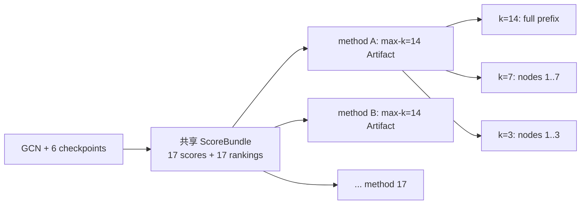

# SUP Selection 实验结果汇报

> [!NOTE]
> **路径哈希迁移说明（2026-07-24）**：本报告引用的 benchmark/summary SHA-256 已随 retired SSH path normalization 重算；实验数值和验收结论未改。原始字节可从 Git `41708162a4f3e2c4fd89c30c47b6b35feb1b8d75` 复核。

> [!success] 验收结论
> Cora、CiteSeer、PubMed × seeds 42/212/2024 的 17-output SUP Selection
> 实验已完成：**9/9 cells 成功，153/153 方法级 cold miss → warm exact hit，
> 0 failures**。本结果作为一次性 grandfathered public-split Selection GT
> 接受，无需重复消耗 GPU。

> [!warning] 结论边界
> 本报告只回答 **Selection 公式、ranking、时间、缓存与资源可行性**。
> 它不是 GU outcome，不回答 TracIn 是否比 degree 造成更强的 GU damage，
> 也不能改称 OpenGU canonical 80/20 split 结果。

## 1. 给验收人的一分钟摘要

本实验把 17 种节点选择得分统一放入一个共享 `ScoreBundle`，在相同的
two-layer GCN、候选节点、目标集合和 checkpoint 轨迹上计算，再将每个完整
ranking 物化为一个最大预算 $k=14$ 的不可变 Selection Artifact；$k=7$ 与
$k=3$ 直接复用稳定前缀。这就是本文所称的 **SUP Selection**。

四个核心结论：

1. **同一 source 下，去掉 Hessian 的 single-final proxy 很可靠。**
   `p_point/r_point`、`p_simple/gt_simple`、`p_graph/gt_full` 的平均全排序
   Spearman 分别为 **0.977、0.953、0.985**。
2. **source 公式比求解器选择更重要。** `gt_simple/gt_full` 的 Spearman
   只有 **0.036**；忽略删除图带来的邻居梯度变化，会改变所选节点，而不只是
   产生小数值误差。
3. **更多 checkpoint 没有自动提高 reference fidelity。** 从 3 增至 6 个
   checkpoint，point/simple/graph 三组 Spearman 仅从
   `0.892/0.719/0.511` 变为 `0.893/0.722/0.521`。
4. **degree 与 TracIn-like / graph-aware ranking 明显不同，但“不同”不等于
   “更强”。** 在 $k=7$，degree 与 `tracin_cp_point_6`、
   `tracin_cp_graph_6`、`p_graph` 的平均 Jaccard 仅为
   **0.149、0.073、0.127**；强弱必须由后续 GU retrain-gap 实验回答。

## 2. 研究问题与本报告能回答到哪一步

| 研究问题 | Selection 部分能回答 | 仍需后续实验 |
|---|---|---|
| TracIn 是否比 degree / random / IM 更强？ | 是否选择相同节点、ranking 是否相关、选择成本是否可行 | 在同一 GU method / dataset / seed / budget 下比较 retrain gap、forgetting efficacy 与 retained utility |
| IF 系内部哪种公式更有效？ | 公式之间的 ranking fidelity、source 差异、checkpoint 差异 | 选中节点进入 GNNDelete / GraphEraser 后的真实 GU outcome |
| 哪种公式同时可行？ | shared compute、公式组件成本、显存、cache、失败状态 | 正式 canonical profile 下的端到端 selector + GU 成本 |

因此，Selection 结果是两个研究问题的**第一层证据**：它确定公式到底在选谁、
近似是否忠于 reference、成本来自哪里；它不能用 overlap 直接替代 GU outcome。

> [!IMPORTANT]
> 当前 17-output ScoreBundle **不包含 IM，也不包含生产版 `proper-tracin-v1`**。
> `tracin_cp_point_6` 只是最接近标准 TracInCP 定义的桥接实现；因此本报告尚未闭环
> “TracIn vs degree / random / IM 谁的 GU 效果更强”，该问题必须由后续 downstream
> GU 矩阵回答。

## 3. 实验设置

| 项目 | 设置 |
|---|---|
| Datasets | Planetoid Cora / CiteSeer / PubMed |
| Split | public fixed split |
| Seeds | 42 / 212 / 2024 |
| Model | two-layer GCN，hidden 16，dropout 0.5 |
| Training | Adam，200 epochs，lr 0.01，weight decay 0.0005 |
| Candidate pool | `train_mask`：Cora 140、CiteSeer 120、PubMed 60 |
| Target $E$ | `val_mask` 的 mean cross-entropy，三数据集均为 500 nodes |
| Test set | 不参与选点；仅绑定 split identity，本报告没有 test/GU outcome |
| Budgets | $k\in\{14,7,3\}$，max-k 一次物化、较小 $k$ 取稳定前缀 |
| Checkpoints | epochs 1 / 10 / 25 / 50 / 100 / 200 |
| 3-checkpoint view | epochs 1 / 50 / 200 |
| Graph source | candidate + undirected 2-hop affected nodes |
| IHVP | LiSSA 20 iterations，scale 25，damp 0.01 |
| B-Hutch | 32 Rademacher probes，seed 1729 |
| Ranking | score descending，node ID ascending |
| Device | SSH RTX 4090 / `cuda:0` |

### 3.1 SUP 的 Artifact 语义

- 每个 method 只保存一个最大 $k$ Selection Artifact。
- 较小预算不重新计算 score，也不创建独立子 Artifact。
- cold 要求 ScoreBundle 与 17 个 Selection Artifacts 全部 miss 后成功保存。
- warm 要求相同 Recipe 全部 exact hit，并用 producer sentinel 证明没有偷偷重算。

## 4. 公式体系与 17 个输出

### 4.1 记号

- $g_v$：候选训练节点 $v$ 的参数梯度。
- $g_E$：validation target $E$ 的平均参数梯度。
- $H$：训练目标在最终模型处的 Hessian。
- $a_v=\mathrm{grad1}_v$：原图 affected set 的梯度 source。
- $q_v=\mathrm{grad1}_v-\mathrm{grad2}_v$：删除候选及关联边前后的
  graph-aware 梯度差。
- $\theta_c,w_c$：第 $c$ 个 checkpoint 及其更新权重。

### 4.2 A/B/C/D 主公式

| 层 | 公式 | 问题 |
|---|---|---|
| A | $s_A(v)=\lVert g_v\rVert$ | 当前训练梯度本身有多大？ |
| B | $s_B(v)=\lVert H^{-1}g_v\rVert$ | 删除后预计造成多大的参数位移？ |
| C-point | $s_{C,p}(v)=g_v^\top H^{-1}g_E$ | 单点 IF 是否伤害目标 $E$？ |
| C-simple | $s_{C,s}(v)=a_v^\top H^{-1}g_E$ | 使用原图 affected-source 是否伤害 $E$？ |
| D-full | $s_D(v)=q_v^\top H^{-1}g_E$ | 纳入删除图 source 后是否伤害 $E$？ |

两种 Hessian-free 近似：

$$
s_{\mathrm{final}}(v)=\langle \mathrm{source}_v,g_E\rangle,
$$

$$
s_{\mathrm{cp}}(v)=\sum_c w_c
\langle \mathrm{source}_v(\theta_c),g_E(\theta_c)\rangle.
$$

### 4.3 完整方法矩阵

| Family | Reference / control | Single-final proxy | 3 checkpoints | 6 checkpoints |
|---|---|---|---|---|
| Controls | `random`, `degree` | — | — | — |
| A | `a_grad_norm` | — | — | — |
| B implementation | `b_param_hutch` | — | — | — |
| C-point, source $g_v$ | `r_point` | `p_point` | `tracin_cp_point_3` | `tracin_cp_point_6` |
| C-simple, source $a_v$ | `gt_simple` | `p_simple` | `tracin_cp_simple_3` | `tracin_cp_simple_6` |
| D-full, source $q_v$ | `gt_full` | `p_graph` | `tracin_cp_graph_3` | `tracin_cp_graph_6` |
| Legacy negative control | `legacy = \langle g_v,-\sum_j g_j\rangle` | — | — | — |

术语必须保持严格：

- 只有 point checkpoint variants 与标准 TracInCP 较接近。
- simple / graph checkpoint variants 是项目内部的 source ablation，不是
  proper TracIn。
- `legacy` 是 deployed cross-gradient negative control，也不是 proper TracIn。
- `b_param_hutch` 是 B 目标的 Hutchinson 实现；历史 `b_param_lissa` 只用于
  数值一致性验证，没有进入本轮 17-output bundle。

## 5. 时间到底测了什么

这是本次汇报最容易混淆的部分。报告保留五个互不替代的时间口径。

| 时间字段 | 计时边界 | 9-cell 结果 | 应如何解释 |
|---|---|---:|---|
| Common training | GCN 训练与 checkpoint 生成 | mean 1.1079 s，max 1.2998 s | 所有公式共享，不用于判断某个 selector 更快 |
| Shared score compute | 真实公式计算：梯度、IHVP、graph source、Hutch、17 score/ranking | mean 6.4824 s，max 8.1552 s | 当前最接近“Selection 计算时间”的口径 |
| ScoreBundle cold total | exact-miss lookup + shared compute + 校验/序列化/落盘 | mean 6.8038 s，max 9.1624 s | 正式 cold ScoreBundle 端到端时间 |
| Per-method cold Selection | ScoreBundle 已存在后，ranking → top-k Artifact + 索引/文件系统 | mean 522.404 ms，max 2365.102 ms | **不是每个公式的独立计算时间** |
| ScoreBundle warm read | exact read；producer 必须为 0 | mean 0.3200 s，max 0.9635 s | cache 正确性与复用成本 |

方法级 warm Selection Artifact access 的 mean/max 为
`660.689/3885.406 ms`。warm wall-clock 偶尔慢于 cold，是共享 AutoFS 索引、
校验和文件访问抖动；warm 的验收含义是**没有调用 producer**，不是保证每次
文件读取都更短。

`total_seconds` 还包括数据加载、公共训练、Recipe/provenance、17 个 Artifact、
pairwise metrics 和 JSON 写出，9 cells mean/max 为 `19.3610/47.7709 s`。
它不是单纯算法时间，不应与 `ScoreBundle cold total` 混用。

### 5.1 共享公式组件成本

| 共享组件 | Mean | Max | 被哪些方法需要 |
|---|---:|---:|---|
| Checkpoint point gradients | 0.7356 s | 0.9246 s | A、C-point、point checkpoint family |
| C-target IHVP | 0.0835 s | 0.0936 s | `r_point`、`gt_simple`、`gt_full` reference |
| Checkpoint graph-source construction | 3.7822 s | 5.0526 s | simple / graph final 与 checkpoint family |
| B-Hutch inverse probes | 1.7918 s | 2.0124 s | `b_param_hutch` |

这些组件共享中间量，不能相加后伪装成 17 个独立方法时间。它们的正确用途是
解释 feasibility：graph-aware source 是当前共享计算的最大块；B-Hutch 的
32 个 inverse probes 是另一项显著成本；single-final `p_*` 去掉了 IHVP，
但仍需其对应的 source gradient。

## 6. 资源、缓存与失败状态

| Dataset | Seed | Cold bundle (s) | Warm read (s) | Peak alloc (MiB) | Peak reserve (MiB) |
|---|---:|---:|---:|---:|---:|
| Cora | 42 | 9.1624 | 0.9635 | 187.8 | 208.0 |
| Cora | 212 | 7.0050 | 0.1325 | 187.8 | 208.0 |
| Cora | 2024 | 6.9413 | 0.1546 | 187.8 | 208.0 |
| CiteSeer | 42 | 7.6537 | 0.1286 | 357.0 | 384.0 |
| CiteSeer | 212 | 7.3706 | 0.1427 | 357.0 | 384.0 |
| CiteSeer | 2024 | 6.9745 | 0.9430 | 357.0 | 384.0 |
| PubMed | 42 | 5.1406 | 0.1448 | 268.2 | 314.0 |
| PubMed | 212 | 5.0778 | 0.1315 | 268.2 | 314.0 |
| PubMed | 2024 | 5.9085 | 0.1388 | 268.2 | 314.0 |

总体峰值为 **357 MiB allocated / 384 MiB reserved**。9 个 cells、153 个方法行
全部成功，没有 OOM、非有限 score、cache conflict 或 producer-sentinel failure。

## 7. Selection 结果

### 7.1 同一 source：single-final proxy 是否足够忠实？

| Pair | $k=3$ Jaccard | $k=7$ Jaccard | $k=14$ Jaccard | Full-rank Spearman |
|---|---:|---:|---:|---:|
| `p_point` vs `r_point` | 1.000 | 0.901 | 0.890 | **0.977** |
| `p_simple` vs `gt_simple` | 1.000 | 0.972 | 0.970 | **0.953** |
| `p_graph` vs `gt_full` | 0.778 | 0.828 | 0.877 | **0.985** |

结论：固定 source 后，single-final Hessian-free proxy 基本保留 reference 排名。
如果目标是以较低复杂度复现同一 reference，`p_point`、`p_simple`、`p_graph`
均是可行候选；其中 `p_graph` 是 D-full source 的首选 scalable proxy。

### 7.2 改变 source 会发生什么？

| Pair | $k=7$ common fraction | $k=7$ Jaccard | Full-rank Spearman |
|---|---:|---:|---:|
| `gt_simple` vs `gt_full` | 0.175 | 0.108 | **0.036** |
| `r_point` vs `gt_full` | 0.175 | 0.097 | **0.086** |

结论：point、simple 与 full graph-deletion source 不是同一公式的轻微实现差异。
是否纳入 `grad2` 与邻居梯度变化，会实质改变被选节点。

### 7.3 3 个还是 6 个 checkpoints？

| Checkpoint proxy vs same-source reference | $k=7$ Jaccard | Full-rank Spearman |
|---|---:|---:|
| `tracin_cp_point_3` vs `r_point` | 0.551 | 0.892 |
| `tracin_cp_point_6` vs `r_point` | 0.551 | 0.893 |
| `tracin_cp_simple_3` vs `gt_simple` | 0.746 | 0.719 |
| `tracin_cp_simple_6` vs `gt_simple` | 0.775 | 0.722 |
| `tracin_cp_graph_3` vs `gt_full` | 0.234 | 0.511 |
| `tracin_cp_graph_6` vs `gt_full` | 0.212 | 0.521 |

6 checkpoints 相比 3 checkpoints 只有边际 Spearman 改善，并且 graph 组的
$k=7$ Jaccard 反而略低。checkpoint 累积表示轨迹量，而 reference 是最终点局部量；
二者不必随着 checkpoint 数量增加而收敛。

### 7.4 TracIn-like 与 degree 是否选了相同节点？

| Pair | $k=7$ common fraction | $k=7$ Jaccard | Full-rank Spearman |
|---|---:|---:|---:|
| degree vs `tracin_cp_point_6` | 0.238 | 0.149 | 0.009 |
| degree vs `tracin_cp_graph_6` | 0.127 | 0.073 | -0.072 |
| degree vs `p_graph` | 0.206 | 0.127 | -0.037 |
| degree vs `legacy` | 0.206 | 0.118 | 0.176 |

Selection 层已经证明这些方法并非 degree 的别名。但本表没有 GU outcome，不能据此
声称 TracIn 更强或 degree 更强。下一阶段应在相同 GU Recipe 下做 paired comparison。

## 8. 效果—可行性判断

| 方法族 | Selection fidelity 证据 | 主要成本/依赖 | 当前判断 |
|---|---|---|---|
| `random` / `degree` | control，不追求 IF fidelity | 无 checkpoint IHVP；degree 只需图结构 | 必须保留的低成本 baseline |
| `a_grad_norm` | 与 B-Hutch full-rank $\rho=0.935$，$k=7$ Jaccard 0.641 | final candidate gradients | 强 B-ranking proxy，但语义仍是 gradient magnitude |
| `b_param_hutch` | B 参数位移目标的实现 | 32 inverse probes，组件 mean 1.7918 s | 可行性中等；不能当成 eval-impact 公式 |
| `r_point` | C-point reference | target IHVP + final point gradients | reference；小图可行，规模扩大需审慎 |
| `p_point` | 对 `r_point` $\rho=0.977$ | 无 IHVP；final point gradients | point-source 的高保真可行 proxy |
| `gt_simple` | C-simple reference | target IHVP + graph-source | 与 D-full 不等价 |
| `p_simple` | 对 `gt_simple` $\rho=0.953$ | 无 IHVP；仍需 simple graph-source | C-simple 的高保真可行 proxy |
| `gt_full` | D-full operational reference | target IHVP +完整 graph-deletion source | 研究 reference，不应默认作为大图部署方案 |
| `p_graph` | 对 `gt_full` $\rho=0.985$ | 无 IHVP；仍需 graph source | 当前最有力的 D-full scalable proxy |
| checkpoint families | 轨迹近似；point 最接近标准 TracInCP | 需要 3/6 checkpoints 与对应梯度/source | 6 点相对 3 点收益很小；需用 GU outcome 决定价值 |

selection-only 的 Pareto 判断是：**同一 source 下优先考虑 `p_*`；是否采用 point、
simple 或 full source，不能只依据 proxy fidelity，必须结合后续 GU damage 与业务目标。**

## 9. Provenance 与一次性 GT 例外

| 项目 | 证据 |
|---|---|
| Experiment Git SHA | `9240b9a7bd61b17b4c841981ec2892fdf100dc4b` |
| Algorithm | `bc-target-matrix-v3.0` |
| Machine manifest | `results/bc_target_v2/selection_benchmark_20260721/benchmark_manifest.json` |
| Manifest SHA-256 | `80a68a101459d78e9cd6dfd26b8e99b4878a67e07bcc9f63cb225bf67c73d1a9` |
| Retained cell evidence | `results/bc_target_v2/selection_benchmark_20260721/cells/*/{cold,warm}.json` |

历史运行位于已退役 worktree，并使用后来清理的 shared Planetoid cache。本结果之所以
仍被接受，是因为：

1. 删除前，9 个有效输入逐文件 SHA-256 等于当前 SSH active
   `data/raw/{cora,citeseer,pubmed}`；
2. `9240b9a` 到 accepted main 的 ScoreBundle `produce()` 计算块逐字一致，
   B/C 与 C-target scorer core blob 未变化；
3. cold/warm、GPU memory、method status 与 failure evidence 已完整保留。

该例外接受的是 v3.0 **result payload 与结论**，不是旧 cache 路径。未来新实验仍必须
从 `/autodl-fs/data/OpenGU/GULib-master` active checkout、canonical dataset root、
clean accepted `main` 和新的 Recipe/cache identity 运行。

## 10. 明日验收清单

- [ ] 确认 17 个方法名称与 A/B/C/D taxonomy 一致。
- [ ] 确认公式中的 source、Hessian、checkpoint 语义没有混写。
- [ ] 确认 `shared score compute` 与 `per-method Artifact time` 被明确分开。
- [ ] 确认 9/9 cells、153/153 method rows、0 failures。
- [ ] 确认 cold/warm、显存和 component timing 数字可回溯到 retained JSON。
- [ ] 确认 degree-vs-TracIn 只下“selection distinct”结论，没有越界写 GU 强弱。
- [ ] 确认 `legacy`、simple/graph checkpoint variants 未被称为 proper TracIn。
- [ ] 确认 public Planetoid split 未被改称 OpenGU canonical 80/20。
- [ ] 确认 Markdown 与 HTML 的结论、公式和关键数字一致。

## 11. Evidence index

- 权威 cold/warm 报告：[Markdown](small_graph_selection_BENCHMARK_REPORT.md) ·
  [HTML](small_graph_selection_BENCHMARK_REPORT.html)
- 公式与 A/B/C/D 设计：[Markdown](bc_target_matrix_REPORT.md) ·
  [HTML](bc_target_matrix_REPORT.html)
- dataset / grandfather audit：[Markdown](dataset_layout_AUDIT_REPORT.md) ·
  [HTML](dataset_layout_AUDIT_REPORT.html)
- proper-TracIn 术语边界：[acceptance report](../docs/proper_tracin_v1_selection_gate_ACCEPTANCE_REPORT.md)
- SUP max-k/prefix 语义：[acceptance report](../docs/cache_v2_sup_selection_maxk_ACCEPTANCE_REPORT.md)
