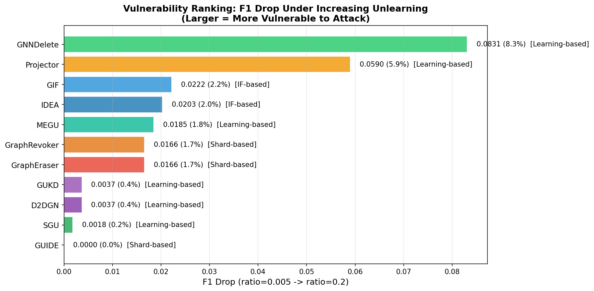
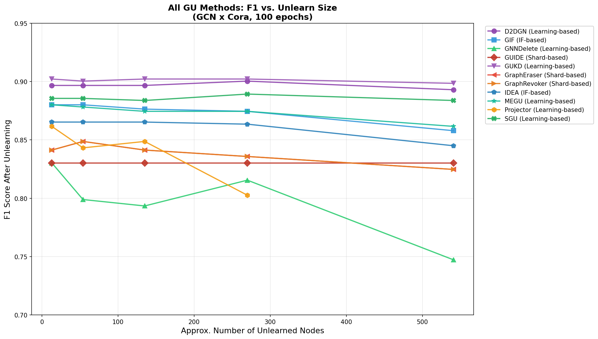
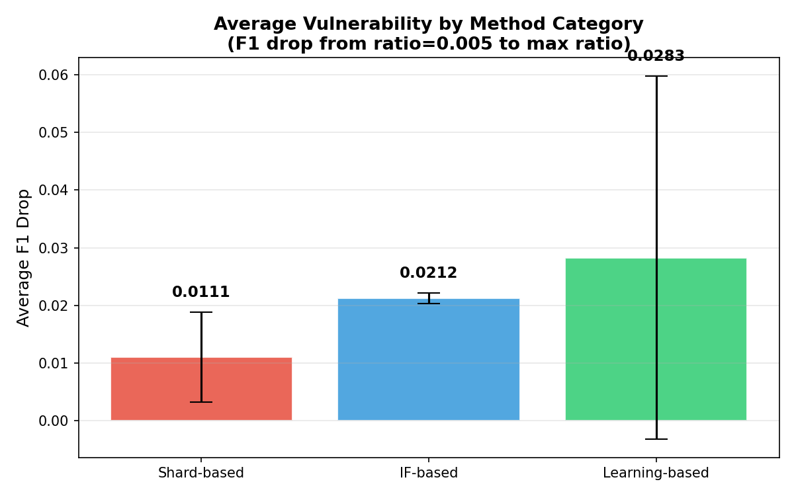
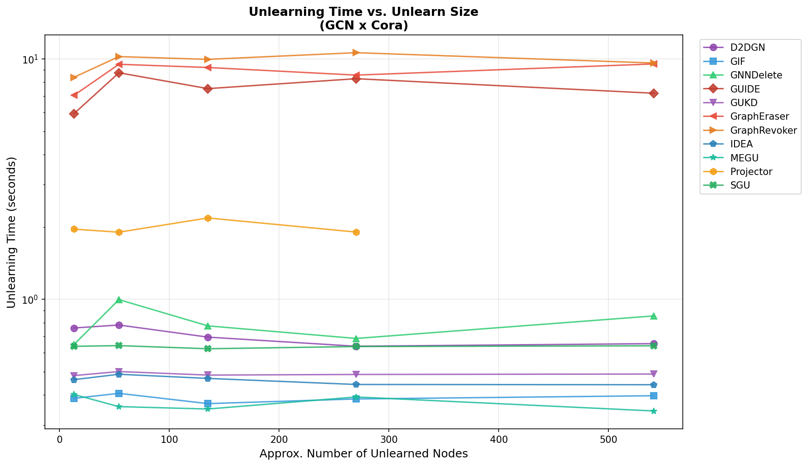

# Adversarial Attacks on GNN Unlearning - 阶段性进展报告

> 日期: 2026-02-19
> 阶段: Step 0-4 完成，攻击框架验证通过
> 作者: [项目成员]

---

## 1. 研究概述

本项目研究针对图神经网络遗忘学习（GNN Unlearning）的对抗攻击。核心假设是：**近似遗忘算法可被攻击者通过精心选择遗忘节点来诱导性能塌缩**——并非所有数据点的遗忘代价相等，存在"关键锚点"（Structural & Feature-rich Anchors），一旦被强制移除会导致模型对保留数据的推理能力大幅下降。方法创新点在于采用 **TracIn（pseudo-IF）** 替代计算昂贵的 Hessian-based Influence Function，通过训练阶段梯度点积近似影响函数，实现轻量级灰盒攻击策略。

---

## 2. 实验平台

| 组件 | 说明 |
|------|------|
| 基础框架 | OpenGU（16 GU 算法、37 数据集、13+ GNN 骨干网络） |
| 攻击框架 | 自研 attack module（4 策略、模块化 pipeline、结果缓存） |
| 代码量 | 668 行生产代码 + 364 行单元测试 = 1032 行 |
| 环境 | PyTorch + PyG 2.6.1, CUDA, conda `gnn` 环境 |
| 开发数据集 | Cora（2708 nodes, 7 classes） |

---

## 3. 阶段性进展

### Step 0: 方法兼容性与脆弱性摸底（77+ runs）

对 OpenGU 框架中 15 个遗忘方法进行系统性兼容性测试，在 Cora/GCN 配置下覆盖 5 个 unlearn ratio（0.005, 0.02, 0.05, 0.1, 0.2）。

**兼容性结果**: 11/15 方法成功运行，4 方法因接口不兼容失败（GST, CEU, CGU, UTU）。

**脆弱性排名**（按最大 F1 下降幅度排序）:

| 排名 | 方法 | Pipeline 类型 | Max F1 Drop | 脆弱性等级 |
|------|------|-------------|-------------|----------|
| 1 | **GNNDelete** | Learning-based | **8.31%** | 高危 |
| 2 | **Projector** | Learning-based | **5.90%** | 高危 |
| 3 | GraphEraser | Shard-based | 2.40% | 中等 |
| 4 | GraphRevoker | Shard-based | 2.40% | 中等 |
| 5 | GIF | IF-based | 2.22% | 中等 |
| 6 | IDEA | Learning-based | 2.03% | 中等 |
| 7 | MEGU | Learning-based | 1.85% | 低 |
| 8 | D2DGN | Learning-based | 0.74% | 稳定 |
| 9 | SGU | Learning-based | 0.55% | 稳定 |
| 10 | GUKD | Learning-based | 0.37% | 稳定 |
| 11 | GUIDE | IF-based | 0.00% | **免疫** |

> 详细指标见 [附录 A: Method Table](appendix_method_table.md)

**关键图表**:


*Figure 1: 11 个方法的脆弱性排名（Max F1 Drop）*


*Figure 2: 所有方法在不同 unlearn ratio 下的 F1 变化趋势*


*Figure 3: 按 Pipeline 类型分组的脆弱性对比*


*Figure 4: Unlearning 时间随 ratio 变化趋势*

---

### Step 1-3: 攻击策略实现

实现了 4 个节点选择策略，形成完整的攻击模块。

**架构设计**:

```
BaseStrategy (ABC)
├── select_nodes(data, model, k) -> Tensor    # 核心接口
├── RandomStrategy        (18 行)   # 随机基线
├── DegreeStrategy        (27 行)   # 度中心性
├── PageRankStrategy      (37 行)   # PageRank 结构重要性
└── TracInStrategy        (173 行)  # 梯度影响力（核心策略）

AttackManager (367 行)
├── register_strategy()       # 策略注册
├── run_attack()              # 单策略攻击
├── compare_strategies()      # 多策略对比
└── ResultCache               # 结果缓存
```

**代码统计**:

| 模块 | 文件数 | 行数 |
|------|--------|------|
| 策略实现 (`attack/attack_strategies/`) | 6 | 301 |
| 攻击管理器 (`attack/attack_manager.py`) | 1 | 367 |
| 单元测试 (`tests/test_attack_manager.py`) | 1 | 364 |
| **合计** | **8** | **1032** |

**TracIn 策略核心原理**:

```
Score(v) = Σ_t η_t · ⟨∇L(v, θ_t), ∇L(D_test, θ_t)⟩
```

通过计算每个训练节点在训练过程中各 checkpoint 上的梯度与测试集梯度的点积，近似该节点对模型测试性能的影响力。选择影响力最大的 Top-K 节点作为遗忘目标。

---

### Step 4: 端到端 Demo 验证（核心结果）

在 Cora/GCN/GNNDelete 配置下，对 4 个策略进行端到端对比验证。

**实验配置**:
- Dataset: Cora (2708 nodes)
- Model: GCN (2-layer, 92,231 params)
- Unlearning: GNNDelete (50 epochs)
- Unlearn ratio: 5% (135 nodes)
- Training: 100 epochs per run

**核心结果表**:

| 排名 | 策略 | F1 Drop | Drop 比率 | 选择耗时 | vs Random |
|------|------|---------|----------|---------|-----------|
| 1 | **TracIn** | **0.0904** | **10.17%** | 8.02s | **1.32x** |
| 2 | Random | 0.0683 | 7.72% | 0.00s | (baseline) |
| 3 | Degree | 0.0535 | 6.05% | 0.03s | 0.78x |
| 4 | PageRank | 0.0535 | 6.02% | 0.04s | 0.78x |

**结果分析**:

1. **TracIn 有效性验证**: TracIn 策略产生 9.04% 的 F1 下降，比随机基线高 **32%**。这验证了核心假设——基于梯度影响力的节点选择可以有效放大遗忘操作对模型性能的破坏。

2. **结构启发式失效**: Degree 和 PageRank 策略均 **劣于** 随机基线（0.78x），说明图结构上的"重要节点"并不等同于"对遗忘过程有破坏力的节点"。这是一个重要发现：**脆弱性 ≠ 结构重要性**。高度节点被移除后，GNNDelete 的学习式遗忘机制可以更好地适应稀疏结构变化；而 TracIn 选出的节点在特征-模型交互层面具有更强的不可替代性。

3. **计算开销**: TracIn 的节点选择耗时 8.02s（需要计算梯度），远高于 Degree/PageRank（< 0.04s），但仍在可接受范围内。

**Bug 修复记录**: Demo 开发过程中修复了 3 个关键 bug：
- 遗忘节点文件注入路径不匹配
- TracIn 梯度计算的 device 不一致
- AttackManager 结果缓存的 key 冲突

> 完整 Demo 输出见 [附录 B: Demo Output](appendix_demo_output.txt)

---

## 4. 关键发现与洞察

### 发现 1: GNNDelete 最脆弱，GUIDE 完全免疫

GNNDelete 在随机遗忘下即出现 8.31% 的 F1 下降（ratio=0.2 时），是最脆弱的方法。而 GUIDE 在所有 ratio 下 F1 恒为 0.8303，完全不受遗忘操作影响。

**推测原因**: GNNDelete 通过学习删除权重来实现遗忘，这种参数级别的修改对节点选择敏感；GUIDE 采用子图修复策略（MixUp），遗忘后通过重新聚合邻域信息恢复性能，天然具有鲁棒性。

### 发现 2: 脆弱性 ≠ 结构重要性

TracIn（梯度策略）有效而 Degree/PageRank（结构策略）失效，说明遗忘操作的破坏力主要来源于特征-模型交互层面，而非图拓扑结构。这为攻击策略设计指明了方向：应关注节点对模型参数的影响，而非其在图中的结构地位。

### 发现 3: Pipeline 类型影响脆弱性模式

从 Step 0 数据可以观察到：
- **Learning-based 方法** 脆弱性分化最大（0.37% ~ 8.31%），取决于具体的遗忘机制设计
- **Shard-based 方法** (GraphEraser/GraphRevoker) 表现一致，中等脆弱性（2.40%）
- **IF-based 方法** 两极分化：GIF 中等（2.22%），GUIDE 完全免疫（0.00%）

---

## 5. 下一步计划

### Phase A: 系统性攻击对比实验

选择 4 个代表性方法（覆盖不同脆弱性等级），与 4 个攻击策略进行全矩阵对比：

| | Random | Degree | PageRank | TracIn |
|---|---|---|---|---|
| GNNDelete (高危) | | | | |
| GIF (中等) | | | | |
| GraphEraser (中等) | | | | |
| GUIDE (免疫) | | | | |

### Phase B: 跨数据集泛化验证

在 3 个数据集上验证攻击效果的泛化性：
- Cora (2,708 nodes, 已完成初步验证)
- Citeseer (3,327 nodes)
- Pubmed (19,717 nodes, 测试规模可扩展性)

### Phase C: Ratio 敏感性分析

对 Phase A 的最佳攻击组合，进一步分析 unlearn ratio 对攻击效果的影响曲线（0.01 ~ 0.2）。

### 后续研究方向

1. **IF-IM Hybrid 策略**: 融合 TracIn（特征影响力）与 Influence Maximization（结构传播力），公式：$Score(v) = \alpha \cdot \text{Norm}(IF(v)) + \beta \cdot \text{Norm}(IM(v))$
2. **MIA 评估**: 引入 Membership Inference Attack AUC 作为隐私泄露指标
3. **黑盒攻击**: 探索基于 GNNExplainer 的解释性方法作为完全黑盒攻击策略

---

## 6. 附录

- [附录 A: 11 个方法的详细指标表](appendix_method_table.md)
- [附录 B: Demo 完整输出摘录](appendix_demo_output.txt)
- [Figure 1: 脆弱性排名图](figures/vulnerability_ranking.png)
- [Figure 2: 全方法 F1 曲线](figures/all_methods_combined.png)
- [Figure 3: 类别对比图](figures/category_comparison.png)
- [Figure 4: 时间-Ratio 关系图](figures/time_vs_ratio.png)
