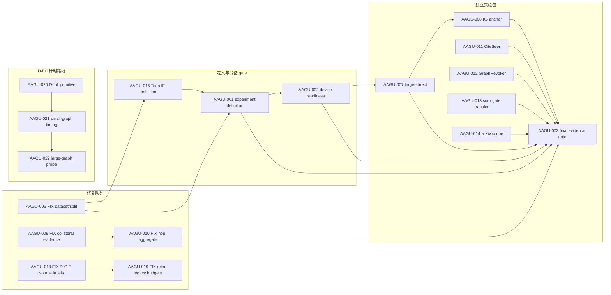

# WORKPLAN — 全局任务图、依赖图与状态投影

> Last updated: 2026-08-31
>
> 本文件只拥有编排事实：做什么、优先级、依赖关系、当前唯一执行线和下一步。研究定义、实验解释、结果与论文正文只链接到各自 owner。

Current node: AAGU-009

Next step: 恢复同一 `AAGU-009` Claim 与可逆 collateral repair 候选，先完成本地回归和正式运行 preflight；只有完整 SHA、GPU、配置与远端身份都满足时才启动精确 120-cell 修复重跑。

---

## 0. 一句话现状

当前唯一执行线是 `AAGU-009 · FIX · L8 collateral evidence 修复`；它不依赖 AAGU-001/AAGU-002，设备 readiness 只作为正式重跑 preflight；`AAGU-006` 保留已验证候选等待人工决定，`AAGU-010` 在 009 证据明确接受后继续。

## 1. WorkItem 状态投影

下面区域由 [`scripts/dashboard/refresh.py`](../../scripts/dashboard/refresh.py) 从 `.workblock/items/*/WORKITEM.md` 重建。不要手改状态。

<!-- WORKITEM_STATUS:BEGIN -->
<!-- Generated by scripts/dashboard/refresh.py; lifecycle status comes from WORKITEM.md. -->
| ID | 类型 | 状态投影 | 优先级 | 前置 | 唯一事实 owner |
|---|---|---|---|---|---|
| [AAGU-009](../../.workblock/items/AAGU-009/WORKITEM.md) | FIX | in progress / current | P0 | — | [重跑与缓存修复 Runbook](../../../../OpenGU-DocMap/10_实验矩阵/13_重跑与缓存修复Runbook.md) |
| [AAGU-004](../../.workblock/items/AAGU-004/WORKITEM.md) | SUPPORT | awaiting acceptance | P1 | — | [AAGU-004 Block contract](../../.workblock/items/AAGU-004/WORKITEM.md) |
| [AAGU-010](../../.workblock/items/AAGU-010/WORKITEM.md) | FIX | blocked by AAGU-009 | P0 | AAGU-009 | [重跑与缓存修复 Runbook](../../../../OpenGU-DocMap/10_实验矩阵/13_重跑与缓存修复Runbook.md) |
| [AAGU-015](../../.workblock/items/AAGU-015/WORKITEM.md) | EXP | blocked by AAGU-006 | P0 | AAGU-006 | [IF 目标层级实验计划](../../../../OpenGU-DocMap/10_实验矩阵/20_IF目标层级对比实验计划.md) |
| [AAGU-001](../../.workblock/items/AAGU-001/WORKITEM.md) | GATE | blocked by AAGU-006, AAGU-015 | P0 | AAGU-006, AAGU-015 | [实验框架总览](../../../../OpenGU-DocMap/10_实验矩阵/10_实验-框架总览.md) |
| [AAGU-002](../../.workblock/items/AAGU-002/WORKITEM.md) | GATE | blocked by AAGU-001 | P0 | AAGU-001 | [AAGU-002 Block contract](../../.workblock/items/AAGU-002/WORKITEM.md) |
| [AAGU-007](../../.workblock/items/AAGU-007/WORKITEM.md) | EXP | blocked by AAGU-002 | P0 | AAGU-002 | [实验框架总览](../../../../OpenGU-DocMap/10_实验矩阵/10_实验-框架总览.md) |
| [AAGU-008](../../.workblock/items/AAGU-008/WORKITEM.md) | EXP | blocked by AAGU-007 | P1 | AAGU-007 | [实验框架总览](../../../../OpenGU-DocMap/10_实验矩阵/10_实验-框架总览.md) |
| [AAGU-021](../../.workblock/items/AAGU-021/WORKITEM.md) | EXP | blocked by AAGU-020 | P1 | AAGU-020 | [AAGU-021 Block contract](../../.workblock/items/AAGU-021/WORKITEM.md) |
| [AAGU-003](../../.workblock/items/AAGU-003/WORKITEM.md) | GATE | blocked by AAGU-001, AAGU-002, AAGU-007, AAGU-008, AAGU-010, AAGU-011, AAGU-012, AAGU-013, AAGU-014 | P2 | AAGU-001, AAGU-002, AAGU-007, AAGU-008, AAGU-010, AAGU-011, AAGU-012, AAGU-013, AAGU-014 | [AAGU-003 Block contract](../../.workblock/items/AAGU-003/WORKITEM.md) |
| [AAGU-022](../../.workblock/items/AAGU-022/WORKITEM.md) | EXP | blocked by AAGU-021 | P2 | AAGU-021 | [AAGU-022 Block contract](../../.workblock/items/AAGU-022/WORKITEM.md) |
| [AAGU-005](../../.workblock/items/AAGU-005/WORKITEM.md) | SUPPORT | blocked by AAGU-001 | P3 | AAGU-001 | [AAGU-005 Block contract](../../.workblock/items/AAGU-005/WORKITEM.md) |
| [AAGU-006](../../.workblock/items/AAGU-006/WORKITEM.md) | FIX | registered / not claimed | P0 | — | [实验数据与正式运行合同](../../experiments/AGENTS.md) |
| [AAGU-019](../../.workblock/items/AAGU-019/WORKITEM.md) | FIX | registered / ready after dependency | P0 | AAGU-018 | [AAGU-019 Block contract](../../.workblock/items/AAGU-019/WORKITEM.md) |
| [AAGU-011](../../.workblock/items/AAGU-011/WORKITEM.md) | EXP | registered / not claimed | P1 | — | [实验框架总览](../../../../OpenGU-DocMap/10_实验矩阵/10_实验-框架总览.md) |
| [AAGU-012](../../.workblock/items/AAGU-012/WORKITEM.md) | EXP | registered / not claimed | P1 | — | [重跑与缓存修复 Runbook](../../../../OpenGU-DocMap/10_实验矩阵/13_重跑与缓存修复Runbook.md) |
| [AAGU-020](../../.workblock/items/AAGU-020/WORKITEM.md) | EXP | registered / not claimed | P1 | — | [AAGU-020 Block contract](../../.workblock/items/AAGU-020/WORKITEM.md) |
| [AAGU-013](../../.workblock/items/AAGU-013/WORKITEM.md) | EXP | registered / not claimed | P2 | — | [代理选集迁移实验计划](../../../../OpenGU-DocMap/10_实验矩阵/24_E7代理选集迁移实验计划.md) |
| [AAGU-014](../../.workblock/items/AAGU-014/WORKITEM.md) | EXP | registered / not claimed | P2 | — | [实验框架总览](../../../../OpenGU-DocMap/10_实验矩阵/10_实验-框架总览.md) |
| [AAGU-016](../../.workblock/items/AAGU-016/WORKITEM.md) | TODO | todo candidate / ready to promote | P2 | — | [评审与 rebuttal](../../../../OpenGU-DocMap/30_评审与汇报/31_评审意见与rebuttal.md) |
| [AAGU-017](../../.workblock/items/AAGU-017/WORKITEM.md) | TODO | todo candidate / ready to promote | P2 | — | [实验框架总览](../../../../OpenGU-DocMap/10_实验矩阵/10_实验-框架总览.md) |

已关闭 FIX 节点已从活动投影隐藏：1 个；历史保留在对应 WorkItem 与 Git。
<!-- WORKITEM_STATUS:END -->

## 2. 事实所有权

| 事实 | 唯一 owner | WORKPLAN 的角色 |
|---|---|---|
| 任务、优先级、依赖、当前线、下一步 | 本文件 | 权威编排 |
| Todo / Block 生命周期 | [`.workblock/items/*/WORKITEM.md`](../../.workblock/items) | 只做生成投影 |
| 科学问题、selector/metrics 论证、矩阵解释 | [OpenGU DocMap](../../../../OpenGU-DocMap/_文档地图.md) | 每个节点只链接 owner |
| 最终可执行配置 | [`experiments/configs/`](../../experiments/configs) | 不复制 YAML 参数 |
| 正式运行与证据接纳 | [`results/`](../../results) 与 Block evidence/report | 不复制结果或结论 |
| 历史修复与旧状态 | Git、验收记录、[冻结实验看板](EXPERIMENT_DASHBOARD.md) | 不进入活动队列 |

## 3. 当前唯一线与注意项

- **Current**：`AAGU-009`。先完成 L8 collateral evidence 的安全重跑与重新接受；AAGU-006 的独立候选/决定不构成本修复线的任务依赖。
- **Attention ordering**：任何 awaiting-acceptance 或 blocked 节点都由生成投影置顶；本段不手工复制具体生命周期状态。
- **Claim boundary**：AAGU-009 已由当前任务领取；尚未启动 GPU cell，也没有运行或接受其他实验。
- **IF boundary**：`AAGU-015` 只保留科学定义 Todo；selector 选择与实验结论必须在后续任务中和用户共同决定。

## 4. 依赖图

实线只表示真实输入前置。版面相邻和优先级不自动生成 `depends_on`；AAGU-011/012/013/014 可独立形成各自候选，最终由 AAGU-003 直接消费。



## 5. 修复队列

关闭的 `FIX` 会从活动投影和 HTML 修复列隐藏；历史仍保留在 WorkItem、验收记录和 Git。

| ID | 类型 | 节点 | 优先级 | 前置 | Owner |
|---|---|---|---|---|---|
| AAGU-006 | FIX | 目标实验 Dataset/Split 权威修复 | P0 | — | [实验数据与正式运行合同](../../experiments/AGENTS.md) |
| AAGU-018 | FIX | D-GIF affected-source 标签越界修复 | P0 | — | [AAGU-018 Block contract](../../.workblock/items/AAGU-018/WORKITEM.md) |
| AAGU-019 | FIX | 硬退役旧小预算实验 setup | P0 | AAGU-018 | [AAGU-019 Block contract](../../.workblock/items/AAGU-019/WORKITEM.md) |
| AAGU-009 | FIX | L8 collateral evidence 修复 | P0 | — | [重跑与缓存修复 Runbook](../../../../OpenGU-DocMap/10_实验矩阵/13_重跑与缓存修复Runbook.md) |
| AAGU-010 | FIX | hop aggregate fields 修复 | P0 | AAGU-009 | [重跑与缓存修复 Runbook](../../../../OpenGU-DocMap/10_实验矩阵/13_重跑与缓存修复Runbook.md) |

## 6. 独立实验包

每个 `EXP` 都是独立 Block。优先级决定注意顺序，不把表格相邻关系投影成硬依赖；只有明确消费前一 Block 产物的节点才保留 `depends_on`。正式 GPU 仍需执行时授权。

| ID | 类型 | 节点 | 优先级 | 前置 | Owner |
|---|---|---|---|---|---|
| AAGU-015 | EXP | IF 科学定义与 selector 决策（Todo candidate） | P0 | AAGU-006 | [IF 目标层级实验计划](../../../../OpenGU-DocMap/10_实验矩阵/20_IF目标层级对比实验计划.md) |
| AAGU-001 | GATE | 实验定义与注册 gate | P0 | AAGU-006, AAGU-015 | [实验框架总览](../../../../OpenGU-DocMap/10_实验矩阵/10_实验-框架总览.md) |
| AAGU-002 | GATE | Device Readiness gate | P0 | AAGU-001 | [AAGU-002 Block contract](../../.workblock/items/AAGU-002/WORKITEM.md) |
| AAGU-007 | EXP | Target-Direct GU gate | P0 | AAGU-002 | [实验框架总览](../../../../OpenGU-DocMap/10_实验矩阵/10_实验-框架总览.md) |
| AAGU-008 | EXP | K5 noise anchor | P1 | AAGU-007 | [实验框架总览](../../../../OpenGU-DocMap/10_实验矩阵/10_实验-框架总览.md) |
| AAGU-011 | EXP | CiteSeer scope replacement | P1 | — | [实验框架总览](../../../../OpenGU-DocMap/10_实验矩阵/10_实验-框架总览.md) |
| AAGU-012 | EXP | GraphRevoker replacement | P1 | — | [重跑与缓存修复 Runbook](../../../../OpenGU-DocMap/10_实验矩阵/13_重跑与缓存修复Runbook.md) |
| AAGU-013 | EXP | Surrogate transfer | P2 | — | [代理选集迁移实验计划](../../../../OpenGU-DocMap/10_实验矩阵/24_E7代理选集迁移实验计划.md) |
| AAGU-014 | EXP | arXiv scope expansion | P2 | — | [实验框架总览](../../../../OpenGU-DocMap/10_实验矩阵/10_实验-框架总览.md) |
| AAGU-003 | GATE | Formal GPU evidence acceptance | P2 | AAGU-001, AAGU-002, AAGU-007, AAGU-008, AAGU-010, AAGU-011, AAGU-012, AAGU-013, AAGU-014 | [AAGU-003 Block contract](../../.workblock/items/AAGU-003/WORKITEM.md) |

## 7. D-full 计时路线

三个 Block 共用同一 D-full GIF 计算原语，但分别保留实现、计时验证和大图容量探针的独立证据与人工决定。

| ID | 类型 | 节点 | 优先级 | 前置 | Owner |
|---|---|---|---|---|---|
| AAGU-020 | EXP | D-full GIF 计算原语与计时应用 | P1 | — | [AAGU-020 Block contract](../../.workblock/items/AAGU-020/WORKITEM.md) |
| AAGU-021 | EXP | 小图 D-full GIF 计时验证与线性拟合 | P1 | AAGU-020 | [AAGU-021 Block contract](../../.workblock/items/AAGU-021/WORKITEM.md) |
| AAGU-022 | EXP | 大图 D-full GIF 计时探针与全量外推 | P2 | AAGU-021 | [AAGU-022 Block contract](../../.workblock/items/AAGU-022/WORKITEM.md) |

## 8. 写作

写作保留一个有编号的顶层 Todo；后续只把 ready 的子 Todo Promote 成独立 Block。

| ID | 类型 | 节点 | 优先级 | 前置 | Owner |
|---|---|---|---|---|---|
| AAGU-016 | TODO | Writing workstream umbrella | P2 | — | [评审与 rebuttal](../../../../OpenGU-DocMap/30_评审与汇报/31_评审意见与rebuttal.md) |

## 9. 画图

画图保留一个有编号的顶层 Todo；不注册成一个庞大 Block。

| ID | 类型 | 节点 | 优先级 | 前置 | Owner |
|---|---|---|---|---|---|
| AAGU-017 | TODO | Figure workstream umbrella | P2 | — | [实验框架总览](../../../../OpenGU-DocMap/10_实验矩阵/10_实验-框架总览.md) |

## 10. 支撑与决策队列

这些 Block 属于项目全局视图，但不并入实验 timeline。

| ID | 类型 | 节点 | 优先级 | 前置 | Owner |
|---|---|---|---|---|---|
| AAGU-004 | SUPPORT | FlowChunk D0 acceptance decision | P1 | — | [AAGU-004 Block contract](../../.workblock/items/AAGU-004/WORKITEM.md) |
| AAGU-005 | SUPPORT | SyncMate productization decision | P3 | AAGU-001 | [AAGU-005 Block contract](../../.workblock/items/AAGU-005/WORKITEM.md) |

## 11. 漂移检测与重建

```powershell
python -B -X utf8 scripts/dashboard/refresh.py
python -B -X utf8 scripts/dashboard/refresh.py --check
python -B -X utf8 -m unittest tests.test_dashboard_refresh -v
```

验证会拒绝：失效链接、重复节点映射、未映射 WorkItem、已关闭 Block 仍占当前线、当前线存在未完成前置，以及依赖已关闭但 Todo Record 仍停在 blocked。

## 12. 历史入口

- 旧任务编号、研究事实、实验结果与论文叙述不再保存在活动 WORKPLAN；需要追溯时查 Git 和对应 owner。
- 历史覆盖与缺陷档案只读：[EXPERIMENT_DASHBOARD.md](EXPERIMENT_DASHBOARD.md)。
- 可视化看板是派生物：[progress.html](progress.html)。
