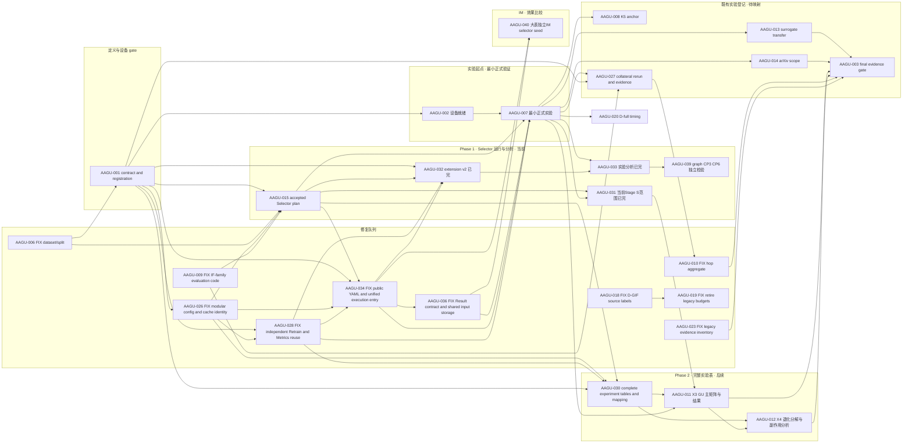

# WORKPLAN — 全局任务图、依赖图与状态投影

> Last updated: 2026-09-09
>
> 本文件只拥有编排事实：做什么、优先级、依赖关系、当前唯一执行线和下一步。研究定义、实验解释、结果与论文正文只链接到各自 owner。

Current node: AAGU-039

Next step: 本次仅完成031/032/033/035收口。039保留为后续候选，030/011仅保留原有计划；未授权本次提交Git或启动任何新实验。

---

## 0. 一句话现状

031、032、033的本轮科研结果已接受并标“完”；035已合并、部署并完成收尾复核。当前结论见[DocMap阶段结论](../../../../OpenGU-DocMap/10_实验矩阵/24_AAGU-032_GT有效性与extension-v2对照.md)，统一验收入口为[033报告](../../.workblock/items/AAGU-033/REPORT.md)。015的旧“尚未跑”是方案阶段历史描述，实际执行由031/032承接。

后续候选为039独立CP检验，本次不启动、不提交、不实施新实验。030负责下一阶段配置映射，011承接实际GU主矩阵。007已完成最小实验链路验证并按用户决定收口，当前验收入口见[007报告](../../.workblock/items/AAGU-007/REPORT.md)。原始证据和既有运行保留。

## 1. WorkItem 状态投影

下面区域由 [`scripts/dashboard/refresh.py`](../../scripts/dashboard/refresh.py) 从 `.workblock/items/*/WORKITEM.md` 重建。不要手改状态。

<!-- WORKITEM_STATUS:BEGIN -->
<!-- Generated by scripts/dashboard/refresh.py; lifecycle status comes from WORKITEM.md. -->
| ID | 类型 | 状态投影 | 优先级 | 前置 | 唯一事实 owner |
|---|---|---|---|---|---|
| [AAGU-039](../../.workblock/items/AAGU-039/WORKITEM.md) | TODO | todo candidate / ready to promote / current | P0 | AAGU-031, AAGU-033 | [AAGU-039 独立检验](../../.workblock/items/AAGU-039/WORKITEM.md) |
| [AAGU-010](../../.workblock/items/AAGU-010/WORKITEM.md) | FIX | blocked by AAGU-027 | P1 | AAGU-027 | [重跑与缓存修复 Runbook](../../../../OpenGU-DocMap/10_实验矩阵/13_重跑与缓存修复Runbook.md) |
| [AAGU-011](../../.workblock/items/AAGU-011/WORKITEM.md) | EXP | blocked by AAGU-030 | P1 | AAGU-030, AAGU-031, AAGU-007 | [AAGU-011 X3 实验合同](../../.workblock/items/AAGU-011/WORKITEM.md) |
| [AAGU-012](../../.workblock/items/AAGU-012/WORKITEM.md) | EXP | blocked by AAGU-030, AAGU-011 | P1 | AAGU-030, AAGU-011 | [AAGU-012 X4 分析合同](../../.workblock/items/AAGU-012/WORKITEM.md) |
| [AAGU-021](../../.workblock/items/AAGU-021/WORKITEM.md) | EXP | blocked by AAGU-020 | P1 | AAGU-020 | [AAGU-021 Block contract](../../.workblock/items/AAGU-021/WORKITEM.md) |
| [AAGU-003](../../.workblock/items/AAGU-003/WORKITEM.md) | GATE | blocked by AAGU-014, AAGU-010, AAGU-011, AAGU-012 | P2 | AAGU-014, AAGU-010, AAGU-023, AAGU-011, AAGU-012 | [AAGU-003 Block contract](../../.workblock/items/AAGU-003/WORKITEM.md) |
| [AAGU-022](../../.workblock/items/AAGU-022/WORKITEM.md) | EXP | blocked by AAGU-021 | P2 | AAGU-021 | [AAGU-022 Block contract](../../.workblock/items/AAGU-022/WORKITEM.md) |
| [AAGU-030](../../.workblock/items/AAGU-030/WORKITEM.md) | DOCS/CONFIG | registered / not claimed | P1 | AAGU-001, AAGU-015, AAGU-026, AAGU-028 | [AAGU-030 表格与覆盖合同](../../.workblock/items/AAGU-030/WORKITEM.md) |
| [AAGU-027](../../.workblock/items/AAGU-027/WORKITEM.md) | EXP | registered / not claimed | P1 | AAGU-001, AAGU-009, AAGU-007 | [AAGU-027 实验合同](../../.workblock/items/AAGU-027/WORKITEM.md) |
| [AAGU-008](../../.workblock/items/AAGU-008/WORKITEM.md) | EXP | registered / not claimed | P1 | AAGU-007 | [实验框架总览](../../../../OpenGU-DocMap/10_实验矩阵/10_实验-框架总览.md) |
| [AAGU-020](../../.workblock/items/AAGU-020/WORKITEM.md) | EXP | registered / not claimed | P1 | AAGU-007 | [AAGU-020 Block contract](../../.workblock/items/AAGU-020/WORKITEM.md) |
| [AAGU-013](../../.workblock/items/AAGU-013/WORKITEM.md) | EXP | registered / not claimed | P2 | AAGU-007 | [代理选集迁移实验计划](../../../../OpenGU-DocMap/10_实验矩阵/24_E7代理选集迁移实验计划.md) |
| [AAGU-014](../../.workblock/items/AAGU-014/WORKITEM.md) | EXP | registered / not claimed | P2 | AAGU-007 | [实验框架总览](../../../../OpenGU-DocMap/10_实验矩阵/10_实验-框架总览.md) |
| [AAGU-016](../../.workblock/items/AAGU-016/WORKITEM.md) | TODO | todo candidate / ready to promote | P2 | — | [评审与 rebuttal](../../../../OpenGU-DocMap/30_评审与汇报/31_评审意见与rebuttal.md) |
| [AAGU-017](../../.workblock/items/AAGU-017/WORKITEM.md) | TODO | todo candidate / ready to promote | P2 | — | [实验框架总览](../../../../OpenGU-DocMap/10_实验矩阵/10_实验-框架总览.md) |
| [AAGU-029](../../.workblock/items/AAGU-029/WORKITEM.md) | SUPPORT | registered / not claimed | P2 | AAGU-001, AAGU-026 | [AAGU-029 Block contract](../../.workblock/items/AAGU-029/WORKITEM.md) |
| [AAGU-040](../../.workblock/items/AAGU-040/WORKITEM.md) | FIX | registered / not claimed | 未定 | AAGU-034, AAGU-036 | [AAGU-040 修复合同](../../.workblock/items/AAGU-040/WORKITEM.md) |
| [AAGU-002](../../.workblock/items/AAGU-002/WORKITEM.md) | GATE | accepted / closed | P0 | AAGU-001 | [AAGU-002 Block contract](../../.workblock/items/AAGU-002/WORKITEM.md) |
| [AAGU-007](../../.workblock/items/AAGU-007/WORKITEM.md) | EXP | accepted / closed | P0 | AAGU-002, AAGU-015, AAGU-028, AAGU-034, AAGU-036 | [007 ordinary experiment](../../experiments/configs/aagu007/experiment.yaml) |
| [AAGU-015](../../.workblock/items/AAGU-015/WORKITEM.md) | EXP | accepted / 实验表已做，尚未跑 | P0 | AAGU-006, AAGU-001, AAGU-026, AAGU-009 | [AAGU-015 Block contract](../../.workblock/items/AAGU-015/WORKITEM.md) |
| [AAGU-031](../../.workblock/items/AAGU-031/WORKITEM.md) | EXP | accepted / closed | P0 | AAGU-015, AAGU-007 | [AAGU-031 实验合同](../../.workblock/items/AAGU-031/WORKITEM.md) |
| [AAGU-032](../../.workblock/items/AAGU-032/WORKITEM.md) | EXP | accepted / closed | P0 | AAGU-001, AAGU-015, AAGU-028, AAGU-034 | [AAGU-032 实验表合同](../../.workblock/items/AAGU-032/WORKITEM.md) |
| [AAGU-033](../../.workblock/items/AAGU-033/WORKITEM.md) | ANALYSIS | accepted / closed | P0 | AAGU-007, AAGU-032 | [AAGU-033 运行与分析合同](../../.workblock/items/AAGU-033/WORKITEM.md) |
| [AAGU-001](../../.workblock/items/AAGU-001/WORKITEM.md) | GATE | accepted / closed | P0 | AAGU-006 | [AAGU-001 合同与注册规范](../../.workblock/items/AAGU-001/WORKITEM.md) |
| [AAGU-005](../../.workblock/items/AAGU-005/WORKITEM.md) | SUPPORT | accepted / closed | P3 | AAGU-001 | [AAGU-005 Block contract](../../.workblock/items/AAGU-005/WORKITEM.md) |
| [AAGU-024](../../.workblock/items/AAGU-024/WORKITEM.md) | DOCS/PROTOCOL | accepted / closed | 未定 | — | [AAGU-024 Block contract](../../.workblock/items/AAGU-024/WORKITEM.md) |
| [AAGU-037](../../.workblock/items/AAGU-037/WORKITEM.md) | OPT | accepted / closed | 未定 | — | [AAGU-037](../../.workblock/items/AAGU-037/WORKITEM.md) |

已关闭 FIX 节点已从活动投影隐藏：12 个；历史保留在对应 WorkItem 与 Git。
<!-- WORKITEM_STATUS:END -->

## 2. 事实所有权

| 事实 | 唯一 owner | WORKPLAN 的角色 |
|---|---|---|
| 任务、优先级、依赖、当前线、下一步 | 本文件 | 权威编排 |
| Todo / Block 生命周期 | [`.workblock/items/*/WORKITEM.md`](../../.workblock/items) | 只做生成投影 |
| 科学问题、selector/metrics 论证、矩阵解释 | [OpenGU DocMap](../../../../OpenGU-DocMap/_文档地图.md) | 每个节点只链接 owner |
| 最终可执行配置 | [`experiments/configs/`](../../experiments/configs) | 不复制 YAML 参数 |
| 正式运行与证据接纳 | [`results/`](../../results) 与 Block evidence/report | 不复制结果或结论 |
| 历史修复与旧状态 | Git、验收记录、[冻结实验看板](EXPERIMENT_DASHBOARD.md) | 不进入活动队列 |

## 3. 当前唯一线与注意项

- **后续候选（非启动授权）**：039，graph版CP3、CP6对D-full末层两跳；建议三数据集、三seed、10%预算。具体比较与数量见[阶段结论](../../../../OpenGU-DocMap/10_实验矩阵/24_AAGU-032_GT有效性与extension-v2对照.md)，当前仅安排，未启动。
- **当前设备条件**：2026-09-09只读检查SSH成功，CUDA不可用、GPU数量0；本地清理选择器的代码尚未提交/部署。正式运行前需恢复GPU、完成已审核代码配置落地，并核对同一SHA及范围专属gate。
- **后续映射建议（本次不执行）**：030将Random、Degree、R-point、D-full映射到后续GU比较；011在配置与gate齐备后运行，不将当前建议的72格切片冒称已批准/已提交矩阵。
- **本轮收尾**：031/032/033科研项已完成；035此前软件合并部署已复核。032早期方案分支仅作为历史材料保留，不重新并入当前代码。
- **范围**：不重跑已完成的P-point/R-point，不增加arxiv实测、末层三跳F1或完整17方案矩阵。CP3/CP6是独立问题，不阻塞前一轮接受。
- **计时与缓存**：使用实际计时作用域；只在完整有效身份相同时复用，不清缓存制造冷时间，不把计划条件数等同于producer调用数。

## 4. 依赖图

实验入口为 002、034 与 036 → 007；034 另作为 032 最终配置验收前置；007 接受后才展开 031、033、GU/重跑或计时路线。033 另消费 032 已验收方案，与 031 平行，互不依赖。Phase 是分组与优先级：Phase 1 不等待 Phase 2 的总表；X3 消费完整表、031 的 Selector 证据和 007 gate，X4 消费 X3 输出。方案工作可独立推进。



## 5. 修复队列

关闭的 `FIX` 会从活动投影和 HTML 修复列隐藏；历史仍保留在 WorkItem、验收记录和 Git。

| ID | 类型 | 节点 | 优先级 | 前置 | Owner |
|---|---|---|---|---|---|
| AAGU-035 | FIX | 多数据集实验矩阵与 SyncMate 回传 | P0 | — | [AAGU-035 合同](../../.workblock/items/AAGU-035/WORKITEM.md) |
| AAGU-036 | FIX | 实验回传合同与存储边界修复（合并038） | P0 | AAGU-034 | [AAGU-036 修复合同](../../.workblock/items/AAGU-036/WORKITEM.md) |
| AAGU-038 | FIX | 已并入036，撤销独立执行（非验收完成） | P0 | — | [统一 owner AAGU-036](../../.workblock/items/AAGU-036/WORKITEM.md) |
| AAGU-034 | FIX | 实验配置与统一执行入口修正（026 返工） | P0 | AAGU-001, AAGU-026, AAGU-015, AAGU-028 | [AAGU-034 修正合同](../../.workblock/items/AAGU-034/WORKITEM.md) |
| AAGU-028 | FIX | Retrain 独立方法与 Metrics 输出复用 | P0 | AAGU-001, AAGU-026 | [AAGU-028 Block contract](../../.workblock/items/AAGU-028/WORKITEM.md) |
| AAGU-006 | FIX | 目标实验 Dataset/Split 权威修复 | P0 | — | [historical split contract](../../docs/archive/experiment-configs-pre-aagu034/syncmate_target_direct_formal_v2.yaml) |
| AAGU-018 | FIX | D-GIF affected-source 标签越界修复 | P0 | — | [AAGU-018 Block contract](../../.workblock/items/AAGU-018/WORKITEM.md) |
| AAGU-019 | FIX | 硬退役旧小预算实验 setup | P0 | AAGU-018 | [AAGU-019 Block contract](../../.workblock/items/AAGU-019/WORKITEM.md) |
| AAGU-025 | FIX | 通用缓存原位接入 Cache V2 | 未定 | — | [AAGU-025 Block contract](../../.workblock/items/AAGU-025/WORKITEM.md) |
| AAGU-026 | FIX | 模块化实验配置与缓存身份隔离 | 未定 | AAGU-001 | [AAGU-026 Block contract](../../.workblock/items/AAGU-026/WORKITEM.md) |
| AAGU-009 | FIX | IF-family 参数写回与 Collateral 评估代码修复 | P0 | — | [AAGU-009 软件修复合同](../../.workblock/items/AAGU-009/WORKITEM.md) |
| AAGU-010 | FIX | hop aggregate fields 修复 | P1 | AAGU-027 | [重跑与缓存修复 Runbook](../../../../OpenGU-DocMap/10_实验矩阵/13_重跑与缓存修复Runbook.md) |
| AAGU-023 | FIX | Legacy 实验证据盘点与归档边界 | 未定 | — | [AAGU-023 Block contract](../../.workblock/items/AAGU-023/WORKITEM.md) |

## 实验起点 · 最小正式验证

先完成设备就绪、034 公共入口修正与 036 结果存储修复并接受落地，再运行 007 的最小 Target-Direct 正式切片。007 负责证明运行、独立方法输出、收集与离线比较链路；它是后续实际实验的共同门槛，不承接 031 的全量 Selector 分析。

| ID | 类型 | 节点 | 优先级 | 前置 | Owner |
|---|---|---|---|---|---|
| AAGU-002 | GATE | Device Readiness gate | P0 | AAGU-001 | [AAGU-002 Block contract](../../.workblock/items/AAGU-002/WORKITEM.md) |
| AAGU-007 | EXP | 最小正式实验 Gate（Target-Direct） | P0 | AAGU-002, AAGU-015, AAGU-028, AAGU-034, AAGU-036 | [007 ordinary experiment](../../experiments/configs/aagu007/experiment.yaml) |

## 6. Phase 1 · Selector 运行与分析

当前031/032/033的接受范围已完成。039独立检验graph轨迹CP3/CP6，不回填为031未完成Q4。正式执行仍须核对当前数据、模型、checkpoint、producer和gate。

| ID | 类型 | 节点 | 优先级 | 前置 | Owner |
|---|---|---|---|---|---|
| AAGU-015 | EXP | Selector方案与软件验证 | P0 | AAGU-006, AAGU-001, AAGU-026, AAGU-009 | [AAGU-015 Block contract](../../.workblock/items/AAGU-015/WORKITEM.md) |
| AAGU-031 | EXP | 当前72格Selector Stage S与排名分析 | P0 | AAGU-015, AAGU-007 | [AAGU-031 实验合同](../../.workblock/items/AAGU-031/WORKITEM.md) |
| AAGU-032 | EXP | D-full extension v2与独立Retrain | P0 | AAGU-001, AAGU-015, AAGU-028, AAGU-034 | [AAGU-032 实验表合同](../../.workblock/items/AAGU-032/WORKITEM.md) |
| AAGU-033 | ANALYSIS | D-full效果、相似度与计时分析 | P0 | AAGU-007, AAGU-032 | [AAGU-033 运行与分析合同](../../.workblock/items/AAGU-033/WORKITEM.md) |
| AAGU-039 | TODO | graph版CP3、CP6与D-full独立比较 | P0 | AAGU-031, AAGU-033 | [AAGU-039 独立检验](../../.workblock/items/AAGU-039/WORKITEM.md) |

## IM · 效果比较

用户2026-09-09要求新增IM线Phase（`phase-im`）。研究线包含效果比较、复用回传Selection的方法间重叠分析，以及相同配置、不同selector seed的稳定性分析。首个软件前提由040拥有；具体科研矩阵与后续算法接入尚未登记或启动。Phase只分组，不以IF阶段完成作为前置，不改变当前执行线。

| ID | 类型 | 节点 | 优先级 | 前置 | Owner |
|---|---|---|---|---|---|
| AAGU-040 | FIX | 大表独立 IM selector seed 与选集复用 | 未定 | AAGU-034, AAGU-036 | [AAGU-040 修复合同](../../.workblock/items/AAGU-040/WORKITEM.md) |

## Phase 2 · 完整实验表与后续运行映射

保留原实验类别与已批准范围；030 整理完整表和具体配置，A5 分为删除比例与数据集。011/012 已在原编号下改登记为 X3/X4，当前定位不再是 replacement。其余分区的执行责任继续逐项映射；不能把两项改登记说成八块已全部完成。031 的运行和分析不依赖本阶段完成。

| ID | 类型 | 节点 | 优先级 | 前置 | Owner |
|---|---|---|---|---|---|
| AAGU-030 | DOCS/CONFIG | 本轮完整实验表与配置映射 | P1 | AAGU-001, AAGU-015, AAGU-026, AAGU-028 | [AAGU-030 表格与覆盖合同](../../.workblock/items/AAGU-030/WORKITEM.md) |
| AAGU-011 | EXP | X3 GU 主矩阵与结果 | P1 | AAGU-030, AAGU-031, AAGU-007 | [AAGU-011 X3 实验合同](../../.workblock/items/AAGU-011/WORKITEM.md) |
| AAGU-012 | EXP | X4 退化分解与副作用分析 | P1 | AAGU-030, AAGU-011 | [AAGU-012 X4 分析合同](../../.workblock/items/AAGU-012/WORKITEM.md) |

## 既有实验 timeline（待映射）

以下保留其他既有合同和身份供 030 核对。011/012 已移入 Phase 2；013 的独立代理分组不再沿用旧 012 相邻顺序为前置。CiteSeer 数据集扩展和 GraphRevoker 方法维度继续保留在原表覆盖中。

| ID | 类型 | 节点 | 优先级 | 前置 | Owner |
|---|---|---|---|---|---|
| AAGU-001 | GATE | 实验合同与注册规范 | P0 | AAGU-006 | [AAGU-001 合同与注册规范](../../.workblock/items/AAGU-001/WORKITEM.md) |
| AAGU-027 | EXP | IF-family Collateral 重跑与双端证据验收 | P1 | AAGU-001, AAGU-009, AAGU-007 | [AAGU-027 实验合同](../../.workblock/items/AAGU-027/WORKITEM.md) |
| AAGU-008 | EXP | K5 noise anchor | P1 | AAGU-007 | [实验框架总览](../../../../OpenGU-DocMap/10_实验矩阵/10_实验-框架总览.md) |
| AAGU-013 | EXP | Surrogate transfer | P2 | AAGU-007 | [代理选集迁移实验计划](../../../../OpenGU-DocMap/10_实验矩阵/24_E7代理选集迁移实验计划.md) |
| AAGU-014 | EXP | arXiv scope expansion | P2 | AAGU-007 | [实验框架总览](../../../../OpenGU-DocMap/10_实验矩阵/10_实验-框架总览.md) |
| AAGU-003 | GATE | Formal GPU evidence acceptance | P2 | AAGU-014, AAGU-010, AAGU-023, AAGU-011, AAGU-012 | [AAGU-003 Block contract](../../.workblock/items/AAGU-003/WORKITEM.md) |

## 7. D-full 计时路线

三个 Block 共用同一 D-full GIF 计算原语，但分别保留实现、计时验证和大图容量探针的独立证据与人工决定。

| ID | 类型 | 节点 | 优先级 | 前置 | Owner |
|---|---|---|---|---|---|
| AAGU-020 | EXP | D-full GIF 计算原语与计时应用 | P1 | AAGU-007 | [AAGU-020 Block contract](../../.workblock/items/AAGU-020/WORKITEM.md) |
| AAGU-021 | EXP | 小图 D-full GIF 计时验证与线性拟合 | P1 | AAGU-020 | [AAGU-021 Block contract](../../.workblock/items/AAGU-021/WORKITEM.md) |
| AAGU-022 | EXP | 大图 D-full GIF 计时探针与全量外推 | P2 | AAGU-021 | [AAGU-022 Block contract](../../.workblock/items/AAGU-022/WORKITEM.md) |

## 8. 协议与归档队列

协议任务的生命周期由其 WorkItem 投影；未声明优先级时保持为“未定”，不替用户推断。AAGU-023 依照图注册归入上方修复队列。

| ID | 类型 | 节点 | 优先级 | 前置 | Owner |
|---|---|---|---|---|---|
| AAGU-024 | DOCS/PROTOCOL | 未 Claim WorkItems 升级为 2.1 Human Surface | 未定 | — | [AAGU-024 Block contract](../../.workblock/items/AAGU-024/WORKITEM.md) |

## 9. 写作

写作保留一个有编号的顶层 Todo；后续只把 ready 的子 Todo Promote 成独立 Block。

| ID | 类型 | 节点 | 优先级 | 前置 | Owner |
|---|---|---|---|---|---|
| AAGU-016 | TODO | Writing workstream umbrella | P2 | — | [评审与 rebuttal](../../../../OpenGU-DocMap/30_评审与汇报/31_评审意见与rebuttal.md) |

## 10. 画图

画图保留一个有编号的顶层 Todo；不注册成一个庞大 Block。

| ID | 类型 | 节点 | 优先级 | 前置 | Owner |
|---|---|---|---|---|---|
| AAGU-017 | TODO | Figure workstream umbrella | P2 | — | [实验框架总览](../../../../OpenGU-DocMap/10_实验矩阵/10_实验-框架总览.md) |

## 11. 支撑与决策队列

这些 Block 属于项目全局视图，但不并入实验 timeline。

| ID | 类型 | 节点 | 优先级 | 前置 | Owner |
|---|---|---|---|---|---|
| AAGU-005 | SUPPORT | SyncMate 的 OpenGU 接入与联调 | P3 | AAGU-001 | [AAGU-005 Block contract](../../.workblock/items/AAGU-005/WORKITEM.md) |
| AAGU-029 | SUPPORT | 大图实验准备：指定节点评分与分阶段计时接口 | P2 | AAGU-001, AAGU-026 | [AAGU-029 Block contract](../../.workblock/items/AAGU-029/WORKITEM.md) |

## 12. 漂移检测与重建

```powershell
python -B -X utf8 scripts/dashboard/refresh.py
python -B -X utf8 scripts/dashboard/refresh.py --check
python -B -X utf8 -m unittest tests.test_dashboard_refresh -v
```

验证会拒绝：失效链接、重复节点映射、未映射 WorkItem、已关闭 Block 仍占当前线、当前线存在未完成前置，以及依赖已关闭但 Todo Record 仍停在 blocked。

## 13. 历史入口

- 旧任务编号、研究事实、实验结果与论文叙述不再保存在活动 WORKPLAN；需要追溯时查 Git 和对应 owner。
- 历史覆盖与缺陷档案只读：[EXPERIMENT_DASHBOARD.md](EXPERIMENT_DASHBOARD.md)。
- 可视化看板是派生物：[progress.html](progress.html)。

## 已登记优化节点

| ID | 类型 | 节点 | 优先级 | 前置 | Owner |
|---|---|---|---|---|---|
| AAGU-037 | OPT | Selection 跨预算覆盖复用 | 未定 | — | [AAGU-037](../../.workblock/items/AAGU-037/WORKITEM.md) |
