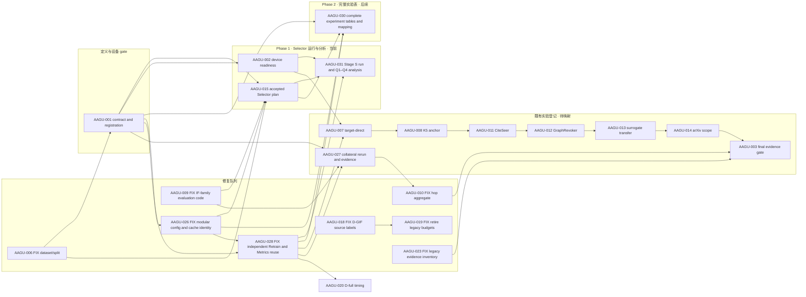

# WORKPLAN — 全局任务图、依赖图与状态投影

> Last updated: 2026-09-06
>
> 本文件只拥有编排事实：做什么、优先级、依赖关系、当前唯一执行线和下一步。研究定义、实验解释、结果与论文正文只链接到各自 owner。

Current node: AAGU-002

Next step: 优先推进 Phase 1：AAGU-002 设备就绪 → AAGU-031 Selector Stage S 正式运行与 Q1–Q4 分析，直接复用 AAGU-015 已接受方案。Phase 2 的 AAGU-030 完整实验表整理不作为该路线前置。当前完成阶段编排与登记，尚未 Claim 或启动正式作业。

---

## 0. 一句话现状

AAGU-015 的 Selector 方案与能力检查已接受；Phase 1 优先由 AAGU-031 承接真实运行与分析，先满足 AAGU-002 设备就绪。Phase 2 由 AAGU-030 整理原实验大表、配置和后续执行责任。既有实验 Block 部分沿用旧 replacement 编排，尚不等于新八分区已完整登记；各 Block 生命周期由下方 WorkItem 投影给出。

## 1. WorkItem 状态投影

下面区域由 [`scripts/dashboard/refresh.py`](../../scripts/dashboard/refresh.py) 从 `.workblock/items/*/WORKITEM.md` 重建。不要手改状态。

<!-- WORKITEM_STATUS:BEGIN -->
<!-- Generated by scripts/dashboard/refresh.py; lifecycle status comes from WORKITEM.md. -->
| ID | 类型 | 状态投影 | 优先级 | 前置 | 唯一事实 owner |
|---|---|---|---|---|---|
| [AAGU-002](../../.workblock/items/AAGU-002/WORKITEM.md) | GATE | registered / not claimed / current | P0 | AAGU-001 | [AAGU-002 Block contract](../../.workblock/items/AAGU-002/WORKITEM.md) |
| [AAGU-004](../../.workblock/items/AAGU-004/WORKITEM.md) | SUPPORT | awaiting acceptance | P1 | — | [AAGU-004 Block contract](../../.workblock/items/AAGU-004/WORKITEM.md) |
| [AAGU-031](../../.workblock/items/AAGU-031/WORKITEM.md) | EXP | blocked by AAGU-002 | P0 | AAGU-015, AAGU-002, AAGU-028 | [AAGU-031 实验合同](../../.workblock/items/AAGU-031/WORKITEM.md) |
| [AAGU-007](../../.workblock/items/AAGU-007/WORKITEM.md) | EXP | blocked by AAGU-002 | P0 | AAGU-002, AAGU-028 | [target-direct formal v2 recipe](../../experiments/configs/syncmate_target_direct_formal_v2.yaml) |
| [AAGU-010](../../.workblock/items/AAGU-010/WORKITEM.md) | FIX | blocked by AAGU-027 | P1 | AAGU-027 | [重跑与缓存修复 Runbook](../../../../OpenGU-DocMap/10_实验矩阵/13_重跑与缓存修复Runbook.md) |
| [AAGU-008](../../.workblock/items/AAGU-008/WORKITEM.md) | EXP | blocked by AAGU-007 | P1 | AAGU-007 | [实验框架总览](../../../../OpenGU-DocMap/10_实验矩阵/10_实验-框架总览.md) |
| [AAGU-011](../../.workblock/items/AAGU-011/WORKITEM.md) | EXP | blocked by AAGU-008 | P1 | AAGU-008 | [实验框架总览](../../../../OpenGU-DocMap/10_实验矩阵/10_实验-框架总览.md) |
| [AAGU-012](../../.workblock/items/AAGU-012/WORKITEM.md) | EXP | blocked by AAGU-011 | P1 | AAGU-011 | [重跑与缓存修复 Runbook](../../../../OpenGU-DocMap/10_实验矩阵/13_重跑与缓存修复Runbook.md) |
| [AAGU-021](../../.workblock/items/AAGU-021/WORKITEM.md) | EXP | blocked by AAGU-020 | P1 | AAGU-020 | [AAGU-021 Block contract](../../.workblock/items/AAGU-021/WORKITEM.md) |
| [AAGU-013](../../.workblock/items/AAGU-013/WORKITEM.md) | EXP | blocked by AAGU-012 | P2 | AAGU-012 | [代理选集迁移实验计划](../../../../OpenGU-DocMap/10_实验矩阵/24_E7代理选集迁移实验计划.md) |
| [AAGU-014](../../.workblock/items/AAGU-014/WORKITEM.md) | EXP | blocked by AAGU-013 | P2 | AAGU-013 | [实验框架总览](../../../../OpenGU-DocMap/10_实验矩阵/10_实验-框架总览.md) |
| [AAGU-003](../../.workblock/items/AAGU-003/WORKITEM.md) | GATE | blocked by AAGU-014, AAGU-010 | P2 | AAGU-014, AAGU-010, AAGU-023 | [AAGU-003 Block contract](../../.workblock/items/AAGU-003/WORKITEM.md) |
| [AAGU-022](../../.workblock/items/AAGU-022/WORKITEM.md) | EXP | blocked by AAGU-021 | P2 | AAGU-021 | [AAGU-022 Block contract](../../.workblock/items/AAGU-022/WORKITEM.md) |
| [AAGU-030](../../.workblock/items/AAGU-030/WORKITEM.md) | DOCS/CONFIG | registered / not claimed | P1 | AAGU-001, AAGU-015, AAGU-026, AAGU-028 | [AAGU-030 表格与覆盖合同](../../.workblock/items/AAGU-030/WORKITEM.md) |
| [AAGU-027](../../.workblock/items/AAGU-027/WORKITEM.md) | EXP | registered / not claimed | P1 | AAGU-001, AAGU-009, AAGU-028 | [AAGU-027 实验合同](../../.workblock/items/AAGU-027/WORKITEM.md) |
| [AAGU-020](../../.workblock/items/AAGU-020/WORKITEM.md) | EXP | registered / not claimed | P1 | AAGU-028 | [AAGU-020 Block contract](../../.workblock/items/AAGU-020/WORKITEM.md) |
| [AAGU-016](../../.workblock/items/AAGU-016/WORKITEM.md) | TODO | todo candidate / ready to promote | P2 | — | [评审与 rebuttal](../../../../OpenGU-DocMap/30_评审与汇报/31_评审意见与rebuttal.md) |
| [AAGU-017](../../.workblock/items/AAGU-017/WORKITEM.md) | TODO | todo candidate / ready to promote | P2 | — | [实验框架总览](../../../../OpenGU-DocMap/10_实验矩阵/10_实验-框架总览.md) |
| [AAGU-029](../../.workblock/items/AAGU-029/WORKITEM.md) | SUPPORT | registered / not claimed | P2 | AAGU-001, AAGU-026 | [AAGU-029 Block contract](../../.workblock/items/AAGU-029/WORKITEM.md) |
| [AAGU-015](../../.workblock/items/AAGU-015/WORKITEM.md) | EXP | accepted / closed | P0 | AAGU-006, AAGU-001, AAGU-026, AAGU-009 | [AAGU-015 Block contract](../../.workblock/items/AAGU-015/WORKITEM.md) |
| [AAGU-001](../../.workblock/items/AAGU-001/WORKITEM.md) | GATE | accepted / closed | P0 | AAGU-006 | [AAGU-001 合同与注册规范](../../.workblock/items/AAGU-001/WORKITEM.md) |
| [AAGU-005](../../.workblock/items/AAGU-005/WORKITEM.md) | SUPPORT | accepted / closed | P3 | AAGU-001 | [AAGU-005 Block contract](../../.workblock/items/AAGU-005/WORKITEM.md) |
| [AAGU-024](../../.workblock/items/AAGU-024/WORKITEM.md) | DOCS/PROTOCOL | accepted / closed | 未定 | — | [AAGU-024 Block contract](../../.workblock/items/AAGU-024/WORKITEM.md) |

已关闭 FIX 节点已从活动投影隐藏：8 个；历史保留在对应 WorkItem 与 Git。
<!-- WORKITEM_STATUS:END -->

## 2. 事实所有权

| 事实 | 唯一 owner | WORKPLAN 的角色 |
|---|---|---|
| 任务、优先级、依赖、当前线、下一步 | 本文件 | 权威编排 |
| Todo / Block 生命周期 | [`.workblock/items/*/WORKITEM.md`](../../.workblock/items) | 只做生成投影 |
| 科学问题、selector/metrics 论证、矩阵解释 | [OpenGU DocMap](../../../../OpenGU-DocMap/_文档地图.md) | 每个节点只链接 owner |
| 最终可执行配置 | [`experiments/configs/`](../../experiments/configs) | 不复制 YAML 参数 |
| 正式运行与证据接纳 | [`results/`](../../results) 与 Block evidence/report | 不复制结果或结论 |
| 历史修复与旧状态 | Git、验收记录、[冻结实验看板](EXPERIMENT_DASHBOARD.md) | 不进入活动队列 |

## 3. 当前唯一线与注意项

- **Current**：Phase 1 当前入口为 `AAGU-002`，下一执行目标是 `AAGU-031`。优先形成 015 既定 Selector 实验的真实结果与 Q1–Q4 分析；`AAGU-030` 属下一阶段的表格整理，不能阻塞当前阶段。实时执行状态以同一 WorkItem 与 live Claim 为准。
- **Attention ordering**：任何 awaiting-acceptance 或 blocked 节点都由生成投影置顶；本段不手工复制具体生命周期状态。
- **Acceptance boundary**：候选验证通过不等于接受；只有明确接受后才由 `block-closeout` 投影决定并 Apply，不在当前阶段重复实施。
- **Contract boundary**：`AAGU-001` 的范围与验收以其 WorkItem 为准；核心包括真实参数归属、当前值/来源、变体配置与缓存变更影响，不以纯模板或链接代替。接受公共规范不等于批准全部具体实验，也不要求一次冻结所有参数和矩阵。
- **Implementation boundary**：`AAGU-026` 已交付并接受独立配置与方法级缓存实现；此前明确提出而未承接的 Retrain 独立执行 / Metrics 复用由 `AAGU-028` 修复，不转嫁为 015 的方案文档工作。
- **IF boundary**：`AAGU-015` 已交付本阶段实验方案、纯 Selector YAML、分数排名输出合同与未来 GU 复用的隔离 CPU 小测试；`AAGU-031` 承接其正式输入绑定、实际运行、成本与 Q1–Q4 分析。015 保持已接受，不重新承担全部未来实验设计；031 满足 002、028 及本轮运行门槛后推进。
- **Experiment ordering**：所有实际实验运行，包括修复重跑、训练、评估和计时，都须先消费已接受的 `AAGU-001` 实验框图，并完成本轮定义、注册与批准。`AAGU-015` 同样在 001 之后；软件单元/回归验证可先做，但不能借 FIX 名义提前运行研究实验。
- **Retrain prerequisite**：按用户 2026-09-05 的明确决定，`AAGU-028` 接受并落地前不启动整轮正式研究实验。007、027 和 020 三条执行根及其后续实验继承此前置；015 的材料验收、无写入检查和必要的隔离 CPU 软件验证可先行。解除此前置不自动批准任何实验。
- **Repair split**：`AAGU-009` 只承担 IF-family 代码修复和本地软件回归；`AAGU-027` 在 001、009 接受后承接双端运行准备、正式重跑、收集及证据验收；`AAGU-010` 消费 027 的已接受结果。历史 120-cell 范围不等于当前实验批准。

## 4. 依赖图

Phase 是任务组织与优先级，依赖表示实际输入或门槛。当前 Phase 1 不等待 Phase 2；下方旧实验链保留为待映射的既有登记，不能用它阻塞 Selector Stage S。



## 5. 修复队列

关闭的 `FIX` 会从活动投影和 HTML 修复列隐藏；历史仍保留在 WorkItem、验收记录和 Git。

| ID | 类型 | 节点 | 优先级 | 前置 | Owner |
|---|---|---|---|---|---|
| AAGU-028 | FIX | Retrain 独立方法与 Metrics 输出复用 | P0 | AAGU-001, AAGU-026 | [AAGU-028 Block contract](../../.workblock/items/AAGU-028/WORKITEM.md) |
| AAGU-006 | FIX | 目标实验 Dataset/Split 权威修复 | P0 | — | [target-direct formal v2 recipe](../../experiments/configs/syncmate_target_direct_formal_v2.yaml) |
| AAGU-018 | FIX | D-GIF affected-source 标签越界修复 | P0 | — | [AAGU-018 Block contract](../../.workblock/items/AAGU-018/WORKITEM.md) |
| AAGU-019 | FIX | 硬退役旧小预算实验 setup | P0 | AAGU-018 | [AAGU-019 Block contract](../../.workblock/items/AAGU-019/WORKITEM.md) |
| AAGU-025 | FIX | 通用缓存原位接入 Cache V2 | 未定 | — | [AAGU-025 Block contract](../../.workblock/items/AAGU-025/WORKITEM.md) |
| AAGU-026 | FIX | 模块化实验配置与缓存身份隔离 | 未定 | AAGU-001 | [AAGU-026 Block contract](../../.workblock/items/AAGU-026/WORKITEM.md) |
| AAGU-009 | FIX | IF-family 参数写回与 Collateral 评估代码修复 | P0 | — | [AAGU-009 软件修复合同](../../.workblock/items/AAGU-009/WORKITEM.md) |
| AAGU-010 | FIX | hop aggregate fields 修复 | P1 | AAGU-027 | [重跑与缓存修复 Runbook](../../../../OpenGU-DocMap/10_实验矩阵/13_重跑与缓存修复Runbook.md) |
| AAGU-023 | FIX | Legacy 实验证据盘点与归档边界 | 未定 | — | [AAGU-023 Block contract](../../.workblock/items/AAGU-023/WORKITEM.md) |

## 6. Phase 1 · Selector 运行与分析

这是当前优先研究阶段。015 的表格和比较设计已接受；031 直接消费它们，先完成 002 设备就绪，再按既定运行门槛形成真实输出和分析。031 不等待 030，也不等待旧 GU/replacement 链。

| ID | 类型 | 节点 | 优先级 | 前置 | Owner |
|---|---|---|---|---|---|
| AAGU-015 | EXP | Selector 两阶段实验与证据 | P0 | AAGU-006, AAGU-001, AAGU-026, AAGU-009 | [AAGU-015 Block contract](../../.workblock/items/AAGU-015/WORKITEM.md) |
| AAGU-002 | GATE | Device Readiness gate | P0 | AAGU-001 | [AAGU-002 Block contract](../../.workblock/items/AAGU-002/WORKITEM.md) |
| AAGU-031 | EXP | Selector Stage S 正式运行与 Q1–Q4 分析 | P0 | AAGU-015, AAGU-002, AAGU-028 | [AAGU-031 实验合同](../../.workblock/items/AAGU-031/WORKITEM.md) |

## Phase 2 · 完整实验表与后续运行映射

保留原实验类别与已批准范围，先整理完整表、配置引用和每类执行责任；A5 分为删除比例与数据集。既有执行 Block 按事实复用或提出调整，缺少的承接项明确列出；八分区草稿不等于八个已注册 Block。031 的运行和分析不依赖本阶段完成。

| ID | 类型 | 节点 | 优先级 | 前置 | Owner |
|---|---|---|---|---|---|
| AAGU-030 | DOCS/CONFIG | 本轮完整实验表与配置映射 | P1 | AAGU-001, AAGU-015, AAGU-026, AAGU-028 | [AAGU-030 表格与覆盖合同](../../.workblock/items/AAGU-030/WORKITEM.md) |

## 既有实验 timeline（待映射）

以下保留既有合同、身份和依赖供 030 核对，并非已完成新阶段的执行拆分。011 的独立补缺任务已按用户决定不再需要，其 CiteSeer 科学范围仍在整套重跑中；WorkItem 的实际处置另依同一记录完成，不在此伪造取消状态。

| ID | 类型 | 节点 | 优先级 | 前置 | Owner |
|---|---|---|---|---|---|
| AAGU-001 | GATE | 实验合同与注册规范 | P0 | AAGU-006 | [AAGU-001 合同与注册规范](../../.workblock/items/AAGU-001/WORKITEM.md) |
| AAGU-027 | EXP | IF-family Collateral 重跑与双端证据验收 | P1 | AAGU-001, AAGU-009, AAGU-028 | [AAGU-027 实验合同](../../.workblock/items/AAGU-027/WORKITEM.md) |
| AAGU-007 | EXP | Target-Direct GU gate | P0 | AAGU-002, AAGU-028 | [target-direct formal v2 recipe](../../experiments/configs/syncmate_target_direct_formal_v2.yaml) |
| AAGU-008 | EXP | K5 noise anchor | P1 | AAGU-007 | [实验框架总览](../../../../OpenGU-DocMap/10_实验矩阵/10_实验-框架总览.md) |
| AAGU-011 | EXP | CiteSeer scope replacement | P1 | AAGU-008 | [实验框架总览](../../../../OpenGU-DocMap/10_实验矩阵/10_实验-框架总览.md) |
| AAGU-012 | EXP | GraphRevoker replacement | P1 | AAGU-011 | [重跑与缓存修复 Runbook](../../../../OpenGU-DocMap/10_实验矩阵/13_重跑与缓存修复Runbook.md) |
| AAGU-013 | EXP | Surrogate transfer | P2 | AAGU-012 | [代理选集迁移实验计划](../../../../OpenGU-DocMap/10_实验矩阵/24_E7代理选集迁移实验计划.md) |
| AAGU-014 | EXP | arXiv scope expansion | P2 | AAGU-013 | [实验框架总览](../../../../OpenGU-DocMap/10_实验矩阵/10_实验-框架总览.md) |
| AAGU-003 | GATE | Formal GPU evidence acceptance | P2 | AAGU-014, AAGU-010, AAGU-023 | [AAGU-003 Block contract](../../.workblock/items/AAGU-003/WORKITEM.md) |

## 7. D-full 计时路线

三个 Block 共用同一 D-full GIF 计算原语，但分别保留实现、计时验证和大图容量探针的独立证据与人工决定。

| ID | 类型 | 节点 | 优先级 | 前置 | Owner |
|---|---|---|---|---|---|
| AAGU-020 | EXP | D-full GIF 计算原语与计时应用 | P1 | AAGU-028 | [AAGU-020 Block contract](../../.workblock/items/AAGU-020/WORKITEM.md) |
| AAGU-021 | EXP | 小图 D-full GIF 计时验证与线性拟合 | P1 | AAGU-020 | [AAGU-021 Block contract](../../.workblock/items/AAGU-021/WORKITEM.md) |
| AAGU-022 | EXP | 大图 D-full GIF 计时探针与全量外推 | P2 | AAGU-021 | [AAGU-022 Block contract](../../.workblock/items/AAGU-022/WORKITEM.md) |

## 8. 协议与归档队列

协议任务的生命周期由其 WorkItem 投影；未声明优先级时保持为“未定”，不替用户推断。AAGU-023 依照图注册归入上方修复队列。

| ID | 类型 | 节点 | 优先级 | 前置 | Owner |
|---|---|---|---|---|---|
| AAGU-024 | DOCS/PROTOCOL | 未 Claim WorkItems 升级为 2.1 Human Surface | 未定 | — | [AAGU-024 Block contract](../../.workblock/items/AAGU-024/WORKITEM.md) |

## 9. 写作

写作保留一个有编号的顶层 Todo；后续只把 ready 的子 Todo Promote 成独立 Block。

| ID | 类型 | 节点 | 优先级 | 前置 | Owner |
|---|---|---|---|---|---|
| AAGU-016 | TODO | Writing workstream umbrella | P2 | — | [评审与 rebuttal](../../../../OpenGU-DocMap/30_评审与汇报/31_评审意见与rebuttal.md) |

## 10. 画图

画图保留一个有编号的顶层 Todo；不注册成一个庞大 Block。

| ID | 类型 | 节点 | 优先级 | 前置 | Owner |
|---|---|---|---|---|---|
| AAGU-017 | TODO | Figure workstream umbrella | P2 | — | [实验框架总览](../../../../OpenGU-DocMap/10_实验矩阵/10_实验-框架总览.md) |

## 11. 支撑与决策队列

这些 Block 属于项目全局视图，但不并入实验 timeline。

| ID | 类型 | 节点 | 优先级 | 前置 | Owner |
|---|---|---|---|---|---|
| AAGU-004 | SUPPORT | FlowChunk D0 acceptance decision | P1 | — | [AAGU-004 Block contract](../../.workblock/items/AAGU-004/WORKITEM.md) |
| AAGU-005 | SUPPORT | SyncMate 的 OpenGU 接入与联调 | P3 | AAGU-001 | [AAGU-005 Block contract](../../.workblock/items/AAGU-005/WORKITEM.md) |
| AAGU-029 | SUPPORT | 大图实验准备：指定节点评分与分阶段计时接口 | P2 | AAGU-001, AAGU-026 | [AAGU-029 Block contract](../../.workblock/items/AAGU-029/WORKITEM.md) |

## 12. 漂移检测与重建

```powershell
python -B -X utf8 scripts/dashboard/refresh.py
python -B -X utf8 scripts/dashboard/refresh.py --check
python -B -X utf8 -m unittest tests.test_dashboard_refresh -v
```

验证会拒绝：失效链接、重复节点映射、未映射 WorkItem、已关闭 Block 仍占当前线、当前线存在未完成前置，以及依赖已关闭但 Todo Record 仍停在 blocked。

## 13. 历史入口

- 旧任务编号、研究事实、实验结果与论文叙述不再保存在活动 WORKPLAN；需要追溯时查 Git 和对应 owner。
- 历史覆盖与缺陷档案只读：[EXPERIMENT_DASHBOARD.md](EXPERIMENT_DASHBOARD.md)。
- 可视化看板是派生物：[progress.html](progress.html)。
