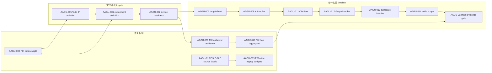

# WORKPLAN — 全局任务图、依赖图与状态投影

> Last updated: 2026-08-26
>
> 本文件只拥有编排事实：做什么、优先级、依赖关系、当前唯一执行线和下一步。研究定义、实验解释、结果与论文正文只链接到各自 owner。

Current node: AAGU-006

Next step: 在独立执行任务中用 `block-workflow` claim `AAGU-006`，统一 dataset/split 权威入口并完成本地合同验证；不启动正式 GPU 实验。

---

## 0. 一句话现状

当前唯一执行线是 `AAGU-006 · FIX · 目标实验 Dataset/Split 权威修复`；IF 科学定义、实验定义、设备 gate 与后续实验都沿依赖图等待，不从旧实验编号或历史结果反推状态。

## 1. WorkItem 状态投影

下面区域由 [`scripts/dashboard/refresh.py`](../../scripts/dashboard/refresh.py) 从 `.workblock/items/*/WORKITEM.md` 重建。不要手改状态。

<!-- WORKITEM_STATUS:BEGIN -->
<!-- Generated by scripts/dashboard/refresh.py; lifecycle status comes from WORKITEM.md. -->
| ID | 类型 | 状态投影 | 优先级 | 前置 | 唯一事实 owner |
|---|---|---|---|---|---|
| [AAGU-006](../../.workblock/items/AAGU-006/WORKITEM.md) | FIX | registered / not claimed / current | P0 | — | [实验数据与正式运行合同](../../experiments/AGENTS.md) |
| [AAGU-004](../../.workblock/items/AAGU-004/WORKITEM.md) | SUPPORT | awaiting acceptance | P1 | — | [AAGU-004 Block contract](../../.workblock/items/AAGU-004/WORKITEM.md) |
| [AAGU-019](../../.workblock/items/AAGU-019/WORKITEM.md) | FIX | blocked by AAGU-018 | P0 | AAGU-018 | [AAGU-019 Block contract](../../.workblock/items/AAGU-019/WORKITEM.md) |
| [AAGU-015](../../.workblock/items/AAGU-015/WORKITEM.md) | EXP | blocked by AAGU-006 | P0 | AAGU-006 | [IF 目标层级实验计划](../../../../OpenGU-DocMap/10_实验矩阵/20_IF目标层级对比实验计划.md) |
| [AAGU-001](../../.workblock/items/AAGU-001/WORKITEM.md) | GATE | blocked by AAGU-006, AAGU-015 | P0 | AAGU-006, AAGU-015 | [实验框架总览](../../../../OpenGU-DocMap/10_实验矩阵/10_实验-框架总览.md) |
| [AAGU-002](../../.workblock/items/AAGU-002/WORKITEM.md) | GATE | blocked by AAGU-001 | P0 | AAGU-001 | [AAGU-002 Block contract](../../.workblock/items/AAGU-002/WORKITEM.md) |
| [AAGU-007](../../.workblock/items/AAGU-007/WORKITEM.md) | EXP | blocked by AAGU-002 | P0 | AAGU-002 | [实验框架总览](../../../../OpenGU-DocMap/10_实验矩阵/10_实验-框架总览.md) |
| [AAGU-009](../../.workblock/items/AAGU-009/WORKITEM.md) | FIX | blocked by AAGU-002 | P1 | AAGU-002 | [重跑与缓存修复 Runbook](../../../../OpenGU-DocMap/10_实验矩阵/13_重跑与缓存修复Runbook.md) |
| [AAGU-010](../../.workblock/items/AAGU-010/WORKITEM.md) | FIX | blocked by AAGU-009 | P1 | AAGU-009 | [重跑与缓存修复 Runbook](../../../../OpenGU-DocMap/10_实验矩阵/13_重跑与缓存修复Runbook.md) |
| [AAGU-008](../../.workblock/items/AAGU-008/WORKITEM.md) | EXP | blocked by AAGU-007 | P1 | AAGU-007 | [实验框架总览](../../../../OpenGU-DocMap/10_实验矩阵/10_实验-框架总览.md) |
| [AAGU-011](../../.workblock/items/AAGU-011/WORKITEM.md) | EXP | blocked by AAGU-008 | P1 | AAGU-008 | [实验框架总览](../../../../OpenGU-DocMap/10_实验矩阵/10_实验-框架总览.md) |
| [AAGU-012](../../.workblock/items/AAGU-012/WORKITEM.md) | EXP | blocked by AAGU-011 | P1 | AAGU-011 | [重跑与缓存修复 Runbook](../../../../OpenGU-DocMap/10_实验矩阵/13_重跑与缓存修复Runbook.md) |
| [AAGU-013](../../.workblock/items/AAGU-013/WORKITEM.md) | EXP | blocked by AAGU-012 | P2 | AAGU-012 | [代理选集迁移实验计划](../../../../OpenGU-DocMap/10_实验矩阵/24_E7代理选集迁移实验计划.md) |
| [AAGU-014](../../.workblock/items/AAGU-014/WORKITEM.md) | EXP | blocked by AAGU-013 | P2 | AAGU-013 | [实验框架总览](../../../../OpenGU-DocMap/10_实验矩阵/10_实验-框架总览.md) |
| [AAGU-003](../../.workblock/items/AAGU-003/WORKITEM.md) | GATE | blocked by AAGU-014, AAGU-010 | P2 | AAGU-014, AAGU-010 | [AAGU-003 Block contract](../../.workblock/items/AAGU-003/WORKITEM.md) |
| [AAGU-005](../../.workblock/items/AAGU-005/WORKITEM.md) | SUPPORT | blocked by AAGU-001 | P3 | AAGU-001 | [AAGU-005 Block contract](../../.workblock/items/AAGU-005/WORKITEM.md) |
| [AAGU-018](../../.workblock/items/AAGU-018/WORKITEM.md) | FIX | awaiting human acceptance / rework candidate verified | P0 | — | [AAGU-018 Block contract](../../.workblock/items/AAGU-018/WORKITEM.md) |
| [AAGU-016](../../.workblock/items/AAGU-016/WORKITEM.md) | TODO | todo candidate / ready to promote | P2 | — | [评审与 rebuttal](../../../../OpenGU-DocMap/30_评审与汇报/31_评审意见与rebuttal.md) |
| [AAGU-017](../../.workblock/items/AAGU-017/WORKITEM.md) | TODO | todo candidate / ready to promote | P2 | — | [实验框架总览](../../../../OpenGU-DocMap/10_实验矩阵/10_实验-框架总览.md) |
<!-- WORKITEM_STATUS:END -->

## 2. 事实所有权

| 事实 | 唯一 owner | WORKPLAN 的角色 |
|---|---|---|
| 任务、优先级、依赖、当前线、下一步 | 本文件 | 权威编排 |
| Todo / Block 生命周期 | [`.workblock/items/*/WORKITEM.md`](../../.workblock/items) | 只做生成投影 |
| 科学问题、selector/metrics 论证、矩阵解释 | [OpenGU DocMap](../../../../OpenGU-DocMap/_文档地图.md) | 每个节点只链接 owner |
| 最终可执行配置 | [`experiments/configs/`](../../experiments/configs) | 不复制 YAML 参数 |
| 正式运行与证据接纳 | [`results/`](../../results) 与 Block evidence/report | 不复制结果或结论 |
| 历史修复与旧状态 | Git、验收记录、[冻结实验看板](EXPERIMENT_DASHBOARD.md) | 不进入活动队列 |

## 3. 当前唯一线与注意项

- **Current**：`AAGU-006`。先修复 dataset/split 权威入口，再允许 IF Todo Promote 和实验定义 gate 前进。
- **Attention ordering**：任何 awaiting-acceptance 或 blocked 节点都由生成投影置顶；本段不手工复制具体生命周期状态。
- **Registration is not claim**：本轮只注册显著 Todo/Block 并建立投影，没有领取、运行或接受任何实验。
- **IF boundary**：`AAGU-015` 只保留科学定义 Todo；selector 选择与实验结论必须在后续任务中和用户共同决定。

## 4. 依赖图

实线表示编排前置；实验 timeline 的相邻边同时固定逐项推进顺序，不表示前一实验结论在科学上证明后一实验。



## 5. 修复队列

关闭的 `FIX` 会从活动投影和 HTML 修复列隐藏；历史仍保留在 WorkItem、验收记录和 Git。

| ID | 类型 | 节点 | 优先级 | 前置 | Owner |
|---|---|---|---|---|---|
| AAGU-006 | FIX | 目标实验 Dataset/Split 权威修复 | P0 | — | [实验数据与正式运行合同](../../experiments/AGENTS.md) |
| AAGU-018 | FIX | D-GIF affected-source 标签越界修复 | P0 | — | [AAGU-018 Block contract](../../.workblock/items/AAGU-018/WORKITEM.md) |
| AAGU-019 | FIX | 硬退役旧小预算实验 setup | P0 | AAGU-018 | [AAGU-019 Block contract](../../.workblock/items/AAGU-019/WORKITEM.md) |
| AAGU-009 | FIX | L8 collateral evidence 修复 | P1 | AAGU-002 | [重跑与缓存修复 Runbook](../../../../OpenGU-DocMap/10_实验矩阵/13_重跑与缓存修复Runbook.md) |
| AAGU-010 | FIX | hop aggregate fields 修复 | P1 | AAGU-009 | [重跑与缓存修复 Runbook](../../../../OpenGU-DocMap/10_实验矩阵/13_重跑与缓存修复Runbook.md) |

## 6. 实验 timeline

每个 `EXP` 都是独立 Block。只有前一节点关闭且真实依赖满足后，下一节点才进入可领取状态；正式 GPU 仍需执行时授权。

| ID | 类型 | 节点 | 优先级 | 前置 | Owner |
|---|---|---|---|---|---|
| AAGU-015 | EXP | IF 科学定义与 selector 决策（Todo candidate） | P0 | AAGU-006 | [IF 目标层级实验计划](../../../../OpenGU-DocMap/10_实验矩阵/20_IF目标层级对比实验计划.md) |
| AAGU-001 | GATE | 实验定义与注册 gate | P0 | AAGU-006, AAGU-015 | [实验框架总览](../../../../OpenGU-DocMap/10_实验矩阵/10_实验-框架总览.md) |
| AAGU-002 | GATE | Device Readiness gate | P0 | AAGU-001 | [AAGU-002 Block contract](../../.workblock/items/AAGU-002/WORKITEM.md) |
| AAGU-007 | EXP | Target-Direct GU gate | P0 | AAGU-002 | [实验框架总览](../../../../OpenGU-DocMap/10_实验矩阵/10_实验-框架总览.md) |
| AAGU-008 | EXP | K5 noise anchor | P1 | AAGU-007 | [实验框架总览](../../../../OpenGU-DocMap/10_实验矩阵/10_实验-框架总览.md) |
| AAGU-011 | EXP | CiteSeer scope replacement | P1 | AAGU-008 | [实验框架总览](../../../../OpenGU-DocMap/10_实验矩阵/10_实验-框架总览.md) |
| AAGU-012 | EXP | GraphRevoker replacement | P1 | AAGU-011 | [重跑与缓存修复 Runbook](../../../../OpenGU-DocMap/10_实验矩阵/13_重跑与缓存修复Runbook.md) |
| AAGU-013 | EXP | Surrogate transfer | P2 | AAGU-012 | [代理选集迁移实验计划](../../../../OpenGU-DocMap/10_实验矩阵/24_E7代理选集迁移实验计划.md) |
| AAGU-014 | EXP | arXiv scope expansion | P2 | AAGU-013 | [实验框架总览](../../../../OpenGU-DocMap/10_实验矩阵/10_实验-框架总览.md) |
| AAGU-003 | GATE | Formal GPU evidence acceptance | P2 | AAGU-014, AAGU-010 | [AAGU-003 Block contract](../../.workblock/items/AAGU-003/WORKITEM.md) |

## 7. 写作

写作保留一个有编号的顶层 Todo；后续只把 ready 的子 Todo Promote 成独立 Block。

| ID | 类型 | 节点 | 优先级 | 前置 | Owner |
|---|---|---|---|---|---|
| AAGU-016 | TODO | Writing workstream umbrella | P2 | — | [评审与 rebuttal](../../../../OpenGU-DocMap/30_评审与汇报/31_评审意见与rebuttal.md) |

## 8. 画图

画图保留一个有编号的顶层 Todo；不注册成一个庞大 Block。

| ID | 类型 | 节点 | 优先级 | 前置 | Owner |
|---|---|---|---|---|---|
| AAGU-017 | TODO | Figure workstream umbrella | P2 | — | [实验框架总览](../../../../OpenGU-DocMap/10_实验矩阵/10_实验-框架总览.md) |

## 9. 支撑与决策队列

这些 Block 属于项目全局视图，但不并入实验 timeline。

| ID | 类型 | 节点 | 优先级 | 前置 | Owner |
|---|---|---|---|---|---|
| AAGU-004 | SUPPORT | FlowChunk D0 acceptance decision | P1 | — | [AAGU-004 Block contract](../../.workblock/items/AAGU-004/WORKITEM.md) |
| AAGU-005 | SUPPORT | SyncMate productization decision | P3 | AAGU-001 | [AAGU-005 Block contract](../../.workblock/items/AAGU-005/WORKITEM.md) |

## 10. 漂移检测与重建

```powershell
python -B -X utf8 scripts/dashboard/refresh.py
python -B -X utf8 scripts/dashboard/refresh.py --check
python -B -X utf8 -m unittest tests.test_dashboard_refresh -v
```

验证会拒绝：失效链接、重复节点映射、未映射 WorkItem、已关闭 Block 仍占当前线、当前线存在未完成前置，以及依赖已关闭但 Todo Record 仍停在 blocked。

## 11. 历史入口

- 旧任务编号、研究事实、实验结果与论文叙述不再保存在活动 WORKPLAN；需要追溯时查 Git 和对应 owner。
- 历史覆盖与缺陷档案只读：[EXPERIMENT_DASHBOARD.md](EXPERIMENT_DASHBOARD.md)。
- 可视化看板是派生物：[progress.html](progress.html)。
