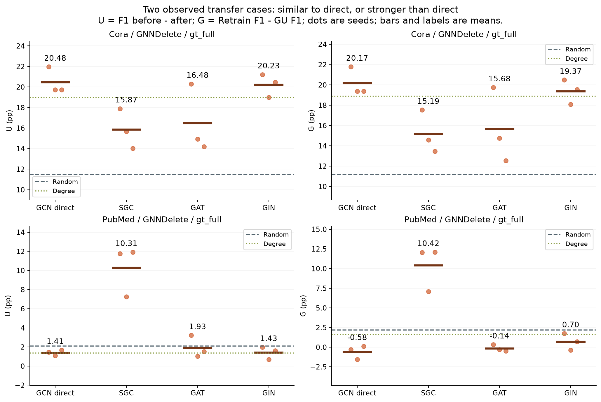
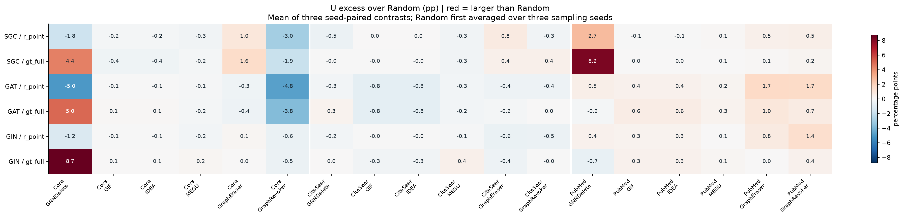
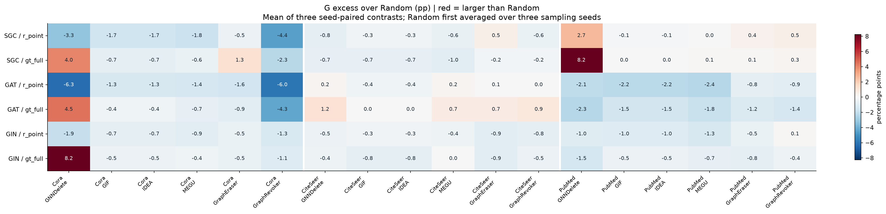
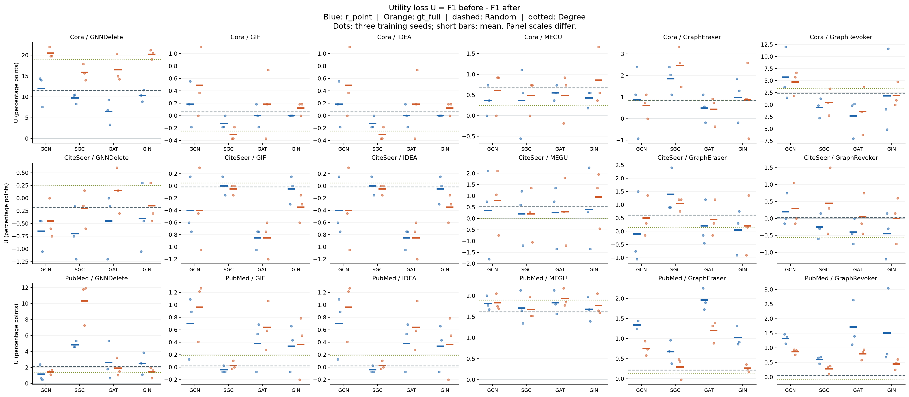
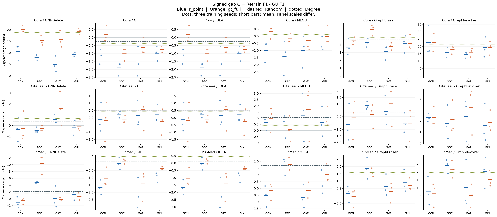
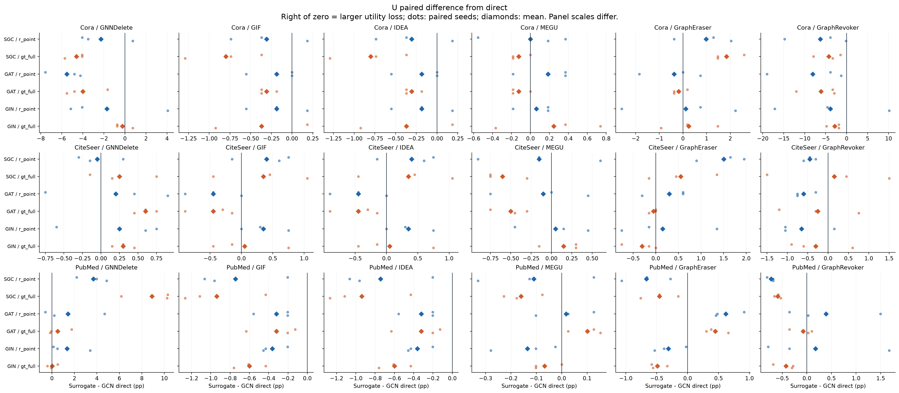
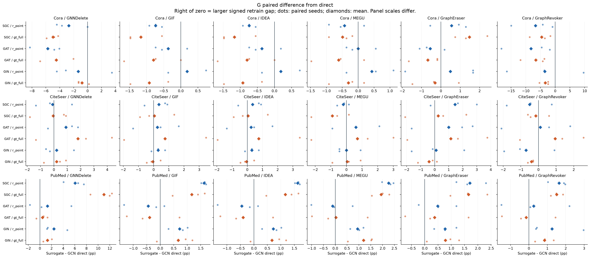
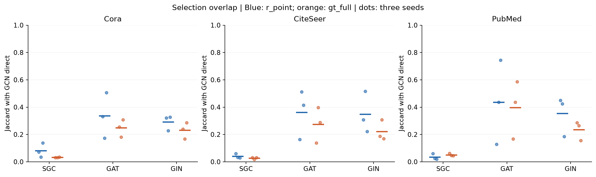

# EXP-013 · Surrogate → GCN：哪些攻击效果能迁移？

后续主分析已按用户确认的三个层次展开：[选点一致性、F1效果相关性与效果接近程度](post_REPORT.html)。本页保留原幅度与retrain-gap分析作为补充；不要只用攻击大小判断迁移。

这轮结果支持**特定数据集、方法和选点算法上的迁移**，不支持“任意代理模型都能复现白盒效果”。最清晰的现象来自 GNNDelete + gt_full：Cora 的 GIN 代理接近 direct，PubMed 的 SGC 代理明显超过 direct。完整结果同时包含弱效果、负增益和 utility / retrain-gap 分离的组合。

## 先看这张图

这张图是观察结果后选取的示例，不能代表全部组合。下文给出全部 108 个 surrogate 分组及 direct / Random / Degree 对照。每个点为一个训练 seed，每条短线及数字为三个 seed 的均值；Random 先对同一训练 seed 的三个抽样 seed 求均值。

## 关键观察

1. **Cora / GNNDelete / gt_full / GIN：接近 direct 的正例。** U 为 20.23 pp，GCN direct 为 20.48 pp；配对差为 -0.25 pp。G 为 19.37 pp，相比 direct 差 -0.80 pp。相对 Random 的 U/G 增量分别为 +8.73/+8.18 pp，三个 seed 均高于各自 Random 均值。这是描述性的“接近”，不是统计等效结论。
2. **PubMed / GNNDelete / gt_full / SGC：surrogate 超过 direct。** U/G 为 10.31/10.42 pp，相对 direct 为 +8.90/+11.00 pp，相对 Random 为 +8.21/+8.24 pp。三个配对 seed 的两项增量均为正。direct 在这里并不是攻击强度上界，也不适合作为“迁移百分比”的分母。
3. **迁移不是普遍成立。** 108 个 dataset × GU × surrogate × selector 分组中，U 均值高于 Random 的有 53 个，G 有 27 个。这只是正负号计数，不是成功率、显著性检验或独立重复；GIF/IDEA 的本轮 F1 结果相同，不能把它们算作两份独立支持证据。Cora / GNNDelete / GAT / r_point 的 U 相对 Random 为 -5.04 pp，构成直接反例。
4. **utility 迁移与 GU-gap 迁移需要分开。** PubMed / GraphEraser / GAT / r_point 的 U 相对 Random 为 +1.74 pp，但 G 为 -0.83 pp：更大的总损失不等于更大的近似遗忘偏差。

下表单位均为百分点（pp），全部是三个训练 seed 的均值。`vs_direct` 为同 selector 的配对差；`vs_random` 为同数据集、方法、训练 seed 下相对 Random 均值的差。

| dataset | method | source | selector | U_mean | G_mean | U_vs_direct_mean | G_vs_direct_mean | U_vs_random_mean | G_vs_random_mean |
| --- | --- | --- | --- | --- | --- | --- | --- | --- | --- |
| Cora | GNNDelete | GAT | r_point | 6.46 | 4.92 | -5.54 | -5.72 | -5.04 | -6.27 |
| Cora | GNNDelete | GIN | gt_full | 20.23 | 19.37 | -0.25 | -0.80 | 8.73 | 8.18 |
| PubMed | GNNDelete | SGC | gt_full | 10.31 | 10.42 | 8.90 | 11.00 | 8.21 | 8.24 |
| PubMed | GraphEraser | GAT | r_point | 1.96 | 0.66 | 0.62 | 0.49 | 1.74 | -0.83 |

**Degree 是更强的必要参照。** Cora / GNNDelete 的 Degree 均值 U/G 为 19.00/18.88 pp，因此 GIN + gt_full 相比它仅高约 1.23/0.49 pp；相对 Random 的大增量不能用来声称显著优于拓扑基线。PubMed 的 Degree U/G 为 1.36/1.63 pp，SGC + gt_full 的对应增量约为 8.95/8.79 pp。这里同样只报告观察差异，不作显著性声明。

## 全部组合相对 Random 的变化

红色表示比 Random 更大的损失或 signed gap，蓝色表示更小。两图颜色范围各自标定，比较时应读数值；这里不把微小正数标为显著效果。

## 原始效果与 direct 配对差

U = 100 × (F1_before − F1_after)，越大表示总性能下降越多，负数表示性能提高。

G = 100 × (F1_Retrain − F1_GU)，保持符号；正数表示 GU 差于同请求 Retrain，负数表示 GU 优于它。本报告的 G 与原始 `gap` 同号，**不能与 EXP-011 报告中采用相反方向的 GU − Retrain 列直接混用**。

上述图的蓝色为 r_point、橙色为 gt_full，虚线为 Random 均值、点线为 Degree 均值。各面板纵轴独立，不能以视觉高度跨面板排名。Random/Degree 的逐 seed 数值在 baselines.csv。

配对图横轴为 surrogate − GCN direct，零线右侧表示该指标更大。圆点为三个同 seed 配对差，菱形为均值；各面板横轴独立。未设等效容差，不作“等效”“100%迁移”或 p 值声明。

## 选集是否相似？

Jaccard 只解释选集重叠，不代表效果。在 PubMed / gt_full 中，SGC 与 GCN direct 的平均 Jaccard 仅 0.051，却产生上述更强的 GNNDelete U/G。低重叠与强效果在本例中并存；这不是关于重叠与效果因果关系的证明。每个选集跨 GU 复用，重叠统计按 dataset × seed × source × selector 去重，不重复计六次。

## 范围、核验与解释边界

- 范围：Cora、CiteSeer、PubMed；训练 seeds 42/212/2024；删除训练候选节点的 10%；GCN/SGC/GAT/GIN × r_point/gt_full，外加 Degree 和三个独立 Random 抽样；六种 GU + 同请求 Retrain。合计 756 个单元，其中 648 个 GU 单元、108 个 Retrain。
- Victim 固定为 GCN backbone；GraphEraser/GraphRevoker 是分片集成，其全图 Retrain 参照与单模型 GU 的解释边界不同，不称其为 ensemble-direct。
- 本实验为共享图、训练划分及 validation labels 假设下的灰盒、无 victim 查询迁移；不能推广到完全黑盒、其他 victim 架构、其他预算或不同 split。
- 1513 个文件逐一匹配可信回传 manifest 的 SHA-256，原始 read_run 消费器通过；648 个 GU 的同请求 Retrain 身份、选集、seed、split 和数值关系均核对。未排除任何已完成单元。
- 原始 Retrain 没有 f1_before，所以不虚构 Retrain 自身的 U；它在本报告中作为各 GU 的配对 G 参照，完整 after 数值见 cells.csv。
- 样本量为三个训练 seed，不把 Random 抽样、六种 GU、两个算法或同一选集重复当作独立样本。统计量均为描述性；summary.csv 提供均值、样本标准差、最小/最大值。
- 执行成功、回传 verified、项目产物 accepted 均已确认；**科学结论仍待用户评议**。

## 对论文问题的回答

可支持的表述是：在固定 GCN victim 和本轮共享数据假设下，部分 surrogate 选集能够产生与 direct 接近或更强的损失及 signed retrain-gap，且现象依赖 dataset、GU 和 selector；GNNDelete/gt_full 是本轮最明确的展示案例。不能据此写成所有 GU、所有 surrogate 都稳定迁移。

建议放在“跨架构迁移”结果小节：主图候选为 focus_gt_full，紧随 random_U/random_G 的全范围检查；四张完整分面图、重叠图和全表保留在附录。示例是事后选择，正文应同时交代反例。后续若要主张等效或泛化，需要在新结果出现前明确容差与额外重复范围；本分析不启动新实验。

## 可复用数据与复现

- [逐单元数据 cells.csv](cells.csv)：全部 756 个单元、来源及原始效果。
- [配对 seed 数据 paired_seed_values.csv](paired_seed_values.csv)：432 个 source × GU × seed × selector 观测及 direct/Random 差值。
- [完整统计 summary.csv](summary.csv)：144 个含 direct 的分组及均值、标准差和范围。
- [简单基线 baselines.csv](baselines.csv)、[选集重叠 selection_overlap.csv](selection_overlap.csv)、[身份核验 audit.json](audit.json)。
- 每张图同时生成 PNG 和可编辑矢量 SVG；报告 HTML 内嵌 PNG，可以独立打开。
- 生成器：[analyze_surrogate.py](analyze_surrogate.py)。在仓库根运行 `python -X utf8 self/research/analyses/EXP-013/analyze_surrogate.py`，依赖现有 matplotlib/numpy/pandas/markdown-it-py，不运行模型或读取远端 Cache。
- 原始执行 SHA：`62926d95b843af137076eb9dd0a15e1c54c75663`；job：`exp013-full-20260930-r1`；run：`r1`。
- run.json 的可信 SHA-256：`70588d5793760e44ae268dfe55b3648e0638b71fde3a4db0eee998dc51760a49`。
- 恢复证据：`.syncmate/recovery-exp013-full-20260930-r1/summary.json`；输入：`results/runs/gpu4090/exp013-surrogate-to-gcn/r1/`。这些运行文件保持原样。

矢量图下载：[重点案例](focus_gt_full.svg) · [Random U](random_U.svg) · [Random G](random_G.svg) · [原始 U](raw_U.svg) · [原始 G](raw_G.svg) · [配对 U](paired_U.svg) · [配对 G](paired_G.svg) · [选集重叠](selection_overlap.svg)。

## 完整分组表

下表包含 GCN direct 和全部 surrogate，没有按结果好坏删行。精度更高的数值、标准差和逐 seed 记录见 CSV。

| dataset | method | source | selector | U_mean | G_mean | U_vs_direct_mean | G_vs_direct_mean | U_vs_random_mean | G_vs_random_mean |
| --- | --- | --- | --- | --- | --- | --- | --- | --- | --- |
| CiteSeer | GIF | GAT | gt_full | -0.85 | 0.55 | -0.45 | 0.75 | -0.83 | 0.03 |
| CiteSeer | GIF | GAT | r_point | -0.85 | 0.15 | -0.45 | 0.25 | -0.83 | -0.37 |
| CiteSeer | GIF | GCN | gt_full | -0.40 | -0.20 | 0.00 | 0.00 | -0.38 | -0.72 |
| CiteSeer | GIF | GCN | r_point | -0.40 | -0.10 | 0.00 | 0.00 | -0.38 | -0.62 |
| CiteSeer | GIF | GIN | gt_full | -0.35 | -0.25 | 0.05 | -0.05 | -0.33 | -0.77 |
| CiteSeer | GIF | GIN | r_point | -0.05 | 0.20 | 0.35 | 0.30 | -0.03 | -0.32 |
| CiteSeer | GIF | SGC | gt_full | -0.05 | -0.15 | 0.35 | 0.05 | -0.03 | -0.67 |
| CiteSeer | GIF | SGC | r_point | 0.00 | 0.25 | 0.40 | 0.35 | 0.02 | -0.27 |
| CiteSeer | GNNDelete | GAT | gt_full | 0.15 | 1.55 | 0.60 | 1.80 | 0.33 | 1.20 |
| CiteSeer | GNNDelete | GAT | r_point | -0.45 | 0.55 | 0.20 | 0.90 | -0.27 | 0.20 |
| CiteSeer | GNNDelete | GCN | gt_full | -0.45 | -0.25 | 0.00 | 0.00 | -0.27 | -0.60 |
| CiteSeer | GNNDelete | GCN | r_point | -0.65 | -0.35 | 0.00 | 0.00 | -0.47 | -0.70 |
| CiteSeer | GNNDelete | GIN | gt_full | -0.15 | -0.05 | 0.30 | 0.20 | 0.03 | -0.40 |
| CiteSeer | GNNDelete | GIN | r_point | -0.40 | -0.15 | 0.25 | 0.20 | -0.22 | -0.50 |
| CiteSeer | GNNDelete | SGC | gt_full | -0.20 | -0.30 | 0.25 | -0.05 | -0.02 | -0.65 |
| CiteSeer | GNNDelete | SGC | r_point | -0.70 | -0.45 | -0.05 | -0.10 | -0.52 | -0.80 |
| CiteSeer | GraphEraser | GAT | gt_full | 0.45 | 1.05 | -0.05 | 1.15 | -0.17 | 0.70 |
| CiteSeer | GraphEraser | GAT | r_point | 0.20 | 0.40 | 0.30 | 1.00 | -0.42 | 0.05 |
| CiteSeer | GraphEraser | GCN | gt_full | 0.50 | -0.10 | 0.00 | 0.00 | -0.12 | -0.45 |
| CiteSeer | GraphEraser | GCN | r_point | -0.10 | -0.60 | 0.00 | 0.00 | -0.72 | -0.95 |
| CiteSeer | GraphEraser | GIN | gt_full | 0.20 | -0.50 | -0.30 | -0.40 | -0.42 | -0.85 |
| CiteSeer | GraphEraser | GIN | r_point | 0.05 | -0.50 | 0.15 | 0.10 | -0.57 | -0.85 |
| CiteSeer | GraphEraser | SGC | gt_full | 1.05 | 0.15 | 0.55 | 0.25 | 0.43 | -0.20 |
| CiteSeer | GraphEraser | SGC | r_point | 1.40 | 0.85 | 1.50 | 1.45 | 0.78 | 0.50 |
| CiteSeer | GraphRevoker | GAT | gt_full | 0.05 | 3.25 | -0.25 | 0.95 | 0.02 | 0.88 |
| CiteSeer | GraphRevoker | GAT | r_point | -0.40 | 2.40 | -0.60 | 0.10 | -0.43 | 0.03 |
| CiteSeer | GraphRevoker | GCN | gt_full | 0.30 | 2.30 | 0.00 | 0.00 | 0.27 | -0.07 |
| CiteSeer | GraphRevoker | GCN | r_point | 0.20 | 2.30 | 0.00 | 0.00 | 0.17 | -0.07 |
| CiteSeer | GraphRevoker | GIN | gt_full | 0.00 | 1.90 | -0.30 | -0.40 | -0.03 | -0.47 |
| CiteSeer | GraphRevoker | GIN | r_point | -0.45 | 1.60 | -0.65 | -0.70 | -0.48 | -0.77 |
| CiteSeer | GraphRevoker | SGC | gt_full | 0.45 | 2.15 | 0.15 | -0.15 | 0.42 | -0.22 |
| CiteSeer | GraphRevoker | SGC | r_point | -0.25 | 1.80 | -0.45 | -0.50 | -0.28 | -0.57 |
| CiteSeer | IDEA | GAT | gt_full | -0.85 | 0.55 | -0.45 | 0.75 | -0.83 | 0.03 |
| CiteSeer | IDEA | GAT | r_point | -0.85 | 0.15 | -0.45 | 0.25 | -0.83 | -0.37 |
| CiteSeer | IDEA | GCN | gt_full | -0.40 | -0.20 | 0.00 | 0.00 | -0.38 | -0.72 |
| CiteSeer | IDEA | GCN | r_point | -0.40 | -0.10 | 0.00 | 0.00 | -0.38 | -0.62 |
| CiteSeer | IDEA | GIN | gt_full | -0.35 | -0.25 | 0.05 | -0.05 | -0.33 | -0.77 |
| CiteSeer | IDEA | GIN | r_point | -0.05 | 0.20 | 0.35 | 0.30 | -0.03 | -0.32 |
| CiteSeer | IDEA | SGC | gt_full | -0.05 | -0.15 | 0.35 | 0.05 | -0.03 | -0.67 |
| CiteSeer | IDEA | SGC | r_point | 0.00 | 0.25 | 0.40 | 0.35 | 0.02 | -0.27 |
| CiteSeer | MEGU | GAT | gt_full | 0.30 | 1.70 | -0.50 | 0.70 | -0.22 | 0.65 |
| CiteSeer | MEGU | GAT | r_point | 0.25 | 1.25 | -0.10 | 0.60 | -0.27 | 0.20 |
| CiteSeer | MEGU | GCN | gt_full | 0.80 | 1.00 | 0.00 | 0.00 | 0.28 | -0.05 |
| CiteSeer | MEGU | GCN | r_point | 0.35 | 0.65 | 0.00 | 0.00 | -0.17 | -0.40 |
| CiteSeer | MEGU | GIN | gt_full | 0.95 | 1.05 | 0.15 | 0.05 | 0.43 | 0.00 |
| CiteSeer | MEGU | GIN | r_point | 0.40 | 0.65 | 0.05 | -0.00 | -0.12 | -0.40 |
| CiteSeer | MEGU | SGC | gt_full | 0.20 | 0.10 | -0.60 | -0.90 | -0.32 | -0.95 |
| CiteSeer | MEGU | SGC | r_point | 0.20 | 0.45 | -0.15 | -0.20 | -0.32 | -0.60 |
| Cora | GIF | GAT | gt_full | 0.18 | -0.62 | -0.31 | -0.80 | 0.12 | -0.37 |
| Cora | GIF | GAT | r_point | 0.00 | -1.54 | -0.18 | -0.37 | -0.06 | -1.29 |
| Cora | GIF | GCN | gt_full | 0.49 | 0.18 | 0.00 | 0.00 | 0.43 | 0.43 |
| Cora | GIF | GCN | r_point | 0.18 | -1.17 | 0.00 | 0.00 | 0.12 | -0.92 |
| Cora | GIF | GIN | gt_full | 0.12 | -0.74 | -0.37 | -0.92 | 0.06 | -0.49 |
| Cora | GIF | GIN | r_point | 0.00 | -0.98 | -0.18 | 0.18 | -0.06 | -0.74 |
| Cora | GIF | SGC | gt_full | -0.31 | -0.98 | -0.80 | -1.17 | -0.37 | -0.74 |
| Cora | GIF | SGC | r_point | -0.12 | -1.91 | -0.31 | -0.74 | -0.18 | -1.66 |
| Cora | GNNDelete | GAT | gt_full | 16.48 | 15.68 | -4.00 | -4.49 | 4.98 | 4.49 |
| Cora | GNNDelete | GAT | r_point | 6.46 | 4.92 | -5.54 | -5.72 | -5.04 | -6.27 |
| Cora | GNNDelete | GCN | gt_full | 20.48 | 20.17 | 0.00 | 0.00 | 8.98 | 8.98 |
| Cora | GNNDelete | GCN | r_point | 11.99 | 10.64 | 0.00 | 0.00 | 0.49 | -0.55 |
| Cora | GNNDelete | GIN | gt_full | 20.23 | 19.37 | -0.25 | -0.80 | 8.73 | 8.18 |
| Cora | GNNDelete | GIN | r_point | 10.27 | 9.29 | -1.72 | -1.35 | -1.23 | -1.91 |
| Cora | GNNDelete | SGC | gt_full | 15.87 | 15.19 | -4.61 | -4.98 | 4.37 | 4.00 |
| Cora | GNNDelete | SGC | r_point | 9.72 | 7.93 | -2.28 | -2.71 | -1.78 | -3.26 |
| Cora | GraphEraser | GAT | gt_full | 0.43 | 3.81 | -0.18 | -0.68 | -0.41 | -0.90 |
| Cora | GraphEraser | GAT | r_point | 0.49 | 3.14 | -0.37 | -0.55 | -0.35 | -1.58 |
| Cora | GraphEraser | GCN | gt_full | 0.62 | 4.49 | 0.00 | 0.00 | -0.23 | -0.23 |
| Cora | GraphEraser | GCN | r_point | 0.86 | 3.69 | 0.00 | 0.00 | 0.02 | -1.03 |
| Cora | GraphEraser | GIN | gt_full | 0.86 | 4.18 | 0.25 | -0.31 | 0.02 | -0.53 |
| Cora | GraphEraser | GIN | r_point | 0.98 | 4.18 | 0.12 | 0.49 | 0.14 | -0.53 |
| Cora | GraphEraser | SGC | gt_full | 2.46 | 5.97 | 1.85 | 1.48 | 1.62 | 1.25 |
| Cora | GraphEraser | SGC | r_point | 1.85 | 4.24 | 0.98 | 0.55 | 1.00 | -0.47 |
| Cora | GraphRevoker | GAT | gt_full | -1.35 | 16.05 | -6.09 | -6.58 | -3.77 | -4.26 |
| Cora | GraphRevoker | GAT | r_point | -2.34 | 14.33 | -8.06 | -8.24 | -4.76 | -5.99 |
| Cora | GraphRevoker | GCN | gt_full | 4.74 | 22.63 | 0.00 | 0.00 | 2.32 | 2.32 |
| Cora | GraphRevoker | GCN | r_point | 5.72 | 22.57 | 0.00 | 0.00 | 3.30 | 2.26 |
| Cora | GraphRevoker | GIN | gt_full | 1.91 | 19.25 | -2.83 | -3.38 | -0.51 | -1.07 |
| Cora | GraphRevoker | GIN | r_point | 1.85 | 19.07 | -3.87 | -3.51 | -0.57 | -1.25 |
| Cora | GraphRevoker | SGC | gt_full | 0.49 | 18.02 | -4.24 | -4.61 | -1.93 | -2.30 |
| Cora | GraphRevoker | SGC | r_point | -0.55 | 15.87 | -6.27 | -6.70 | -2.97 | -4.45 |
| Cora | IDEA | GAT | gt_full | 0.18 | -0.62 | -0.31 | -0.80 | 0.12 | -0.37 |
| Cora | IDEA | GAT | r_point | 0.00 | -1.54 | -0.18 | -0.37 | -0.06 | -1.29 |
| Cora | IDEA | GCN | gt_full | 0.49 | 0.18 | 0.00 | 0.00 | 0.43 | 0.43 |
| Cora | IDEA | GCN | r_point | 0.18 | -1.17 | 0.00 | 0.00 | 0.12 | -0.92 |
| Cora | IDEA | GIN | gt_full | 0.12 | -0.74 | -0.37 | -0.92 | 0.06 | -0.49 |
| Cora | IDEA | GIN | r_point | 0.00 | -0.98 | -0.18 | 0.18 | -0.06 | -0.74 |
| Cora | IDEA | SGC | gt_full | -0.31 | -0.98 | -0.80 | -1.17 | -0.37 | -0.74 |
| Cora | IDEA | SGC | r_point | -0.12 | -1.91 | -0.31 | -0.74 | -0.18 | -1.66 |
| Cora | MEGU | GAT | gt_full | 0.49 | -0.31 | -0.12 | -0.62 | -0.18 | -0.68 |
| Cora | MEGU | GAT | r_point | 0.55 | -0.98 | 0.18 | 0.00 | -0.12 | -1.35 |
| Cora | MEGU | GCN | gt_full | 0.62 | 0.31 | 0.00 | 0.00 | -0.06 | -0.06 |
| Cora | MEGU | GCN | r_point | 0.37 | -0.98 | 0.00 | 0.00 | -0.31 | -1.35 |
| Cora | MEGU | GIN | gt_full | 0.86 | -0.00 | 0.25 | -0.31 | 0.18 | -0.37 |
| Cora | MEGU | GIN | r_point | 0.43 | -0.55 | 0.06 | 0.43 | -0.25 | -0.92 |
| Cora | MEGU | SGC | gt_full | 0.49 | -0.18 | -0.12 | -0.49 | -0.18 | -0.55 |
| Cora | MEGU | SGC | r_point | 0.37 | -1.41 | -0.00 | -0.43 | -0.31 | -1.78 |
| PubMed | GIF | GAT | gt_full | 0.64 | -1.43 | -0.32 | -0.40 | 0.62 | -1.52 |
| PubMed | GIF | GAT | r_point | 0.38 | -2.11 | -0.32 | -0.45 | 0.36 | -2.21 |
| PubMed | GIF | GCN | gt_full | 0.96 | -1.03 | 0.00 | 0.00 | 0.94 | -1.13 |
| PubMed | GIF | GCN | r_point | 0.70 | -1.66 | 0.00 | 0.00 | 0.68 | -1.76 |
| PubMed | GIF | GIN | gt_full | 0.36 | -0.36 | -0.60 | 0.67 | 0.34 | -0.46 |
| PubMed | GIF | GIN | r_point | 0.34 | -0.95 | -0.36 | 0.72 | 0.32 | -1.04 |
| PubMed | GIF | SGC | gt_full | 0.03 | 0.14 | -0.94 | 1.17 | 0.01 | 0.04 |
| PubMed | GIF | SGC | r_point | -0.04 | -0.04 | -0.74 | 1.62 | -0.06 | -0.14 |
| PubMed | GNNDelete | GAT | gt_full | 1.93 | -0.14 | 0.52 | 0.44 | -0.17 | -2.32 |
| PubMed | GNNDelete | GAT | r_point | 2.59 | 0.10 | 1.44 | 1.31 | 0.49 | -2.08 |
| PubMed | GNNDelete | GCN | gt_full | 1.41 | -0.58 | 0.00 | 0.00 | -0.69 | -2.76 |
| PubMed | GNNDelete | GCN | r_point | 1.16 | -1.21 | 0.00 | 0.00 | -0.94 | -3.39 |
| PubMed | GNNDelete | GIN | gt_full | 1.43 | 0.70 | 0.02 | 1.28 | -0.67 | -1.48 |
| PubMed | GNNDelete | GIN | r_point | 2.49 | 1.21 | 1.34 | 2.42 | 0.39 | -0.97 |
| PubMed | GNNDelete | SGC | gt_full | 10.31 | 10.42 | 8.90 | 11.00 | 8.21 | 8.24 |
| PubMed | GNNDelete | SGC | r_point | 4.84 | 4.84 | 3.68 | 6.05 | 2.74 | 2.67 |
| PubMed | GraphEraser | GAT | gt_full | 1.20 | 0.32 | 0.45 | 0.37 | 0.98 | -1.16 |
| PubMed | GraphEraser | GAT | r_point | 1.96 | 0.66 | 0.62 | 0.49 | 1.74 | -0.83 |
| PubMed | GraphEraser | GCN | gt_full | 0.75 | -0.05 | 0.00 | 0.00 | 0.54 | -1.54 |
| PubMed | GraphEraser | GCN | r_point | 1.34 | 0.17 | 0.00 | 0.00 | 1.13 | -1.32 |
| PubMed | GraphEraser | GIN | gt_full | 0.26 | 0.73 | -0.49 | 0.78 | 0.05 | -0.76 |
| PubMed | GraphEraser | GIN | r_point | 1.03 | 0.94 | -0.31 | 0.77 | 0.81 | -0.55 |
| PubMed | GraphEraser | SGC | gt_full | 0.30 | 1.60 | -0.46 | 1.65 | 0.08 | 0.11 |
| PubMed | GraphEraser | SGC | r_point | 0.68 | 1.87 | -0.67 | 1.70 | 0.46 | 0.38 |
| PubMed | GraphRevoker | GAT | gt_full | 0.79 | 0.52 | -0.08 | -0.15 | 0.73 | -1.41 |
| PubMed | GraphRevoker | GAT | r_point | 1.72 | 1.02 | 0.39 | 0.26 | 1.65 | -0.92 |
| PubMed | GraphRevoker | GCN | gt_full | 0.87 | 0.68 | 0.00 | 0.00 | 0.81 | -1.26 |
| PubMed | GraphRevoker | GCN | r_point | 1.33 | 0.76 | 0.00 | 0.00 | 1.26 | -1.18 |
| PubMed | GraphRevoker | GIN | gt_full | 0.45 | 1.52 | -0.42 | 0.85 | 0.39 | -0.42 |
| PubMed | GraphRevoker | GIN | r_point | 1.50 | 2.02 | 0.18 | 1.26 | 1.44 | 0.08 |
| PubMed | GraphRevoker | SGC | gt_full | 0.28 | 2.19 | -0.59 | 1.51 | 0.22 | 0.25 |
| PubMed | GraphRevoker | SGC | r_point | 0.60 | 2.40 | -0.73 | 1.64 | 0.54 | 0.46 |
| PubMed | IDEA | GAT | gt_full | 0.64 | -1.43 | -0.32 | -0.40 | 0.62 | -1.52 |
| PubMed | IDEA | GAT | r_point | 0.38 | -2.11 | -0.32 | -0.45 | 0.36 | -2.21 |
| PubMed | IDEA | GCN | gt_full | 0.96 | -1.03 | 0.00 | 0.00 | 0.94 | -1.13 |
| PubMed | IDEA | GCN | r_point | 0.70 | -1.66 | 0.00 | 0.00 | 0.68 | -1.76 |
| PubMed | IDEA | GIN | gt_full | 0.36 | -0.36 | -0.60 | 0.67 | 0.34 | -0.46 |
| PubMed | IDEA | GIN | r_point | 0.34 | -0.95 | -0.36 | 0.72 | 0.32 | -1.04 |
| PubMed | IDEA | SGC | gt_full | 0.03 | 0.14 | -0.94 | 1.17 | 0.01 | 0.04 |
| PubMed | IDEA | SGC | r_point | -0.04 | -0.04 | -0.74 | 1.62 | -0.06 | -0.14 |
| PubMed | MEGU | GAT | gt_full | 1.94 | -0.14 | 0.10 | 0.03 | 0.32 | -1.83 |
| PubMed | MEGU | GAT | r_point | 1.83 | -0.66 | 0.02 | -0.11 | 0.21 | -2.36 |
| PubMed | MEGU | GCN | gt_full | 1.83 | -0.16 | 0.00 | 0.00 | 0.21 | -1.86 |
| PubMed | MEGU | GCN | r_point | 1.82 | -0.55 | 0.00 | 0.00 | 0.20 | -2.25 |
| PubMed | MEGU | GIN | gt_full | 1.77 | 1.04 | -0.07 | 1.20 | 0.15 | -0.66 |
| PubMed | MEGU | GIN | r_point | 1.68 | 0.40 | -0.14 | 0.95 | 0.06 | -1.30 |
| PubMed | MEGU | SGC | gt_full | 1.67 | 1.78 | -0.16 | 1.94 | 0.05 | 0.09 |
| PubMed | MEGU | SGC | r_point | 1.71 | 1.71 | -0.11 | 2.26 | 0.09 | 0.01 |
