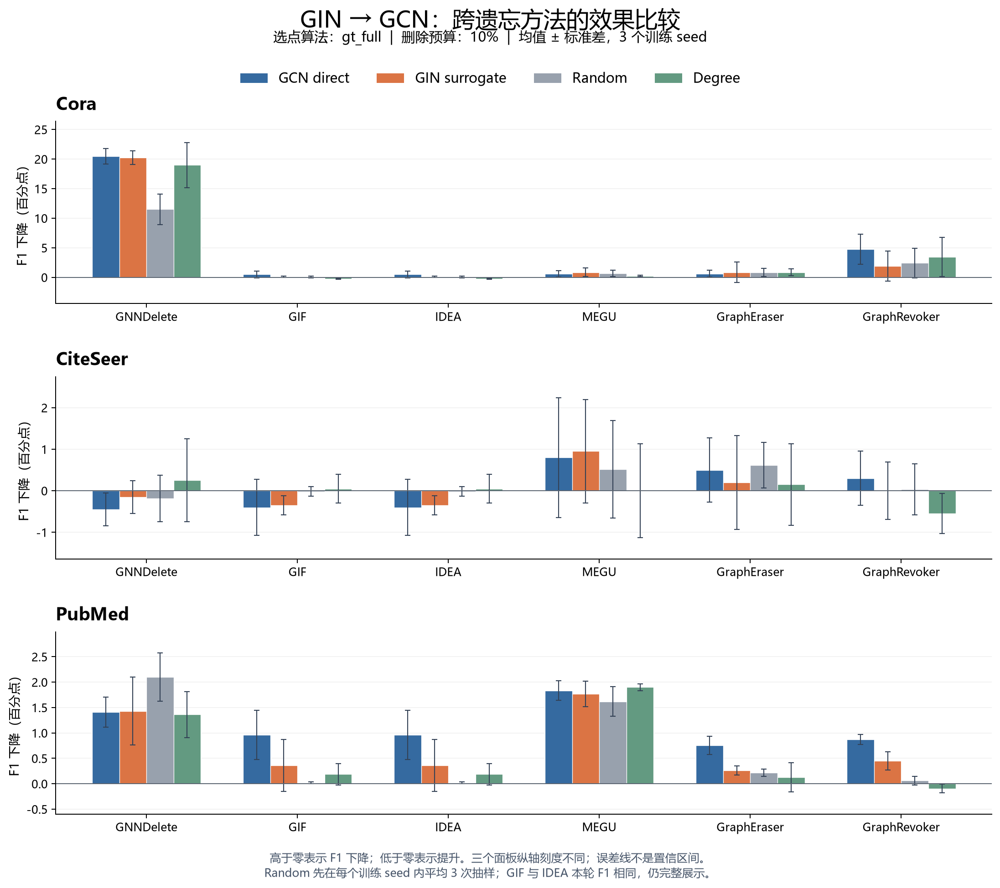
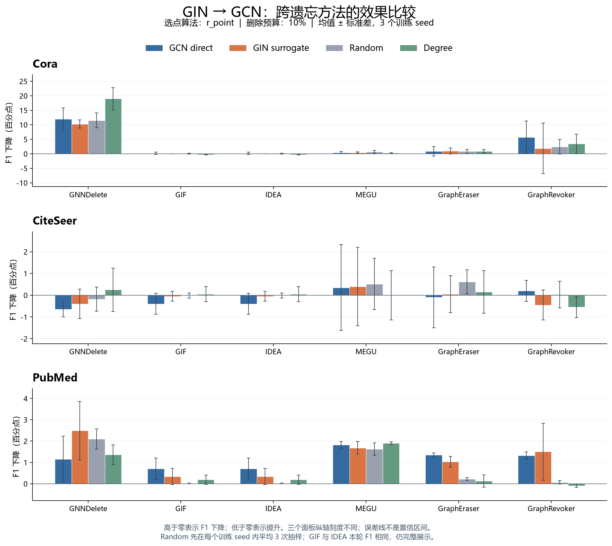

# GIN → GCN：多 GU 比较图与 Discussion 草稿

**当前结论：多个 GU 上出现平均响应接近，但强攻击保留、接近 direct、优于简单基线并不总是同时成立。** 正文围绕条件性迁移组织，保留完整三数据集×六方法结果。仅聚焦已讨论的 GIN；其他 surrogate 的证据仍在原报告中。

## 图 1：gt_full 的完整比较

[SVG](gin_to_gcn_methods_gt_full.svg) · [PDF](gin_to_gcn_methods_gt_full.pdf)

**读图：** 横轴为遗忘方法；蓝色是 GCN direct，橙色是 GIN surrogate，灰色是 Random，绿色是 Degree。比较同一方法内的柱高，不把 seed 作为横轴。纵轴为 F1_before − F1_after，单位百分点；正值为损伤、负值为提升。各数据集面板单独缩放，保留零点且没有截断柱形。

**图注草稿：** GIN→GCN 在固定 gt_full 选点算法和10%节点删除预算下的跨方法效用响应。所有柱值为三个训练 seed 的均值，误差线为样本标准差（ddof=1），不是置信区间。Random 在每个训练 seed 内先平均三次抽样，再跨训练 seed 计算均值与标准差；误差线仅表示该抽样均值的跨训练 seed 波动。GraphEraser/GraphRevoker 使用 GCN backbone 分片集成，图中 GCN direct 是 full-graph 选点参照，不声称它等于对整个集成的严格白盒选点。GIF/IDEA 的本轮 F1 相同，两列完整保留但不算两份独立证据。

## 证据与结论对照

| 问题 | 当前观察 | 支持范围 |
| --- | --- | --- |
| GIN 是否能保留较大损伤？ | Cora/GNNDelete/gt_full 中 GIN 接近 direct，并高于 Random | 具体配置正例；Degree 也强 |
| 是否仅一个 GU 有接近现象？ | MEGU 在三数据集上平均响应均接近 | 效应小且部分 seed 波动明显，不代表等效或强攻击 |
| 是否所有方法都能替代 direct？ | GraphRevoker/Cora 等条件有衰减；PubMed 的多方法下降较小 | 不支持普遍替代 |
| 接近 direct 是否一定优于基线？ | PubMed/GNNDelete 的 Random 高于 GIN 和 direct | 必须分别判断 |

## Discussion（中文草稿）

在固定 GCN 目标架构、10% 节点删除预算下，我们比较 GIN 代理选点与 GCN 直接选点在六种图遗忘方法上的效用响应。图中每个柱值为三个训练 seed 的平均 F1 下降，误差线为样本标准差。gt_full 下，GIN 在 Cora/GNNDelete 上造成 20.23 个百分点的下降，接近直接选点的 20.48，并高于 Random 的 11.50。这种接近并不限于单个 GU：在 MEGU 上，GCN 与 GIN 的平均下降分别为 Cora 的 0.62 与 0.86、CiteSeer 的 0.80 与 0.95、PubMed 的 1.83 与 1.77 个百分点。不过，这些 MEGU 结果的绝对变化较小，且 Cora、CiteSeer 的 seed 波动明显，因此它们体现的是平均效用响应相近，而不能单独作为强攻击或统计等效的证据。

迁移也表现出明确的条件依赖。Cora/GraphRevoker 的平均下降由 direct 的 4.74 减为 GIN 的 1.91 个百分点；在 PubMed，GIN 在 GIF、IDEA、GraphEraser 和 GraphRevoker 上的平均下降均小于 direct。与此同时，PubMed/GNNDelete 中 GIN 与 direct 分别为 1.43 与 1.41 个百分点，二者虽接近，却低于 Random 的 2.10。Cora/GNNDelete 的 Degree 也达到 19.00 个百分点。因此，效果接近 direct、攻击损伤较大、以及优于简单基线应分别判断。完整比较支持 GIN→GCN 在部分配置下的条件性效果迁移，不支持跨所有 GU 的普遍替代或一致的基线优势。r_point 的完整对照进一步显示这种关系依赖选点算法，例如 Cora/GNNDelete 的 GIN 平均下降为 10.27，低于 direct 的 11.99 和 Random 的 11.50 个百分点。

## Discussion（英文草稿）

We evaluate GIN-to-GCN transfer across six graph-unlearning methods at a fixed 10% node-deletion budget. Each bar reports the mean F1 drop over three training seeds, with error bars denoting sample standard deviations. Under gt_full, GIN-based selection retains the large loss observed for direct selection on Cora/GNNDelete (20.23 versus 20.48 percentage points), exceeding the Random baseline (11.50). Similar average responses also occur for MEGU across the three datasets: direct/GIN drops are 0.62/0.86 on Cora, 0.80/0.95 on CiteSeer, and 1.83/1.77 on PubMed. These MEGU effects are modest in absolute magnitude, and the variability on Cora and CiteSeer precludes interpreting proximity of the means as evidence of equivalence or strong attacks.

Transfer is nevertheless conditional on the unlearning method, dataset, and selection algorithm. On Cora/GraphRevoker, the mean drop decreases from 4.74 with direct selection to 1.91 with GIN selection. On PubMed, GIN yields smaller mean drops than direct selection for GIF, IDEA, GraphEraser, and GraphRevoker. Moreover, proximity to direct selection does not imply superiority to simple baselines: on PubMed/GNNDelete, the GIN and direct drops (1.43 and 1.41) are both below Random (2.10), while Degree already produces a large drop on Cora/GNNDelete (19.00). The r_point comparison also changes the picture: on Cora/GNNDelete, GIN yields 10.27 points versus 11.99 for direct selection and 11.50 for Random. These results support conditional transfer of the utility response rather than universal replacement of direct selection or consistent superiority over simple baselines.

## 图 2：r_point 的同口径完整对照

[SVG](gin_to_gcn_methods_r_point.svg) · [PDF](gin_to_gcn_methods_r_point.pdf)

两图均使用全部方法与三个数据集，Random/Degree 为同一组对照。图 1 的正文示例选择属于探索阶段；新增 seed 前固定假设和统计口径，保留图 2 及不支持的结果。

## 适用边界与下一步

本节只讨论效用迁移，不据此推断遗忘正确性、隐私或机制。三 seed、单预算、固定数据划分支持描述性发现；误差线重叠与否不是显著性检验。均值接近可能包含配对差异抵消，因此另存逐 seed 差值、配对差的标准差和平均绝对差，未设事后等效阈值。选点重叠与跨方法排序相关保留在原分析中作为辅助，不单独作为有效性证明。

新增 seed 验证见 [EXP-079](../../experiments/EXP-079.html)，尚未运行。本图所用均为原 EXP-013 r1，不包含新 seed。当前为引文图数据，无视觉任务证据，本节不据此提出视觉应用上的泛化主张。

## 完整数值与复现

| selector | dataset | method | GCN direct | GIN surrogate | Random | Degree |
| --- | --- | --- | --- | --- | --- | --- |
| gt_full | CiteSeer | GIF | -0.40 ± 0.68 | -0.35 ± 0.23 | -0.02 ± 0.12 | 0.05 ± 0.35 |
| gt_full | CiteSeer | GNNDelete | -0.45 ± 0.40 | -0.15 ± 0.40 | -0.18 ± 0.56 | 0.25 ± 1.00 |
| gt_full | CiteSeer | GraphEraser | 0.50 ± 0.77 | 0.20 ± 1.13 | 0.62 ± 0.55 | 0.15 ± 0.98 |
| gt_full | CiteSeer | GraphRevoker | 0.30 ± 0.65 | 0.00 ± 0.69 | 0.03 ± 0.61 | -0.55 ± 0.48 |
| gt_full | CiteSeer | IDEA | -0.40 ± 0.68 | -0.35 ± 0.23 | -0.02 ± 0.12 | 0.05 ± 0.35 |
| gt_full | CiteSeer | MEGU | 0.80 ± 1.44 | 0.95 ± 1.25 | 0.52 ± 1.18 | 0.00 ± 1.13 |
| gt_full | Cora | GIF | 0.49 ± 0.56 | 0.12 ± 0.11 | 0.06 ± 0.16 | -0.25 ± 0.11 |
| gt_full | Cora | GNNDelete | 20.48 ± 1.28 | 20.23 ± 1.13 | 11.50 ± 2.56 | 19.00 ± 3.81 |
| gt_full | Cora | GraphEraser | 0.62 ± 0.56 | 0.86 ± 1.75 | 0.84 ± 0.72 | 0.86 ± 0.59 |
| gt_full | Cora | GraphRevoker | 4.74 ± 2.55 | 1.91 ± 2.55 | 2.42 ± 2.50 | 3.44 ± 3.32 |
| gt_full | Cora | IDEA | 0.49 ± 0.56 | 0.12 ± 0.11 | 0.06 ± 0.16 | -0.25 ± 0.11 |
| gt_full | Cora | MEGU | 0.62 ± 0.53 | 0.86 ± 0.70 | 0.68 ± 0.53 | 0.25 ± 0.11 |
| gt_full | PubMed | GIF | 0.96 ± 0.48 | 0.36 ± 0.51 | 0.02 ± 0.02 | 0.19 ± 0.21 |
| gt_full | PubMed | GNNDelete | 1.41 ± 0.30 | 1.43 ± 0.67 | 2.10 ± 0.48 | 1.36 ± 0.46 |
| gt_full | PubMed | GraphEraser | 0.75 ± 0.18 | 0.26 ± 0.09 | 0.22 ± 0.07 | 0.13 ± 0.29 |
| gt_full | PubMed | GraphRevoker | 0.87 ± 0.10 | 0.45 ± 0.18 | 0.06 ± 0.09 | -0.09 ± 0.09 |
| gt_full | PubMed | IDEA | 0.96 ± 0.48 | 0.36 ± 0.51 | 0.02 ± 0.02 | 0.19 ± 0.21 |
| gt_full | PubMed | MEGU | 1.83 ± 0.19 | 1.77 ± 0.25 | 1.62 ± 0.29 | 1.90 ± 0.07 |
| r_point | CiteSeer | GIF | -0.40 ± 0.48 | -0.05 ± 0.23 | -0.02 ± 0.12 | 0.05 ± 0.35 |
| r_point | CiteSeer | GNNDelete | -0.65 ± 0.35 | -0.40 ± 0.68 | -0.18 ± 0.56 | 0.25 ± 1.00 |
| r_point | CiteSeer | GraphEraser | -0.10 ± 1.40 | 0.05 ± 0.85 | 0.62 ± 0.55 | 0.15 ± 0.98 |
| r_point | CiteSeer | GraphRevoker | 0.20 ± 0.48 | -0.45 ± 0.69 | 0.03 ± 0.61 | -0.55 ± 0.48 |
| r_point | CiteSeer | IDEA | -0.40 ± 0.48 | -0.05 ± 0.23 | -0.02 ± 0.12 | 0.05 ± 0.35 |
| r_point | CiteSeer | MEGU | 0.35 ± 1.98 | 0.40 ± 1.80 | 0.52 ± 1.18 | 0.00 ± 1.13 |
| r_point | Cora | GIF | 0.18 ± 0.37 | 0.00 ± 0.00 | 0.06 ± 0.16 | -0.25 ± 0.11 |
| r_point | Cora | GNNDelete | 11.99 ± 3.84 | 10.27 ± 1.38 | 11.50 ± 2.56 | 19.00 ± 3.81 |
| r_point | Cora | GraphEraser | 0.86 ± 1.67 | 0.98 ± 1.05 | 0.84 ± 0.72 | 0.86 ± 0.59 |
| r_point | Cora | GraphRevoker | 5.72 ± 5.54 | 1.85 ± 8.73 | 2.42 ± 2.50 | 3.44 ± 3.32 |
| r_point | Cora | IDEA | 0.18 ± 0.37 | 0.00 ± 0.00 | 0.06 ± 0.16 | -0.25 ± 0.11 |
| r_point | Cora | MEGU | 0.37 ± 0.37 | 0.43 ± 0.21 | 0.68 ± 0.53 | 0.25 ± 0.11 |
| r_point | PubMed | GIF | 0.70 ± 0.51 | 0.34 ± 0.38 | 0.02 ± 0.02 | 0.19 ± 0.21 |
| r_point | PubMed | GNNDelete | 1.16 ± 1.07 | 2.49 ± 1.37 | 2.10 ± 0.48 | 1.36 ± 0.46 |
| r_point | PubMed | GraphEraser | 1.34 ± 0.10 | 1.03 ± 0.25 | 0.22 ± 0.07 | 0.13 ± 0.29 |
| r_point | PubMed | GraphRevoker | 1.33 ± 0.17 | 1.50 ± 1.33 | 0.06 ± 0.09 | -0.09 ± 0.09 |
| r_point | PubMed | IDEA | 0.70 ± 0.51 | 0.34 ± 0.38 | 0.02 ± 0.02 | 0.19 ± 0.21 |
| r_point | PubMed | MEGU | 1.82 ± 0.17 | 1.68 ± 0.29 | 1.62 ± 0.29 | 1.90 ± 0.07 |

- 原 job：`exp013-full-20260930-r1`；原执行 SHA：`62926d95b843af137076eb9dd0a15e1c54c75663`；完整回传1513个文件重新核对哈希后生成图表。
- [均值与标准差](gin_transfer_summary.csv)：144行；[图中逐seed值](gin_transfer_seed_values.csv)：432行，基线为在两个算法面板中重复展示的相同对照，不是新增样本。
- [GIN与各对照的配对差](gin_transfer_contrasts.csv)：108行。三数据集×六GU×两算法×三参照；均值差、差值SD及配对MAE分开保存。
- [生成器](gin_transfer_figure.py)：`python -B -X utf8 self/research/analyses/EXP-013/gin_transfer_figure.py`。
- [整体条件性结论](transfer_conclusion_REPORT.html) · [原始全架构分析](REPORT.html)。
