# EXP-013 Post 分析 · 选点、效果排序与效果接近程度

**本轮发现：选点一致性、效果相关性与效果幅度是不同层次。** GAT/GIN 存在共同选点倾向；一些先前被“攻击弱”掩盖的组合（如 MEGU）呈现很高的效果排序相关。另一些组合则“排序一致但幅度不同”，或“代理攻击更强但排序不一致”。不能据此宣称某个 surrogate 可在所有 GU 上替代 GCN direct。

本报告是用户提出新分析视角后的探索性 post 分析，基于既有、可信回传的 r1。没有新运行、参数调整或结果筛除；原幅度报告保留为[补充分析](REPORT.html)。主要指标是 F1 drop 和删除后 F1，retrain-gap 不参与本报告主结论。

## 先看一张：同一个 seed，换模型选点后 F1 下降改变多少？

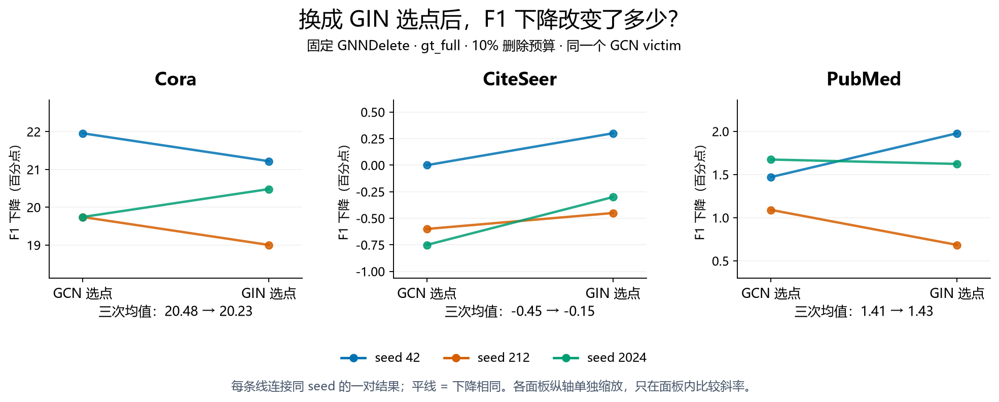

先固定 **GNNDelete × gt_full × GIN**，只读三条实际配对线。左端是 GCN 选点，右端是 GIN 选点；同色连接同一个 seed，纵轴是 F1 下降百分点。线水平表示下降相同，向上表示换成 GIN 后下降更多。各数据集单独缩放纵轴，只在面板内部比较斜率；负值代表 F1 提升。两端最终都评估 GCN victim。

这是延续讨论的一个阅读示例，不代表 GIN 是所有条件下最优。HTML 可切换全部六种遗忘方法、两个选点算法和三种 surrogate，并显示九对原始数值；一次只看一个组合。JavaScript 不可用时保留默认静态图。

在这个示例中，Cora 的三次均值从 20.48 到 20.23 pp，三对绝对差均约 0.74 pp；PubMed 从 1.41 到 1.43 pp，三对绝对差约 0.05～0.51 pp。**在这些具体配对上下降幅度相近**，但不等于通过统计等效检验。CiteSeer 两边的变化都在 1 pp 内，并未显示明显 F1 损伤。判断攻击是否优于 Random 仍需基线。

这个图让幅度、方向和 seed 差异可直接检查，不能取代相关性问题。后者仍保留在下方作为补充。旧主图把两个算法合并，PubMed/GNNDelete/GIN 的 0.03 不能概括当前 gt_full 子集的幅度差，更不能直接判断其攻击效果很差。

## 补充：六个混合条件的排序相关

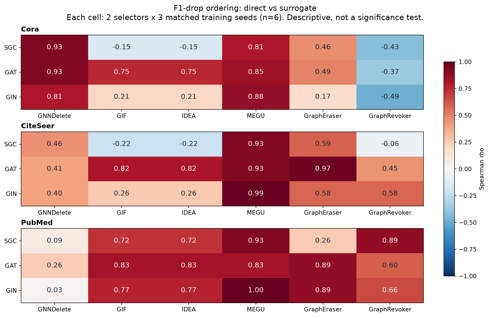

每格固定一个 dataset × GU × surrogate。横纵比较的是：GCN direct 选集 vs surrogate 选集，**都在同一个 GCN victim 上评估**。每格仅有 r_point/gt_full × 三个训练 seed，共六个配对观测；三个 seed 是重复来源，不是六次独立训练。

红色趋近 +1：direct 下降较大的条件，surrogate 也倾向下降较大；接近 0：未观察到清晰单调关系；负值：顺序有反转。它不是成功率，也不是显著性结果。GIF/IDEA 本轮的 F1 相同，两个列不算两份独立证据。

## 关键证据与解读

| dataset | method | source | spearman_drop | pearson_drop | spearman_f1 | mae_pp | bias_pp |
| --- | --- | --- | --- | --- | --- | --- | --- |
| CiteSeer | MEGU | GIN | 0.99 | 0.98 | 0.90 | 0.30 | 0.10 |
| PubMed | MEGU | GIN | 1.00 | 0.97 | 0.99 | 0.10 | -0.10 |
| Cora | GNNDelete | GAT | 0.93 | 0.96 | 0.89 | 4.77 | -4.77 |
| Cora | GNNDelete | GIN | 0.81 | 0.81 | 0.83 | 2.58 | -0.98 |
| PubMed | GNNDelete | SGC | 0.09 | 0.25 | 0.09 | 6.29 | 6.29 |
| CiteSeer | GraphEraser | GAT | 0.97 | 0.98 | 0.57 | 0.28 | 0.13 |
| Cora | GraphRevoker | GIN | -0.49 | -0.62 | 0.14 | 6.73 | -3.35 |

- **高相关、也接近：MEGU / GIN。** CiteSeer 的 Spearman 为 0.986，平均绝对差仅 0.300 pp；PubMed 为 1.000，平均绝对差 0.101 pp。两数据集分别去掉任意一个 seed 后，Spearman 范围为 0.949～1.000、1.000～1.000。但 PubMed direct 的六点 drop 范围只有 0.380 pp，不能把微小变化的排序一致称为强攻击。
- **高相关、幅度仍不同：Cora / GNNDelete / GAT。** Spearman 0.928，平均有符号差 -4.766 pp（surrogate − direct）。代理保留了总体强弱趋势，却系统地造成较小下降。相关性与攻击大小给出互补信息。
- **攻击更强、但排序不保留：PubMed / GNNDelete / SGC。** 平均有符号差 +6.292 pp，但 Spearman 仅 0.086。之前的强攻击正例，不能直接当作“复现 direct 效果规律”的正例。
- **另一个较一致的条件：CiteSeer / GraphEraser / GAT。** Spearman 0.971、MAE 0.275 pp；去掉算法间均值差后的 Pearson 仍为 0.986。这表明本轮观察不限于 GNNDelete。
- **反例仍然存在：Cora / GraphRevoker。** 三种代理的 Spearman 都为负，不能把 GAT/GIN 的选点重叠外推成所有方法的效果可替代。

## 相关不等于接近

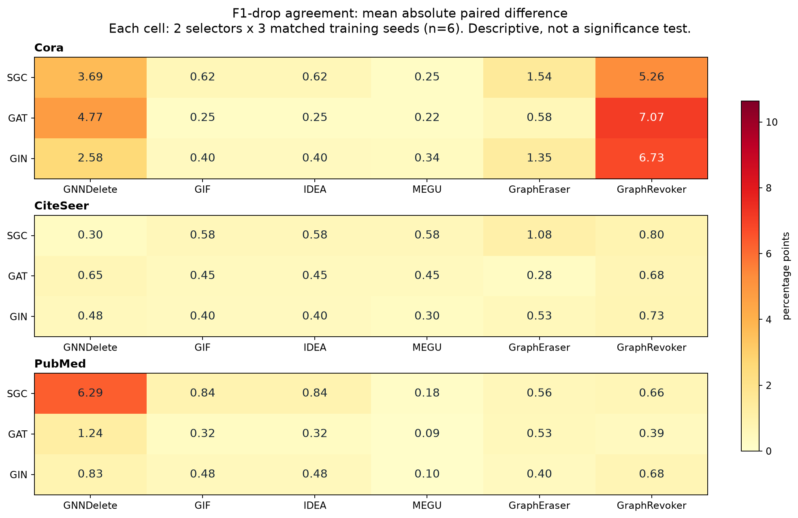

MAE = mean(|drop_surrogate − drop_direct|)，单位 pp，越小越接近；bias 为有符号均差；RMSE 同时保存在 CSV。双方用同一个 before F1，因此 **drop 的绝对配对差等于删除后 F1 的绝对配对差**，已经逐组数值核对。但跨 seed 的 before F1 可以不同，故 drop 的相关系数不等于 after F1 的相关系数。

没有预先指定可接受差距，报告不以事后阈值划分“等效”“成功”。例如高相关、MAE 小可能表示弱效应共同变化，并不证明攻击实用性；幅度是否超过 Random/Degree 应回看原始效果报告。

## 删除后 F1 本身

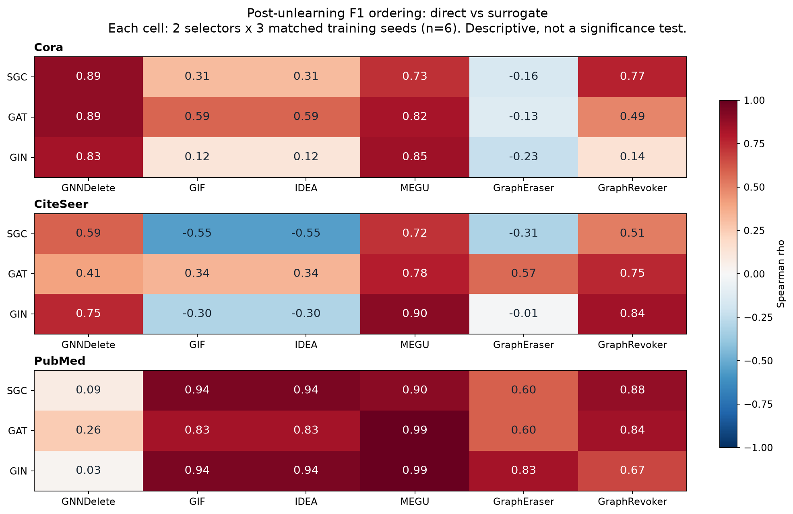

CSV 同时给出 Pearson/Spearman after F1。两种指标回答不同问题：after F1 对应最终任务性能；drop 对应从原模型性能下降多少。以 CiteSeer / GraphEraser / GAT 为例，drop Spearman 为 0.971，after F1 Spearman 为 0.567，因此报告不能混用二者。

## 选点一致性：加入模型自身波动参照

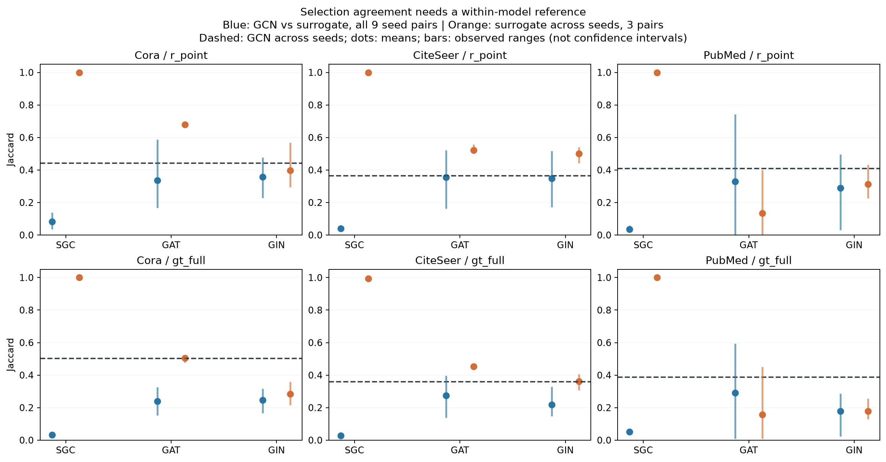

蓝色使用每个 surrogate 三个 seed 与 GCN 三个 seed 的 **全部九种配对**；橙色是 surrogate 自身三种跨 seed 配对；虚线是 GCN 自身跨 seed 均值。误差线只是观察范围，不是置信区间。这些配对共享选集，不能视为九次或三次独立重复。

- SGC 模型内 Jaccard 为 0.994～1.000，和 GCN 之间却只有约 0.027～0.082。支持“稳定但不同的选点”，不支持直接把差异归因于凸性。
- GCN 模型内均值约 0.358～0.503，是自然波动参照，**不是上限**。GAT/GIN 的若干跨模型值与这一量级接近，支持共同选点倾向；Cora/gt_full 等条件仍明显低于 GCN 模型内均值。
- 同数字 seed 在不同架构上并无相同权重或同一随机轨迹的含义。旧图用同 seed 配对，可能受对齐方式影响；本图补全交叉配对。PubMed/r_point/GAT 从同 seed 0.436 变为全部配对 0.329，gt_full 从 0.396 变为 0.291，说明不能只凭那三个对角配对宣称跨 seed 普遍一致。
- `overlap_fraction_mean` 按每个配对的交集/选集大小计算后平均，没有把均值 Jaccard 非线性换算成平均重合比例。10%预算下独立均匀随机选集的预期重合比例约10%，只是简单参照；图结构、标签和选择偏好并非均匀随机。

| dataset | selector | source | comparison | n_pairs | jaccard_mean | overlap_fraction_mean | same_seed_jaccard |
| --- | --- | --- | --- | --- | --- | --- | --- |
| CiteSeer | gt_full | GAT | cross_model | 9 | 0.28 | 0.42 | 0.27 |
| CiteSeer | gt_full | GAT | within_model | 3 | 0.45 | 0.62 | nan |
| CiteSeer | gt_full | GCN | within_model | 3 | 0.36 | 0.52 | nan |
| CiteSeer | gt_full | GIN | cross_model | 9 | 0.22 | 0.35 | 0.22 |
| CiteSeer | gt_full | GIN | within_model | 3 | 0.36 | 0.53 | nan |
| CiteSeer | gt_full | SGC | cross_model | 9 | 0.03 | 0.05 | 0.03 |
| CiteSeer | gt_full | SGC | within_model | 3 | 0.99 | 1.00 | nan |
| CiteSeer | r_point | GAT | cross_model | 9 | 0.36 | 0.51 | 0.36 |
| CiteSeer | r_point | GAT | within_model | 3 | 0.52 | 0.69 | nan |
| CiteSeer | r_point | GCN | within_model | 3 | 0.36 | 0.53 | nan |
| CiteSeer | r_point | GIN | cross_model | 9 | 0.35 | 0.50 | 0.35 |
| CiteSeer | r_point | GIN | within_model | 3 | 0.50 | 0.67 | nan |
| CiteSeer | r_point | SGC | cross_model | 9 | 0.04 | 0.08 | 0.04 |
| CiteSeer | r_point | SGC | within_model | 3 | 1.00 | 1.00 | nan |
| Cora | gt_full | GAT | cross_model | 9 | 0.24 | 0.38 | 0.25 |
| Cora | gt_full | GAT | within_model | 3 | 0.50 | 0.67 | nan |
| Cora | gt_full | GCN | within_model | 3 | 0.50 | 0.67 | nan |
| Cora | gt_full | GIN | cross_model | 9 | 0.25 | 0.39 | 0.23 |
| Cora | gt_full | GIN | within_model | 3 | 0.28 | 0.44 | nan |
| Cora | gt_full | SGC | cross_model | 9 | 0.03 | 0.06 | 0.03 |
| Cora | gt_full | SGC | within_model | 3 | 1.00 | 1.00 | nan |
| Cora | r_point | GAT | cross_model | 9 | 0.34 | 0.48 | 0.34 |
| Cora | r_point | GAT | within_model | 3 | 0.68 | 0.81 | nan |
| Cora | r_point | GCN | within_model | 3 | 0.44 | 0.61 | nan |
| Cora | r_point | GIN | cross_model | 9 | 0.36 | 0.52 | 0.29 |
| Cora | r_point | GIN | within_model | 3 | 0.40 | 0.56 | nan |
| Cora | r_point | SGC | cross_model | 9 | 0.08 | 0.15 | 0.08 |
| Cora | r_point | SGC | within_model | 3 | 1.00 | 1.00 | nan |
| PubMed | gt_full | GAT | cross_model | 9 | 0.29 | 0.41 | 0.40 |
| PubMed | gt_full | GAT | within_model | 3 | 0.16 | 0.22 | nan |
| PubMed | gt_full | GCN | within_model | 3 | 0.39 | 0.47 | nan |
| PubMed | gt_full | GIN | cross_model | 9 | 0.18 | 0.29 | 0.24 |
| PubMed | gt_full | GIN | within_model | 3 | 0.18 | 0.30 | nan |
| PubMed | gt_full | SGC | cross_model | 9 | 0.05 | 0.10 | 0.05 |
| PubMed | gt_full | SGC | within_model | 3 | 1.00 | 1.00 | nan |
| PubMed | r_point | GAT | cross_model | 9 | 0.33 | 0.43 | 0.44 |
| PubMed | r_point | GAT | within_model | 3 | 0.13 | 0.19 | nan |
| PubMed | r_point | GCN | within_model | 3 | 0.41 | 0.51 | nan |
| PubMed | r_point | GIN | cross_model | 9 | 0.29 | 0.42 | 0.35 |
| PubMed | r_point | GIN | within_model | 3 | 0.31 | 0.47 | nan |
| PubMed | r_point | SGC | cross_model | 9 | 0.03 | 0.07 | 0.03 |
| PubMed | r_point | SGC | within_model | 3 | 1.00 | 1.00 | nan |

## 敏感性检查：高相关来自哪里？

1. **算法分层。** 主图每格六点，可能主要反映两个算法的均值差。另算各 selector 内三点的相关，以及去掉各 selector 均值后的 Pearson。Cora/GNNDelete/GIN 总体 Spearman 为 0.812，但去掉算法均值差后的 Pearson 为 -0.452。所以应说“混合两个算法的总体排序对应”，不能说同一算法内部稳定对应。
2. **逐 seed 留出。** 每次移除一个 seed 的两个点，再计算四点 Spearman；范围保存在 CSV。只有三个 seed，这仅展示敏感性，不是泛化验证或置信区间。报告保留所有正、负和未定义结果。
3. **相对 Random 的效果。** 按同一 dataset/GU/seed，减去三个 Random 抽样的平均 drop，再比较两侧 excess 的 Spearman。PubMed/MEGU/GIN 的原始 drop 相关为 1.000，excess 相关降至 0.429；CiteSeer 对应为 0.986→0.880。提示某些原始高相关可能包含共享的 victim/seed 响应。共同减去 Random 并不消除所有依赖，也不是因果调整。
4. **数值并列。** F1 来源于有限测试节点，存在真正的并列。Spearman 在 pp 单位保留10位小数后以平均秩处理并列，避免浮点减法约1e-14的差别制造虚假排序。Pearson 保留原数值。任一向量近常数时相关记 NA，不以0代替。
5. **原始动态范围。** 保存每格 direct/surrogate 的最大最小差；范围很小的高相关不能与几十 pp 变化的相关性等量齐观。没有 pooled correlation、p值、显著性星号或从多重探索中筛选出的“成功率”。

## 选集更像，效果就更接近吗？

按 dataset × GU，将同 seed 的 Jaccard 与 |drop_surrogate − drop_direct| 做 Spearman：负值表示重叠更高时差距更小。每层18个点来自三个 surrogate × 两个算法 × 三个 seed，共享 direct 和 seed，不是18次独立重复。另保存每个 selector 内的九点描述统计。

| dataset | method | selector | n | n_seeds | rho_jaccard_vs_absolute_drop_difference |
| --- | --- | --- | --- | --- | --- |
| CiteSeer | GIF | both | 18 | 3 | -0.22 |
| CiteSeer | GNNDelete | both | 18 | 3 | 0.46 |
| CiteSeer | GraphEraser | both | 18 | 3 | -0.24 |
| CiteSeer | GraphRevoker | both | 18 | 3 | -0.15 |
| CiteSeer | IDEA | both | 18 | 3 | -0.22 |
| CiteSeer | MEGU | both | 18 | 3 | -0.32 |
| Cora | GIF | both | 18 | 3 | -0.61 |
| Cora | GNNDelete | both | 18 | 3 | 0.18 |
| Cora | GraphEraser | both | 18 | 3 | -0.42 |
| Cora | GraphRevoker | both | 18 | 3 | -0.13 |
| Cora | IDEA | both | 18 | 3 | -0.61 |
| Cora | MEGU | both | 18 | 3 | 0.18 |
| PubMed | GIF | both | 18 | 3 | -0.52 |
| PubMed | GNNDelete | both | 18 | 3 | -0.71 |
| PubMed | GraphEraser | both | 18 | 3 | -0.26 |
| PubMed | GraphRevoker | both | 18 | 3 | -0.36 |
| PubMed | IDEA | both | 18 | 3 | -0.52 |
| PubMed | MEGU | both | 18 | 3 | -0.57 |

这些关系并非一致：例如 PubMed/GNNDelete 呈负相关，而 Cora、CiteSeer/GNNDelete 并非如此。跨 source/selector 的结构差异也可能驱动关系，不能作因果解释。SGC 的低重叠与 MEGU 的高效果相关并存，说明选点重叠不能独自代替效果分析。

## 逐方法配对散点

每张图固定 GU，行是 dataset，列是 surrogate；横轴 direct drop，纵轴 surrogate drop，蓝色 r_point、橙色 gt_full；圆形 seed42、方形 seed212、三角形 seed2024。完全重合的点不人为抖动，精确坐标见配对CSV。虚线 y=x，用来同时判断趋势和幅度。每个 dataset 行共享坐标范围，不画跨数据集拟合线。

### GNNDelete

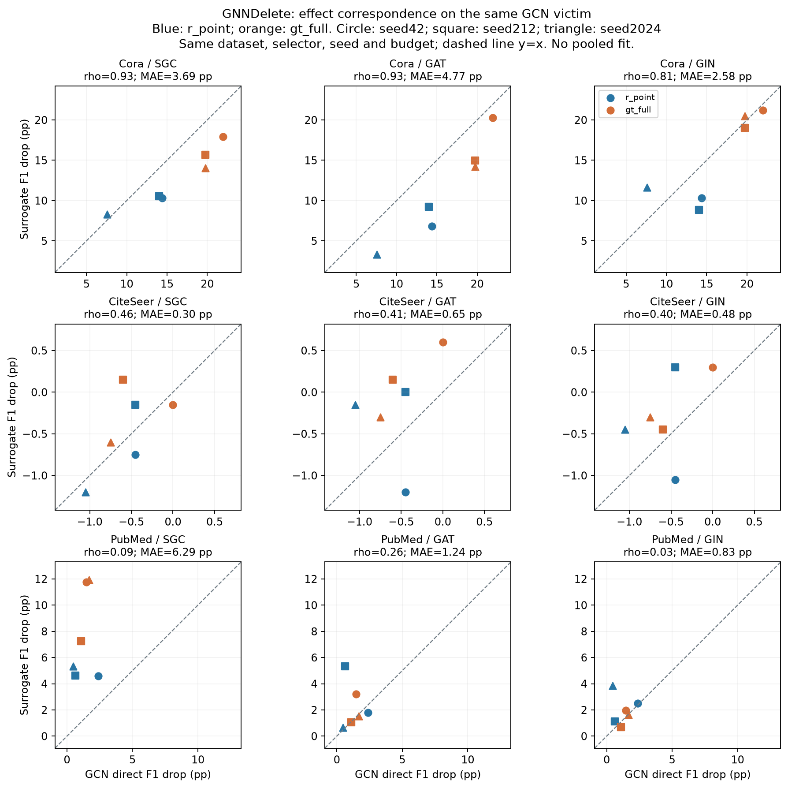

[矢量 SVG](post_scatter_GNNDelete.svg)
### GIF

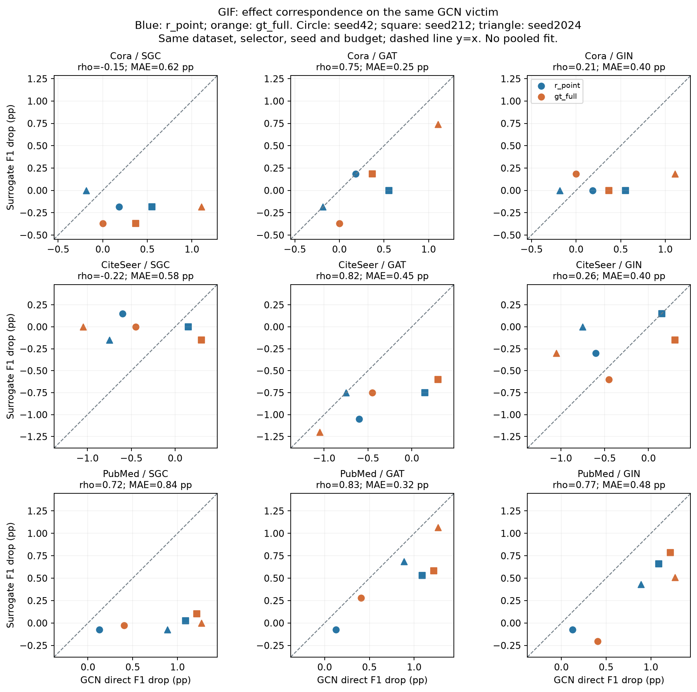

[矢量 SVG](post_scatter_GIF.svg)
### IDEA

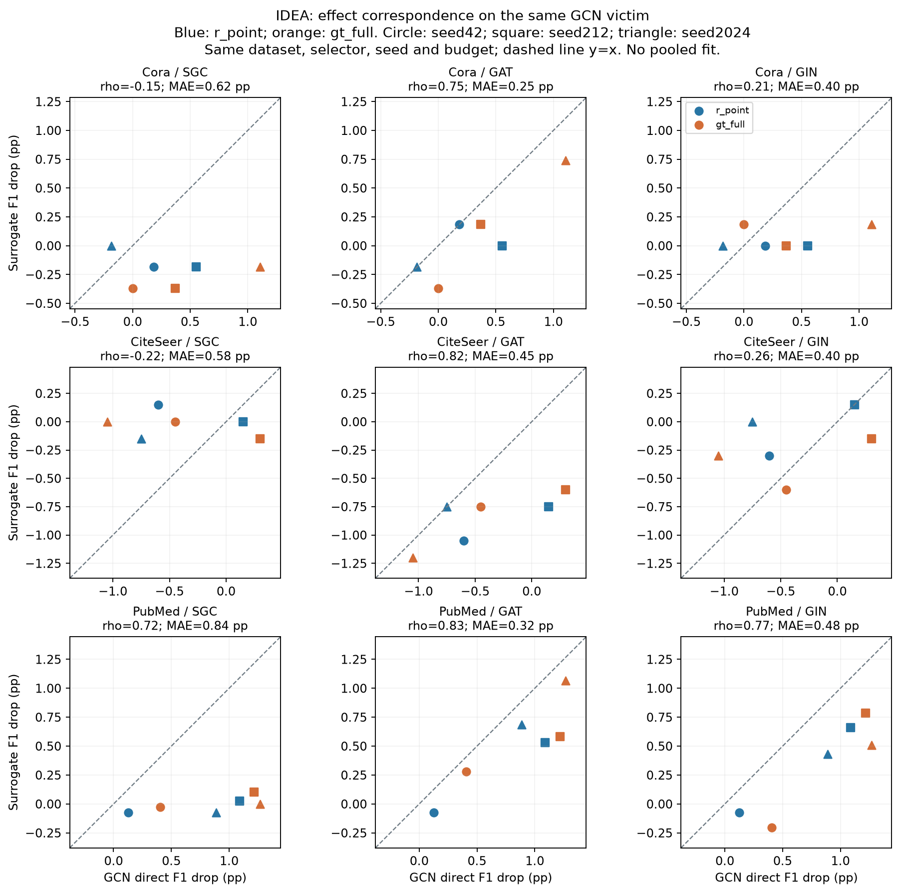

[矢量 SVG](post_scatter_IDEA.svg)
### MEGU

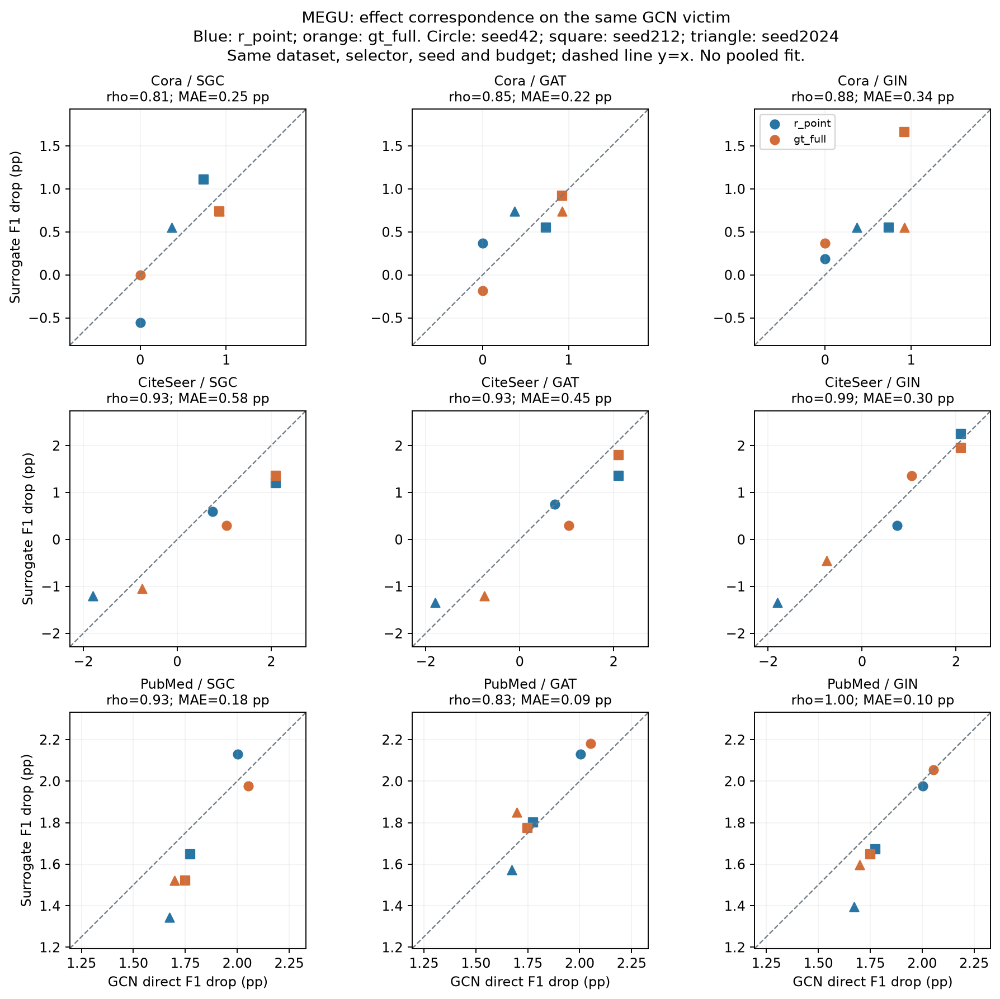

[矢量 SVG](post_scatter_MEGU.svg)
### GraphEraser

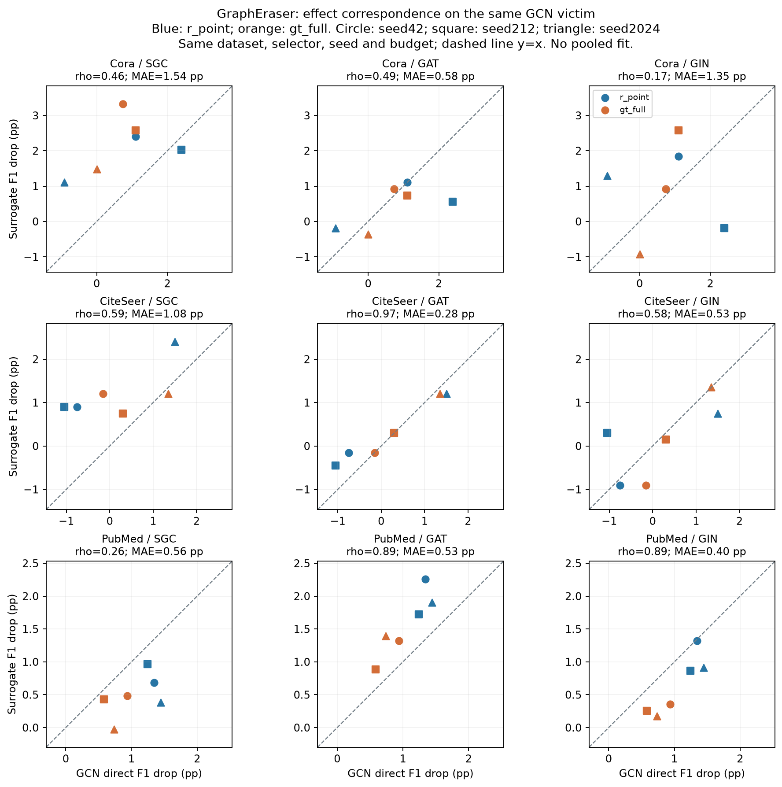

[矢量 SVG](post_scatter_GraphEraser.svg)
### GraphRevoker

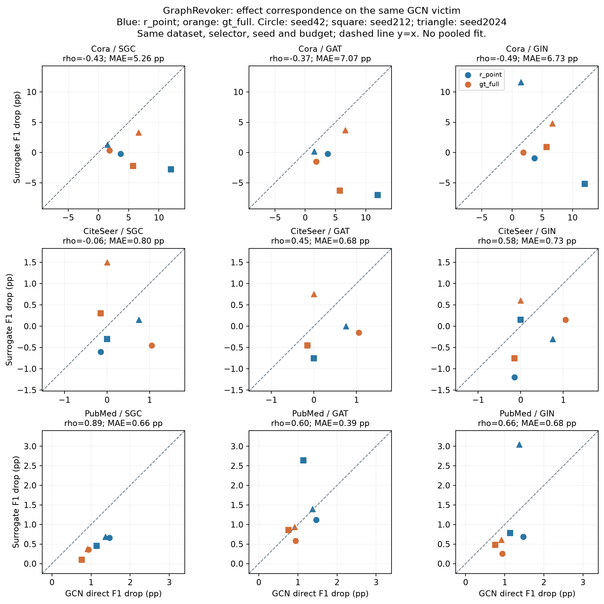

[矢量 SVG](post_scatter_GraphRevoker.svg)

## 当前可以写成什么发现？

建议的证据表述：**在本轮固定 GCN victim、10%节点删除及共享数据条件下，跨架构选点重叠、F1效果排序相关和幅度接近程度表现为可区分的现象。部分 surrogate/GU 条件保留强弱排序，即使选集不同或攻击幅度有系统差异；也存在更强攻击但低排序相关的条件。**

这比只比较攻击大小提供了更多信息，但不支持“GAT/GIN在所有方法上可替代GCN”，也不证明相关来自 surrogate 本身：两侧共享 victim、训练 seed、数据划分，且本轮 selector seed 与 victim seed 同轴。模型内随机性、算法均值差与模型特异选点贡献尚未被独立操控。SGC 的凸性/表示差异仍是机制假设。

三个 seed、单预算、固定划分使当前结论属于描述性 post 分析；没有预注册假设或等效阈值。若后续需要确认性结果，再单独决定扩展 seed、预算或解耦 selector/victim seed；本次不启动新实验。文献新颖性不由本报告认定，科学接受待用户审阅。

## 复现与数据

- 原 job：`exp013-full-20260930-r1`；run：`r1`；原执行 SHA：`62926d95b843af137076eb9dd0a15e1c54c75663`。
- 原 run.json 哈希：`70588d5793760e44ae268dfe55b3648e0638b71fde3a4db0eee998dc51760a49`。
- 再次检查1513个回传文件哈希，读取全部756单元，核对648个GU与同请求Retrain的身份；post主分析使用324个 surrogate-GU 单元与108个 direct-GU 单元配对。
- [全部相关性与敏感性统计](post_correlations.csv)：54个六点分组 + 108个三点分组；含 drop/F1 Pearson与Spearman、MAE、RMSE、bias和动态范围。
- [逐效果配对](post_effect_pairs.csv)、[逐选集配对](post_selection_pairs.csv)、[选集统计](post_selection_summary.csv)、[重叠与效果关系](post_overlap_effect.csv)。
- [核验记录](post_audit.json)：162组相关统计与 scipy 独立实现对照；配对drop和after F1的绝对差一致。
- [生成器](post_analysis.py)：仓库根运行 `python -X utf8 self/research/analyses/EXP-013/post_analysis.py`。本地依赖 numpy/pandas/matplotlib/markdown-it-py/scipy，无GPU或远端模型输入。
- [配对主图SVG](post_paired_reading.svg) · [相关性补充SVG](post_drop_correlation.svg) · [幅度差SVG](post_drop_agreement.svg) · [选点参照SVG](post_selection_reference.svg) · [F1相关SVG](post_f1_correlation.svg)。HTML内嵌所有图像和配对数据，可独立查看；CSV/SVG作为配套下载文件。

## 完整六点统计

| dataset | method | source | spearman_drop | pearson_drop | spearman_f1 | mae_pp | bias_pp | pearson_within_selector | spearman_excess_random | leave_one_seed_out_rho_min | leave_one_seed_out_rho_max |
| --- | --- | --- | --- | --- | --- | --- | --- | --- | --- | --- | --- |
| CiteSeer | GIF | GAT | 0.82 | 0.77 | 0.34 | 0.45 | -0.45 | 0.77 | 0.90 | 0.63 | 0.95 |
| CiteSeer | GIF | GIN | 0.26 | 0.38 | -0.30 | 0.40 | 0.20 | 0.49 | 0.49 | -0.63 | 0.60 |
| CiteSeer | GIF | SGC | -0.22 | -0.28 | -0.55 | 0.58 | 0.38 | -0.29 | 0.58 | -0.95 | 0.32 |
| CiteSeer | GNNDelete | GAT | 0.41 | 0.32 | 0.41 | 0.65 | 0.40 | 0.19 | 0.61 | 0.20 | 0.60 |
| CiteSeer | GNNDelete | GIN | 0.40 | 0.44 | 0.75 | 0.48 | 0.28 | 0.39 | 0.83 | 0.40 | 0.63 |
| CiteSeer | GNNDelete | SGC | 0.46 | 0.62 | 0.59 | 0.30 | 0.10 | 0.57 | 0.60 | -0.50 | 0.80 |
| CiteSeer | GraphEraser | GAT | 0.97 | 0.98 | 0.57 | 0.28 | 0.13 | 0.99 | 0.93 | 0.89 | 0.95 |
| CiteSeer | GraphEraser | GIN | 0.58 | 0.70 | -0.01 | 0.53 | -0.08 | 0.71 | 0.17 | -0.32 | 0.74 |
| CiteSeer | GraphEraser | SGC | 0.59 | 0.68 | -0.31 | 1.08 | 1.03 | 0.86 | 0.09 | -0.32 | 0.95 |
| CiteSeer | GraphRevoker | GAT | 0.45 | 0.18 | 0.75 | 0.68 | -0.43 | 0.15 | 0.00 | 0.20 | 0.33 |
| CiteSeer | GraphRevoker | GIN | 0.58 | 0.33 | 0.84 | 0.73 | -0.48 | 0.31 | 0.60 | 0.32 | 0.89 |
| CiteSeer | GraphRevoker | SGC | -0.06 | -0.23 | 0.51 | 0.80 | -0.15 | -0.33 | -0.06 | -0.32 | 0.20 |
| CiteSeer | IDEA | GAT | 0.82 | 0.77 | 0.34 | 0.45 | -0.45 | 0.77 | 0.90 | 0.63 | 0.95 |
| CiteSeer | IDEA | GIN | 0.26 | 0.38 | -0.30 | 0.40 | 0.20 | 0.49 | 0.49 | -0.63 | 0.60 |
| CiteSeer | IDEA | SGC | -0.22 | -0.28 | -0.55 | 0.58 | 0.38 | -0.29 | 0.58 | -0.95 | 0.32 |
| CiteSeer | MEGU | GAT | 0.93 | 0.96 | 0.78 | 0.45 | -0.30 | 0.97 | 0.66 | 0.74 | 0.95 |
| CiteSeer | MEGU | GIN | 0.99 | 0.98 | 0.90 | 0.30 | 0.10 | 0.98 | 0.88 | 0.95 | 1.00 |
| CiteSeer | MEGU | SGC | 0.93 | 0.97 | 0.72 | 0.58 | -0.38 | 0.99 | 0.40 | 0.74 | 0.95 |
| Cora | GIF | GAT | 0.75 | 0.87 | 0.59 | 0.25 | -0.25 | 0.87 | 0.83 | 0.32 | 0.80 |
| Cora | GIF | GIN | 0.21 | 0.36 | 0.12 | 0.40 | -0.28 | 0.16 | 0.06 | -0.77 | 0.77 |
| Cora | GIF | SGC | -0.15 | -0.12 | 0.31 | 0.62 | -0.55 | 0.22 | -0.14 | -0.32 | 0.45 |
| Cora | GNNDelete | GAT | 0.93 | 0.96 | 0.89 | 4.77 | -4.77 | 0.80 | 0.77 | 0.80 | 1.00 |
| Cora | GNNDelete | GIN | 0.81 | 0.81 | 0.83 | 2.58 | -0.98 | -0.45 | 0.83 | 0.74 | 1.00 |
| Cora | GNNDelete | SGC | 0.93 | 0.95 | 0.89 | 3.69 | -3.44 | 0.74 | 0.83 | 0.80 | 1.00 |
| Cora | GraphEraser | GAT | 0.49 | 0.64 | -0.13 | 0.58 | -0.28 | 0.64 | -0.14 | -0.63 | 0.80 |
| Cora | GraphEraser | GIN | 0.17 | -0.02 | -0.23 | 1.35 | 0.18 | -0.03 | -0.83 | -0.32 | 0.40 |
| Cora | GraphEraser | SGC | 0.46 | 0.51 | -0.16 | 1.54 | 1.41 | 0.62 | -0.06 | -0.95 | 0.80 |
| Cora | GraphRevoker | GAT | -0.37 | -0.51 | 0.49 | 7.07 | -7.07 | -0.50 | -0.43 | -0.80 | 0.40 |
| Cora | GraphRevoker | GIN | -0.49 | -0.62 | 0.14 | 6.73 | -3.35 | -0.63 | -0.60 | -0.80 | -0.40 |
| Cora | GraphRevoker | SGC | -0.43 | -0.48 | 0.77 | 5.26 | -5.26 | -0.46 | -0.37 | -1.00 | 0.20 |
| Cora | IDEA | GAT | 0.75 | 0.87 | 0.59 | 0.25 | -0.25 | 0.87 | 0.83 | 0.32 | 0.80 |
| Cora | IDEA | GIN | 0.21 | 0.36 | 0.12 | 0.40 | -0.28 | 0.16 | 0.06 | -0.77 | 0.77 |
| Cora | IDEA | SGC | -0.15 | -0.12 | 0.31 | 0.62 | -0.55 | 0.22 | -0.14 | -0.32 | 0.45 |
| Cora | MEGU | GAT | 0.85 | 0.79 | 0.82 | 0.22 | 0.03 | 0.86 | 0.50 | 0.50 | 0.95 |
| Cora | MEGU | GIN | 0.88 | 0.67 | 0.85 | 0.34 | 0.15 | 0.62 | 0.35 | 0.54 | 0.95 |
| Cora | MEGU | SGC | 0.81 | 0.86 | 0.73 | 0.25 | -0.06 | 0.87 | 0.12 | 0.33 | 0.95 |
| PubMed | GIF | GAT | 0.83 | 0.89 | 0.83 | 0.32 | -0.32 | 0.88 | 0.83 | 0.40 | 1.00 |
| PubMed | GIF | GIN | 0.77 | 0.92 | 0.94 | 0.48 | -0.48 | 0.95 | 0.77 | 0.40 | 0.80 |
| PubMed | GIF | SGC | 0.72 | 0.67 | 0.94 | 0.84 | -0.84 | 0.63 | 0.89 | 0.40 | 1.00 |
| PubMed | GNNDelete | GAT | 0.26 | -0.17 | 0.26 | 1.24 | 0.98 | -0.13 | -0.03 | -0.40 | 0.40 |
| PubMed | GNNDelete | GIN | 0.03 | -0.07 | 0.03 | 0.83 | 0.68 | 0.03 | -0.03 | -0.40 | 0.80 |
| PubMed | GNNDelete | SGC | 0.09 | 0.25 | 0.09 | 6.29 | 6.29 | 0.16 | -0.14 | -0.20 | 0.80 |
| PubMed | GraphEraser | GAT | 0.89 | 0.91 | 0.60 | 0.53 | 0.53 | 0.57 | 0.77 | 0.60 | 1.00 |
| PubMed | GraphEraser | GIN | 0.89 | 0.89 | 0.83 | 0.40 | -0.40 | 0.23 | 0.60 | 0.80 | 1.00 |
| PubMed | GraphEraser | SGC | 0.26 | 0.51 | 0.60 | 0.56 | -0.56 | -0.25 | 0.20 | 0.00 | 0.80 |
| PubMed | GraphRevoker | GAT | 0.60 | 0.34 | 0.84 | 0.39 | 0.16 | -0.89 | 0.54 | 0.60 | 0.80 |
| PubMed | GraphRevoker | GIN | 0.66 | 0.55 | 0.67 | 0.68 | -0.12 | 0.14 | 0.66 | 0.60 | 1.00 |
| PubMed | GraphRevoker | SGC | 0.89 | 0.96 | 0.88 | 0.66 | -0.66 | 0.88 | 1.00 | 0.60 | 1.00 |
| PubMed | IDEA | GAT | 0.83 | 0.89 | 0.83 | 0.32 | -0.32 | 0.88 | 0.83 | 0.40 | 1.00 |
| PubMed | IDEA | GIN | 0.77 | 0.92 | 0.94 | 0.48 | -0.48 | 0.95 | 0.77 | 0.40 | 0.80 |
| PubMed | IDEA | SGC | 0.72 | 0.67 | 0.94 | 0.84 | -0.84 | 0.63 | 0.89 | 0.40 | 1.00 |
| PubMed | MEGU | GAT | 0.83 | 0.94 | 0.99 | 0.09 | 0.06 | 0.96 | 0.55 | 0.40 | 1.00 |
| PubMed | MEGU | GIN | 1.00 | 0.97 | 0.99 | 0.10 | -0.10 | 0.98 | 0.43 | 1.00 | 1.00 |
| PubMed | MEGU | SGC | 0.93 | 0.95 | 0.90 | 0.18 | -0.14 | 0.96 | -0.26 | 0.80 | 0.95 |
