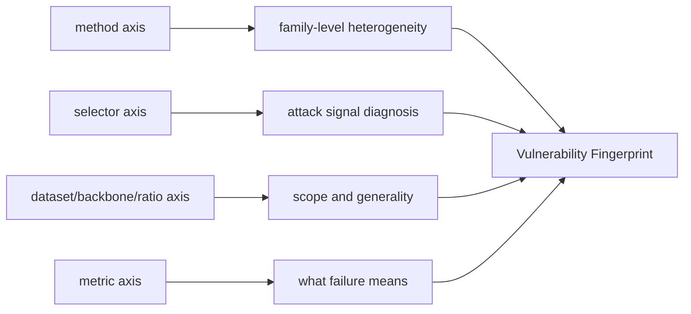

# 实验-框架总览

这页只回答一个主问题：**实验矩阵如何支撑研究框架。**

TracIn、GraphRevoker、ratio sweep 这类具体问题都应该是本页下面的子内容，不抢主层级。

---

## 1. 实验矩阵要回答什么

核心问题不是“哪个 selector 最强”，而是：

> 当 deletion request 被对抗性选择时，不同 graph unlearning 方法会以什么方式失效？

实验矩阵的每一维都对应一个框架问题：

| 维度 | 设计内容 | 对应框架问题 |
|---|---|---|
| GU method | GIF / GNNDelete / MEGU / IDEA / GraphEraser / GraphRevoker | 不同 unlearning family 是否有不同脆弱性 |
| selector | random / degree / pagerank / IM / TracIn / Hybrid | 攻击信号来自结构中心性、传播覆盖，还是 influence |
| dataset / backbone / ratio | Cora / arxiv / Citeseer，GCN / GAT，删除比例 | 现象是否只在一个小图设置成立 |
| metric | F1、retrain gap、collateral、update-detection AUC 等 | “失效”到底是性能掉、近似误差，还是副作用 |

这就是为什么实验 part 和框架 part 不能拆开：框架判断必须从矩阵维度里读出来。

---

## 2. 矩阵如何支撑框架

当前最稳的讲法：

- method axis 支撑 **heterogeneity**：不同 GU family 的响应形状不同。
- selector axis 支撑 **fingerprint**：同一方法面对不同 deletion signal 的反应构成画像。
- metric axis 决定结论强度：raw F1 只是表面，retrain gap 更接近 approximate unlearning 的误差。
- dataset/backbone/ratio axis 决定 scope：现在不能把小图结论写成 universal law。

---

## 3. 子问题挂在哪里

| 子问题 | 所属矩阵轴 | 当前页 |
|---|---|---|
| 策略输出重合度：不同 selector 是否选同一批节点 | selector axis | [[11_策略输出重合度实验]] |
| 近似策略有效性：IM coverage / trajectory influence 是否对准目标 | approximation axis / SUP A.7 | [[12_近似策略重合度实验]] |
| IF 目标层级：A / B / C 是否选择同一批点 | approximation / objective axis | [[20_IF目标层级对比实验计划]] |
| C 目标近似：final / checkpoint / graph-aware 是否逼近 full / approximate GIF GT | eval-impact validity | [[21_C目标TracIn与GIF近似有效性实验计划]] |
| 成熟 IM：时间 / 保证 / score 形态及能否超过 degree | selector quality / scalability | [[22_IM成熟算法可用性与Degree超越实验计划]] |
| GraphRevoker post-fix 验收 / 本地归档 | GU method / evidence axis | [[13_重跑与缓存修复Runbook]] · [E4 验收报告](../../docs/graphrevoker_e4_ACCEPTANCE_REPORT.md) |
| TracIn / Hybrid refresh | selector / approximation axis | [[13_重跑与缓存修复Runbook]] · [[12_近似策略重合度实验]] |
| cache / result 层级 | evidence state | [[14_Cache与结果层级]] |
| run.py / yaml / sh 关系 | execution | [[15_实验运行入口与脚本]] |
| produced / usable / rerun | evidence state | [config_inventory.html](../../self/dashboard/config_inventory.html) · [[13_重跑与缓存修复Runbook]] |
| Citeseer / arxiv scope | dataset axis | 待建 |
| ratio / alpha sweep | ratio / selector interaction | 待建 |

---

## 4. 当前实验矩阵的阅读顺序

不要从所有配置平铺开始。先按框架问题读：

1. **主矩阵**：method × selector 的基本 fingerprint。
2. **GraphRevoker post-fix 四策略矩阵**：远端 E4 已通过；完整数值使用前先看本地归档状态。
3. **TracIn refresh**：校正 IF 轴，重新解释 TracIn / Hybrid；不与已完成的 GraphRevoker 四策略 E4 混算。
4. **scope 实验**：Citeseer / arxiv 判断外推范围。
5. **ablation**：ratio / alpha 只在主框架稳定后补。

实时状态看 [config_inventory.html](../../self/dashboard/config_inventory.html)，不要在 OB 里手抄数字。

当某个 method / selector 已经 produced 但不能 usable，例如 GraphRevoker 或旧 TracIn / Hybrid，先按 [[13_重跑与缓存修复Runbook]] 判定 cache 和 rerun 范围。

---

## 5. 下一步

先读 [[11_策略输出重合度实验]] 锁定 A/B–C–D taxonomy，再读 [[12_近似策略重合度实验]] 验证 IM 与 trajectory proxy。IF 细节继续按 [[20_IF目标层级对比实验计划]] → [[21_C目标TracIn与GIF近似有效性实验计划]] 阅读：先区分 A/B、C-IF、D-GIF，再验证各组内部近似。成熟 IM 的工程可用性、score 形态与 degree 超越门槛单独看 [[22_IM成熟算法可用性与Degree超越实验计划]]；该页当前是待审批预注册，不代表实验已执行。

---

## 6. 面板入口

[config_inventory.html](../../self/dashboard/config_inventory.html) 现在包含一个独立的 `SUPP / overlap-validity` 块：

- `concordance_topology_overlap`：selector 输出重叠度，6 个数据集已产出。
- `concordance_if_validity_gif_tracin`：GIF / proper-TracIn / deployed-TracIn 近似有效性，Cora/Citeseer/Pubmed 已产出。
- `concordance_overlap_damage_join`：待 proper-TracIn/Hybrid attack rerun 后，把 selector overlap 和 attack outcome 连接起来。

这个块是 supplementary validity，不替代主矩阵；它解释 selector / approximation 轴为什么成立，以及哪些 TracIn/Hybrid 旧结果不能直接当 paper evidence。
