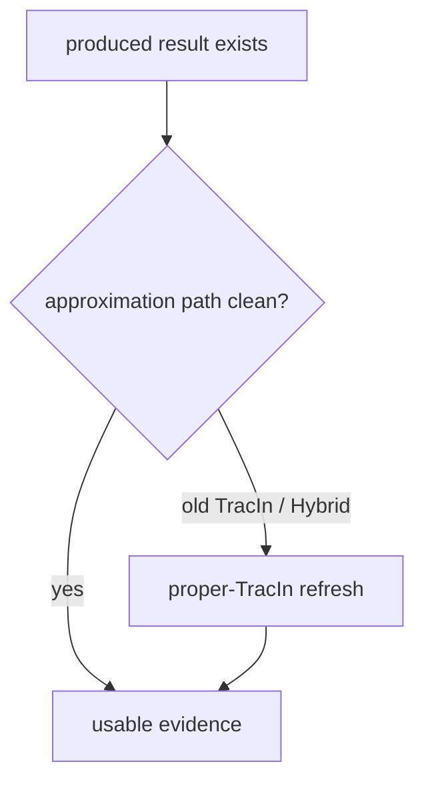

# 近似策略重合度实验

这页是 supplementary experiment 的第二部分：**IM / IF 这类近似策略是否仍然有效。**

它不只是看“最后选出来的节点是否重合”，而是问：

> 近似策略的代理目标，是否仍然对准我们声称的信号？

---

## 1. 为什么要单独开

IM 和 IF 都是近似方法。它们不是直接观测 unlearning damage，而是用 proxy 来选节点。公式和方法定义不放在本页，统一见 [[20_研究框架/20_方法与策略框架]]；本页只记录 supplementary 里要验证什么。

| 近似方法        | proxy                        | 要验证的问题                        |
| ----------- | ---------------------------- | ----------------------------- |
| IM          | propagation / coverage proxy | coverage 近似是否不是 degree 的伪装    |
| IF / TracIn | model-impact 或 loss-sensitivity proxy | 先定义影响目标，再验证 proxy 是否对准 |
| Hybrid      | IM + IF proxy                | 两个近似信号是否能互补，且 IF 分支是否干净       |

所以这部分比“策略输出重合度”更深一层：它检查 proxy 本身有没有对准。

---

## 2. IM 近似是否仍有效

IM 的风险是：看似高级，其实可能只是 degree 的昂贵版本。

当前 concordance 结果支持：

- IM 与 degree 在多数据集上重合低；
- 大图/密图上 IM 与 degree 更分开；
- 这说明 IM 的组合覆盖信号不是简单 degree。

谨慎说法：

> IM 没有在 set level 退化为 degree；它保留了独立 topology/coverage 信号。但这不自动说明 IM attack outcome 一定最强。

---

## 3. IF / TracIn 近似是否仍有效

IF 的风险是：cheap Hessian-free proxy 可能偏离真正想测的 IF 目标。这里先分清三类目标，不然“IF selector”会被说成一个过宽的桶：

| 线 | 目标 | 当前状态 |
|---|---|---|
| training-objective / model-state | 选训练 loss 梯度本身大的点 | 已补：`||g_v||` |
| parameter-change IF | 选删除后参数扰动大的点 | 已补：`||H^-1 g_v||` 的 Hutchinson 估计 |
| eval-impact IF | 选对 held-out/query loss 影响大的点 | 已有 concordance：proper TracIn 与 GIF overlap 高 |

2026-07-10 已补一个 selector-only 诊断：在 Cora/GCN/r=0.05/seed=2024 上训练同一个 base model，只比较打分公式，不执行 unlearning。脚本是 [if_selector_diagnostic.py](../../self/related_work/concordance/if_selector_diagnostic.py)，已引用证据是 [ifdiag_cora_GCN_r0.05_seed2024.json](../../self/related_work/concordance/data/ifdiag_cora_GCN_r0.05_seed2024.json)；其中 degree / PageRank / IM 列来自同次设置的 [topology sidecar](../../self/related_work/concordance/data/cora_GCN_r0.05_seed2024.json)。该证据使用 Hutchinson 32 probes；它是 schema v2 落成前生成的历史 artifact，保留原内容，不由新版脚本静默覆盖。

当前 canonical reproduction command（所有会改变该诊断语义的 CLI 参数均显式给出）是：

```powershell
E:/conda_package/envs/gnn/python.exe self/related_work/concordance/if_selector_diagnostic.py --dataset_name cora --base_model GCN --unlearn_ratio 0.05 --seed 2024 --num_epochs 100 --batch_size 64 --lissa_iter 100 --lissa_scale 25.0 --lissa_damp 0.01 --hutch_probes 32 --hutch_seed 1729
```

新版输出带 `diagnostic_schema_version`、`algorithm_version`、完整 `recipe`、`recipe_hash` 与 reproduction command；默认文件名包含 recipe hash。目标文件已存在时默认拒绝写入；只有显式 `--overwrite` 且已有 `recipe_hash` 完全相同时才允许原子替换，不同配置或旧式不可验证 artifact 一律 fail closed。

复现时 topology sidecar 也进入新版 Recipe（含相对路径和 SHA-256）；缺少它时脚本仍可计算五个 model-based selector，但不会伪造 degree / PageRank / IM 对照，并会得到不同 Recipe hash。仓库只精确追踪上述两份 Cora JSON 证据，不放开整个 ignored `data/` 目录。

| 分数目标 | score | 与目标参照的重合 |
|---|---|---:|
| 参数 / 模型状态影响大 | `||H_train^-1 g_v||`，Hutchinson 估计 | vs `||g_v||` = 0.8462 |
| 训练目标 / 模型状态 proxy | `||g_v||` | vs eval-IF = 0.2486 |
| 泛化 / 性能影响大 | `<g_v, H_train^-1 grad L_eval>` | vs proper TracIn = 0.7419 |
| 旧 deployed cross-TracIn | `-<sum_candidate grad loss_j, g_v>` | vs eval-IF = 0.1134 |

这说明“一看就知道”的核心判断是对的：不同 IF/TracIn 公式确实会选出不同集合。实验设计上是三组：`||g_v||`、`||H^-1 g_v||`、`<g_v, H^-1 grad L_eval>`。当前 Cora/GCN 结果里，前两组 top-k 高度相近（0.8462），所以会看起来像两个主簇；但概念上不能合并，因为一个是梯度 magnitude，一个是曲率修正后的参数扰动。proper TracIn 对 eval-impact IF 是合理近似；旧 deployed cross-TracIn 既不等于前者，也不等于后者，只能作为 legacy selector / 反例。

concordance 的 model-based 部分显示：

- eval-impact proper TracIn 与 eval-impact GIF 的 overlap 明显高；
- deployed cross-TracIn 与 GIF 的 overlap 低；
- 因此“TracIn 近似 IF 是否有效”要先说清楚 IF 目标是哪一种。

这里暴露出一个子问题：旧 deployed TracIn 的定义不干净。人类可读的公式学习页见 [[20_研究框架/21_TracIn变体与GIF关系]]；最小定义表见 [[20_研究框架/20_方法与策略框架#33-tracin--proper-tracin--gif-的公式边界]]。当前代码路径在 [tracin_strategy.py](../../attack/attack_strategies/tracin_strategy.py) 中使用 deployed cross-TracIn；Hybrid 通过 [hybrid_strategy.py](../../attack/attack_strategies/hybrid_strategy.py) 复用 TracIn 分数，所以一起受影响。

权威来源：

- [FINDING_tracin_misspecification.md](../../self/related_work/concordance/FINDING_tracin_misspecification.md)
- [HANDOFF.md](../../self/related_work/concordance/HANDOFF.md)
- [modelbased_cora.json](../../self/related_work/concordance/data/modelbased_cora.json)
- [modelbased_citeseer.json](../../self/related_work/concordance/data/modelbased_citeseer.json)
- [modelbased_pubmed.json](../../self/related_work/concordance/data/modelbased_pubmed.json)

---

## 4. 对主实验矩阵的影响

| 受影响对象 | 处理 |
|---|---|
| TracIn cells | produced 仍然是产物，但不能当 proper IF evidence |
| Hybrid cells | 因为融合 TracIn 分数，也需要 refresh |
| random / degree / pagerank / IM | 不受 TracIn 定义问题影响 |
| GraphRevoker | 是另一条 repair 线，不要和 TracIn refresh 混成一个问题 |

因此，矩阵读法要从旧的 `done` 改成：



这个决定已经进入 [config_inventory.html](../../self/dashboard/config_inventory.html) 的 produced / usable / rerun 口径。详见 [VALIDATION_LOG.md](../../self/dashboard/VALIDATION_LOG.md) 中 2026-07-01 的 IF-concordance 条目。

重跑边界按 [[13_重跑与缓存修复Runbook]]；Cache 层级与 V2 Recipe 规则见 [[14_Cache与结果层级]]、[[19_Cache架构重设计与迁移方案]]。Legacy `score_cache/if` 与 SelectionCache 全程只读，不通过删除旧 Cache 切换算法口径；`proper-tracin-v1` 必须建立新的 versioned V2 Recipe / Artifact，旧 V2 Artifact 不覆盖，只有明确退役时才显式 retire。random / degree / pagerank / IM 不因 TracIn 换版重跑。

---

## 5. 框架层怎么讲

可以讲：

> supplementary overlap study 有两层：第一层说明 selector axis 不是虚设；第二层说明 IM 与 IF-style proxy 这些近似信号需要分别验证。现有 concordance 已说明 eval-impact proper TracIn 与 GIF 更一致；旧 deployed TracIn 既不是干净的 eval-impact IF，也不是干净的 model-impact IF，因此 TracIn/Hybrid attack outcome 需要刷新或重新命名。

不要讲：

> 旧 TracIn 结果已经证明 influence-based attack 弱。

当前口径：

- IM 没退化为 degree；
- eval-impact proper TracIn 是更可信的 Hessian-free eval-loss IF proxy；
- training-objective magnitude、parameter-change IF、eval-impact IF 要分开讲；
- deployed TracIn / Hybrid 旧结果需要 refresh；
- correct IF attack 是否弱于 degree，要等 IF 目标定义清楚并 rerun 后再写死。

---

## 6. 面板跟踪

[config_inventory.html](../../self/dashboard/config_inventory.html) 已加入 `SUPP / overlap-validity` 块，用来跟踪本页相关的补充验证：

- `concordance_if_validity_gif_tracin`：3/3 produced，3/3 usable；它验证的是 eval-impact proper TracIn / GIF，不覆盖 parameter-change IF selector。
- `concordance_overlap_damage_join`：0/1 produced；等 proper-TracIn / Hybrid attack rerun 后，连接 overlap-with-degree 与 attack damage。

因此当前结论边界是：eval-impact proper TracIn 作为 Hessian-free eval-loss IF proxy 更可信；training-objective magnitude 与 parameter-change IF 在 Cora/GCN 上高度接近但概念上仍是两类；旧 deployed TracIn / Hybrid 结果需要 refresh 或重新命名。

2026-07-10 补充：`if_selector_diagnostic.py` 已覆盖 training-objective magnitude、parameter-change IF、eval-impact IF 的 first-pass Cora/GCN 诊断，但还只是单数据集、单 backbone、单 seed。这里的 `E` 使用 test split，仅用于机制诊断；若把同一信息用于正式攻击选点会形成 label leakage。该结果可以作为方法选择的 sanity check，不能当跨数据集结论，也不能直接证明任何 GU method 的 attack outcome。
