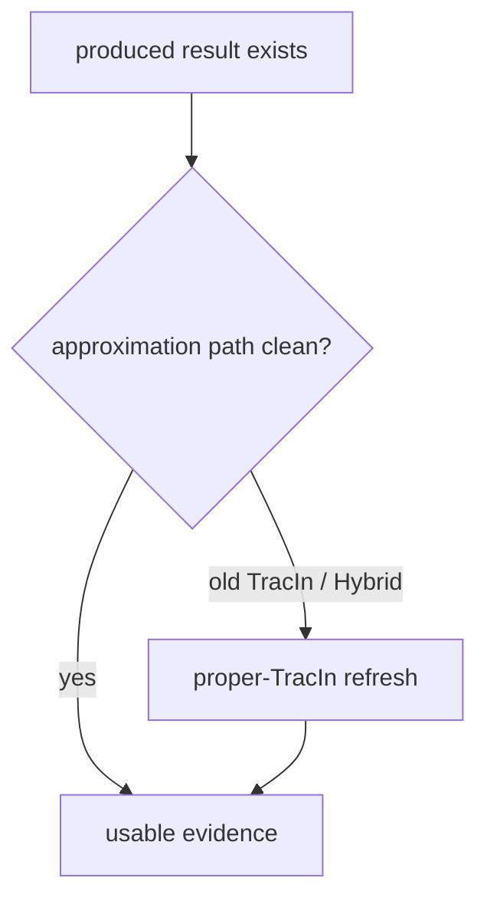

# 近似策略重合度实验

这页是 supplementary experiment 的第二部分：**IM / IF 这类近似策略是否仍然有效。**

它不只是看“最后选出来的节点是否重合”，而是问：

> 近似策略的代理目标，是否仍然对准我们声称的信号？

---

## 1. 为什么要单独开

IM 和 IF 都是近似方法。它们不是直接观测 unlearning damage，而是用 proxy 来选节点。公式和方法定义不放在本页，统一见 [[20_研究框架/20_方法与策略框架]]；本页只记录 supplementary 里要验证什么。

| 近似方法        | proxy                        | 要验证的问题                        |
| ----------- | ---------------------------- | ----------------------------- |
| IM          | propagation / coverage proxy | coverage 近似是否不是 degree 的伪装    |
| IF / TracIn | loss-sensitivity proxy       | Hessian-free IF 是否接近 real GIF |
| Hybrid      | IM + IF proxy                | 两个近似信号是否能互补，且 IF 分支是否干净       |

所以这部分比“策略输出重合度”更深一层：它检查 proxy 本身有没有对准。

---

## 2. IM 近似是否仍有效

IM 的风险是：看似高级，其实可能只是 degree 的昂贵版本。

当前 concordance 结果支持：

- IM 与 degree 在多数据集上重合低；
- 大图/密图上 IM 与 degree 更分开；
- 这说明 IM 的组合覆盖信号不是简单 degree。

谨慎说法：

> IM 没有在 set level 退化为 degree；它保留了独立 topology/coverage 信号。但这不自动说明 IM attack outcome 一定最强。

---

## 3. IF / TracIn 近似是否仍有效

IF 的风险是：cheap Hessian-free proxy 可能偏离 real graph IF。

concordance 的 model-based 部分显示：

- proper TracIn 与 GIF 的 overlap 明显高；
- deployed cross-TracIn 与 GIF 的 overlap 低；
- 因此“TracIn 近似 IF 是否有效”要分清是哪一种 TracIn。

这里暴露出一个子问题：旧 deployed TracIn 的定义不干净。具体公式边界见 [[20_研究框架/20_方法与策略框架#32-tracin--proper-tracin--gif-的公式边界]]。当前代码路径在 [tracin_strategy.py](../../attack/attack_strategies/tracin_strategy.py) 中使用 deployed cross-TracIn；Hybrid 通过 [hybrid_strategy.py](../../attack/attack_strategies/hybrid_strategy.py) 复用 TracIn 分数，所以一起受影响。

权威来源：

- [FINDING_tracin_misspecification.md](../../self/related_work/concordance/FINDING_tracin_misspecification.md)
- [HANDOFF.md](../../self/related_work/concordance/HANDOFF.md)
- [modelbased_cora.json](../../self/related_work/concordance/data/modelbased_cora.json)
- [modelbased_citeseer.json](../../self/related_work/concordance/data/modelbased_citeseer.json)
- [modelbased_pubmed.json](../../self/related_work/concordance/data/modelbased_pubmed.json)

---

## 4. 对主实验矩阵的影响

| 受影响对象 | 处理 |
|---|---|
| TracIn cells | produced 仍然是产物，但不能当 proper IF evidence |
| Hybrid cells | 因为融合 TracIn 分数，也需要 refresh |
| random / degree / pagerank / IM | 不受 TracIn 定义问题影响 |
| GraphRevoker | 是另一条 repair 线，不要和 TracIn refresh 混成一个问题 |

因此，矩阵读法要从旧的 `done` 改成：

这个决定已经进入 [config_inventory.html](../../self/dashboard/config_inventory.html) 的 produced / usable / rerun 口径。详见 [VALIDATION_LOG.md](../../self/dashboard/VALIDATION_LOG.md) 中 2026-07-01 的 IF-concordance 条目。

重跑和 cache 处理按 [[13_重跑与缓存修复Runbook]]；cache 层级见 [[14_Cache与结果层级]]。TracIn / Hybrid 要处理 `score_cache/if` 和对应 selection cache，但不要清 IM cache，也不要重跑 random / degree / pagerank / IM。

---

## 5. 框架层怎么讲

可以讲：

> supplementary overlap study 有两层：第一层说明 selector axis 不是虚设；第二层说明 IM 与 proper TracIn/GIF 这些近似信号确实各自保留独立含义。但旧 deployed TracIn 的 proxy 没有对准 evaluation-loss influence，因此 TracIn/Hybrid attack outcome 需要刷新。

不要讲：

> 旧 TracIn 结果已经证明 influence-based attack 弱。

当前口径：

- IM 没退化为 degree；
- proper TracIn 是更可信的 Hessian-free IF proxy；
- deployed TracIn / Hybrid 旧结果需要 refresh；
- correct IF attack 是否弱于 degree，要等 proper-TracIn attack rerun。

---

## 6. 面板跟踪

[config_inventory.html](../../self/dashboard/config_inventory.html) 已加入 `SUPP / overlap-validity` 块，用来跟踪本页相关的补充验证：

- `concordance_if_validity_gif_tracin`：3/3 produced，3/3 usable；但精确 GIF 数值在引用前仍需 LiSSA sensitivity。
- `concordance_overlap_damage_join`：0/1 produced；等 proper-TracIn / Hybrid attack rerun 后，连接 overlap-with-degree 与 attack damage。

因此当前结论边界是：proper TracIn 作为 Hessian-free IF proxy 更可信；旧 deployed TracIn / Hybrid 结果需要 refresh；correct IF attack 是否弱于 degree，要等 proper-TracIn attack rerun 后再写死。
