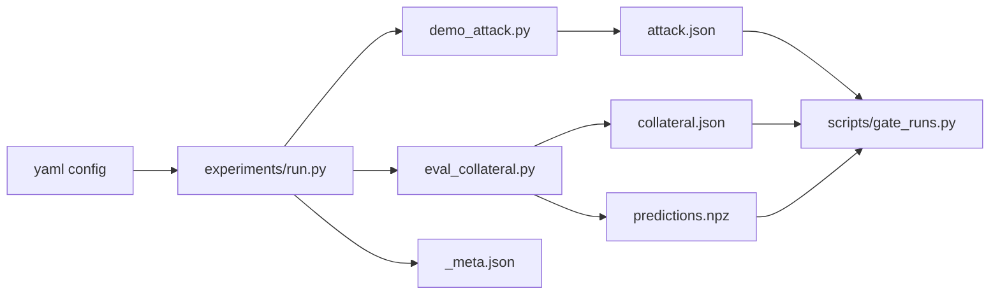

# 实验运行入口与脚本

这页说明现在实验到底怎么跑。

结论：**正式 Phase B 主矩阵靠 `experiments/run.py + yaml`，不是旧的 `.sh` 主流程。** `.sh` 现在主要是辅助链、诊断、补跑或服务器包装。

---

## 1. 正式入口

从 repo root 跑：

```powershell
E:/conda_package/envs/gnn/python.exe experiments/run.py experiments/configs/<config>.yaml
```

常用参数：

```powershell
E:/conda_package/envs/gnn/python.exe experiments/run.py experiments/configs/<config>.yaml --force
E:/conda_package/envs/gnn/python.exe experiments/run.py experiments/configs/<config>.yaml --dry_run
E:/conda_package/envs/gnn/python.exe experiments/run.py experiments/configs/<config>.yaml --limit 5
```

| 参数 | 用途 |
|---|---|
| no flag | 正式跑，已完成 cell 会 skip |
| `--force` | 修复后强制重跑；慎用，先看 [[13_重跑与缓存修复Runbook]] |
| `--dry_run` | 展开矩阵但不执行 |
| `--limit N` | 只跑前 N 个 cell，用于 sanity |

---

## 2. Run + Modify 工作方式

服务器上不是只“跑脚本”。遇到 GraphRevoker / TracIn 这类问题时，流程是：

1. 本地或服务器上最小修改代码 / yaml。
2. 用 `--dry_run` 或 `--limit 1` 看矩阵展开和单 cell 是否合理。
3. 必要时按 [[14_Cache与结果层级]] 清对应 cache。
4. 用 sanity yaml 或单 cell 小跑。
5. `gate_runs.py` 检查。
6. 通过后再开 full yaml / nohup chain。
7. 同步 [[13_重跑与缓存修复Runbook]]、`config_inventory` 和 TODO 台账。

小跑例子：

```powershell
E:/conda_package/envs/gnn/python.exe experiments/run.py experiments/configs/phase_b_cora_gcn.yaml --dry_run
E:/conda_package/envs/gnn/python.exe experiments/run.py experiments/configs/phase_b_cora_gcn.yaml --limit 1
```

GraphRevoker 修复后：

```powershell
E:/conda_package/envs/gnn/python.exe experiments/run.py experiments/configs/sanity_graphrevoker.yaml --force
```

TracIn 修复后：

```powershell
E:/conda_package/envs/gnn/python.exe experiments/run.py experiments/configs/phase_b_arxiv_tracin_smoke.yaml --force
```

---

## 3. 运行回路



服务器侧每个 cell 最后应有四件：`attack.json`、`collateral.json`、`predictions.npz`、`_meta.json`。回收到本地后，`predictions.npz` 默认不传；本地分析只要求 `attack.json`、`collateral.json`、`_meta.json` 对齐。

---

## 4. 常用 yaml

| config | 用途 |
|---|---|
| `experiments/configs/sanity_one_cell.yaml` | 环境烟测 |
| `experiments/configs/sanity_graphrevoker.yaml` | GraphRevoker 修复后最小 sanity |
| `experiments/configs/phase_b_cora_gcn.yaml` | Cora / GCN 主矩阵 |
| `experiments/configs/phase_b_cora_gat.yaml` | Cora / GAT 主矩阵 |
| `experiments/configs/phase_b_arxiv_feasibility.yaml` | arxiv random feasibility |
| `experiments/configs/phase_b_arxiv_T1_seed42.yaml` | arxiv T1 |
| `experiments/configs/phase_b_arxiv_T2_seed212.yaml` | arxiv T2 |
| `experiments/configs/phase_b_arxiv_T3_seed722.yaml` | arxiv T3 |
| `experiments/configs/phase_b_arxiv_tracin_smoke.yaml` | arxiv TracIn smoke |
| `experiments/configs/A5_ratio_*.yaml` | ratio sweep |
| `experiments/configs/A3_cora_*_alpha*.yaml` | alpha sweep |

配置总说明见 [experiments/configs/README.md](../../experiments/configs/README.md)。

---

## 5. `.sh` 脚本现在是什么角色

| 脚本 | 角色 | 是否主入口 |
|---|---|---|
| `scripts/post_redo_chain.sh` | 服务器上把多个 yaml 串起来：redo → ratio → alpha → gate → ship → shutdown | 包装脚本，不是实验定义源 |
| `scripts/diag_b1.sh` | 快速看 B.1 / 指定 cell 输出是否齐 | 诊断 |
| `experiments/baseline_k5/fill_missing_cora.sh` | 补 k=5 baseline 缺口 | 专项补跑 |
| `SERVER_RUNBOOK.md` 里的 `nohup bash -c ...` | 远程长任务包装，防 SSH 断开 | 运行包装 |

所以问“现在是不是靠 sh”时，准确回答是：

> 矩阵定义和 cell 执行靠 `experiments/run.py + yaml`；`.sh` 只负责把多个 yaml 串起来、做诊断或补 baseline。

---

## 6. 4090 小数据集线 vs arxiv 线

当前要分清两条运行线：

| 线 | 机器 | 主要内容 | 入口 |
|---|---|---|---|
| 4090 小数据集线 | RTX 4090 24GB | Cora GCN/GAT、ratio sweep、Citeseer、GIN、alpha sweep | [[16_4090小数据集运行与回收]] |
| arxiv 大图线 | 80GB GPU 为主；少量 IM-only 可 4090 | ogbn-arxiv TracIn / Hybrid / collateral retrain | [ARXIV_RUNBOOK.md](../../ARXIV_RUNBOOK.md) |

不要因为 4090 上有 arxiv 残留目录，就把它当成本轮小数据集主线的一部分。4090 这条线的关键判断是：小数据集结果是否完整、是否受代码/selector 变动影响、aggregate 是否覆盖新结果。完整且口径未变的实验不用重做。

资源估时见 [[17_CPU-GPU估时与资源分工]]。

---

## 7. 服务器常用写法

交互式，适合盯日志：

```bash
python -u experiments/run.py experiments/configs/phase_b_cora_gcn.yaml 2>&1 | tee logs/cora_gcn_$(date +%Y%m%d_%H%M).log
```

后台长跑：

```bash
nohup python experiments/run.py experiments/configs/phase_b_cora_gcn.yaml \
  > logs/cora_gcn_$(date +%Y%m%d_%H%M).log 2>&1 &
echo $! > logs/cora_gcn.pid
```

串多个 yaml：

```bash
nohup bash -c '
python experiments/run.py experiments/configs/phase_b_cora_gcn.yaml && \
python experiments/run.py experiments/configs/phase_b_cora_gat.yaml && \
python scripts/gate_runs.py experiments/configs/phase_b_cora_gcn.yaml && \
python scripts/gate_runs.py experiments/configs/phase_b_cora_gat.yaml
' > logs/cora_full_$(date +%Y%m%d_%H%M).log 2>&1 &
```

---

## 8. Gate 与同步

跑完后：

```powershell
E:/conda_package/envs/gnn/python.exe scripts/gate_runs.py experiments/configs/<config>.yaml
```

如果是路径级 gate：

```powershell
E:/conda_package/envs/gnn/python.exe scripts/gate_runs.py results/runs/cora_GCN_r0.05
```

同步：

- `config_inventory`：produced / usable / rerun。
- [[14_Cache与结果层级]]：如果产物层级或 cache 规则变了。
- [[13_重跑与缓存修复Runbook]]：如果修复流程变了。
- [[00_动态工作台/02_TODO台账]]：如果任务状态变了。

---

## 9. sanity 本地、4090 还是服务器跑

`sanity` 的意思是小型冒烟 / 健康检查：只证明修复路径能跑通，不等于论文证据。

GraphRevoker 修完后，`experiments/configs/sanity_graphrevoker.yaml` 可以作为最小检查；但这个 yaml 现在默认 `cuda: 0`。因此：

- 推荐路径：本地 5070 只做 coding、静态检查、`--dry_run` 和不碰 CUDA 的基本调试；真正执行 `sanity_graphrevoker.yaml` 放到 4090 小数据集线跑。
- 4090 是 GraphRevoker sanity、Cora/Citeseer 小图 rerun、ratio/alpha 等小数据集实验的正式运行位置；跑完后 gate、ship、aggregate，再同步 `config_inventory` 的 produced / usable / rerun。
- 只有在特别想本地先试一格时，才显式走 CPU：临时复制一份本地 CPU yaml，把 `defaults.cuda` 设为 `-1`，并在 PowerShell 里先设置 `$env:CUDA_VISIBLE_DEVICES=""`，避免项目内部模块直接探测到本地不可用 GPU。
- arxiv TracIn / Hybrid / collateral retrain 不走这条线，继续按 80GB GPU 方案处理。

参考命令：

```powershell
$env:CUDA_VISIBLE_DEVICES=""
E:/conda_package/envs/gnn/python.exe experiments/run.py experiments/configs/sanity_graphrevoker_cpu.local.yaml --force
```

不要把本地 CPU 临时 yaml 当作正式矩阵入口；正式入口仍是 4090/服务器上的 `sanity_graphrevoker.yaml` 和后续 full yaml。
