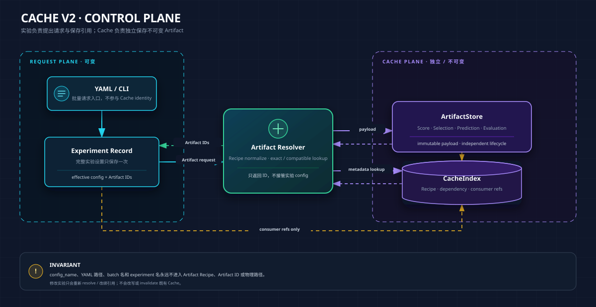
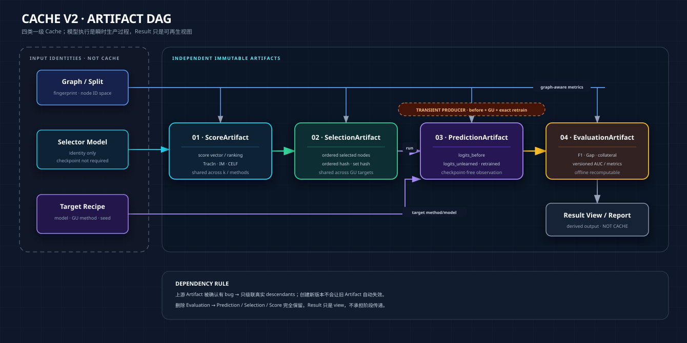

# Cache V2 架构与 Legacy 迁移方案

这页回答两个问题：

> OpenGU/GULib 的 Cache 怎样脱离实验 YAML/config 独立存在，同时支持跨实验复用、单件删除、自动补齐、真实依赖级联和安全迁移？

> 当前 Legacy ResultCache、SelectionCache、ScoreCache 与 `results/runs` 怎样进入 V2，同时抢救 selected nodes 和 predictions，不把历史 bug 一起升级成权威数据？

## 0. 一分钟结论

V2 只有四类一级 Cache：

~~~text
ScoreCache
    ↓
SelectionCache
    ↓
临时执行 GU + exact retrain
    ↓
PredictionCache
    ↓
EvaluationCache
~~~

锁死以下边界：

1. **Cache 与实验 config 文件无关。** `config_name`、YAML 路径、batch 名、experiment 名都不进入 Cache identity 和物理路径。
2. **Cache 只由产物的最小计算依赖决定。** 这些依赖组成 Artifact Recipe，不是分阶段保存的实验 config。
3. **实验只是 Cache 的消费者。** 实验设置在实验层完整保存一次，只引用 Artifact；它不拥有、命名或控制 Cache 生命周期。
4. **修改实验 config 不会让旧 Cache 失效。** 新请求重新解析并改绑引用；旧 Artifact 保持不可变，等待继续复用或零引用 GC。
5. **V2 不设 ResultCache。** 最终结果是 EvaluationArtifact 的组合视图，不再复制一份“大而全 AttackResult”。
6. **V2 不设模型 checkpoint 型 RunCache。** GU 与 retrain 临时执行，缓存统一的三套 logits；checkpoint 仍可由个别方法自行保留，但不进入 V2 核心契约。
7. **AUC、F1、Gap、collateral 都属于 Evaluation。** Prediction 保存原始观测，指标定义以后可以换版本并离线重算。
8. **上游 Artifact 真正有 bug 时，下游真实消费者失效；删除下游、修改实验、删除 YAML 都不能伤害共享上游。**
9. **SSH 真机索引验收只是 V2.1 门槛，不是 Legacy 删除授权。** 新计算写 V2、新旧结果对照、runner canary、Legacy 冻结与最终归档/删除必须按 §11.1 的六阶段 gate 逐项通过。

本 Markdown 仍是架构语义 source of truth；同名 HTML 只是浏览器导读版。V2.1 的可执行契约以 `cache_v2/contracts.py`、`cache_v2/schema.py` 与对应测试为实现层 source of truth，二者若有偏差必须 fail closed 并回写本页。

---

## 1. 当前 Legacy：As-Is

### 1.1 物理布局

~~~text
results/
├── cache/                         # Legacy 完整 ResultCache
│   └── <16位MD5>.json
│       ├── config
│       └── AttackResult
│           ├── selected_nodes
│           ├── f1_before / f1_after
│           ├── mia_auc
│           └── timing / cache trace
│
├── selection_cache/               # Legacy SelectionCache
│   └── <32位SHA256>.json
│       ├── selection config projection
│       └── selected_nodes / selection_time
│
├── score_cache/                   # Legacy ScoreCache
│   ├── if/                        # TracIn score
│   ├── im/                        # IM initial marginal gain
│   └── im_celf/                   # CELF sequence
│
└── runs/                          # 正式实验证据目录
    └── <dataset_model_ratio>/<method_strategy>/seed*/
        ├── attack.json
        ├── collateral.json
        ├── predictions.npz
        └── _meta.json

data/
├── GraphRevoker/                  # 方法副作用：checkpoint / processed state
├── GraphEraser/
└── GNNDelete/
~~~

### 1.2 当前执行顺序

~~~text
experiments/run.py
│
├─ 检查 results/runs 整 cell 是否有四件产物
│
├─ demo_attack
│    ├─ 先查 ResultCache
│    ├─ 再查 SelectionCache
│    ├─ selector 内再查 ScoreCache
│    └─ 执行 GU，写 attack.json
│
└─ eval_collateral
     ├─ 再次执行 before + GU + retrain
     ├─ 从 ResultCache 取 selected_nodes
     └─ 写 collateral.json + predictions.npz
~~~

Legacy 中“先查完整 ResultCache，再查更细 Cache”的宏观顺序没有问题；问题是完整 Result 同时承担缓存、阶段中转、身份和索引，miss 后又缺少统一 Artifact Resolver。

### 1.3 远端实测快照

2026-07-12 对 SSH `/autodl-fs/data/OpenGU/GULib-master` 的只读盘点：

| 路径 | 数量 / 规模 | 说明 |
|---|---:|---|
| `results/cache` | 783 JSON，约 6.2 MB | Legacy AttackResult |
| `results/selection_cache` | 110 JSON | method 字段为 0，实际上跨 method 共享 |
| `results/score_cache/if` | 32 组 JSON+NPZ | TracIn score |
| `results/score_cache/im` | 1 组 JSON+NPZ | IM score |
| `results/score_cache/im_celf` | 4 组 JSON+NPZ | CELF sequence |
| `results/runs` | 3146 文件，约 605 MB | 正式实验产物 |

一次完整解析 783 个 ResultCache JSON 约 26.1 秒。`eval_collateral` fallback 扫描使重复查询接近 `O(cells × cache_files)`。

### 1.4 已确认的 Legacy 问题

#### 问题一：ResultCache 同时承担四种职责

Legacy hash 文件同时承担：

- 产物身份；
- 查找索引；
- 分类；
- demo_attack 与 eval_collateral 的中转。

V2 必须拆成：

- Artifact Recipe：定义产物由什么真正输入决定；
- Artifact ID / content hash：定义不可变产物；
- ArtifactStore：保存 payload；
- SQLite：索引、依赖、消费者引用；
- 实验层：保存完整实验设置并引用 Artifact。

#### 问题二：attack 与 predictions 不是同一次执行

当前 `demo_attack` 和 `eval_collateral` 各自执行一次 GU。远端真实 cell `cora/GCN/GIF/random/seed42` 中：

~~~text
attack.json f1_after             = 0.8395
predictions logits_unlearned F1 = 0.8653
~~~

因此 `attack.json` 指标不能天然视为 `predictions.npz` 的派生结果。V2 必须让 PredictionArtifact 成为效果指标的唯一原始观测来源。

#### 问题三：AUC 名称与协议混乱

Legacy `mia_auc` 经历过：

- MEGU / GraphEraser 调用被注释后长期输出 0；
- 实际协议不是标准 shadow-model MIA，而是 posterior shift deletion audit；
- GIF/IDEA、GNNDelete/MEGU、GraphEraser/GraphRevoker 使用不同 forward、采样数量和 ensemble 查询方式。

V2 不把任何一个旧 AUC 定义写进 PredictionCache。只保存原始 logits、label、mask 和 selected nodes；AUC 由 versioned Evaluation Recipe 离线产生。

#### 问题四：方法 checkpoint 是无治理副作用

SSH 上 GraphRevoker、GraphEraser、GNNDelete 存在部分 checkpoint，GIF/IDEA/MEGU 没有统一持久化模型。现有文件名不能稳定绑定完整 cell、selection hash 和 producer version。

这些文件不升级为 V2 核心 RunCache。需要时只作为 method-local legacy state 审计。

#### 问题五：共享存在但不可治理

Score 与 Selection 已经被多个 method / experiment 共享，但系统没有可靠记录：

- 哪些 Artifact 消费了该上游；
- 哪些实验正在引用它；
- 一个上游有 bug 时真实下游范围是什么；
- 何时可以物理 GC。

---

## 2. V2 设计不变量

1. **ArtifactStore 独立于 experiment/config/YAML。**
2. **四类一级 Cache 固定：Score、Selection、Prediction、Evaluation。**
3. **Artifact immutable。** 已登记产物不原地改写；新内容产生新 Artifact ID。
4. **Artifact Recipe 只包含真正改变该产物的输入。** 不包含 config 名、YAML 路径、batch 名、报告名。
5. **实验设置在实验层完整保存一次。** Cache 中不保存四份“阶段 config”。
6. **实验通过引用消费 Artifact。** 修改或删除实验只改变引用，不改变 Artifact 内容与有效性。
7. **配置变化不是 Cache invalidation。** 新请求重新 resolve；旧 Artifact 继续存在。
8. **只有产物自身缺陷才触发 invalidation。** 包括 producer bug、明确退役版本、内容损坏和错误 provenance。
9. **上游 Artifact 失效只级联到真实 Artifact descendants。**
10. **删除下游不能伤害 parent、sibling 和其他消费者。**
11. **文件缺失与语义错误分开处理。** 能重建出相同 content hash 时，下游无需重算。
12. **SQLite 是可重建索引，不是 payload 和唯一真相。**
13. **Legacy 只读旁路迁移。** 验证前不批量重命名或删除。
14. **时间是 Artifact producer metadata，不是 Cache identity。**
15. **本架构只服务 OpenGU 实验治理，不扩张为通用工作流平台。**

---

## 3. 正确的对象关系

### 3.1 Cache、实验与 YAML

边界：

- YAML 可以改名、拆分、合并；Cache 不受影响。
- 两份 YAML 只要请求相同 Artifact Recipe，就命中同一个 Artifact。
- Experiment record 用于复现实验，不参与 Artifact identity。
- Cache 可以在没有任何当前实验 config 的情况下独立存在。

### 3.2 Artifact DAG

可选路径：

- random / degree / PageRank：Graph identity 直接产生 SelectionArtifact。
- IM：Graph → IM score / CELF → SelectionArtifact。
- TracIn：Graph + selector model identity → ScoreArtifact → SelectionArtifact。
- GU 与 retrain 只在生成 PredictionArtifact 时临时执行。
- Evaluation 可以同时依赖 PredictionArtifact 和 graph identity，例如 hop-decay。
- Result view 只组合 Evaluation 与 provenance，不复制成第五类 Cache。

---

## 4. 四类 Artifact 契约

### 4.1 ScoreArtifact

用途：保存昂贵 selector 中间结果，例如 TracIn score vector、IM marginal gain、CELF sequence。

最小内容：

~~~text
artifact_id
artifact_type = score
recipe
recipe_hash
content_hash
producer_version
ordered score/ranking payload
compute_seconds
provenance
~~~

典型 Recipe：

| Strategy | 真正依赖 |
|---|---|
| TracIn | graph fingerprint、selector model identity、score algorithm/version、query set、相关超参 |
| IM | graph fingerprint、IM version、MC seed、candidate policy、相关超参 |
| degree/PageRank | 通常不需要单独 ScoreArtifact；需要保存 ranking 时只依赖 topology 与算法版本 |

### 4.2 SelectionArtifact

用途：保存有序 selected nodes，是多个 GU method 的共享上游。

最小内容：

~~~text
artifact_id
artifact_type = selection
recipe / recipe_hash
selected_nodes_ordered
ordered_nodes_hash
node_set_hash
source_score_artifact_id（可空）
graph_fingerprint
candidate_set_hash
producer_version
compute_seconds
~~~

共享边界：

| Strategy | 合理共享范围 |
|---|---|
| degree / PageRank | 跨 GU method、跨 target model；依赖 topology/ranking/k |
| IM | 跨 GU method、跨 target model；依赖 graph、IM recipe、selector seed、k |
| random | 同一 graph/split、random recipe、seed、k |
| TracIn | 同一 selector model identity、score recipe、query set、k |
| hybrid | 同一分支 Artifact 与 fusion recipe、k |

SelectionArtifact 不是一份实验配置，也不属于创建它的 YAML。

### 4.3 PredictionArtifact

用途：保存一次标准化执行产生的原始预测观测。V2 不要求保存 checkpoint。

固定核心：

~~~text
logits_before      [N, C]
logits_unlearned   [N, C]
logits_retrained   [N, C]
~~~

必要上下文：

~~~text
y                  [N]
train_mask         [N]
test_mask          [N]
retain_mask        [N]
selected_nodes     [K]
node_id_space
class_order
graph_fingerprint
selection_artifact_id
target method/model recipe
producer_version
compute_seconds
~~~

可选 producer timing breakdown：

~~~json
{
  "compute_seconds": 18.4,
  "timing_breakdown": {
    "before": 5.1,
    "unlearn": 2.3,
    "retrain": 10.6,
    "export": 0.4
  }
}
~~~

约束：

- `compute_seconds` 必须有；breakdown 可选。
- `retrain_time` 不作为一级字段，不影响 Artifact 完整性。
- `selection_reuse_time` 不保存进正式 Artifact。
- method 自报的 `avg_unlearning_time` 只可放入 `legacy_timing`，不用于跨方法统一比较。
- GraphEraser/GraphRevoker 必须输出统一全局 node ID 空间的 aggregate posterior，不能把单 shard model 输出伪装成全局 PredictionArtifact。

### 4.4 EvaluationArtifact

用途：由 PredictionArtifact 和必要的只读输入派生指标。

#### 4.4.1 单 Prediction 指标：V2.0 核心

这类指标只依赖一个 PredictionArtifact 与必要的只读 graph/split 输入，可以直接进入 V2 EvaluationCache：

- F1 before / unlearned / retrained；
- F1 drop；
- approximation/retrain gap；
- mean/max prediction shift；
- fraction flipped；
- hop-distance collateral decay；
- degree alignment；
- posterior-based AUC family。

Evaluation Recipe 必须 versioned。例如：

~~~json
{
  "metric": "update_detection_auc",
  "version": "v2",
  "prediction_artifact_id": "pred_xxx",
  "positive_policy": "selected_nodes",
  "negative_policy": "deterministic_matched_test",
  "sampling_seed": 2024,
  "score_function": "softmax_l2"
}
~~~

PredictionCache 不决定 AUC 定义。由现有 logits 可以继续计算 confidence、loss、entropy、KL/JS shift 等 posterior-based AUC。需要 shadow model、embedding 或 gradient 的未来攻击不属于纯 Prediction evaluator，需要另建对应上游 Artifact 类型或扩展 Prediction schema；当前 V2 不提前设计。

#### 4.4.2 跨 cell / cohort 指标：独立指标层

以下指标依赖多个 Prediction/Evaluation、budget-matched random 对照或多 seed，不伪装成单 Prediction Evaluation：

- paired effect；
- noise / volume / attack decomposition；
- paired t-test；
- budget efficiency；
- 跨 method / dataset / backbone 的聚合统计。

V2.0 先把这些指标及其输入清单记录在独立 metrics/cohort 段；它们可以由 Result view / report 动态生成。只有确认反复计算成本值得缓存时，才增加显式的 `input_artifact_ids[] + cohort_recipe`，不影响 Score、Selection、Prediction 主路径。

### 4.5 Result view 不是 Cache

人类需要的一个 cell 结果可以动态组合：

~~~text
Experiment provenance
+ Selection reference
+ Prediction reference
+ requested Evaluation artifacts
= Result view / report row
~~~

可以为了导出生成 JSON/CSV/HTML，但这些是可再生 view，不进入 Cache identity，也不反向给阶段传数据。

---

## 5. Artifact Recipe：不是实验 config

### 5.1 定义

Artifact Recipe 是某个产物的最小计算依赖集合。它由 Resolver 从请求的实际值中规范化构造，但不保存为“该阶段的实验 config”。

~~~text
完整 ExperimentConfig：实验层保存一次，用于复现
Artifact Recipe：Cache 内描述某一产物怎样生成
~~~

禁止进入 Recipe 的字段：

- `config_name`；
- YAML 文件路径与文件名；
- batch 名；
- experiment display name；
- 报告路径；
- 与该产物输出无关的 method/evaluator 参数。

### 5.2 四类 Recipe

| Artifact | Recipe 核心依赖 | 不应包含 |
|---|---|---|
| Score | graph、selector identity、score algorithm/version、相关参数 | target GU method、YAML 名、k（若保存完整 ranking） |
| Selection | source score/ranking 或 topology recipe、selection rule、seed、k | target GU method、target seed（若无关）、metric |
| Prediction | graph/split identity、SelectionArtifact、target model/method recipe、run seed | AUC/F1 定义、报告配置、YAML 名 |
| Evaluation | PredictionArtifact、metric recipe、必要 graph identity | selector 内部参数、训练 checkpoint 路径、YAML 名 |

### 5.3 selector model 与 target model

TracIn 必须区分：

~~~text
selector_model_identity = 谁产生 score / selection
target_model_recipe     = 谁接受删除并执行 GU
~~~

模型身份是 Recipe 的一部分，不要求持久化模型 checkpoint。它至少包含 architecture、训练 seed、训练相关参数、graph/split identity 和 producer version。

这使以下共享自然成立：

~~~text
GCN-TracIn SelectionArtifact
├── GCN target / GNNDelete
├── GAT target / GNNDelete
└── GIN target / GNNDelete
~~~

---

## 6. Artifact ID、物理目录与 SQLite

### 6.1 物理布局

~~~text
results/cache_v2/
├── artifacts/
│   ├── score/
│   │   └── <human-readable-semantic-scope>/<artifact_id>.json|npz
│   ├── selection/
│   │   └── <human-readable-semantic-scope>/<artifact_id>.json
│   ├── prediction/
│   │   └── <human-readable-semantic-scope>/<artifact_id>.json|npz
│   └── evaluation/
│       └── <metric-family>/<artifact_id>.json|npz
└── index.sqlite

results/experiment_records/        # Cache 之外
└── <experiment_id>.json           # 完整 config + artifact refs

results/batch_records/             # 可选，Cache 之外
└── <submission_id>.json           # 某次 YAML 展开了哪些 experiment
~~~

上图是 V2.2 以后可能采用的目标布局，不是 V2.1 已创建的 payload 目录。V2.1 只定义可空的 `semantic_path` 字段，并强制它是规范化相对路径：禁止绝对路径、`..` 穿越和对当前 cwd 的隐式依赖。精确目录层级暂不拍死；以下仅是非规范性候选：

~~~text
score/cora/selector-GCN/tracin-proper-v1/
selection/cora/tracin-proper-v1/k108/
prediction/cora/target-GIN/GNNDelete/r0.05/seed42/
evaluation/update-detection-v2/
~~~

未来目录不能包含 A6、C6 或 YAML 名称。V2.1 不写正式 payload，也不创建 `artifacts/`；只有显式 `legacy index --apply` 才允许创建 `results/cache_v2/index.sqlite`，默认 dry-run 连数据库和目录都不创建。

### 6.2 Artifact ID

建议：

~~~text
artifact_id = <type-prefix>_<recipe-hash-prefix>_<content-hash-prefix>
~~~

例：

~~~text
sel_7f2a31c8_91ab72e4
pred_553a20d1_bbd402ac
~~~

- `recipe_hash` 用于查找语义相同的候选；
- `content_hash` 用于验证真实 payload；
- 同一 `(artifact_type, recipe_hash)` 只允许一个正式 Artifact；正常请求应直接 hit。
- 强制重算得到相同 `content_hash` 时视为验证成功，不新增 Artifact。
- 强制重算得到不同 content 时，原 Artifact 保持有效，新 payload 进入 quarantine 并登记 conflict；不能覆盖原件，也不能注册成第二个 `valid` Artifact。

### 6.3 CacheIndex

SQLite schema version 1 只保存 metadata、关系和可重建索引，不保存大型 JSON/NPZ payload：

~~~text
schema_meta(key, value)

artifacts(
  artifact_id, artifact_type, recipe_hash, content_hash, recipe_json,
  semantic_path, producer_version_json, status, verification_status,
  compute_seconds, created_at, header_version, metadata_json
)

dependencies(
  parent_artifact_id,
  child_artifact_id,
  relation
)

consumer_refs(
  consumer_type, consumer_id, artifact_id, created_at, metadata_json
)

legacy_sources(
  legacy_source_id, artifact_id?, legacy_kind, legacy_path, path_kind,
  source_root, observed_artifact_type?, observed_recipe_hash?,
  raw_content_hash?, semantic_content_hash?, verification_status,
  size_bytes, mtime_ns, imported_at, metadata_json
)

artifact_conflicts(
  conflict_id, artifact_type, recipe_hash, existing_artifact_id?,
  existing_content_hash, observed_content_hash, legacy_source_id?,
  quarantine_path?, detected_at, metadata_json
)
~~~

关键约束：

- `UNIQUE artifacts(artifact_type, recipe_hash)`，保证一个 Recipe 只有一个正式 Artifact；
- `content_hash` 负责验证 payload，不负责让同 Recipe 的多个正式结果并存；
- 不同 content 写入 `artifact_conflicts` 与 quarantine，不参与 Resolver hit；
- `INDEX dependencies(parent_artifact_id)`；
- `INDEX dependencies(child_artifact_id)`；
- `INDEX consumer_refs(artifact_id)` 与 `(consumer_type, consumer_id)`；
- `legacy_sources.artifact_id` 可空：只读扫描到的 Legacy source 不是正式 Artifact；
- schema version 同时检查 `schema_meta`、`PRAGMA user_version` 与完整 DDL fingerprint；同版本但缺约束/索引也拒绝打开；
- 写操作使用显式事务，异常回滚；数据库缺失、损坏、版本不符或 row/header 自洽性失败时一律 fail closed；
- Legacy 活跃路径保存相对 `results` 的规范化路径，外部 source 才保存明确绝对路径；
- 小型 Recipe/header metadata 有大小上限，任何 payload 都不得塞进 SQLite；
- append-only `index.jsonl` 在 V2.1 明确暂缓。

未来正式 Artifact Store 落地后，损坏的 `index.sqlite` 必须能由 versioned header/sidecar 重建。V2.1 先定义统一 `ArtifactHeader` metadata model，但不决定它最终嵌入 JSON/NPZ 还是使用统一 sidecar，也不写正式 payload。

---

## 7. Resolver 与自动补齐

### 7.1 查询流程

V2.1 只实现 read-only exact explain：

~~~text
1. 从显式最小 Recipe 计算稳定 recipe_hash
2. exact lookup 正式 Artifact，并列出同 Recipe 的 Legacy exact candidates
3. 检查 status、verification、conflict 与全部 parent dependency health
4. 只有正式候选 valid + verified、无 conflict、无坏祖先才解释为 hit
5. 否则返回明确 miss reasons；Legacy candidate 只展示，不自动 promotion
6. 不计算、不写 Artifact、不执行 compatible/prefix hit
~~~

V2.2 以后的目标流程才会继续 compatible lookup、Legacy promotion gate、必要计算和实验引用登记。

同 Recipe 已有正式 Artifact 时：content 相同即复用；content 不同即 fail closed，将新 payload 隔离并登记 conflict。Resolver 永远不会在两个正式候选之间猜测。

Resolver 不接收或查询 `config_name`。V2.1 的实际入口是：

~~~powershell
python scripts/cachectl.py resolve explain --type selection --recipe recipe.json
~~~

### 7.2 Compatible hit

以下仍是 V2.2 设计规则，V2.1 未实现正式执行：

- 相同有序 ranking/sequence 支持多个 k；较大 k 可以通过 `SelectionRef(artifact_id, take_first_k)` 服务较小 k，不需要复制一个新 Artifact；
- Prediction 必须同时记录本次实际使用的 `take_first_k` 和有效前缀 `ordered_nodes_hash`，不能只记录来源 Artifact ID；
- 前缀复用要求 strategy/version、seed、候选池与排序算法完全相同。degree/PageRank/固定 score ranking 天然满足；deterministic random permutation 也可满足；
- IM CELF 只有在候选池相同时才能安全截断。当前剪枝规则是 `n_keep = max(floor(M × candidate_fraction), k)`：例如 `M=1000, fraction=0.1`，`k=50` 的候选池是 top-100，而 `k=200` 的候选池是 top-200；后者的前 50 个不保证等于直接在 top-100 上得到的 k=50。因此 Resolver 必须比较 `candidate_set_hash`，相同才允许 prefix hit；
- 同一 SelectionArtifact 跨 GU method / target backbone 复用；
- 同一 PredictionArtifact 支持多个 metric version；
- metric 修改只创建新的 EvaluationArtifact。

兼容命中必须有显式规则和 provenance，不能靠扫描后猜测“看起来像”。

### 7.3 Repair-on-read

以下属于 V2.2+，V2.1 不执行 repair 写回：

1. **低成本且可无损恢复**：自动重建；content hash 相同则恢复原 Artifact。
2. **当前请求真正需要且缺失**：计算新 Artifact 并登记。
3. **昂贵但当前请求不需要**：不自动预热。
4. **Legacy provenance 不足**：注册为 `legacy_degraded`，不能伪造 authoritative Artifact。

---

## 8. 实验 config 与 Cache 生命周期彻底分离

### 8.1 Experiment record

实验层完整保存一次有效设置，并只保存 Artifact 引用：

~~~json
{
  "experiment_id": "exp_20260712_xxx",
  "effective_config": {
    "dataset": "cora",
    "selector_model": "GCN",
    "target_model": "GIN",
    "strategy": "tracin",
    "method": "GNNDelete",
    "ratio": 0.05,
    "seed": 42
  },
  "artifact_refs": {
    "score": "score_xxx",
    "selection": {
      "artifact_id": "sel_xxx",
      "take_first_k": 108,
      "effective_ordered_nodes_hash": "sha256:..."
    },
    "prediction": "pred_xxx",
    "evaluations": ["eval_gap_xxx", "eval_auc_xxx"]
  }
}
~~~

`effective_config` 不复制进 Score/Selection/Prediction/Evaluation 四处。

### 8.2 修改 config

修改 config 的语义不是 invalidate Cache，而是重新 resolve：

~~~text
旧 Experiment reference
        ↓ 修改请求
Resolver 查找新请求所需 Artifact
        ├─ 已存在 → 改绑引用
        └─ 不存在 → 生成新 Artifact 后改绑

旧 Artifact 完全不变
        ├─ 仍有消费者 → 保留
        └─ 零引用且满足 GC 条件 → 日后清理
~~~

示例：

| 操作 | Cache 行为 |
|---|---|
| YAML 改名 | 什么都不发生 |
| 一个 YAML 拆成两个 | 什么都不发生 |
| 两个 YAML 合并 | 什么都不发生 |
| 新增一个 method | 复用已有 Score/Selection，只 resolve Prediction/Evaluation |
| target model GAT → GIN | Score/Selection 可复用，resolve 新 Prediction/Evaluation |
| AUC v1 → v2 | 复用 Prediction，生成新 Evaluation |
| selector recipe 改变 | resolve 新 Score/Selection；旧 Artifact 不失效 |
| 删除一个实验 | 解除 consumer refs；不直接删除 Cache |

### 8.3 为什么仍然需要 consumer refs

引用只服务：

- 审计“哪个实验用了哪个 Artifact”；
- 计算零引用；
- 防止 GC 删除仍在使用的共享产物；
- 展示一个 Artifact 的消费者。

引用不参与 Artifact identity，也不赋予实验对 Artifact 的所有权。

---

## 9. Invalidation、删除与 GC

### 9.1 只有 Artifact 自身问题才 invalid

合法 invalidation 原因：

- producer 代码 bug；
- 算法版本被明确判废；
- payload content hash 不一致；
- graph/model provenance 错误；
- Legacy 已确认受污染。

不合法的 invalidation 原因：

- YAML 改名；
- experiment config 修改；
- 报告不再使用；
- 某个消费者删除；
- 另一个 method 需要重跑。

### 9.2 真实级联

~~~text
retire(artifact_id, reason)
→ 将该 Artifact 标记 invalid/retired
→ 通过 dependencies 枚举全部真实 descendants
→ descendants 标记 blocked_by_parent / invalid
→ consumer records 显示需要重新 resolve
→ parents、siblings、无关 consumers 不变
~~~

示例：

~~~text
Selection S1
├── Prediction GIF-P1
├── Prediction GNNDelete-P1
└── Prediction GraphRevoker-P1

S1 被确认由 selector bug 产生
→ S1 与三个真实 Prediction descendants 失效
→ S1 的 Score parent 保留
→ 其他 Selection siblings 保留
~~~

如果只是 selector recipe 升级而 S1 本身没有 bug，则创建 S2 并让新请求使用 S2；S1 不失效。

### 9.3 删除与 GC

删除操作分三类：

| 操作 | 语义 |
|---|---|
| unlink consumer | 解除实验/报告引用，不删除 Artifact |
| retire artifact | 判定产物不可信，级联真实 descendants |
| gc artifact | 零引用、无有效 child、超过保留期后物理删除 |

GC 必须满足：

- 无 consumer refs；
- 无有效 child dependency；
- 不属于冻结审计证据；
- 超过保留期；
- dry-run 已明确列出删除范围。

---

## 10. AUC 与时间的最终处理

### 10.1 AUC 延迟到 Evaluation

PredictionArtifact 已保存三套 logits、`y`、mask 和 selected nodes，因此可以以后选择：

- update-detection AUC；
- confidence AUC；
- loss/entropy AUC；
- KL/JS posterior shift AUC；
- 不同 deterministic negative sampling policy。

每种定义产生独立 EvaluationArtifact。旧 `mia_auc` 只作为 legacy derived value，不迁移为权威 V2 指标。

### 10.2 时间只记录原始计算成本

每个 Artifact 保存：

~~~text
compute_seconds = 该 Artifact 原始生产耗时
~~~

不进入正式 Artifact 的字段：

- `selection_reuse_time`；
- cache lookup latency；
- 含义不统一的旧 `total_time`。

单实验逻辑计算成本动态求和：

~~~text
cell_compute_time =
    score.compute_seconds
  + selection.compute_seconds
  + prediction.compute_seconds
  + evaluation.compute_seconds
~~~

一批实验的真实 Artifact 生产成本按 unique Artifact 去重求和。`retrain_time` 只作为可选 Prediction producer breakdown，不是核心字段。

旧 OpenGU `avg_unlearning_time` 的边界由各 method 自行定义，是上游技术债；V2 保留时只能写入 `legacy_timing`，统一成本使用外层 Artifact producer wall time。

---

## 11. Legacy 迁移方案

下面的 Phase 0–6 是技术工作分解；是否允许切换或删除，以 §11.1 的六阶段验收门为准。任何单次 SSH 验收都不得跨过中间 gate。

### Phase 0：冻结与盘点

- 旧 `results/cache`、`selection_cache`、`score_cache` 只读；
- 记录远端 branch/SHA、文件数、mtime、content hash；
- 不批量重命名、不先删除 ResultCache；
- 标注已知 bug/version 范围。

### Phase 1：一次性 Legacy Index

~~~powershell
python scripts/cachectl.py legacy index --root results --dry-run
~~~

输出：

- source path；
- 推断的 Artifact type 与 Recipe；
- selected-node ordered/set hash；
- prediction payload keys；
- producer/version 缺口；
- 同 Recipe 内容冲突；
- `verified / degraded / invalid / unknown` 建议状态。

远端旧快照中的 783 个 ResultCache JSON 只在建库时扫描一次；V2.1 `cachectl`/Resolver 的 metadata 查询走 SQLite，runner 与现有 Cache 查询路径仍未接入。

V2.1 于 2026-07-13 对当前本地 checkout 执行了上述精确 dry-run；这是本地证据，不覆盖 §1.3 的远端历史快照：

| 项目 | 本地 dry-run 结果 |
|---|---:|
| 物理文件 / 逻辑 Legacy source | 2521 / 2508 |
| Legacy kind | Result 8；Selection 9；Score 13；run attack/collateral/meta 各 826 |
| 候选类型 | Score 13；Selection 835；Evaluation 826；无法权威归类 834 |
| 建议状态 | degraded 1673；invalid 1；unknown 834 |
| conflict / 同 content duplicate group | 1 / 1 |
| 默认排除目录 | 2 |
| 主要异常 | dangling selection ref 706；缺 graph fingerprint 826；缺 run component 826；Recipe 不完整 1652 |

夹心快照覆盖每个 active Legacy 文件的相对路径、大小、mtime 与 SHA-256：扫描前后均为 2521 文件、12,644,658 bytes，aggregate 均为 `3e4fb7eb2129c69705cea626bf8ca70e2f3275fbf00ef478f6b883558e0e2b90`。命令报告 `writes=[]`，真实 `results/cache_v2/index.sqlite` 不存在。

2026-07-14 从 SSH 隔离代码检出 `9b90ad4` 运行 `cachectl`，并把远端真实目录 `/autodl-fs/data/OpenGU/GULib-master/results` 作为 `--root` 完成 Gate 1；真实主 checkout 的 branch/HEAD 全程未切换。这次证据仅验收 **V2.1 Legacy 只读索引**，不表示真实 Selection payload cold/warm hit 已测：

| 项目 | SSH Gate 1 实测 |
|---|---:|
| dry-run 物理文件 / 逻辑 Legacy source | 4113 / 4076 |
| dry-run 写入 | 0；不创建 `results/cache_v2` 或 SQLite |
| Legacy 夹心快照 | `file_states` 集合、每项 SHA-256 与 mtime 扫描前后完全不变 |
| 显式 `--apply` 唯一新增文件 | `results/cache_v2/index.sqlite` |
| SQLite 内容 | `legacy_sources=4076`；`artifact_conflicts=5`；正式 `artifacts=0` |
| 数据库验证 | integrity、schema version 与 DDL fingerprint 核对通过 |
| 远端测试 | `tests/test_cache_v2.py` 41 passed；SQLite、schema 与路径人工故障注入均 fail closed |

本次 `--apply` 只建立 Legacy source 索引，没有 promotion、没有正式 Artifact、没有 payload 写入，也没有修改 runner 或 Legacy 查询路径。远端 active inventory 比 2026-07-13 本地快照多 1592 个物理文件和 1568 个逻辑 source；两边的“物理数−逻辑数”分别为 37 和 13，来自 ScoreCache JSON sidecar 与 NPZ payload 两个物理文件合并为一个逻辑 source，不是扫描丢文件。

### Phase 2：抢救 Score 与 Selection

优先注册最昂贵且共享价值最高的产物：

1. ScoreCache 原地注册；
2. SelectionCache 与 `results/runs/**/attack.json` 双源核对；
3. 记录 `ordered_nodes_hash`、`node_set_hash`、selector version、selector model identity、graph fingerprint；
4. provenance 不足时标 `legacy_degraded`，不自动裁决冲突。

### Phase 3：注册 PredictionArtifact

- 从 `predictions.npz` 提取标准 schema；
- 验证 shape、node ID、mask、selected nodes 与 graph fingerprint；
- GIF/IDEA pre-fix、GraphRevoker/GraphEraser 已知问题按 producer/version gate；
- 不把 `attack.json` 的 F1/AUC 当作 Prediction 的权威字段；
- 不迁移 checkpoint 型 RunCache。

### Phase 4：离线生成 EvaluationArtifact

- 从 Prediction 统一计算 F1、Gap、shift、flip、hop-decay；
- 选择 versioned AUC evaluator 后批量补算；
- 对比 Legacy JSON 只做差异报告，不强求复制旧数字；
- 已知污染 Prediction 不生成 authoritative Evaluation。

### Phase 5：切换主查询路径

- demo_attack / runner 使用 ArtifactResolver；
- selection 通过 `selection_artifact_id` 显式传递；
- Prediction 成为全部效果指标唯一原始来源；
- `eval_collateral` 不再扫描 ResultCache；
- 实验记录写在 Cache 之外，只保存完整 config 与 refs。

### Phase 6：退役 Legacy ResultCache

本段只是技术候选步骤，不是删除授权。只有 §11.1 Gate 1–6 全部通过并对删除范围单独审批后，才可以删除 Legacy ResultCache：

- selected nodes 已完成双 hash 抢救；
- Prediction 注册与 bug gate 完成；
- 关键 Evaluation 离线回算通过；
- Resolver 不再读取 ResultCache 作为阶段中转；
- 迁移覆盖率、`consumer_refs`、新旧结果一致性已验收；
- 冻结备份、回滚窗口和删除清单已生成。

### 11.1 六阶段验收门（2026-07-14 锁定）

| Gate | 必须证据 | 当前状态 |
|---|---|---|
| 1. SSH 真机验收 V2.1 | dry-run 零写入；Legacy hash/mtime 不变；`--apply` 只写 `results/cache_v2/index.sqlite`；SQLite、路径和 schema 异常 fail closed；本地/远端统计可解释 | **已通过**（2026-07-14，`9b90ad4`） |
| 2. 新计算只写 V2 | 不双写 Legacy；Legacy 只作历史读取/迁移源；补齐 payload、versioned header 和 conflict resolution | 未通过 |
| 3. 新旧结果对照 | 抽样对照 Score、Selection、Prediction、Evaluation；Selection 节点有序序列精确一致；Prediction 按明确浮点容差比较，不要求文件 hash 相同 | 未通过 |
| 4. runner 切换 V2 | 先小范围 canary，通过后再设默认；查询失败禁止静默回退 Legacy | **硬阻塞**：当前只有 conflict fail-closed 检测与 durable marker，没有可审计解除流程 |
| 5. Legacy 冻结 | 完全只读；保留明确回滚窗口；列出所有尚未迁移 Legacy Artifact | 未通过 |
| 6. 归档或删除 Legacy | 迁移覆盖率、`consumer_refs`、结果一致性、回滚备份全部通过，并对物理范围单独审批 | 未通过 |

Gate 必须按顺序推进。**Gate 1 的一次真机通过绝不授权 Legacy 删除。** Gate 4 之前，conflict 解除机制是硬门槛：需要明确人工授权、保留原冲突证据、产生可追溯 resolution record，并证明 Resolver 只在解除后重新允许 hit。当前的 marker 只能阻止误命中，不是 resolution workflow。

这也意味着：2026-07-14 尚未完成真实 Selection payload 的 cold miss → warm hit、producer 哨兵与 payload mtime 验证；该证据属于 Gate 2/4 前的隔离 canary，不得用 Gate 1 的 SQLite 命中解释替代。

---

## 12. GraphRevoker 当前最小闭环

在 V2 主路径落地前：

1. 范围固定为 Cora r0.05、GCN/GAT、random/degree/pagerank/im、5 seeds，共 40 selection identities。
2. 双源核对 ablating 与 4090 `attack.json`；当前盘点为 40/40 存在、零 node-set 冲突。
3. 将这 40 组注册为冻结 SelectionArtifact，不从当前局部 Cache 重新定义节点。
4. 先跑 GCN/degree/seed42 canary。
5. 新 Prediction 必须绑定 SelectionArtifact ID 与 selected-node hash。
6. canary 通过后扩 40 cells。
7. TracIn/Hybrid 等 selector version 锁定后再进入正式迁移。

---

## 13. Cache V2 解锁的实验：L2-surrogate transfer

V2 把 selector model identity 与 target model recipe 分开后，可正常表达：

~~~text
GCN selection → GCN target
GCN selection → GAT target
GCN selection → GIN target
~~~

### C.6a same-architecture surrogate

| 项目 | 设计 |
|---|---|
| Selector producer | 独立训练的 GCN surrogate |
| Target | GCN + GNNDelete |
| Seeds | 5 |
| 新增规模 | 5 cells |
| 目的 | 隔离相同 architecture、不同权重/seed 的迁移损失 |

### C.6b cross-backbone surrogate

| 项目 | 设计 |
|---|---|
| Selector producer | GCN surrogate |
| Target | GAT / GIN + GNNDelete |
| Seeds | 5 |
| 新增规模 | 10 cells |
| 目的 | 模拟不知道 target backbone 的 query-free surrogate transfer |

边界：

- 这是 L2-surrogate / query-free 灰盒迁移，不称纯黑盒；
- 正式实验先锁定 `proper-tracin-v1`；
- deployed cross-TracIn 只作 legacy diagnostic；
- 不同实验 YAML 可以直接复用同一 GCN SelectionArtifact。

---

## 14. 实施顺序

### V2.0 架构契约

- [x] 四类 Artifact：Score / Selection / Prediction / Evaluation。
- [x] Cache 与 YAML/config/experiment identity 解耦。
- [x] Experiment settings 只在实验层保存一次。
- [x] Prediction 三套 logits 固定，不要求 checkpoint。
- [x] AUC 延迟到 versioned Evaluation。
- [x] Artifact producer time 规则。
- [x] immutable Artifact DAG、引用、retire 与 GC 语义。
- [x] selector model / target model 分离。
- [x] Recipe schema、versioned Artifact header metadata model 与 SQLite DDL 已机器化并通过测试。

### V2.1 只读索引

- [x] 建立独立轻量 `cache_v2/` 包：四类 Artifact、Recipe canonicalization、SHA-256 identity、header、producer 与状态契约。
- [x] 实现 schema v1 与六张表：`schema_meta / artifacts / dependencies / consumer_refs / legacy_sources / artifact_conflicts`。
- [x] 实现初始化、三重 schema 检查、事务回滚、唯一正式 Artifact、幂等与 conflict fail-closed。
- [x] 实现默认零写 dry-run 的 Legacy indexer；archive/deprecated/backup/`cache_v2` 默认排除，坏单文件不中断全扫描。
- [x] ResultCache 只登记为 Legacy source；provenance 不足只给 `unknown/degraded`，没有 promotion 成正式 Artifact。
- [x] 实现 artifact `status / parents / children / consumers` 与 exact-only `resolve explain`。
- [x] 临时 fixture 可建库、查询 dependency/consumer、验证 idempotent/conflict；本地与 SSH 真实目录 dry-run 均完成且 hash/mtime 不变。
- [x] 本地 `tests/test_cache_v2.py` 41 passed、既有相关测试 77 passed；远端 `9b90ad4` 上 41 passed，SQLite/schema/路径人工故障注入均 fail closed。
- [x] SSH 真实目录 `--apply` 验收完成：唯一新增文件为 `results/cache_v2/index.sqlite`，其中 `legacy_sources=4076`、`artifact_conflicts=5`、正式 `artifacts=0`。
- [x] 未修改 runner、现有 Cache 查询路径或任何 Legacy 文件；真实 Selection payload hit、promotion 与 Legacy 退役仍未进入 V2.1。

实现包使用顶层 `cache_v2/`，而非建议的 `attack/cache_v2/`：当前 `attack/__init__.py` 会连带导入严格解析 CLI argv 的实验配置，放在其下会让独立 `cachectl legacy ...` 在进入子命令前失败。该选择保持 runner 与旧查询路径零改动。

### V2.2 Score / Selection 主路径

- gate：先评审 Legacy promotion policy、header carrier 与 semantic directory；冲突或 provenance 缺口未清零的 source 不得 promotion；
- 注册现有 ScoreCache；
- 建 SelectionArtifact Store；
- demo_attack、eval_collateral 接受 selection artifact reference；
- 建 ranking/prefix compatible lookup；
- 建 ordered/set 双 hash 校验。

### V2.3 Prediction / Evaluation 主路径

- 建统一 Prediction exporter；
- 修正 shard ensemble PredictionProvider；
- 建离线 evaluator；
- attack/collateral/AUC 都从同一 PredictionArtifact 派生；
- 不再生成 V2 ResultCache。

### V2.4 引用、退役与 GC

- 实验记录与 Cache 分离；
- consumer refs；
- artifact retire cascade；
- reference-aware GC；
- local CPU / SSH GPU 最小 Artifact transfer。

---

## 15. 建议 CLI

V2.1 已实现：

~~~powershell
# 默认 dry-run；不创建目录或数据库
python scripts/cachectl.py legacy index --root results --dry-run

# 显式建只读索引；唯一写入目标是 results/cache_v2/index.sqlite
python scripts/cachectl.py legacy index --root results --apply

# 查看一个正式 Artifact
python scripts/cachectl.py artifact status sel_xxx

# 解释一次 Recipe 查询为什么 hit / miss
python scripts/cachectl.py resolve explain --type selection --recipe recipe.json

# 查看真实上下游和消费者
python scripts/cachectl.py artifact parents sel_xxx
python scripts/cachectl.py artifact children sel_xxx
python scripts/cachectl.py artifact consumers sel_xxx
~~~

V2.2+ 设计占位，V2.1 未实现：

~~~powershell
# 只解除某个实验引用，不删除 Cache
cachectl consumer unlink --experiment exp_xxx --artifact sel_xxx --dry-run

# 只解除某个实验引用，不删除 Cache
cachectl consumer unlink --experiment exp_xxx --artifact sel_xxx --dry-run

# Artifact 确认有 bug 后退役并展示真实级联
cachectl artifact retire sel_xxx --reason selector-bug --cascade --dry-run

# 无损修复缺失 payload
cachectl artifact repair pred_xxx --dry-run

# 零引用垃圾回收
cachectl gc --dry-run

~~~

V2.1 没有删除、retire、repair 或 GC 写命令。未来这些命令仍必须默认 dry-run；正式执行必须打印 Artifact、parents、children、consumers 与保留项。

---

## 16. V2 验收标准

### Cache 与 config 解耦

- 两份不同 YAML 请求同一 Recipe，返回同一 Artifact ID；
- YAML 改名、移动、拆分、合并不改变任何 Artifact ID；
- config 名、experiment ID 不出现在 Artifact Recipe 和物理路径；
- 修改 experiment config 只重新 resolve 和改绑引用，不修改旧 Artifact status；
- 删除 experiment 只解除 refs，不直接删除共享 Artifact。

### 查询与性能

- exact lookup 不遍历 payload 目录；
- Score / Selection compatible lookup 走 index；
- 783 个 Legacy ResultCache 只在建库时扫描一次；
- index 可由 Artifact header/sidecar 重建。

### 正确性

- V2 只有 Score、Selection、Prediction、Evaluation 四类一级 Cache；
- Prediction 固定三套 logits 与必要上下文；
- F1、Gap、collateral、AUC 均从 Prediction 离线产生；
- paired effect、paired t-test、budget efficiency 等跨 cell 指标留在独立 metrics/cohort 层，不伪装成单 Prediction Evaluation；
- 同一 cell 的权威指标与 Prediction 一致；
- 同 Recipe 最多一个正式 Artifact；不同 content 只能进入 quarantine/conflict，不参与 hit；
- 大 k 前缀复用必须绑定 `take_first_k`、有效前缀 hash 与相同 `candidate_set_hash`；
- Selection 内容真正有 bug 时全部 Artifact descendants 可枚举；
- 仅创建新 selector version 时旧 Selection 不被错误判 invalid；
- 删除 Evaluation 不影响 Prediction、Selection 和 Score；
- 修改 metric recipe 只产生新 Evaluation。

### 可审计性

任意权威 Evaluation 都能回答：

- 来源 PredictionArtifact 是哪个；
- Prediction 使用哪个 SelectionArtifact；
- graph/split fingerprint 是什么；
- selector model identity 与 target method/model recipe 是什么；
- selected-node ordered/set hash 是什么；
- producer/evaluator version 是什么；
- payload content hash 是什么；
- compute_seconds 是多少；
- 来源是 V2 计算还是 Legacy promotion。

### 迁移安全

- Legacy 未在验证前原地覆盖；
- 已知 bug 产物不会升级成 authoritative Artifact；
- GraphRevoker 40 组 selection 双源一致；
- ResultCache 删除前 selected nodes 和 Prediction 已完成抢救；
- GC 不删除仍被任何 consumer 引用的 Artifact。

---

## 17. 已拍板与 V2.1 保守落点

### 已拍板

- V2 四类 Cache：Score、Selection、Prediction、Evaluation。
- V2 删除 ResultCache，不设计 checkpoint 型 RunCache。
- Cache 与实验 config/YAML/experiment identity 无关。
- Cache 只由最小 Artifact Recipe 决定。
- Experiment settings 完整保存一次，只引用 Artifact。
- config 修改不 invalid Cache；Artifact bug 才 invalid，并级联真实 descendants。
- Prediction 固定 before/unlearned/retrained logits。
- posterior-based AUC 后续离线选择定义。
- 单 Prediction Evaluation 与跨 cell/cohort 指标分层；后者先由 metrics/report view 管理。
- 同 Recipe 只有一个正式 Artifact；异常重算内容进入 quarantine/conflict。
- SelectionArtifact 支持显式 `take_first_k` 前缀复用，但必须验证候选池一致。
- `selection_reuse_time` 不进入正式 Artifact；`total_time` 动态求和；`retrain_time` 仅可选 breakdown。
- 统一 Resolver、分散 payload、SQLite 可重建索引。
- Legacy 只读旁路迁移，ResultCache 删除前先抢救 selected nodes 与 Prediction。
- C.6a/C.6b 进入实验计划，并跨 YAML 复用相同 SelectionArtifact。

### V2.1 保守落点（已拍板）

1. **Artifact header**：先定义统一、versioned `ArtifactHeader` metadata model；V2.1 不写正式 payload，嵌入 JSON/NPZ 还是统一 sidecar 留到 V2.2 gate。
2. **semantic directory**：V2.1 只建立可空 `semantic_path` 与严格相对路径验证；精确目录层级不在本阶段拍死。
3. **producer version**：数据模型同时支持显式 `semantic_version` 与 `source_fingerprint`；正式 `valid` Artifact 至少提供其中一种，允许二者同时存在。
4. **状态机**：Artifact status 固定为 `valid / degraded / invalid / corrupt / missing / retired / unknown / conflict`；另设 `verified / degraded / invalid / corrupt / missing / unknown` verification status，避免把对象生命周期与验证强度混为一谈。
5. **灾备索引**：V2.1 只维护 SQLite，append-only `index.jsonl` 明确暂缓；正式 payload/header store 落地前不伪造可重建承诺。
