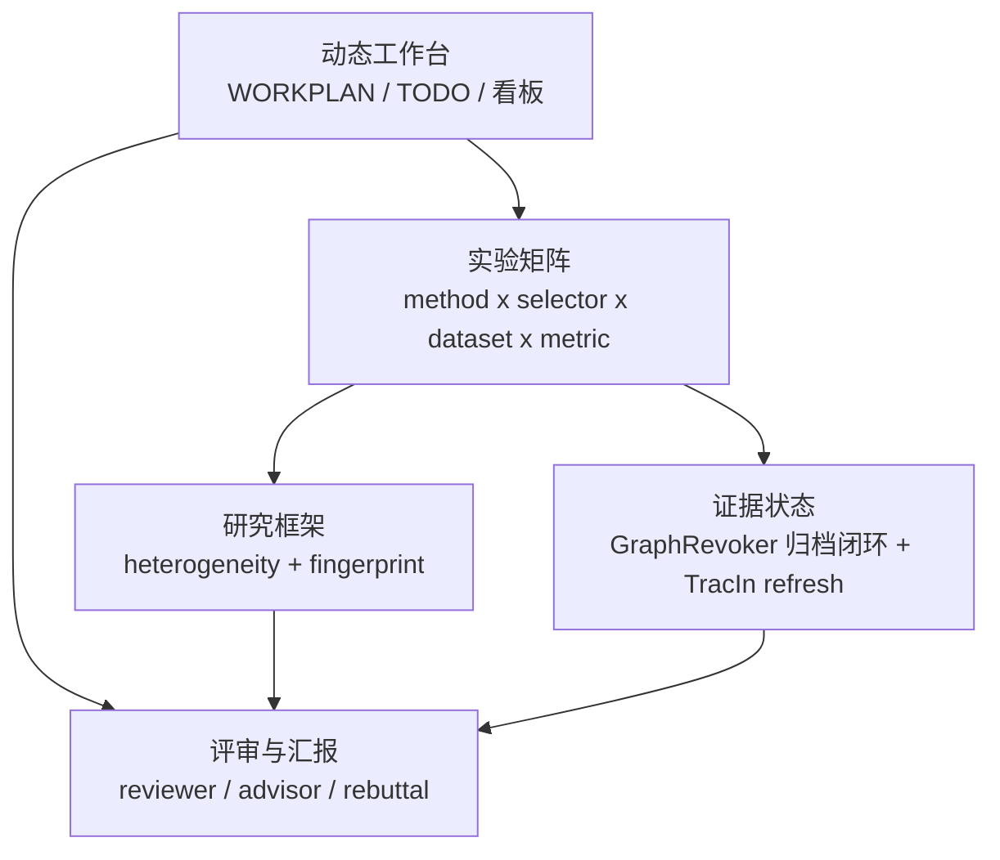

# 文档地图 — OpenGU / GULib

这个 OB 库给人看，不做机器索引。现在按“动态工作台 / 实验矩阵 / 研究框架 / 评审汇报”组织。

> 原则：OB 负责理解和讲述；dashboard 负责状态和数字。
> 每次只新增一个你会读的文件，读完再长下一页。

---

## 大结构

| 文件夹 | 作用 | 当前文件 |
|---|---|---|
| `00_动态工作台/` | 当前计划、TODO、看板入口；和框架页分开 | [[00_动态工作台/00_工作台入口]] · [[00_动态工作台/01_WORKPLAN同步]] · [[00_动态工作台/02_TODO台账]] |
| `10_实验矩阵/` | 实验设计、矩阵读法、selector/method/metric 轴、cache 与重跑 | [[10_实验矩阵/10_实验-框架总览]] · [[10_实验矩阵/11_策略输出重合度实验]] · [[10_实验矩阵/12_近似策略重合度实验]] · [[10_实验矩阵/13_重跑与缓存修复Runbook]] · [[10_实验矩阵/14_Cache与结果层级]] · [[10_实验矩阵/15_实验运行入口与脚本]] · [[10_实验矩阵/16_4090小数据集运行与回收]] · [[10_实验矩阵/17_CPU-GPU估时与资源分工]] · [[10_实验矩阵/18_AutoDL_4090连接与加速]] · [[10_实验矩阵/19_Cache架构重设计与迁移方案]] |
| `20_研究框架/` | threat model、contribution、fingerprint、方法/selector 定义 | [[20_研究框架/20_方法与策略框架]] · [[20_研究框架/21_TracIn变体与GIF关系]] |
| `30_评审与汇报/` | reviewer / advisor / AI review / rebuttal 工作台 | [[30_评审与汇报/31_评审意见与rebuttal]] |

---

## 一张总图

---

## 当前要读

| 顺序 | 文件 | 为什么 |
|---|---|---|
| 0 | [[00_动态工作台/00_工作台入口]] | 先看当前任务、看板和同步规则 |
| 1 | [[00_动态工作台/02_TODO台账]] | 看规划手记 / review 拆成了哪些待办 |
| 2 | [[10_实验矩阵/13_重跑与缓存修复Runbook]] | 看修复结论、回归测试、失效数据和剩余归档边界 |
| 3 | [[10_实验矩阵/14_Cache与结果层级]] | 看 cache / result 分层，知道该动哪层 |
| 4 | [[10_实验矩阵/15_实验运行入口与脚本]] | 看现在主流程是 run.py + yaml，sh 只是包装 |
| 5 | [[10_实验矩阵/16_4090小数据集运行与回收]] | 看 4090 小数据集远端结果、回收和不重跑规则 |
| 6 | [[10_实验矩阵/17_CPU-GPU估时与资源分工]] | 看 CPU-bound / GPU-bound 分工和估时 |
| 7 | [[10_实验矩阵/18_AutoDL_4090连接与加速]] | 看 SSH alias、免密、network_turbo 和当前实例连接口径 |
| 8 | [[10_实验矩阵/19_Cache架构重设计与迁移方案]] | 当 ResultCache / SelectionCache / selected_nodes source of truth 纠缠时读 |
| 9 | [[20_研究框架/20_方法与策略框架]] | 先知道 random / degree / IM / IF / GIF 各是什么 |
| 10 | [[20_研究框架/21_TracIn变体与GIF关系]] | 明确 deployed TracIn / proper TracIn / GIF / self-influence 的公式边界 |
| 11 | [[10_实验矩阵/10_实验-框架总览]] | 把实验矩阵和框架关系放对 |
| 12 | [[10_实验矩阵/11_策略输出重合度实验]] | supplementary experiment 第一部分：不同 selector 是否选同一批节点 |
| 13 | [[10_实验矩阵/12_近似策略重合度实验]] | supplementary A.7：IM coverage 与 trajectory influence 的 proxy validity；production/GU 另设 gate |
| 14 | [[30_评审与汇报/31_评审意见与rebuttal]] | 看审稿压力和 rebuttal 任务 |

---

## 权威入口

| 需要核对什么 | 打开 |
|---|---|
| 当前任务和决策 | [[00_动态工作台/01_WORKPLAN同步]] · [WORKPLAN.md](../self/dashboard/WORKPLAN.md) |
| 统一 TODO | [[00_动态工作台/02_TODO台账]] |
| 修复结论 / 回归 / 失效数据 | [[10_实验矩阵/13_重跑与缓存修复Runbook]] |
| cache / result 分层 | [[10_实验矩阵/14_Cache与结果层级]] |
| cache 架构重设计 / selected_nodes 迁移 | [[10_实验矩阵/19_Cache架构重设计与迁移方案]] |
| run.py / yaml / sh 关系 | [[10_实验矩阵/15_实验运行入口与脚本]] |
| 4090 小数据集运行与回收 | [[10_实验矩阵/16_4090小数据集运行与回收]] |
| CPU/GPU 估时与资源分工 | [[10_实验矩阵/17_CPU-GPU估时与资源分工]] |
| AutoDL 4090 SSH / 免密 / 加速 | [[10_实验矩阵/18_AutoDL_4090连接与加速]] |
| 阶段 kanban | [progress.html](../self/dashboard/progress.html) |
| 实验 produced / usable / rerun | [config_inventory.html](../self/dashboard/config_inventory.html) |
| 看板验收与遗留口径 | [CONFIG_INVENTORY_ACCEPTANCE.md](../self/dashboard/CONFIG_INVENTORY_ACCEPTANCE.md) |
| paper 硬伤映射 | [PAPER_LIABILITIES_MAP.md](../self/dashboard/PAPER_LIABILITIES_MAP.md) |
| evidence / validation | [VALIDATION_LOG.md](../self/dashboard/VALIDATION_LOG.md) |
| TracIn / GIF 公式学习页 | [[20_研究框架/21_TracIn变体与GIF关系]] |
| TracIn 不匹配 finding | [FINDING_tracin_misspecification.md](../self/related_work/concordance/FINDING_tracin_misspecification.md) |
| concordance handoff | [HANDOFF.md](../self/related_work/concordance/HANDOFF.md) |
| 0701 当前汇报 | [current-status-report.html](../report/progress/2026-07-01_advisor-report/current-status-report.html) |
| reviewer / AI / advisor 意见 | [[30_评审与汇报/31_评审意见与rebuttal]] |
| 规划手记原始输入 | [[规划手记]] |

---

## 后续规则

- 动态工作台只放当前任务、看板、TODO，不写长机制解释。
- 运行方式、cache 分层、rerun 修复属于实验矩阵的运维页，放在 `10_实验矩阵/`。
- 4090 小数据集 runbook 和 CPU/GPU 估时也属于 `10_实验矩阵/`；arxiv 只作为外部大图专线链接，不并入 4090 小数据集页。
- 研究框架单独放在 `20_研究框架/`，不要被 WORKPLAN 内容淹没。
- 实验和框架不拆散；先在 [[10_实验矩阵/10_实验-框架总览]] 里连起来。
- 方法介绍放在 `20_研究框架/`，实验页只讲验证设计和结果。
- TracIn / GIF 的公式理解放在 [[20_研究框架/21_TracIn变体与GIF关系]]；A/B–C–D taxonomy 归 [[10_实验矩阵/11_策略输出重合度实验]]，proxy validity 与 production 边界归 [[10_实验矩阵/12_近似策略重合度实验]]。
- review / advisor / AI 意见统一进 [[30_评审与汇报/31_评审意见与rebuttal]]，再拆到 [[00_动态工作台/02_TODO台账]]。
- 改 [WORKPLAN.md](../self/dashboard/WORKPLAN.md) 后同步 [[00_动态工作台/01_WORKPLAN同步]] 和 [[00_动态工作台/02_TODO台账]]。
