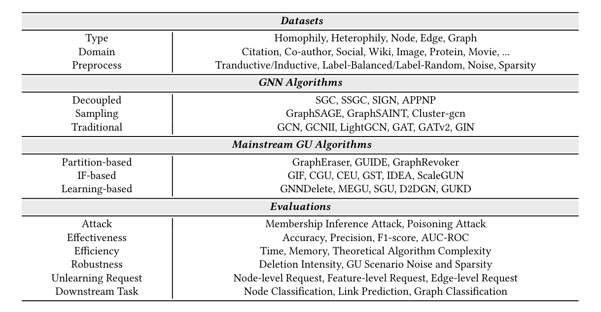
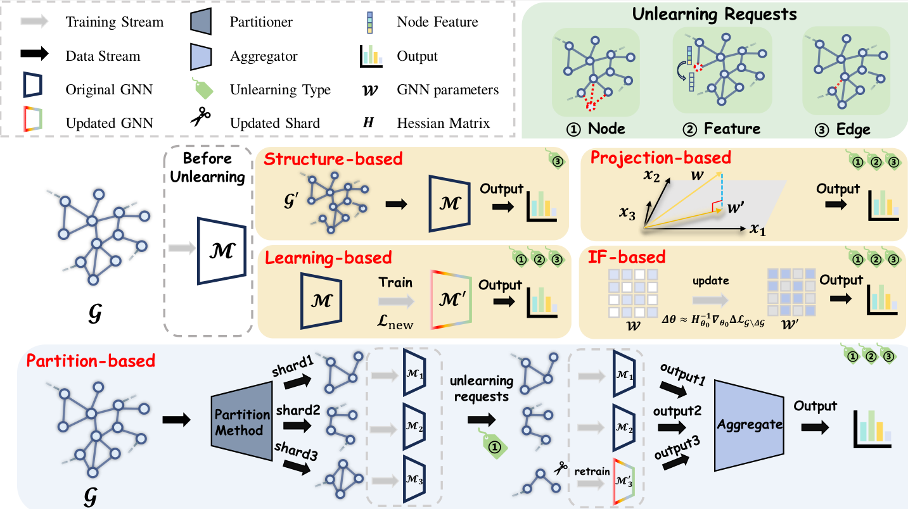

<div align="center">
  
</div>

------

<p align="center">
  <a href="https://gu.readthedocs.io/en/latest/">Docs</a> •
  <a href="#overview-of-the-benchmark">Overview of the Benchmark</a> •
  <a href="#installation">Installation</a> •
  <a href="#quick-start">Quick Start</a> •
  <a href="#reference">Reference</a>
</p>


<p align="center">
  <a href="https://gu.readthedocs.io/en/latest/?badge=latest">
  </a>
  
  
</p>


# OpenGU

## 📝 Abstract

> **Graph Machine Learning (GML)** has become integral to understanding and analyzing complex relational data, highlighting the growing necessity for **Graph Unlearning (GU)** to address challenges in removing sensitive information from trained graph neural networks (GNNs). Differing from machine unlearning in computer vision (CV) or large language models (LLMs), GU presents unique challenges due to the intricate interactions within graph entities, the diversity of downstream tasks, and the varied nature of unlearning requests. Despite the proliferation of diverse GU strategies, the lack of standardized experimental setups and evaluation criteria, and the limited flexibility in combining downstream tasks and unlearning requests have yielded inconsistencies in comparisons, hindering the thriving development of this research domain. To fill this gap, we have integrated **16 SOTA GU algorithms** and **19 multi-domain datasets** within OpenGU, enabling a variety of downstream tasks on **7 GNN backbones** when responding to flexible unlearning requests. Based on this unified benchmark framework, we are able to provide a comprehensive and fair evaluation for GU. Through extensive experimentation, we have drawn crucial **conclusions** about the effectiveness of existing GU methods, while also gaining valuable insights into its limitations, shedding light on potential avenues for future research.

## 📚 Introduction

OpenGU is an open-source platform designed to provide a comprehensive benchmark for **Graph Unlearning**. This project aims to facilitate the evaluation and development of Graph Unlearning methodologies by offering standardized datasets, frameworks, and tools. OpenGU leverages advanced techniques in Graph Structure Learning (GSL) to enhance the performance and robustness of Graph Neural Networks (GNNs) across various applications.

<div align="center">
  
  <p align="center"><em>Figure 1: Overview of the Graph Unlearning Methods Implemented in OpenGU.</em></p>
</div>

## <span id="overview-of-the-benchmark">📈 Overview of the Benchmark</span>

OpenGU offers a robust and standardized benchmark for evaluating **Graph Unlearning** methods. It ensures a fair comparison between different approaches by providing consistent datasets, evaluation metrics, and experimental setups. This benchmark is instrumental in advancing research in Graph Unlearning, promoting reproducibility, and accelerating innovation in the field.

<div align="center">
  
  <p align="center"><em>Figure 2: Overall Benchmark Framework of OpenGU.</em></p>
</div>

## 🗂️ Dataset Overview

Graph unlearning scenarios are fundamentally data-driven, making the meticulous selection of datasets indispensable for evaluating the effectiveness of graph unlearning strategies. To assess the effectiveness, efficiency, and robustness of these methods for node or edge-related tasks, we have carefully selected **19 datasets**.

### Node and Edge-Level Tasks:

- **Citation Networks:** Cora, Citeseer, PubMed
- **Co-author Networks:** CS, Physics
- **Image Networks:** Flickr
- **E-commerce and Product Networks:** Photo, Computers, ogbn-products, Amazon-ratings
- **Scientific and Knowledge Networks:** DBLP, ogbn-arxiv
- **Webpage Networks:** Squirrel, Chameleon
- **Actor Networks:** Actor
- **Online Gaming:** Minesweeper
- **Crowdsourcing Platform:** Tolokers
- **Historical and Social Q&A Contexts:** Roman-empire, Questions

### Graph Classification Tasks:

- **Compounds Networks:** MUTAG, PTC-MR, BZR, COX2, DHFR, AIDS, NCI1, ogbg-molhiv, ogbg-molpcba
- **Protein Networks:** ENZYMES, DD, PROTEINS, ogbg-ppa
- **Movie Networks:** IMDB-BINARY, IMDB-MULTI
- **Collaboration Networks:** COLLAB
- **3D Shapes and Image Superpixels:** ShapeNet, MNISTSuperPixels

#### Statistical Overview

**Table 2: Statistical Overview of Datasets for Node and Edge-Level Tasks in OpenGU Benchmarking**

| Datasets         | Nodes    | Edges      | Features | Classes | Type        | Description           |
|------------------|----------|------------|----------|---------|-------------|-----------------------|
| Cora             | 2,708    | 5,278      | 1,433    | 7       | Homophily   | Citation Network      |
| Citeseer         | 3,327    | 4,732      | 3,703    | 6       | Homophily   | Citation Network      |
| PubMed           | 19,717   | 44,338     | 500      | 3       | Homophily   | Citation Network      |
| DBLP             | 17,716   | 52,867     | 1,639    | 4       | Heterophily | Co-author Network     |
| ogbn-arxiv       | 169,343  | 1,166,243  | 128      | 40      | Homophily   | Citation Network      |
| CS               | 18,333   | 81,894     | 6,805    | 15      | Homophily   | Co-author Network     |
| Physics          | 34,493   | 247,962    | 8,415    | 5       | Homophily   | Co-author Network     |
| Photo            | 7,487    | 119,043    | 745      | 8       | Homophily   | Co-purchasing Network |
| Computers        | 13,381   | 245,778    | 767      | 10      | Homophily   | Co-purchasing Network |
| ogbn-products    | 2,449,029| 61,859,140 | 100      | 47      | Homophily   | Co-purchasing Network |
| Chameleon        | 2,277    | 36,101     | 2,325    | 5       | Heterophily | Wiki-page Network     |
| Squirrel         | 5,201    | 216,933    | 2,089    | 5       | Heterophily | Wiki-page Network     |
| Actor            | 7,600    | 29,926     | 931      | 5       | Heterophily | Actor Network         |
| Minesweeper      | 10,000   | 39,402     | 7        | 2       | Homophily   | Game Synthetic Network|
| Tolokers         | 11,758   | 519,000    | 10       | 2       | Homophily   | Crowd-sourcing Network|
| Roman-empire     | 22,662   | 32,927     | 300      | 18      | Heterophily | Article Syntax Network|
| Amazon-ratings   | 24,492   | 93,050     | 300      | 5       | Heterophily | Rating Network        |
| Questions        | 48,921   | 153,540    | 301      | 2       | Homophily   | Social Network        |
| Flickr           | 89,250   | 899,756    | 500      | 7       | Heterophily | Image Network         |

**Table 3: Statistical Overview of Datasets for Graph-Level Tasks in OpenGU Benchmarking**

| Datasets         | Graphs  | Nodes    | Edges  | Features | Classes | Description           |
|------------------|---------|----------|--------|----------|---------|-----------------------|
| MUTAG            | 188     | 17.93    | 19.79  | 7        | 2       | Compounds Network     |
| PTC-MR           | 344     | 14.29    | 14.69  | 18       | 2       | Compounds Network     |
| BZR              | 405     | 35.75    | 38.36  | 56       | 2       | Compounds Network     |
| COX2             | 467     | 41.22    | 43.45  | 38       | 2       | Compounds Network     |
| DHFR             | 467     | 42.43    | 44.54  | 56       | 2       | Compounds Network     |
| AIDS             | 2,000   | 15.69    | 16.20  | 42       | 2       | Compounds Network     |
| NCI1             | 4,110   | 29.87    | 32.30  | 37       | 2       | Compounds Network     |
| ogbg-molhiv      | 41,127  | 25.50    | 27.50  | 9        | 2       | Compounds Network     |
| ogbg-molpcba     | 437,929 | 26.00    | 28.10  | 9        | 2       | Compounds Network     |
| ENZYMES          | 600     | 32.63    | 62.14  | 21       | 6       | Protein Network       |
| DD               | 1,178   | 284.32   | 715.66 | 89       | 2       | Protein Network       |
| PROTEINS         | 1,113   | 39.06    | 72.82  | 4        | 2       | Protein Network       |
| ogbg-ppa         | 158,100 | 243.40   | 2,266.10 | 4      | 37      | Protein Network       |
| IMDB-BINARY      | 1,000   | 19.77    | 96.53  | degree  | 2       | Movie Network         |
| IMDB-MULTI       | 1,500   | 13.00    | 65.94  | degree  | 3       | Movie Network         |
| COLLAB           | 5,000   | 74.49    | 2,457.78 | degree | 3       | Collaboration Network |
| ShapeNet         | 16,881  | 2,616.20 | KNN    | 3        | 50      | Point Cloud Network   |
| MNISTSuperPixels | 70,000  | 75.00    | 1,393.03 | 1      | 10      | Super-pixel Network   |

#### Data Preprocessing Enhancements

To achieve a standardized and versatile partitioning in OpenGU, we implemented code that allows arbitrary dataset split ratios, enabling researchers to customize partitions to suit their needs and experiment requirements. In addition to flexible splitting, we also consider label balance within class distributions by providing both balanced and random partitioning options. Furthermore, we introduce preprocessing enhancements that allow datasets to function under both transductive and inductive inference scenarios, permitting evaluations under various settings and offering a broader assessment of algorithm performance.

## 🧠 Algorithm Framework

### GNN Backbones

To evaluate the generalizability of GU algorithms, we incorporate three predominant paradigms of GNN models within our benchmark: **Traditional GNNs**, **Sampling GNNs**, and **Decoupled GNNs**. Each category encompasses a variety of state-of-the-art models, providing a comprehensive foundation for assessing Graph Unlearning methods.

<div style="display: flex; flex-wrap: wrap; gap: 20px; justify-content: center;">
  
  <!-- Traditional GNNs -->
  <div style="width: 30%; min-width: 200px;">
    <h4 style="text-align: center; color: #003f5c;">Traditional GNNs</h4>
    <ul style="list-style: none; padding: 0;">
      <li>🔹 **GCN**</li>
      <li>🔹 **GAT**</li>
      <li>🔹 **GCNII**</li>
      <li>🔹 **GIN**</li>
      <li>🔹 **Others**</li>
    </ul>
  </div>
  
  <!-- Sampling GNNs -->
  <div style="width: 30%; min-width: 200px;">
    <h4 style="text-align: center; color: #58508d;">Sampling GNNs</h4>
    <ul style="list-style: none; padding: 0;">
      <li>🔸 **GraphSAGE**</li>
      <li>🔸 **GraphSAINT**</li>
      <li>🔸 **ClusterGNN**</li>
    </ul>
  </div>
  
  <!-- Decoupled GNNs -->
  <div style="width: 30%; min-width: 200px;">
    <h4 style="text-align: center; color: #bc5090;">Decoupled GNNs</h4>
    <ul style="list-style: none; padding: 0;">
      <li>🔹 **SGC**</li>
      <li>🔹 **SSGC**</li>
      <li>🔹 **SIGN**</li>
      <li>🔹 **APPNP**</li>
    </ul>
  </div>
  
</div>

### GU Algorithms

Our framework encompasses **16 state-of-the-art GU algorithms**, meticulously reproduced based on source code or detailed descriptions in relevant publications. These algorithms are categorized into **Partition-based**, **IF-based (Influence Function-based)**, and **Learning-based** methods, each leveraging distinct strategies for effective graph unlearning.

<div style="display: flex; flex-wrap: wrap; gap: 20px; justify-content: center;">
  
  <!-- Partition-based -->
  <div style="width: 30%; min-width: 200px;">
    <h4 style="text-align: center; color: #ff6361;">Partition-based</h4>
    <ul style="list-style: none; padding: 0;">
      <li>🔸 **GraphEraser**</li>
      <li>🔸 **GUIDE**</li>
      <li>🔸 **GraphRevoker**</li>
    </ul>
  </div>
  
  <!-- IF-based -->
  <div style="width: 30%; min-width: 200px;">
    <h4 style="text-align: center; color: #ffa600;">IF-based</h4>
    <ul style="list-style: none; padding: 0;">
      <li>🔹 **GIF**</li>
      <li>🔹 **CGU**</li>
      <li>🔹 **CEU**</li>
      <li>🔹 **GST**</li>
      <li>🔹 **IDEA**</li>
      <li>🔹 **ScaleGUN**</li>
    </ul>
  </div>
  
  <!-- Learning-based -->
  <div style="width: 30%; min-width: 200px;">
    <h4 style="text-align: center; color: #003f5c;">Learning-based</h4>
    <ul style="list-style: none; padding: 0;">
      <li>🔸 **GNNDelete**</li>
      <li>🔸 **MEGU**</li>
      <li>🔸 **SGU**</li>
      <li>🔸 **D2DGN**</li>
      <li>🔸 **GUKD**</li>
    </ul>
  </div>
  
</div>

## 📊 Evaluation Strategy

To provide a thorough assessment of GU algorithms in diverse real-world scenarios, our benchmark evaluation spans three critical dimensions tailored to GU contexts: **effectiveness**, **robustness**, and **efficiency**. Each dimension includes custom evaluation methods reflecting OpenGU’s mission to serve as a flexible, high-standard benchmark.

### Cross-over Design

In previous GU studies, node and feature unlearning typically align with node classification tasks, while edge unlearning is often evaluated in the context of link prediction. However, real-world applications frequently demand the removal of data in scenarios where unlearning requests and downstream tasks intersect. For instance, in a node classification task, it may be necessary to remove edges between nodes, effectively combining edge unlearning with a task traditionally associated with node unlearning. To address this gap, we designed cross-task evaluations in OpenGU, allowing us to measure GU algorithm performance in more complex, realistic scenarios where different unlearning types may apply across diverse downstream tasks. This approach provides a comprehensive and practical evaluation framework to assess the flexibility of GU algorithms in real-world applications.

### Effectiveness

For the effectiveness of GU algorithms within OpenGU, we conduct evaluations tailored to key downstream tasks while specifically examining GU’s performance on **Non-UE**.

- **Node Classification Tasks:**
  - **Metrics:** Accuracy, Precision, F1-score
  - **Purpose:** Gauge GU’s predictive capability on nodes that remain part of the graph, ensuring that the unlearning process does not degrade the model’s performance on retained data.

- **Link Prediction:**
  - **Metrics:** AUC-ROC
  - **Purpose:** Assess the model’s ability to correctly predict relationships between nodes post-unlearning, ensuring that the removal of specific edges does not adversely affect the model’s overall predictive performance.

- **Membership Inference Attack and Poisoning Attack:**
  - **Membership Inference Attack:** Determines whether specific nodes were included in the training data. An AUC-ROC close to 0.5 indicates minimal information leakage.
  - **Poisoning Attack:** Introduces mismatched or "poisoned" edges to degrade prediction performance, followed by an unlearning request to remove these edges. Improvement in link prediction performance post-removal validates the GU algorithm’s effectiveness in erasing unwanted relationships.

This multi-faceted approach ensures a comprehensive evaluation of both retained and unlearned information within OpenGU.

### Robustness

To evaluate the robustness of GU algorithms in OpenGU, we systematically examine model performance under varying levels of deletion intensity. This involves assessing how different proportions of data removal affect the model’s predictive capabilities. Robust GU algorithms should ideally demonstrate minimal performance degradation as deletion intensity increases, reflecting strong resilience in maintaining effective predictions for both retained and partially affected entities.

### Efficiency

In evaluating the efficiency of GU algorithms in OpenGU, we focus on **scalability**, **time complexity**, and **space complexity**:

- **Scalability:** Assesses each method’s adaptability to different dataset sizes, offering insight into performance stability across varying graph scales.
- **Time Complexity:** Includes both theoretical and empirical evaluation to understand computational demands.
- **Space Complexity:** Examines memory efficiency by measuring peak memory usage and storage requirements during unlearning, determining which algorithms are viable in resource-limited environments.

Together, these metrics provide a comprehensive view of each method’s suitability for real-time and scalable deployment.

##  <span id="installation">📥 Installation</span>

**Note:** OpenGU depends on several external libraries. To streamline the installation, OpenGU does **NOT** install these libraries for you. Please install them from the provided links before running OpenGU.

### **Dependencies:**
- **Python:** `3.8.0`
- **PyTorch:** `2.2.1`
- **TorchVision:** `0.17.1`
- **torch_scatter:** `2.1.2`
- **Scipy:** `1.10.1`
- **torch_sparse:** `0.6.18`
- **torch_geometric:** `2.6.1`
- **Matplotlib:** `3.7.5`
- **Scikit-learn:** `1.3.2`
- **OGB:** `1.3.6`
- **PyYAML:** `6.0.2`
- **DeepRobust:** `0.2.11`
- **Cupy:** Install via `pip install cupy-cuda12x`
- **Seaborn:** `0.13.2`
- **Munkres:** `1.1.4`
- **CVXPY:** `1.5.2`
- **PyMetis:** `2023.1.1`
- **IPDB:** `0.13.13`

### **Installing with Pip**

```bash
pip install opengu
```
Note: The pip install opengu command will only work after the package has been uploaded to PyPI. For now, you can install OpenGU directly from GitHub using the following command:

```bash
pip install git+https://github.com/OpenGU/OpenGU.git
```

### **Installation for Local Development:**
```bash
git clone https://github.com/OpenGU/OpenGU
cd opengu
pip install -e .
```


##  <span id="quick-start">🚀 Quick Start</span>

Follow these steps to quickly get started with OpenGU:

### **Step 1: Clone the Repository**

```bash
git clone https://github.com/OpenGU/OpenGU
cd OpenGU
```

### **Step 2: Install Dependencies**

Ensure all dependencies listed in the [Installation](#installation) section are installed. You can install them using `pip`:

```bash
pip install -r OpenGU\requirement.txt
```


### **Step 3: Configure Parameters**

Customize your experiment settings by editing the `config.yaml` file or passing parameters via command line. Key parameters include:

- **method:** The unlearning method to use (e.g., `ceu`, `gnndelete`).
- **dataset:** The dataset to work with (e.g., `Cora`, `Citeseer`).
- **cuda:** The CUDA device index to use (e.g., `0`).
- **proportion_unlearned_nodes:** The proportion of nodes to unlearn (e.g., `0.1` for 10%).

Example `config.yaml`:

```yaml
method: ceu
dataset: Cora
cuda: 0
proportion_unlearned_nodes: 0.1
```

### **Step 4: Run the Main Script**

Execute the main script to initiate the graph unlearning process.

```bash
python main.py --method ceu --dataset Cora --cuda 0 --proportion_unlearned_nodes 0.1
```

*Alternatively, you can rely on the `config.yaml` configuration:*

```bash
python main.py
```

### **Detailed Example: Running Node Classification with CEU Method**

1. **Set Up Configuration:**

   Create or modify the `config.yaml` file with the desired parameters. For example:

   ```yaml
   method: ceu
   dataset: Cora
   cuda: 0
   proportion_unlearned_nodes: 0.1
   ```

2. **Execute the Script:**

   ```bash
   python main.py
   ```

   *Or pass parameters directly via the command line:*

   ```bash
   python main.py --method ceu --dataset Cora --cuda 0 --proportion_unlearned_nodes 0.1
   ```

3. **Monitor the Process:**

   The script will initialize the logger, set the random seeds, load and preprocess the data, build the model, and execute the unlearning manager. Logs will provide real-time feedback on the process.

4. **View Results:**

   Upon completion, results including model performance metrics and unlearning effectiveness will be available as per the logging configuration.

### **Additional Tips**

- **Reproducibility:** Ensure that the random seed is set for reproducible experiments. This is handled in the `seed_everything` function within `main.py`.
  
- **CUDA Configuration:** Verify that the specified CUDA device is available and properly configured to utilize GPU acceleration.

- **Experiment Management:** The `UnlearningManager` handles the execution of unlearning methods. Familiarize yourself with its parameters and functionalities for advanced use cases.


## 🤝 How to Contribute

We welcome contributions from the community to enhance OpenGU. Whether it's adding new methods, datasets, or improving documentation, your input is valuable.

### **Contributing Guidelines:**

1. **Fork the Repository:** Create a fork of the OpenGU repository on GitHub.
2. **Create a Branch:** Develop your feature or fix on a separate branch.
3. **Submit a Pull Request:** Once your changes are ready, submit a pull request for review.
4. **Report Issues:** If you encounter any issues or have suggestions, feel free to open an issue on GitHub.

Please ensure that your contributions adhere to the project's coding standards and include appropriate tests.

## 📄 Cite Us

If you use OpenGU in your research, please cite our paper:

```bibtex
@article{your2024opengu,
  title={OpenGU: An Open-Source Benchmark for Graph Unlearning},
  author={Your Name and Co-author's Name},
  journal={arXiv preprint arXiv:XXXX.XXXXX},
  year={2024}
}
```

##  <span id="reference">📖 Reference</span>

<!-- Reference section to be updated later -->
```

---
