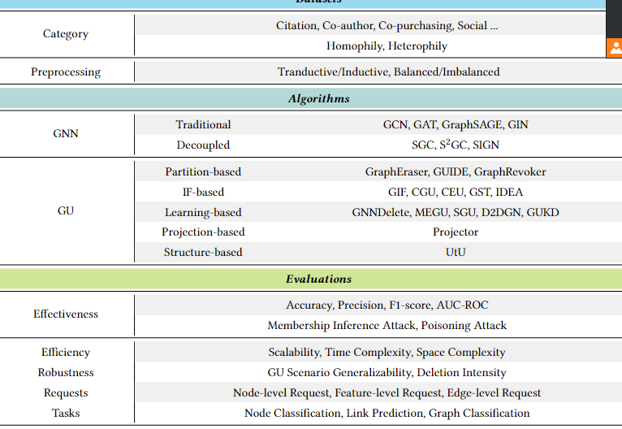
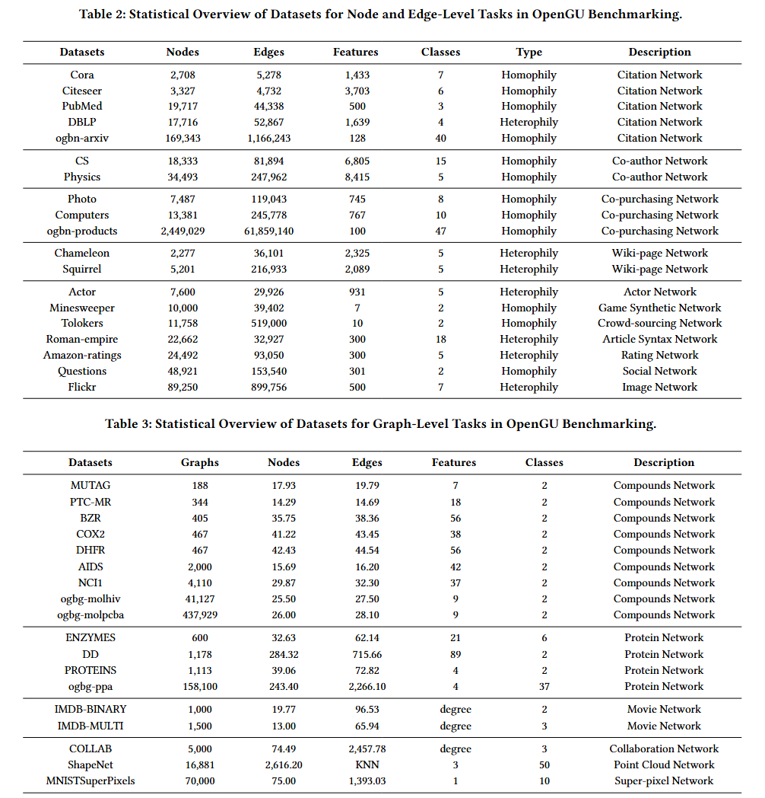

<div align="center">
  
</div>

------

<p align="center">
  <a href="https://gu.readthedocs.io/en/latest/">Docs</a> •
  <a href="#overview-of-the-benchmark">Overview of the Benchmark</a> •
  <a href="#installation">Installation</a> •
  <a href="#quick-start">Quick Start</a> •
  <a href="#reference">Reference</a>
</p>

<p align="center">
  <a href="https://opengsl.readthedocs.io/en/latest/?badge=latest">
   
  
  
</p>


# OpenGU

## Introduction

OpenGU is an open-source platform designed to provide a comprehensive benchmark for **Graph Unlearning**. This project aims to facilitate the evaluation and development of Graph Unlearning methodologies by offering standardized datasets, frameworks, and tools. OpenGU leverages advanced techniques in Graph Structure Learning (GSL) to enhance the performance and robustness of Graph Neural Networks (GNNs) across various applications.

## Overview of the Benchmark

OpenGU offers a robust and standardized benchmark for evaluating **Graph Unlearning** methods. It ensures a fair comparison between different approaches by providing consistent datasets, evaluation metrics, and experimental setups. This benchmark is instrumental in advancing research in Graph Unlearning, promoting reproducibility, and accelerating innovation in the field.


## Methods and Content Overview

<!--
Provide an overview of the methods used in OpenGU, including any algorithms, frameworks, or theoretical foundations. Describe the content structure, such as modules, components, or key features.
-->



## Dataset Usage

OpenGU utilizes a diverse set of datasets to benchmark the performance of various Graph Unlearning methods. These datasets cover a range of domains and graph structures, ensuring that the benchmark is both comprehensive and representative.



**Description:**
- **Dataset 1:** A brief description of the first dataset, including its source, size, and characteristics.
- **Dataset 2:** A brief description of the second dataset, highlighting its unique features and relevance.
- **Dataset 3:** A brief description of the third dataset, outlining its application domain and structure.
- <!-- Add more datasets as needed -->

## Installation

**Note:** OpenGU depends on several external libraries. To streamline the installation, OpenGU does **NOT** install these libraries for you. Please install them from the provided links before running OpenGU.

### **Dependencies:**
- **Python:** `3.8.0`
- **PyTorch:** `2.2.1`
- **TorchVision:** `0.17.1`
- **torch_scatter:** `2.1.2`
- **Scipy:** `1.10.1`
- **torch_sparse:** `0.6.18`
- **torch_geometric:** `2.6.1`
- **Matplotlib:** `3.7.5`
- **Scikit-learn:** `1.3.2`
- **OGB:** `1.3.6`
- **PyYAML:** `6.0.2`
- **DeepRobust:** `0.2.11`
- **Cupy:** Install via `pip install cupy-cuda12x`
- **Seaborn:** `0.13.2`
- **Munkres:** `1.1.4`
- **CVXPY:** `1.5.2`
- **PyMetis:** `2023.1.1`
- **IPDB:** `0.13.13`

### **Installing with Pip**
```bash
pip install opengu
```

### **Installation for Local Development:**
```bash
git clone https://github.com/OpenGU/OpenGU
cd opengu
pip install -e .
```

## Quick Start

You can use the command `python examples/example.py` or follow the steps below to get started quickly.

### **Step 1: Load Configuration**
```python
import opengu
conf = opengu.config.load_conf(method="method_name", dataset="dataset_name")
```

### **Step 2: Load Data**
```python
dataset = opengu.data.Dataset("dataset_name", n_splits=1, feat_norm=conf.dataset['feat_norm'])
```

### **Step 3: Build Model**
```python
solver = opengu.method.MethodSolver(conf, dataset)
```

### **Step 4: Training and Evaluation**
```python
exp = opengu.ExpManager(solver)
exp.run(n_runs=10)
```

## How to Contribute

We welcome contributions from the community to enhance OpenGU. Whether it's adding new methods, datasets, or improving documentation, your input is valuable.

### **Contributing Guidelines:**

1. **Fork the Repository:** Create a fork of the OpenGU repository on GitHub.
2. **Create a Branch:** Develop your feature or fix on a separate branch.
3. **Submit a Pull Request:** Once your changes are ready, submit a pull request for review.
4. **Report Issues:** If you encounter any issues or have suggestions, feel free to open an issue on GitHub.

Please ensure that your contributions adhere to the project's coding standards and include appropriate tests.

## Cite Us

If you use OpenGU in your research, please cite our paper:

```bibtex
@article{your2024opengu,
  title={OpenGU: An Open-Source Benchmark for Graph Unlearning},
  author={Your Name, Co-author's Name},
  journal={arXiv preprint arXiv:XXXX.XXXXX},
  year={2024}
}
```

## Reference

| **ID** | **Paper**                                                                                                                                                                                               | **Method** | **Conference** |
| ------ | ------------------------------------------------------------------------------------------------------------------------------------------------------------------------------------------------------- | :--------: | :------------: |
| 1      | [Semi-supervised classification with graph convolutional networks](https://arxiv.org/pdf/1609.02907.pdf)                                                                                             | GCN        | ICLR 2017      |
| 2      | [Learning Discrete Structures for Graph Neural Networks](https://arxiv.org/abs/1903.11960)                                                                                                              | LDS        | ICML 2019      |
| 3      | [Graph Structure Learning for Robust Graph Neural Networks](https://dl.acm.org/doi/pdf/10.1145/3394486.3403049)                                                                                         | ProGNN     | KDD 2020       |
| 4      | [Iterative Deep Graph Learning for Graph Neural Networks: Better and Robust Node Embeddings](https://proceedings.neurips.cc/paper/2020/file/e05c7ba4e087beea9410929698dc41a6-Paper.pdf)                 | IDGL       | NeurIPS 2020    |
| 5      | [Graph-Revised Convolutional Network](https://arxiv.org/pdf/1911.07123)                                                                                                                                 | GRCN       | ECML-PKDD 2020  |
| 6      | [Data Augmentation for Graph Neural Networks](https://ojs.aaai.org/index.php/AAAI/article/view/17315/17122)                                                                                             | GAug(O)    | AAAI 2021       |
| 7      | [SLAPS: Self-Supervision Improves Structure Learning for Graph Neural Networks](https://proceedings.neurips.cc/paper/2021/file/bf499a12e998d178afd964adf64a60cb-Paper.pdf)                              | SLAPS      | ICML 2021       |
| 8      | [Variational Inference for Training Graph Neural Networks in Low-Data Regime through Joint Structure-Label Estimation](https://dl.acm.org/doi/abs/10.1145/3534678.3539283)                              | WSGNN      | KDD 2022        |
| 9      | [Nodeformer: A scalable graph structure learning transformer for node classification](https://proceedings.neurips.cc/paper_files/paper/2022/file/af790b7ae573771689438bbcfc5933fe-Paper-Conference.pdf) | Nodeformer | NeurIPS 2022    |
| 10     | [Graph Structure Estimation Neural Networks](http://shichuan.org/doc/103.pdf)                                                                                                                           | GEN        | WWW 2021        |
| 11     | [Compact Graph Structure Learning via Mutual Information Compression](https://arxiv.org/pdf/2201.05540)                                                                                                 | CoGSL      | WWW 2022        |
| 12     | [SE-GSL: A General and Effective Graph Structure Learning Framework through Structural Entropy Optimization](https://arxiv.org/pdf/2303.09778)                                                          | SEGSL      | WWW 2023        |
| 13     | [Towards Unsupervised Deep Graph Structure Learning](https://arxiv.org/pdf/2201.06367)                                                                                                                  | SUBLIME    | WWW 2022        |
| 14     | [Reliable Representations Make A Stronger Defender: Unsupervised Structure Refinement for Robust GNN](https://dl.acm.org/doi/pdf/10.1145/3534678.3539484)                                               | STABLE     | KDD 2022        |
| 15     | [Semi-Supervised Learning With Graph Learning-Convolutional Networks](https://ieeexplore.ieee.org/document/8953909/authors#authors)                                                                     | GLCN       | CVPR 2019        |
| 16     | [Block Modeling-Guided Graph Convolutional Neural Networks](http://arxiv.org/abs/2112.13507)                                                                                                            | BM-GCN     | AAAI 2022        |

