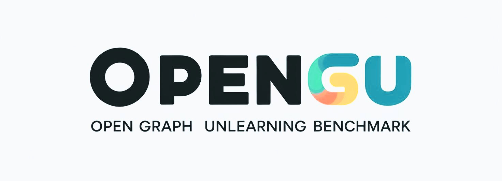

<div align="center">
  
</div>

------

<p align="center">
  <a href="https://opengu.readthedocs.io/en/latest/">Docs</a> •
  <a href="#overview-of-the-benchmark">Overview of the Benchmark</a> •
  <a href="#installation">Installation</a> •
  <a href="#quick-start">Quick Start</a> •
  <a href="#references">References</a>
</p>


<p align="center">
  <a href="https://opengu.readthedocs.io/en/latest/?badge=latest">
  </a>
  
  
</p>


# OpenGU

## 📚 Introduction

**OpenGU** is an open-source benchmark platform for **Graph Unlearning (GU)**. It facilitates the evaluation and development of GU methodologies by providing standardized datasets, state-of-the-art GU algorithms, and versatile tools. OpenGU integrates **16 SOTA GU algorithms** and **37 multi-domain datasets**, supporting a variety of downstream tasks across **13 GNN backbones**. This unified framework enables flexible unlearning requests and ensures comprehensive and fair evaluations of GU methods, addressing the unique challenges posed by complex relational data.

### Our Contributions

To advance Graph Unlearning (GU) research and establish a standardized evaluation framework, **OpenGU** provides the following key contributions:

1. **Comprehensive Benchmark**: OpenGU integrates **16 SOTA GU algorithms** and **37 multi-domain datasets**, offering a unified framework to support flexible 3×3 combinations of unlearning requests and downstream tasks.
2. **Analytical Insights**: Through extensive experiments, OpenGU evaluates GU methods across **effectiveness**, **efficiency**, and **robustness**, providing **8 key insights** that highlight existing limitations and guide future research.
3. **Open-source Library**: OpenGU is designed as an open-source benchmark library with a unified API, detailed documentation, and user-friendly interfaces, fostering collaboration and innovation in the GU community.


<div align="center">
  
  <p align="center"><em>Figure 1: Overview of the Graph Unlearning Methods Implemented in OpenGU.</em></p>
</div>

## <span id="overview-of-the-benchmark">📈 Overview of the Benchmark</span>

OpenGU offers a robust and standardized benchmark for evaluating **Graph Unlearning** methods. It ensures a fair comparison between different approaches by providing consistent datasets, evaluation metrics, and experimental setups. This benchmark is instrumental in advancing research in Graph Unlearning, promoting reproducibility, and accelerating innovation in the field.

<div align="center">
  
  <p align="center"><em>Figure 2: Overall Benchmark Framework of OpenGU.</em></p>
</div>

## 🗂️ Dataset Overview

Graph Unlearning (GU) scenarios are fundamentally data-driven, making the meticulous selection of datasets indispensable for evaluating the effectiveness of graph unlearning strategies. To assess the effectiveness, efficiency, and robustness of these methods for node and edge-related tasks, we have carefully selected **19 graph datasets**. Additionally, for graph-level tasks in diverse application areas, we have selected **18 graph classification datasets**.

### Node and Edge-Level Tasks

- **Citation Networks**: Cora, Citeseer, PubMed, DBLP, ogbn-arxiv
- **Co-author Networks**: CS, Physics
- **Co-purchasing Network**: Photo, Computers, ogbn-products
- **Rating Networks**: Amazon-ratings
- **Wiki-page Networks**: Squirrel, Chameleon
- **Actor Networks**: Actor
- **Game Synthetic Networks**: Minesweeper
- **Crowdsourcing Networks**: Tolokers
- **Article Syntax Networks**: Roman-empire
- **Social Networks**: Questions
- **Image Networks**: Flickr

### Graph Classification Tasks

- **Compounds Networks**: MUTAG, PTC-MR, BZR, COX2, DHFR, AIDS, NCI1, ogbg-molhiv, ogbg-molpcba
- **Protein Networks**: ENZYMES, DD, PROTEINS, ogbg-ppa
- **Movie Networks**: IMDB-BINARY, IMDB-MULTI
- **Collaboration Networks**:  COLLAB
- **Point Cloud Networks**: ShapeNet
- **Super-pixel Networks**: MNISTSuperPixels


#### Statistical Overview
For detailed statistics on the datasets used in our evaluation, see the following file:

- [Dataset Detailed Statistics](Resources/Dataset.png)


### Data Preprocessing Enhancements

OpenGU introduces flexible preprocessing capabilities to support diverse experimental needs:

1. **Custom Dataset Splitting**:
   - Enables arbitrary dataset split ratios for tailored training and testing sets.
   - Supports both balanced and random label distributions.

2. **Inference Scenarios**:
   - Allows datasets to operate under both **transductive** and **inductive** inference settings, enabling comprehensive evaluations.


## 🧠 Algorithm Framework

### GNN Backbones

To evaluate the generalizability of GU algorithms, we incorporate three predominant paradigms of GNN models within our benchmark: **Traditional GNNs**, **Sampling GNNs**, and **Decoupled GNNs**. Each category encompasses a variety of state-of-the-art models, providing a comprehensive foundation for assessing Graph Unlearning methods. **In total, OpenGU integrates 13 GNN backbones.**

| **Traditional GNNs** | **Sampling GNNs** | **Decoupled GNNs** |
|----------------------|--------------------|---------------------|
| 🔹 **GCN**           | 🔸 **GraphSAGE**   | 🔹 **SGC**          |
| 🔹 **GCNII**         | 🔸 **GraphSAINT**  | 🔹 **SSGC**         |
| 🔹 **LightGCN**      | 🔸 **ClusterGCN**  | 🔹 **SIGN**         |
| 🔹 **GAT**           |                    | 🔹 **APPNP**        |
| 🔹 **GATv2**         |                    |                     |
| 🔹 **GIN**           |                    |                     |


### GU Algorithms

Our framework encompasses **16 state-of-the-art GU algorithms**, meticulously reproduced based on source code or detailed descriptions in relevant publications. These algorithms are categorized into **Partition-based**, **IF-based (Influence Function-based)**, **Learning-based**, and **Others**, each leveraging distinct strategies for effective graph unlearning.

| **Partition-based** | **IF-based**     | **Learning-based** | **Others**          |
|---------------------|------------------|---------------------|---------------------|
| 🔸 **GraphEraser**  | 🔹 **GIF**       | 🔸 **GNNDelete**    | 🔹 **UtU**          |
| 🔸 **GUIDE**         | 🔹 **CGU**       | 🔸 **MEGU**         | 🔹 **Projector**    |
| 🔸 **GraphRevoker** | 🔹 **CEU**       | 🔸 **SGU**          |                     |
|                     | 🔹 **GST**       | 🔸 **D2DGN**        |                     |
|                     | 🔹 **IDEA**      | 🔸 **GUKD**         |                     |
|                     | 🔹 **ScaleGUN**  |                     |                     |


## 📊 Evaluation Strategy

OpenGU assesses **Graph Unlearning (GU)** algorithms across three key dimensions: **Effectiveness**, **Robustness**, and **Efficiency**.

### Cross-over Design
Real-world scenarios often require simultaneous removal of nodes and edges. OpenGU supports **cross-task evaluations**, enabling a comprehensive assessment when multiple unlearning types interact in diverse tasks.

### Effectiveness
- **Node Classification (Accuracy, Precision, F1)**: Ensures unlearning does not harm performance on retained nodes.  
- **Link Prediction (AUC-ROC)**: Checks that removing edges does not degrade predictive accuracy.  
- **Security Attacks**:  
  - **MIA (AUC-ROC ~ 0.5)**: Confirms minimal information leakage on whether a node was in training.  
  - **Poisoning Attack**: Improved link prediction after malicious edges are removed indicates successful unlearning.

### Robustness
We test GU algorithms under **varying deletion intensities**, **noise**, and **sparsity**. Robust solutions should exhibit minimal performance drop when more data is removed or degraded.

### Efficiency
Evaluated on **scalability**, **time complexity**, and **space complexity**:
- **Scalability**: Performance consistency across different dataset sizes.  
- **Time Complexity**: Computational cost analyzed both theoretically and empirically.  
- **Space Complexity**: Memory usage and storage overhead during unlearning.


## <span id="installation">📥 Installation</span>

### **Prerequisites**

- **Python**: 3.8.0

### **Step 1: Create and Activate a Virtual Environment**

To manage dependencies, it's recommended to use a virtual environment.

#### Using `venv`

```bash
python -m venv venv
venv\Scripts\activate  # Windows
# or
source venv/bin/activate  # Unix/MacOS
```

#### Using `conda`

```bash
conda create -n myenv python=3.8
conda activate myenv
```

### **Step 2: Install OpenGU**

You can install OpenGU using one of the following methods:

#### 1. **Using Pip**

To install OpenGU directly from PyPI:

```bash
pip install opengu
```

#### 2. **Installing from GitHub for Local Development**

To install OpenGU for local development, clone the GitHub repository and install it from the source:

1. **Clone the Repository**

    ```bash
    git clone https://github.com/bwfan-bit/OpenGU.git
    cd OpenGU
    ```

2. **Install OpenGU in Editable Mode**

    ```bash
    pip install -e .
    ```

### **Step 3: Install Dependencies**

#### CUDA-Specific Dependencies

For GPU support, install the appropriate versions of PyTorch, CuPy, and related libraries that match your CUDA version.

Here is the updated version with the required versions added:

1. **Install PyTorch and torchvision with CUDA Support**

   Example for CUDA 12.1 (PyTorch version 2.2.1 and torchvision version 0.17.1):

   ```bash
   pip install torch==2.2.1 torchvision==0.17.1 torchaudio --index-url https://download.pytorch.org/whl/cu121
   ```

   Please ensure you install the required versions: `torch==2.2.1` and `torchvision==0.17.1`.

2. **Install CuPy with CUDA Support**

   Example for CUDA 12.x:

   ```bash
   pip install cupy-cuda12x
   ```

*Ensure your system has the appropriate CUDA version installed. For more information, refer to the [CuPy Installation Guide](https://docs.cupy.dev/en/stable/install.html#using-pip).*

#### General Dependencies
Before installing the general dependencies, please ensure you have installed the required versions of PyTorch and torchvision.

Install the general dependencies listed in the `requirements.txt` file:

```bash
pip install -r requirements.txt
```

#### Additional Dependencies for Graph Libraries

For `torch_scatter`, `torch_geometric`, and `torch_sparse`, if you encounter compilation issues, it's recommended to install the prebuilt wheels directly from the official PyTorch Geometric website. Below are installation examples based on the CUDA version:

1. Visit the [PyTorch Geometric Installation Guide](https://pytorch-geometric.readthedocs.io/en/latest/notes/installation.html) to find the appropriate wheel links.

2. Example installation for CUDA 12.1:

   ```bash
   pip install torch-scatter -f https://data.pyg.org/whl/torch-2.2.1+cu121.html
   pip install torch-sparse -f https://data.pyg.org/whl/torch-2.2.1+cu121.html
   pip install torch-geometric
   ```

3. If using a different CUDA version, replace `cu121` in the URL with your specific version (e.g., `cu118` for CUDA 11.8).

*Make sure to check the compatibility matrix on the official PyTorch Geometric website for the correct version of `torch`, `torchvision`, and other libraries.*


#### Special Installation for ScaleGUN
If you are using the `ScaleGUN` unlearning method, you need to compile and install the dependencies manually. Navigate to the following directory:

```bash
cd OpenGU/GULib-master/unlearning/unlearning_methods/ScaleGUN/progation_pkg
```

Then, run the following commands:

```bash
pip install cython
pip install eigency
python setup.py build_ext --inplace
```
These steps will compile the necessary Cython extensions for the `progation_pkg` module.

### **Verify Installation**

After installation, verify that OpenGU is installed correctly by running:

```bash
python -c "import opengu; print(opengu.__version__)"
```

##  <span id="quick-start">🚀 Quick Start</span>

Follow these steps to quickly get started with OpenGU:

### **Step 1: Clone the Repository**

```bash
git clone https://github.com/bwfan-bit/OpenGU.git
cd OpenGU
```

### **Step 2: Install Dependencies**

#### General Dependencies
You can install the general dependencies using `pip`:

```bash
pip install -r requirement.txt
```
#### CUDA-Specific Dependencies
For CUDA-specific dependencies, refer to the detailed instructions in the [Installation section](#installation)  above.


### **Step 3: Run the Main Script**

After installing the dependencies, you can run the main script using the following command:

```bash
python GULib-master/main.py --cuda 0 --dataset_name <dataset_name> --base_model <base_model> --unlearning_methods <unlearning_methods> --unlearn_task <unlearn_task> --downstream_task <downstream_task> --num_epochs 100 --batch_size 64
```


#### Optional arguments:

- `--cuda <cuda_device>`: Specify which GPU to use. Replace `<cuda_device>` with the desired GPU number.
- `--dataset_name <dataset_name>`: The name of the graph dataset. Replace `<dataset_name>` with a dataset from the list: `cora`, `citeseer`, `pubmed`, `CS`, `Physics`, `flickr`, `ppi`, `Photo`, `Computers`, `DBLP`, `ogbl`, `ogbn-arxiv`, `ogbn-products`.
- `--base_model <base_model>`: The model architecture to use. Options include `GCN`, `GAT`, `GIN`, `SAGE`, `MLP`, etc.
- `--unlearning_methods <unlearning_methods>`: The unlearning method to use. Choose from `GraphEraser`, `GUIDE`, `CEU`, etc.
- `--unlearn_task <unlearn_task>`: The type of unlearning task. Options are `feature`, `node`, and `edge`.
- `--downstream_task <downstream_task>`: The type of downstream task. Options are `node` and `edge`.
- `--num_epochs <num_epochs>`: Number of epochs to run.
- `--batch_size <batch_size>`: The batch size to use.

Note that the above list includes only a subset of the available parameters. For more parameters and their descriptions, please refer to the `GULib-master/parameter_parser.py` file. 

### Example Command:

To run the **GCN** model using **GraphEraser** for **node-level unlearning** and **node-level downstream tasks**, you can run the following command:

```bash
python GULib-master/main.py --cuda 0 --dataset_name cora --base_model GCN --unlearning_methods GraphEraser --unlearn_task node --downstream_task node --num_epochs 100 --batch_size 64
```

This command will:
- Use the **GCN** model
- Apply **GraphEraser** as the unlearning method
- Perform **node-level unlearning** and **node-level downstream tasks**
- Use the **cora** dataset
- Train for **100 epochs** with a **batch size of 64**


## 🤝 How to Contribute

We welcome contributions from the community to enhance OpenGU. Whether it's adding new methods, datasets, or improving documentation, your input is valuable.

### **Contributing Guidelines:**

1. **Fork the Repository:** Create a fork of the OpenGU repository on GitHub.
2. **Create a Branch:** Develop your feature or fix on a separate branch.
3. **Submit a Pull Request:** Once your changes are ready, submit a pull request for review.
4. **Report Issues:** If you encounter any issues or have suggestions, feel free to open an issue on GitHub.

Please ensure that your contributions adhere to the project's coding standards and include appropriate tests.

## 📄 Cite Us

If you use OpenGU in your research, please cite our paper:

```bibtex
@article{fan2025opengu,
  title={OpenGU: A Comprehensive Benchmark for Graph Unlearning},
  author={Fan, Bowen and Ai, Yuming and Li, Xunkai and Guo, Zhilin and Li, Rong-Hua and Wang, Guoren},
  journal={arXiv preprint arXiv:2501.02728},
  year={2025},
  url={https://arxiv.org/abs/2501.02728}
}
```

## <span id="references">📖 References</span>
| **ID** | **Algorithm** | **Paper**                                                                                             | **Conference/Journal**       |
|--------|---------------|-------------------------------------------------------------------------------------------------------|------------------------------|
| 1      | GraphEraser   | [**Graph Unlearning**](https://dl.acm.org/doi/abs/10.1145/3548606.3559352)                           | CCS 2022                     |
| 2      | GUIDE         | [**Inductive Graph Unlearning**](https://arxiv.org/abs/2304.03093)                                  | USENIX Security 2023          |
| 3      | GraphRevoker  | [**Graph Unlearning with Efficient Partial Retraining**](https://dl.acm.org/doi/abs/10.1145/3589335.3651265) | WWW 2024                     |
| 4      | GIF           | [**GIF: A General Graph Unlearning Strategy via Influence Function**](http://arxiv.org/abs/2304.02835) | WWW 2023                     |
| 5      | CGU           | [**Certified Graph Unlearning**](https://arxiv.org/abs/2206.09140)                                    | NeurIPS 2022 Workshop        |
| 6      | CEU           | [**Certified Edge Unlearning for Graph Neural Networks**](https://dl.acm.org/doi/10.1145/3580305.3599271) | KDD 2023                     |
| 7      | GST           | [**Unlearning Graph Classifiers with Limited Data Resources**](https://dl.acm.org/doi/abs/10.1145/3543507.3583547) | WWW 2023                     |
| 8      | IDEA          | [**IDEA: A Flexible Framework of Certified Unlearning for Graph Neural Networks**](https://dl.acm.org/doi/abs/10.1145/3637528.3671744) | KDD 2024                     |
| 9      | GNNDelete     | [**GNNDelete: A General Strategy for Unlearning in Graph Neural Networks**](https://arxiv.org/abs/2302.13406) | ICLR 2023                    |
| 10     | MEGU          | [**Towards Effective and General Graph Unlearning via Mutual Evolution**](https://doi.org/10.1609/aaai.v38i12.29273) | AAAI 2024                    |
| 11     | D2DGN         | [**Distill to Delete: Unlearning in Graph Networks with Knowledge Distillation**](https://arxiv.org/abs/2309.16173) | arXiv 2024                   |
| 12     | GUKD          | [**Graph Unlearning Using Knowledge Distillation**](https://dl.acm.org/doi/abs/10.1007/978-981-99-7356-9_29) | ICICS 2023                   |
| 13     | UtU           | [**Unlink to Unlearn: Simplifying Edge Unlearning in GNNs**](https://arxiv.org/abs/2402.10695)         | WWW 2024                     |
| 14     | Projector     | [**Efficiently Forgetting What You Have Learned in Graph Representation Learning via Projection**](https://arxiv.org/abs/2302.08990) | AISTATS 2023                |
| 15     | ScaleGUN      | [**Scalable and Certifiable Graph Unlearning: Overcoming the Approximation Error Barrier**](https://doi.org/10.48550/arXiv.2408.09212) | arXiv 2024                   |
| 16  | SGU        | [**Toward Scalable Graph Unlearning: A Node Influence Maximization based Approach**](https://arxiv.org/abs/2501.11823)              | arXiv 2025   |

